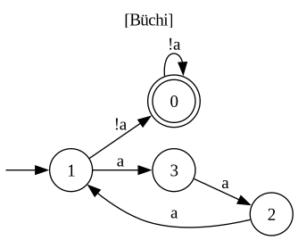

# aut2ltl

`aut2ltl` reconstructs a Linear Temporal Logic (LTL) formula from an
[ω-automaton](https://en.wikipedia.org/wiki/%CF%89-automaton). Given an automaton in
the [HOA format](https://adl.github.io/hoaf/), it produces an LTL formula defining the
same ω-language, or — when the language is not LTL-definable — decides so and returns a
**checkable witness** of why no formula exists. An LTL or PSL formula may be supplied in
place of an automaton, in which case it is translated to an automaton before
reconstruction.

## Quick start

Three native dependencies are needed, none of them pip-installable:

- **[Spot](https://spot.lre.epita.fr/)**, with its Python bindings
- **[GAP](https://www.gap-system.org/)** with the **[SgpDec](https://github.com/gap-packages/sgpdec)** package
- **[libDDD](https://github.com/lip6/libDDD) + [libITS](https://github.com/lip6/libITS)**

[`install.sh`](install.sh) builds all three from source into this checkout's own
`opt/`, taking nothing from the system and writing nothing outside the clone:

```bash
git clone https://github.com/yanntm/aut2ltl.git && cd aut2ltl
./install.sh                      # once; the build takes a while
```

Afterwards, run the tool through [`aut2ltl.sh`](aut2ltl.sh), a thin wrapper that puts
those dependencies on the interpreter's path and passes everything else to `python3`:

```bash
./aut2ltl.sh -m aut2ltl model.hoa
```

To update a dependency, `git pull`, remove its prefix (`rm -rf opt/spot`, `opt/gap`
or `opt/its`) and run `./install.sh` again; what is present is never rebuilt. The
dependencies are compiled for the machine that builds them, AVX2 included, so a
checkout shared between machines must be used from machines with the same instruction
set. See [`deps/README.md`](deps/README.md).

### Examples

#### Round trip — a smaller formula

A **round trip**, LTL → automaton → LTL. Take `F(X!a & ((b R a) W b))` and let Spot
build its TGBA
([`samples/fixtures/hoa/various/collapse_example.hoa`](samples/fixtures/hoa/various/collapse_example.hoa)):

<p align="center"></p>

`aut2ltl` reads a defining formula back off the automaton:

```console
$ ./aut2ltl.sh -m aut2ltl samples/fixtures/hoa/various/collapse_example.hoa
technique : daisy+daisystardet
DAG nodes : 6
temporals : 1
tree nodes: 6
sharing   : 1.0x
build time: 0.002s
LTL: F(b & X!a)
```

`F(b & X!a)` is far smaller than the formula we started from — and no LTL
*simplifier* closes that gap: `ltlfilt` leaves `F(X!a & ((b R a) W b))` untouched at
every level, up to its strongest `-r3`. Minimal LTL simplification is as hard as LTL
equivalence (PSPACE-complete), so syntactic rewriters are necessarily incomplete;
`aut2ltl` reaches the simpler form by passing through the automaton — the semantic
object — and reconstructing LTL from it.

#### Round trip — recovering acceptance

A second round trip, `GFa & FGb`
([`samples/fixtures/hoa/various/fairness_example.hoa`](samples/fixtures/hoa/various/fairness_example.hoa)),
exercises the **acceptance handling**: recovering this fairness pattern means reading
the Büchi acceptance back as `GF`/`FG`, not just the transition structure.

<p align="center"></p>

```console
$ ./aut2ltl.sh -m aut2ltl samples/fixtures/hoa/various/fairness_example.hoa
technique : acc2+daisy
DAG nodes : 7
temporals : 4
tree nodes: 7
sharing   : 1.0x
build time: 0.002s
LTL: G(Fa & FGb)
```

The **result** is printed on stdout, **tagged by kind** — `LTL: <formula>` when a
defining formula exists, `NOT_LTL: <witness>` when the language is not LTL-definable
(with exit code `3`); the **report** above it (the methods used, the formula's size,
build time) goes to stderr and is silenced by `-q`:

```console
$ ./aut2ltl.sh -m aut2ltl samples/fixtures/hoa/various/collapse_example.hoa -q
LTL: F(b & X!a)
```

#### No LTL formula — a witness

Not every ω-automaton has an LTL formula — ω-automata are strictly more expressive — and
when the language lies outside LTL, `aut2ltl` **decides** so and returns a **checkable
witness** of why. Take the mod-3 counter `L = a^{3k}·(!a)^ω`
([`samples/fixtures/hoa/various/mod3_a.hoa`](samples/fixtures/hoa/various/mod3_a.hoa)) —
"an `a`-block whose length is a multiple of 3, then `!a` forever":

<p align="center"></p>

```console
$ ./aut2ltl.sh -m aut2ltl samples/fixtures/hoa/various/mod3_a.hoa
aut2ltl: NOT_LTL -- the language is not LTL-definable
  (the deterministic transition monoid is non-aperiodic (carries a non-trivial
   group), so the language is not star-free / counter-free and no LTL formula exists)
  witness: counting family, period p=3 -- u.v^n.x flips membership with n mod 3
    u = [] ;  v = a ; a ;  x = (!a)^w
NOT_LTL: p=3 u=[] v=[a; a] x=[cycle{!a}]
```

The witness is a **counting family**: `u·vⁿ·x = a^{2n}·(!a)^ω` is in `L` exactly when
`n ≡ 0 (mod 3)`, so its membership toggles with period 3 — the modular counting no
counter-free LTL formula can express, checkable against the automaton by hand.

#### The non-LTL witness format

The prose explanation and a human rendering of the family go to **stderr**; **stdout**
carries one compact, machine-readable line (and the verdict sets a distinct **exit code
3**, vs. `0` for an LTL formula):

```
NOT_LTL: p=3 u=[] v=[a; a] x=[cycle{!a}]
```

- `p` — the period (`> 1`): membership of `u·vⁿ·x` toggles with `n mod p`.
- `u`, `v` — finite words in Spot word syntax (a `;`-separated letter list; `[]` is
  the empty word).
- `x` — the ultimately-periodic tail as a Spot lasso `[prefix; cycle{...}]` (here the
  bare cycle `(!a)ω`).

That line is everything a checker needs. The bundled **verifier** replays it against the
input automaton — sampling membership of `u·vⁿ·x` and confirming it toggles with period
`p`:

```console
$ ./aut2ltl.sh -m aut2ltl.verifier samples/fixtures/hoa/various/mod3_a.hoa \
      "NOT_LTL: p=3 u=[] v=[a; a] x=[cycle{!a}]"
VERIFY: ok pattern=1001001
```

`1001001` is the membership of `u·vⁿ·x` for `n = 0…6` — in `L` exactly at `n ∈ {0, 3, 6}`,
period 3 as claimed. This is a **membership** check (a lasso-intersection per sample, so
it is acceptance-agnostic): it corroborates the witness against the language rather than
proving non-definability from the algebra alone.

The prefix `u` need not be empty. Here the family opens with a two-letter prefix
`u = c; c` before the period-2 counting, and the verifier checks it the same way:

```console
$ ./aut2ltl.sh -m aut2ltl samples/validation/hoa/prefix_nonltl_1.hoa
…
NOT_LTL: p=2 u=[c; c] v=[a & !b] x=[cycle{!a & b}]

$ ./aut2ltl.sh -m aut2ltl.verifier samples/validation/hoa/prefix_nonltl_1.hoa \
      "NOT_LTL: p=2 u=[c; c] v=[a & !b] x=[cycle{!a & b}]"
VERIFY: ok pattern=10101
```

`10101` is membership of `u·vⁿ·x` for `n = 0…4` — in `L` at even `n`, period 2 — once
the `c; c` prefix is read.

`aut2ltl` is also run over an exhaustive census of small ω-automata of a fixed
shape, as a broad coverage and correctness check. The committed results are in
[`genaut/reference/`](genaut/reference/).

## Using it

The input is auto-detected as a HOA file or an LTL/PSL formula; force it with
`--ltl` / `--hoa`.

```bash
./aut2ltl.sh -m aut2ltl 'G(p -> (q U r))'           # an LTL/PSL formula in
./aut2ltl.sh -m aut2ltl model.hoa                    # a HOA automaton file in
./aut2ltl.sh -m aut2ltl model.hoa -q -o out.ltl      # -q: formula only; -o: to a file
./aut2ltl.sh -m aut2ltl model.hoa --list-options     # every -O knob, its default and doc
./aut2ltl.sh -m aut2ltl --help
```

The reconstructed formula is a **hash-consed DAG**: it shares repeated sub-formulas,
and successful outputs are often highly tail-redundant, so the DAG stays compact even
when the flat string is large. By default a large formula is printed only up to a
size gate (raise it with `--flatten-limit N`), or export the DAG itself:

```bash
./aut2ltl.sh -m aut2ltl model.hoa --dag | dot -Tpng -o dag.png
```

Fine-tune any declared option with `-O key=value` (see `--list-options`).

## Evaluation

Reference runs of the **default** portfolio are committed as per-formula CSVs —
which GitHub renders as readable tables — one per corpus, under `results/reference/`:

- [`results/reference/validation/default.csv`](results/reference/validation/default.csv) —
  the curated 40-formula validation survey (the correctness gate's corpus), run both
  as LTL and as the equivalent HOA automaton (81 inputs).
- [`results/reference/benchmark/default.csv`](results/reference/benchmark/default.csv)
  — the larger benchmark corpus (the survey set + scalable W/U/R chains + the Kinská
  automata, 334 inputs).
- [`results/reference/kinska/kinska.csv`](results/reference/kinska/kinska.csv)
  — the 165 Kinská Büchi automata on their own (many are not LTL-definable); see
  [`samples/kinska/README.md`](samples/kinska/README.md) for provenance.

Each folder also holds a one-glance **summary** of its CSV —
[`results/reference/benchmark/SUMMARY.txt`](results/reference/benchmark/SUMMARY.txt):
how many answers were verified equivalent / not-LTL / timed out, and the total
reconstructed formula size.

## Project structure

`aut2ltl` is a **portfolio**: most modules are *translators* (a `Language` in, an
LTL result out) and the portfolio composes them, taking the best answer at each step.

```
aut2ltl/   the package: the input wrapper, the result type, the CLI front end, and the
           translators the portfolio composes (the systematic Krohn-Rhodes cascade is
           aut2ltl/bls/)
survey/    the survey harness (the correctness gate) + diff tools
samples/   input corpora (validation = the gate, benchmark, kinska, fixtures)
results/   committed reference survey runs (results/reference/<corpus>/)
tests/     probes and per-engine unit tests
docs/      algorithm notes, the construction log, figures
```

The source is deliberately structured, and most packages carry a `README.md`, an
`algorithm.md`, or both — the detail lives next to the code. Start with
[`aut2ltl/README.md`](aut2ltl/README.md), the developer source map; the systematic
cascade [`aut2ltl/bls/`](aut2ltl/bls/README.md) holds a faithful implementation of the
Boker–Lehtinen–Sickert paper.

## Scope

Translating an ω-automaton to LTL is expensive — the construction is exponential in
several directions — and not always possible, since ω-automata are strictly more
expressive than LTL. `aut2ltl` is **sound** (it never returns a non-equivalent
formula) and **complete** on the LTL-definable fragment (it reconstructs a defining
formula whenever one exists), at the cost of a possibly exponential blow-up in formula
size. When the input language lies outside LTL it **decides** so and returns a
**checkable witness** (a counting family) of why no formula exists — to our knowledge,
`aut2ltl` is among the first tools to actually decide LTL-definability in practice.

## Algorithms

The systematic core follows Boker, Lehtinen & Sickert, *"On the Translation of
Automata to Linear Temporal Logic"* (FoSSaCS 2022), via a Krohn-Rhodes holonomy
cascade decomposition (SgpDec + GAP) — to our knowledge the first practical
implementation of that construction. It is complemented by a portfolio of additional,
mostly original methods that handle structured fragments directly.

> This material is **unpublished**. Please give us time to write the paper before
> building on this prototype. Feedback and collaboration are very welcome —
> contact **Yann.Thierry-Mieg@lip6.fr** or open a GitHub issue. As a last resort,
> cite this repository.

## License

Distributed under the **GNU General Public License v3.0** (see [`LICENSE`](LICENSE)).

© 2026 Yann Thierry-Mieg, LIP6, Sorbonne Université, CNRS.
