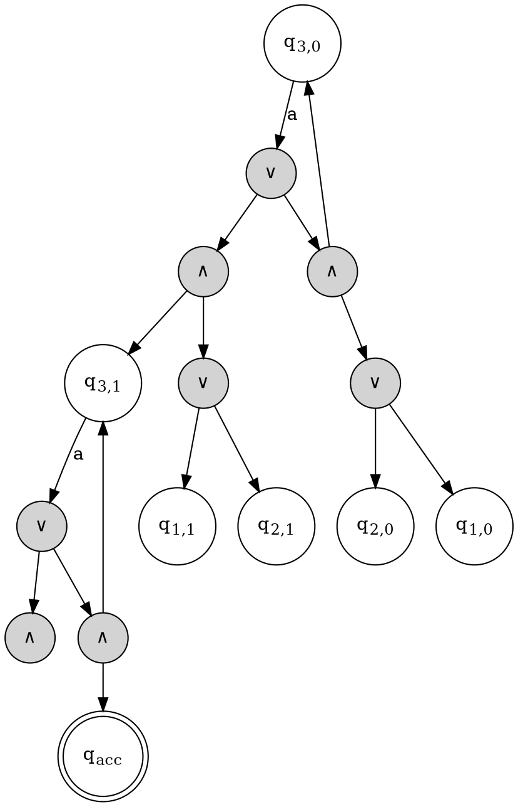

It is incredibly ambitious to implement this construction. As you correctly identified, moving from the theoretical bounds of a FOSSACS paper to a working pipeline requires bridging significant gaps—especially when navigating triple-exponential length formulas.

Here is a structured, comprehensive breakdown of the core definitions and the exact recursive LTL construction, followed by a practical blueprint for tackling this with Spot and GAP.

### Part 1: Core Definitions & Algorithm

The paper relies on translating a counter-free deterministic automaton into a reset cascade, and then recursively building LTL formulas that simulate the cascade's state tracking.

#### 1. Cascades and Configurations

* 
**Cascade:** A sequence of semiautomata $A_1, A_2, \dots, A_n$ where the alphabet of level $i$ is $\Sigma_i = \Sigma \times Q_1 \times \dots \times Q_{i-1}$.


* 
**Configuration:** An $i$-level configuration $S$ is a tuple $\langle q_1, \dots, q_i \rangle$. The 0-configuration is the empty tuple $\langle \rangle$.


* 
**Reset Cascade:** A cascade where every transition either stays in the same state ($\delta(q, \sigma) = q$) or resets to a specific state ($\delta(q, \sigma) = q'$) regardless of the origin state.


* 
**Transition Classification:** For a state $s$, transitions are grouped by their combined letters into $Stay(s)$, $Leave(s)$, and $Enter(s)$.


#### 2. The Reachability Formulas

The algorithm relies on five mutually recursive LTL formulas. They define paths between a starting configuration $S$ and a target $T$, avoiding a "bad" configuration $B$.

**Formula 1: Standard Strong Reachability** 
Semantics: The run from $S$ reaches $T$ (where formula $\tau$ holds) without passing through $B$ (where $\beta$ holds).


$$S \sim\sim_{B(\beta)} T(\tau) := \begin{cases} (\neg \beta) U \tau & \text{if } S = \langle\rangle \\ \langle S, s\rangle \xrightarrow{} \dots \lor \langle S, s\rangle \dashrightarrow \dots & \text{otherwise} \end{cases}$$

**Formula 2: Weak Reachability** 
Semantics: Reaching $T(\tau)$ releases the requirement to not reach $B(\beta)$.


$$S^{weak} \sim\sim_{B(\beta)} T(\tau) := \neg(S \sim\sim_{T(\neg \tau)} B(\neg \beta))$$

**Formula 3: Top-Level Stays** Semantics: Reaches $\langle T, t\rangle(\tau)$ without reaching $\langle B, b\rangle(\beta)$, while strictly staying in top-level state $s$. This is built around a $>0$ step formulation:


$$\langle S, s\rangle^{>0} \xrightarrow{B(\beta)} \langle T, t\rangle(\tau) := \bigvee_{\langle \sigma, T'\rangle \in Stay(s) \text{ s.t. } T' \to T} \left( S \sim\sim_{L(\eta)} T'(\sigma \land X\tau) \land \dots \right)$$


*(It recursively calls Formula 1 on the $n-1$ level configurations, asserting that all paths strictly avoid $Leave(s)$ constraints).*

**Formula 4: Weak Top-Level Stays** Semantics: Weak version of Formula 3; reaching $\langle T, t\rangle(\tau)$ releases the constraint of avoiding $\langle B, b\rangle(\beta)$ or leaving $s$. Built similarly to Formula 3 but uses recursive calls to Formula 2 (the weak $S^{weak} \sim\sim \dots$).

**Formula 5: Top-Level Changes** Semantics: Reaches $\langle T, t\rangle(\tau)$ by explicitly leaving $s$, without hitting $\langle B, b\rangle(\beta)$.


$$\langle S, s\rangle \dashrightarrow_{B(\beta)} \langle T, t\rangle(\tau) := \bigvee_{\dots \in Enter(t)} \left( \dots \land \bigwedge_{\dots \in Enter(b)} (\text{Formula 4}) \dots \right)$$

#### 3. Acceptance Condition Mapping

To compile the final formula for an automaton, evaluate how often configurations are visited:

* 
**Finiteness Formula:** $Fin(C) := \neg(\iota \sim\sim_K C) \lor \iota \sim\sim_K C(\neg(C^{>0} \sim\sim_K C))$.


* **Muller Condition:** The final formula $\phi$ is a disjunction over all original Muller sets. Each set is mapped to a conjunction of $Fin(C)$ and $\neg Fin(C)$ depending on whether configuration $C$ must be visited finitely or infinitely often.


---

### Part 2: Graphviz Illustration

Below is a DOT representation inspired by the weak alternating automaton logic shown in the paper's Figure 1 (specifically detailing the up-counter transitions for a bit state like $q_{3,0}$):



---

### Part 3: Practical Implementation Sketch

To implement this with Spot and GAP, the theoretical $2^{m^n}$ configurations will instantly crash your environment if built naively. Here is how to engineer the pipeline:

#### Step 1: Pre-processing (Spot)

1. Use Spot to read your LTL/Automaton and convert it into a deterministic, state-based acceptance automaton (e.g., a Deterministic Parity Automaton, or a deterministic state-based Muller).
2. Ensure the automaton is minimal. The fewer the states before Holonomy decomposition, the exponentially better your life will be later.

#### Step 2: Cascade Generation (GAP)

1. Extract the transition table from Spot and pass it to GAP.
2. In GAP, compute the transformation semigroup and apply the Krohn-Rhodes/Holonomy decomposition algorithms.
3. Output the reset cascade components $A_1, \dots, A_n$ and the surjective homomorphism $h: Q_{cascade} \to Q_{orig}$ back into your C++/Python environment.


#### Step 3: Graph Reachability & Pruning

**Do not** generate all possible configurations $\Sigma \times Q_1 \times \dots \times Q_n$.
Instead, build the transition system of the cascade dynamically starting *only* from the initial configuration $\iota_0 \in h^{-1}(\iota)$. Use a Breadth-First Search to mark reachable configurations. You will only construct LTL branches for configurations that actually exist in the reachable component.

#### Step 4: Extracting the Muller Sets dynamically

The paper maps the Muller condition directly using the homomorphism $h$. For a set of cascade configurations $M'$, the run is accepting iff the projected set $h(M')$ exactly matches an accepting Muller set $M$ in your original Spot automaton.

1. Use Spot's strongly connected component (SCC) extraction on your *pruned cascade transition graph*.
2. Only enumerate subsets of configurations within terminal SCCs.
3. Map these subsets through $h$. If $h(M')$ satisfies the original Spot acceptance condition, tag $M'$ as an accepting Muller set for the cascade.
4. Construct your top-level LTL formula using the $Fin(C)$ logic restricted *only* to these valid subsets.

#### Step 5: AST Construction & Memoization

Because the formulas recursively nest up to $O(3^m)$ depth, generating the LTL string directly will cause an out-of-memory error.

1. Build an Abstract Syntax Tree (AST) in memory.
2. **Strict Memoization:** Create a hash map mapping `(FormulaType, S, B, T, beta, tau)` to an AST node pointer. Every recursive call must check this cache first.
3. Once the AST is built, traverse it and feed it into Spot's `spot::tl_simplifier` from the bottom up to eagerly simplify constant expressions (`false U X`, etc.) before they bubble up to the root.


## More concretely

### Part 1: Formal Specification of the Boker, Lehtinen, and Sickert Construction

The construction translates a counter-free deterministic $\omega$-regular automaton into an equivalent future LTL formula. It operates over an intermediate **Krohn-Rhodes reset cascade decomposition** of the semiautomaton.

#### 1. Mathematical Framework and Notations

* 
**Cascade ($\mathcal{A}$):** A sequence of semiautomata $\langle \Sigma, \mathcal{A}_1, \mathcal{A}_2, \dots, \mathcal{A}_n \rangle$ where for each level $i$, $\mathcal{A}_i = (\Sigma_i, Q_i, \delta_i)$.


* 
**Alphabets:** Defined inductively such that $\Sigma_1 = \Sigma$, and for $i > 1$, $\Sigma_i = \Sigma \times Q_1 \times \dots \times Q_{i-1}$.


* 
**Configuration:** An $m$-level configuration is a tuple $S = \langle q_1, \dots, q_m \rangle \in Q_1 \times \dots \times Q_m$. The $0$-level configuration is the empty tuple $\langle \rangle$.


* 
**Reset Semiautomaton Property:** For every level $i$ and letter $\sigma \in \Sigma_i$, the transition function $\delta_i$ satisfies one of two properties:


1. 
$\forall q \in Q_i, \delta_i(q, \sigma) = q$ (**Stay** transition).


2. $\exists q' \in Q_i \text{ s.t. [cite_start]} \forall q \in Q_i, \delta_i(q, \sigma) = q'$ (**Reset** transition).


At level $m+1$, let a combined letter input be $\langle \sigma, S \rangle \in \Sigma \times Q_1 \times \dots \times Q_m$. For a given state $s \in Q_{m+1}$, transitions are classified into three sets:

* 
$\text{Stay}(s) = \{ \langle \sigma, S \rangle \mid \delta_{m+1}(s, \langle \sigma, S \rangle) = s \}$ 


* 
$\text{Leave}(s) = \{ \langle \sigma, S \rangle \mid \delta_{m+1}(s, \langle \sigma, S \rangle) \neq s \}$ 


* $\text{Enter}(s) = \{ \langle \sigma, S \rangle \mid \exists s' \neq s \text{ s.t. [cite_start]} \delta_{m+1}(s', \langle \sigma, S \rangle) = s \}$ (Note: Because $\mathcal{A}_{m+1}$ is a reset semiautomaton, if $\langle \sigma, S \rangle \in \text{Enter}(s)$, then $\delta_{m+1}(s', \langle \sigma, S \rangle) = s$ for **all** $s' \in Q_{m+1}$ ).


---

#### 2. The Five Mutually Recursive Reachability Formulas

The construction builds five formulas to track reachability from a starting configuration to a target configuration while avoiding a "bad" configuration. Let $\beta$ be a safety-context formula and $\tau$ be a target-context formula.

##### Formula 1: Strong Reachability ($S \sim\sim_{B(\beta)} T(\tau)$)

* 
**Intent:** Reading a word from configuration $S$, it reaches configuration $T$ (where $\tau$ holds) without hitting configuration $B$ while $\beta$ holds.


* **Base Case (Level 0, $S = \langle \rangle$):**

$$\langle \rangle \sim\sim_{B(\beta)} T(\tau) := (\neg \beta) U \tau$$


* **Inductive Step (Level $m+1$):**

$$\langle S, s \rangle \sim\sim_{\langle B, b \rangle(\beta)} \langle T, t \rangle(\tau) := \left( \langle S, s \rangle \xrightarrow{\langle B, b \rangle(\beta)} \langle T, t \rangle(\tau) \right) \lor \left( \langle S, s \rangle \dashrightarrow_{\langle B, b \rangle(\beta)} \langle T, t \rangle(\tau) \right)$$


##### Formula 2: Weak Reachability ($S^{\text{weak}} \sim\sim_{B(\beta)} T(\tau)$)

* 
**Intent:** Reaching $T$ satisfying $\tau$ releases the obligation to avoid $B$ satisfying $\beta$.


* **Definition:**

$$S^{\text{weak}} \sim\sim_{B(\beta)} T(\tau) := \neg \left( S \sim\sim_{T(\neg \tau)} B(\neg \beta) \right)$$


##### Formula 3: Top-Level Stays ($\langle S, s \rangle \xrightarrow{\langle B, b \rangle(\beta)} \langle T, t \rangle(\tau)$)

* 
**Intent:** Reaches the target without hitting the bad configuration, while completely remaining within the top-level state $s$.


* **Definition by Cases:**
1. **Case 1:** $\langle S, s \rangle \neq \langle B, b \rangle$ and $\langle S, s \rangle \neq \langle T, t \rangle$

$$\langle S, s \rangle \xrightarrow{\langle B, b \rangle(\beta)} \langle T, t \rangle(\tau) := \langle S, s \rangle^{>0} \xrightarrow{\langle B, b \rangle(\beta)} \langle T, t \rangle(\tau)$$


2. **Case 2:** $\langle S, s \rangle \neq \langle B, b \rangle$ and $\langle S, s \rangle = \langle T, t \rangle$

$$\langle S, s \rangle \xrightarrow{\langle B, b \rangle(\beta)} \langle T, t \rangle(\tau) := \left( \langle S, s \rangle^{>0} \xrightarrow{\langle B, b \rangle(\beta)} \langle T, t \rangle(\tau) \right) \lor \tau$$


3. **Case 3:** $\langle S, s \rangle = \langle B, b \rangle$ and $\langle S, s \rangle \neq \langle T, t \rangle$

$$\langle S, s \rangle \xrightarrow{\langle B, b \rangle(\beta)} \langle T, t \rangle(\tau) := \left( \langle S, s \rangle^{>0} \xrightarrow{\langle B, b \rangle(\beta)} \langle T, t \rangle(\tau) \right) \land \neg \beta$$


4. **Case 4:** $\langle S, s \rangle = \langle B, b \rangle$ and $\langle S, s \rangle = \langle T, t \rangle$

$$\langle S, s \rangle \xrightarrow{\langle B, b \rangle(\beta)} \langle T, t \rangle(\tau) := \left( \left( \langle S, s \rangle^{>0} \xrightarrow{\langle B, b \rangle(\beta)} \langle T, t \rangle(\tau) \right) \land \neg \beta \right) \lor \tau$$


Where the structural step formula $\rangle^{>0}$ is defined over the lower $m$-level configurations:


$$\langle S, s \rangle^{>0} \xrightarrow{\langle B, b \rangle(\beta)} \langle T, t \rangle(\tau) := \bigvee_{\substack{\langle \sigma, T_0 \rangle \in \text{Stay}(s) \\\text{s.t. } \delta_{m+1}(s, \langle \sigma, T_0 \rangle) = t \\\text{and } \delta_m(T_0, \sigma) = T}} \left( S \sim\sim_{\emptyset(\text{false})} T_0(\sigma \land X \tau) \ \land \bigwedge_{\langle \eta, L \rangle \in \text{Leave}(s)} S \sim\sim_{L(\eta)} T_0(\sigma \land X \tau) \ \land \bigwedge_{\substack{\langle \rho, B_0 \rangle \in \text{Stay}(s) \\\text{s.t. } \delta_{m+1}(s, \langle \rho, B_0 \rangle) = b \\\text{and } \delta_m(B_0, \rho) = B}} S \sim\sim_{B_0(\rho \land X \beta)} T_0(\sigma \land X \tau) \right)$$

##### Formula 4: Weak Top-Level Stays ($\langle S, s \rangle^{\text{weak}} \xrightarrow{\langle B, b \rangle(\beta)} \langle T, t \rangle(\tau)$)

* 
**Intent:** Weaker version of Formula 3; it does not explicitly force the target configuration to be reached if the run remains stuck or safe indefinitely.


* 
**Definition:** Identical to Formula 3's structure, except every internal instance of the strong reachability operator ($\sim\sim$) is replaced with the weak reachability operator ($^{\text{weak}}\sim\sim$).


##### Formula 5: Top-Level Changes ($\langle S, s \rangle \dashrightarrow_{\langle B, b \rangle(\beta)} \langle T, t \rangle(\tau)$)

* 
**Intent:** Models paths where the run actively transitions out of the current top-level state $s$ to ultimately achieve the reachability goal.


* 
**Definition:** Let $A_{m+1}$ step from $s$ to an intermediate state $s'$ via an entry letter $\langle \sigma, T_0 \rangle \in \text{Enter}(s')$:


$$\langle S, s \rangle \dashrightarrow_{\langle B, b \rangle(\beta)} \langle T, t \rangle(\tau) := \bigvee_{s' \in Q_{m+1}} \bigvee_{\langle \sigma, T_0 \rangle \in \text{Enter}(s')} \left[ S \sim\sim_{S(\text{false})} T_0\left(\sigma \land X \left( \langle T_0', s' \rangle \xrightarrow{\langle B, b \rangle(\beta)} \langle T, t \rangle(\tau) \lor \langle T_0', s' \rangle \dashrightarrow_{\langle B, b \rangle(\beta)} \langle T, t \rangle(\tau) \right)\right) \ \land \bigwedge_{\langle \eta, L \rangle \in \text{Enter}(b)} \neg \left( S \sim\sim_{T_0(\sigma)} L\left(\eta \land X \left( \langle L', b \rangle^{\text{weak}} \xrightarrow{\langle T, t \rangle(\neg \tau)} \langle B, b \rangle(\neg \beta) \right)\right)\right) \right]$$


(Where $T_0' = \delta_m(T_0, \sigma)$ and $L' = \delta_m(L, \eta)$ reflect the lower-level state updates triggered by the transition letters).


---

#### 3. Acceptance Condition Mapping

Once the reachability formulas are defined, the global LTL formula is composed using finiteness subformulas. For a given configuration $C$, the formula $Fin(C)$ characterizes that $C$ is visited only finitely many times along the infinite execution trace:


$$Fin(C) := \neg \left( \iota \sim\sim_{\emptyset(\text{false})} C(\text{true}) \right) \lor \left( \iota \sim\sim_{\emptyset(\text{false})} C\left( \neg \left( C^{>0} \sim\sim_{\emptyset(\text{false})} C(\text{true}) \right) \right) \right)$$

Let $h: Q_{\text{cascade}} \to Q_{\text{orig}}$ be the surjective homomorphism mapping cascade configurations back to states of the original deterministic automaton.

* 
**Muller Acceptance Condition:** Given a Muller set configuration $\alpha = \{M_1, \dots, M_k\}$ where each $M_i \subseteq Q_{\text{orig}}$:


$$\phi := \bigvee_{M \in \alpha} \left( \bigwedge_{C \in h^{-1}(M)} \neg Fin(C) \land \bigwedge_{C \notin h^{-1}(M)} Fin(C) \right)$$


---

### Part 2: Implementation Blueprint for Realization

Given that your target instances are small ($m, n < 5$) and backed by high-capacity infrastructure (100GB+ RAM), constructing explicit synchronized products and computing exact path sets is completely viable.

#### 1. Why the Recursion Cannot Infinite Loop

You noted a concern regarding structural loops. The algorithm's mutual recursion is **strictly well-founded** and mathematically guaranteed to terminate without looping for two structural reasons:

1. 
**Strict Level Decoupling:** Formulas 3 and 5 at level $m+1$ express their spatial properties by executing reachability operators ($\sim\sim$) over configurations belonging exclusively to level $m$. This strictly decrements the level parameter until hitting the baseline level $0$ ($\langle \rangle$), which evaluates directly to an anchor Until formula without further recursion.


2. 
**Reset-Induced State Progression:** Within the same level $m+1$, Formula 5 passes control forward to another state $s'$ via an explicit $\text{Enter}(s')$ transition. Because the underlying component is a *reset semiautomaton*, any non-stay transition resets the state to a target uniquely dictated by the current letter, entirely independent of the source state. This prevents structural feedback cycles inside the generator logic.


#### 2. The Impact of Memoization: Tree Length vs. DAG Size

Memoization does not alter the fundamental complexity class of the language representation, but it handles a massive practical problem:

```
      [Formula 3: (S, s)]
         /          \
  [Formula 1: S]   [Formula 1: S]  <-- Redundant Structural Identical Subtrees
    /       \        /       \
  [...]   [...]    [...]   [...]

```

* **Tree Length (Without Memoization):** Reaches a theoretical **triple-exponential** scale. This is caused by identical configuration profiles being requested across separate structural branches (e.g., checking avoidance metrics against different combinations of bad sets), duplicating identical formulas into a massive tree.
* **DAG Size (With Memoization):** Reduces the operational in-memory representation down to a **single-exponential** number of distinct nodes relative to the states of the full product. Since a unique configuration lookup key `(FormulaType, Start, Target, Bad, context_formulas)` always yields a pointer to a pre-existing sub-graph node, you avoid deep duplicated evaluation tracks.

#### 3. Practical Pipeline Execution Flow

##### Step 1: Compute the Reachable Cascade Space

Do not allocate memory for a theoretical full Cartesian product space $\prod_{i} Q_i$.

1. Map the transition table of the deterministic parity/Muller automaton from Spot.
2. Run the Holonomy decomposition via GAP to output the component reset actions.
3. Compute the initial cascade configuration $\iota_{\text{cascade}} = \langle q_1^0, \dots, q_n^0 \rangle$.
4. Traverse the product space using an explicit Forward Reachability Search (BFS/DFS) under all $\sigma \in \Sigma$. Collect only the configurations that are actively reachable. Filter out the dead space.

##### Step 2: Extracting Muller Sets via Spot SCCs

Since you are mapping an explicit transition system, you can extract the exact Muller sets directly:

1. Construct a synchronized directed graph matching the reachable cascade configurations under the alphabet $\Sigma$.
2. Run Tarjan’s or Couvreur’s algorithm (or utilize Spot’s internal SCC mechanics if bound via an abstraction layer) to isolate all **maximal strongly connected components** within the cascade graph.
3. For each SCC, identify all subsets of configurations that form valid sub-loops (infinitely repeating execution tracks).
4. For each subset $M_{\text{cascade}}$, apply the projection function $h(C)$ to map its configurations back to original states.
5. Test if $h(M_{\text{cascade}})$ satisfies your Spot automaton's acceptance condition. If it is accepting, mark $M_{\text{cascade}}$ as an active accepting Muller component for your global LTL construction.

##### Step 3: Lazy AST Evaluation and Bottom-Up Pruning

To prevent memory exhaustion during the recursive generation of the formula strings:

1. Instantiate a dedicated Abstract Syntax Tree (AST) manager featuring an internal `std::unordered_map` cache keyed by the structural properties of the 5 formulas.
2. When constructing the conjunctions and disjunctions inside Formula 3 and Formula 5, filter out null paths immediately: if your reachability search indicates that configuration $T_0$ cannot reach $T$ under character $\sigma$, skip that disjunct immediately instead of generating an LTL sub-tree that resolves to `false`.
3. Once the top-level Muller conjunction is fully assembled in memory as an AST DAG, pass the root reference directly to Spot’s `spot::tl_simplifier`. This evaluates and reduces constants from the bottom up, compressing the exponential DAG into a minimized future LTL string output.