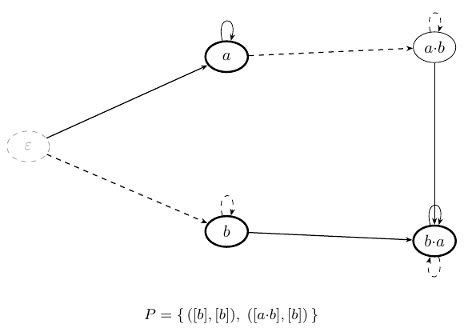
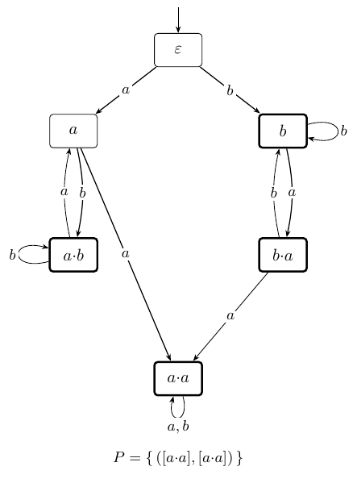
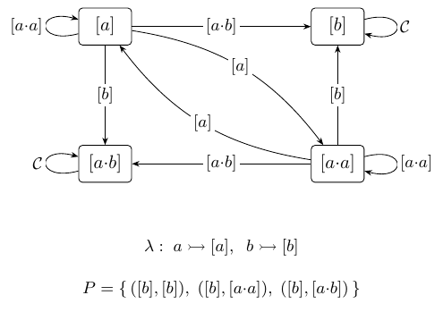
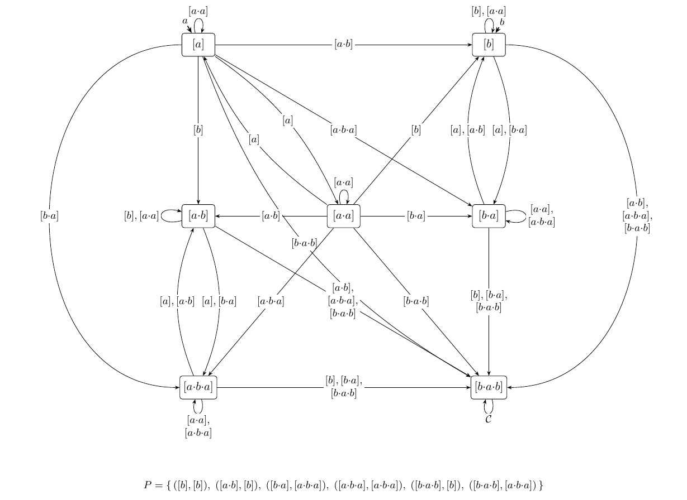
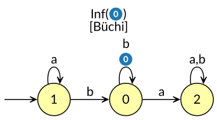
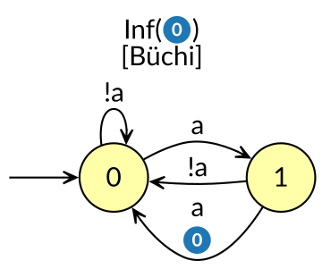
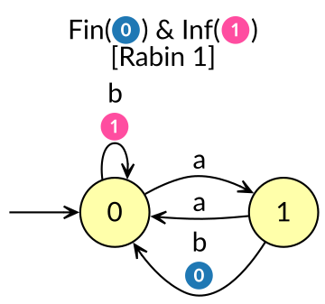
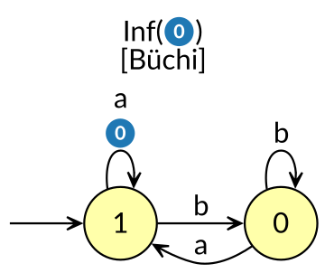

# Materializing the Syntactic ω-Semigroup: a Canonical Representation of Regular ω-Languages

**Yann Thierry-Mieg**

With significant inputs from
**Claude (Anthropic)**

*Working draft — 2026-07-13*

## Abstract

- The syntactic ω-semigroup: canonical, complete, defined since Arnold 1985, never built.
- Contribution 1: the object itself, reified as `𝓘 = ⟨𝒜, P⟩` — an algebra
  `𝒜 = (𝒞, λ, M)` and an acceptance layer `P` over it — with a standalone
  lasso-membership semantics: a canonical normal form for ω-regular languages, which
  the domain has never had.
- Contribution 2: the rotation lemma — the two-sided syntactic congruence is computable
  by right multiplications alone; the structural fact missing from 40 years of literature.
- Contribution 3: the construction from any deterministic Emerson–Lei automaton,
  assembling the two, with correctness `L(𝓘(D)) = L(D)` proved against the semantics.

## 1. Introduction

- Finite words have a normal form (the minimal DFA) and forty years of tooling on it;
  ω-words have none — no minimal deterministic automaton, every pipeline manipulates
  presentations, never languages.
- Arnold's syntactic ω-semigroup is the canonical algebra in principle and a phantom in
  practice: defined everywhere, built nowhere.
- The obstruction is structural (recognizers forget acceptance along runs; the
  congruence is two-sided) — kept from current §1, now as the bridge to Part B.
- Contributions restated: the object (§3), its uses as evidence of significance (§4),
  canonicity (§5), the construction with the rotation lemma at its core (§6–8).
- The three running examples announced — `GF(aa)`, `Even`, `EvenBlocks` — met first as
  tables, only later as automata.

## 2. Background

We fix a finite alphabet `Σ` and write `Σ*` for the finite words over it, `Σ⁺` for
the nonempty ones, `Σ^ω` for the infinite ones. The same exponents
serve on letters and words: for `x ∈ Σ`, `x*` — finitely many repetitions of `x`,
possibly none; `x⁺` — at least one; `x^ω` — repeated forever. A **language** here is a set of infinite words,
`L ⊆ Σ^ω`; we take `L` **regular** (ω-regular [PP04]) — the class with finite-memory
descriptions, and exactly the class the invariant of §3 captures. All examples in this
paper live over the two-letter alphabet `Σ = {a, b}`. This section fixes the few
classical notions the invariant rests on, adapting the presentation of Perrin and Pin
[PP04], each paired with the intuition tying the algebra back to languages of
infinite words.

Consider the language of Carton and Perrin [CP97, Ex. 10] described by `a*·b^ω` —
some `a`'s, then `b`'s forever — which we name `aUGb`. Its syntactic ω-semigroup
is drawn in Figure 1.

|  | ![Figure 1′ — [ε] elided](sos_core_figs/img/core_F0_astar_bomega_b.png) |
|:--:|:--:|

*Figure 1 (left) — the syntactic ω-semigroup of `aUGb = a*·b^ω`: five classes of
finite words, the letter map `λ` and the accepting pairs `P` beneath. It is the
multiplication table represented as a graph: both vertices and edges are labeled by
classes, modeling the product `M : 𝒞 × 𝒞 → 𝒞` of the algebra `𝒜` (§3) — following an
edge multiplies on the right by its label, parallel edges fused into one arrow
listing their labels. Figure 1′ (right) — `[ε]` is elided from the drawing: by
definition `[ε]` is the identity, `[ε]·[c] = [c]·[ε] = [c]`, so drawing it adds no
information; `𝒞` marks an edge that carries every class of the algebra. The
discussion in §2–3 uses Figure 1, without elision; Figure 1′ is homogeneous in
notation to the further figures (§3.4).*

**We only ever look at lassos.** A **lasso** (ultimately-periodic word) is `u·v^ω`: a
finite **stem** `u`, then a finite nonempty **loop** `v` repeated forever. The
organizing fact: *two regular ω-languages are equal iff they agree on all lassos*
[PP04, Ch. I, Cor. 9.8]. Classifying `L` is therefore assigning each lasso to one of finitely many
equivalence classes, and every notion below is machinery for naming the classes and
computing the assignment.

*Example.* `b^ω`, `ab·b^ω` and `aab·(bb)^ω` are lassos of `aUGb`; `ba·(ab)^ω` is a
lasso outside it.

**On finite words, the classifier is a finite monoid.** A **monoid** is a set with an
associative product and an identity element; the finite words `Σ*` form one, under
concatenation, with the empty word as identity. A finite monoid `M` **recognizes** a
language of finite words through a **morphism** `φ : Σ* → M` — a map carrying
concatenation to the product, `φ(u·v) = φ(u)·φ(v)`, and `ε` to the identity — such
that membership depends only on the value: the language is `φ⁻¹(P)` for an accepting
set `P ⊆ M`. The finitely many elements of `M` are the classes, and `φ` computes the
assignment, letter by letter. Every regular language of finite words is recognized by
a finite monoid, and among its recognizers one is canonical, the **syntactic monoid**
— the cornerstone of algebraic language theory [PP04].

*Example.* For `aUGb`, concatenation collapses onto five values — the five boxes
of Figure 1, the class `[ε]` of the empty word among them.

On *infinite* words, exactly one thing more is needed, because no product of finite
pieces expresses `v^ω`. One adjustment first: the empty word is the single finite
word that cannot be repeated forever — `ε^ω` is not an ω-word — so the infinite
theory is built on the nonempty words `Σ⁺`, a **semigroup**: the associative product
alone, no identity required. On `Σ⁺` and `Σ^ω` together, the words carry three total
operations:

* **concatenation** `Σ⁺ × Σ⁺ → Σ⁺` of two finite words;
* the **mixed product** `Σ⁺ × Σ^ω → Σ^ω` — a finite word prefixed to an ω-word,
  concatenation continued;
* the **ω-power** `Σ⁺ → Σ^ω`, `v ↦ v^ω` — the new operation, repetition forever.

An **ω-semigroup** `S = (S₊, S_ω)` is a finite structure with the same signature, one
**sort** per kind of word [PP04, Ch. II]: a finite semigroup `S₊` carries the classes
of nonempty finite words, a finite set `S_ω` carries the classes of ω-words; the
three operations become a product `S₊ × S₊ → S₊`, a mixed product `S₊ × S_ω → S_ω`,
and an ω-power `S₊ → S_ω`. The general definition equips the pair with an *infinite
product* `S₊^ω → S_ω` — one class for every infinite sequence of finite classes
[PP04, Ch. II]; on finite carriers the ω-power determines it entirely
[PP04, Ch. II, Thm 5.1], and the table-sized signature above is the form recalled
here. A **recognizer** for `L` is an ω-semigroup with a morphism
`φ = (φ₊, φ_ω)`, one component per sort — `φ₊ : Σ⁺ → S₊`, `φ_ω : Σ^ω → S_ω` —
carrying each operation to its counterpart,

`φ₊(u·v) = φ₊(u)·φ₊(v)`,   `φ_ω(u·w) = φ₊(u)·φ_ω(w)`,   `φ_ω(v^ω) = φ₊(v)^ω`,

such that membership depends only on the class: `L = φ_ω⁻¹(P)` for a set `P ⊆ S_ω`
of accepting ω-classes. Every regular `L` has a finite recognizer
[PP04, Ch. II, §7]. The organizing claim
is now explicit: two lassos with the same ω-class receive one verdict, and there are
at most `|S_ω|` classes of lassos.

**The second sort will not be carried.** Everything `S_ω` records about a lasso is
determined inside `S₊` by the classes of its stem and of its loop — the idempotent
power and the linked pair below are that determination made exact
[PP04, Ch. II, Thm 5.1]. §3 therefore
keeps one carrier — the classes of finite words, the class `[ε]` adjoined back to
make it a monoid again — and replaces `P` by a set of accepting *pairs* of word
classes.

*Example.* Figure 1 already has this one-sorted shape: five classes of finite words
and, beneath the drawing, the acceptance data as pairs of classes — no box for an
ω-word anywhere.

**The idempotent power.** In a finite semigroup the powers `s, s², s³, …` of any element
cannot all be distinct, so the sequence is eventually periodic and contains a unique
**idempotent**, the one power `s^n` (`n ≥ 1`) with `s^n·s^n = s^n`: the **idempotent
power** of `s`. Now read a loop `v` through the
morphism's finite-word component, simply `φ` from here on: the values of
`v, vv, vvv, …` are the powers of `φ(v)`, so they settle on the idempotent power of `φ(v)`.
That is how "loop forever" is read without any infinite object at hand: iterate the
loop's value until it stops changing, and keep that stable value.

*Example.* On Figure 1 (`aUGb`), the value `φ(b) = [b]` is its own idempotent power —
more `b`'s change nothing, `[b]·[b] = [b]`. The value `φ(ab) = [a·b]` is not: its
square `[a·b]·[a·b] = [b·a]` is the value of the *dead* words (`abab` puts an `a`
after a `b`, and no continuation rescues that), itself idempotent — so the idempotent
power of `φ(ab)` is `[b·a]`: looping `ab` forever is exactly as dead as slipping once.

**A linked pair names a lasso.** Reading `u·v^ω` through the morphism `φ`
(Ramsey's theorem [PP04, Ch. II, Thm 2.1]): the loop
settles on an idempotent `e` — the idempotent power of `φ(v)` — and the stem on
`s = φ(u)·e`, with `s·e = s` (the
stem precedes the loop and is absorbed by it). A **linked pair** is any `(s, e)` with
`e² = e` and `s·e = s`; `s` names the stem, `e` the loop, `(s, e)` the lasso. A
recognizer is fixed by which lassos it accepts, hence by its set of **accepting linked
pairs** — which is why (§3) the acceptance datum of the invariant is a *set of pairs*, not a
subset of the monoid.

*Example.* Read `aab·b^ω` on Figure 1: the loop's value `[b]` is already idempotent,
so `e = [b]`; the stem walks `a·a·b` from the root to `[a·b]`, which the loop absorbs
(`s = [a·b]·[b] = [a·b]`). The pair `([a·b], [b])` names the lasso — as it does every
lasso with stem in `a⁺b*` and loop in `b⁺`.

**One lasso, many names.** A single ω-word has many presentations —
`u·v^ω = (uv)·v^ω = u·(v²)^ω = (u v₁)·(v₂ v₁)^ω` — and, as §3 shows, these need not name
it by the same linked pair. Reconciling them is not bookkeeping: it is the **rotation
lemma** (§3), the paper's structural pivot, and the one nontrivial constraint the invariant
must satisfy.

*Example.* `a·(ba)^ω = ab·(ab)^ω = ab·(abab)^ω`: one ω-word, three presentations —
and infinitely many more. §3 shows how to canonically choose a single one, and gives
it: shortest stem, then shortest loop — here `(ab)^ω` with the empty stem, the
shortlex representative of the whole family.

We now present a canonical representation of an arbitrary regular ω-language `L`,
using its syntactic ω-semigroup reified as an invariant `𝓘(L)`.

## 3. The syntactic ω-semigroup as an invariant `𝓘(L)`

The definition of the invariant

```
    𝓘(L) = ⟨𝒜, P⟩
```

splits in two parts: the **algebra** `𝒜`, a finite monoid classifying the finite
words, and the **acceptance layer** `P`, a set of accepted linked pairs carrying
acceptance. We define the algebra first.

### 3.1 Syntax: the invariant `𝓘 = ⟨𝒜, P⟩`

Let us define the algebra component `𝒜` of the invariant `𝓘 = ⟨𝒜, P⟩`.

**Definition 3.1 (algebra).** An **algebra** `𝒜` over `Σ` is a triple `(𝒞, λ, M)`:

- `𝒞` is a finite set of **classes**, denoted `[c]`, where `c ∈ Σ*` is the
  **representative** of that class; the empty word is always in its own class `[ε]`;
- `λ : Σ ∪ {ε} → 𝒞` is the **letter map**, associating to each letter of the alphabet
  its class; by definition `λ(ε) = [ε]` and, for all `x ∈ Σ`, `λ(x) ≠ [ε]` — `[ε]` is
  **isolated**;
- `M : 𝒞 × 𝒞 → 𝒞` is the **multiplication table**: **associative**, with `[ε]` a
  two-sided **identity** — for all `c ∈ 𝒞`, `M(c, [ε]) = M([ε], c) = c` — so `(𝒞, M)`
  is a finite monoid, and we write `s·t := M(s, t)`.

By convention, the shortlex-smallest word in each class (shortest, then alphabetical)
is chosen as its representative.

*Example.* The algebra of `aUGb` (`a*·b^ω`) is represented in Figure 1. It
contains five classes `𝒞 = {[ε], [a], [b], [a·b], [b·a]}`, which are also the
vertices of the diagram, with `λ(a) = [a]` and `λ(b) = [b]`. The edges are also
labeled by `𝒞`, representing the multiplication table `M : 𝒞 × 𝒞 → 𝒞` of the algebra
as a graph. The letter actions

```
 ·a :  [ε]↦[a]    [a]↦[a]     [b]↦[b·a]   [a·b]↦[b·a]   [b·a]↦[b·a]
 ·b :  [ε]↦[b]    [a]↦[a·b]   [b]↦[b]     [a·b]↦[a·b]   [b·a]↦[b·a]
```

are read off its edges, and these two rows are the whole of `M`: any product `s·t` is
the representative of `t` walked from `s`, edge by edge.

*Example.* On Figure 1 (`aUGb`), consider the lasso `aab·b^ω`. Its reading starts in
`[ε]`, and we do not progress by
letters but by classes: reading a letter `x` follows the edge labeled `λ(x)`. The
first `a` follows `[a]`, from `[ε]` to `[ε]·[a] = [a]`, the class vertex of the
letter itself. In this
situation reading `a` stays in place, `[a]·[a] = [a]`, while `b` moves on,
`[a]·[b] = [a·b]`: after the stem `aab` we sit in `[a·b]`. The loop `b^ω` then turns
on the self-loop `[b]` of `[a·b]` forever — the reading of a lasso is a finite path
that ends circling a cycle. Reading §2's outside lasso `ba·(ab)^ω` instead:
`[ε]·[b] = [b]`, then `[b]·[a] = [b·a]`, and the loop `(ab)^ω` circles at `[b·a]`,
since `[b·a]·[a] = [b·a]·[b] = [b·a]`.

*Example.* On Figure 1 (`aUGb`), `[a]` holds the words in `a⁺`, `[b]` those in
`b⁺`, `[a·b]` those in `a⁺b⁺`, and `[b·a]` the *dead* words, a two-sided **zero**
(`x·[b·a] = [b·a]·x = [b·a]`): once an `a` follows a `b`, no continuation can rescue
the word — which is why the second reading never left `[b·a]`.

**The letter map.** `λ` is data in its own right: two algebras may share their
classes and their table and differ only in `λ`.

*Example.* Over `Σ = {a, b, c}`, the language `(a|c)*·b^ω` has exactly the five
classes and products of Figure 1: `a` and `c` are interchangeable everywhere, so
`λ(a) = λ(c) = [a]`, and the drawing is unchanged; only `λ` tells the two algebras
apart.

**The idempotent power.** Each class `s` has a unique idempotent power (§2): among
the powers `s, s², s³, …` — finitely many, since `𝒞` is finite — exactly one is
idempotent. We write it `s^ω`: the superscript is free — the invariant carries no
second sort and no ω-power — and this idempotent is exactly what stands in for them.
It is a computation on the multiplication table alone.

*Example.* On Figure 1 (`aUGb`), all classes but `[a·b]` are
idempotent, hence their own idempotent powers:
`[ε]` is the identity; `[a]·[a] = [a]` and `[b]·[b] = [b]` read on their self-loops —
more `a`'s, more `b`'s change nothing; and `[b·a]·[b·a] = [b·a]`, the zero absorbing
even itself. `[a·b]` is not: gluing two words of `a⁺b⁺` puts an `a` after a `b`, so
`[a·b]·[a·b] = [b·a]` — already idempotent. Hence `[a·b]^ω = [b·a]`: iterating "`a`'s
then `b`'s" forces an `a` after a `b`.

The second component of the invariant `𝓘` is a set of pairs of classes.

**Definition 3.2 (pair set; invariant).** A **pair set** over an algebra `𝒜` is a
finite set `P ⊆ 𝒞 × 𝒞` of pairs of classes. An **invariant** is a pair `𝓘 = ⟨𝒜, P⟩`.

*Example.* Figure 1 carries its pair set beneath the drawing:
`P = { ([b], [b]), ([a·b], [b]) }`. Of the two lassos we have been reading since §2,
only `aab·b^ω` belongs to `aUGb`; `ba·(ab)^ω` does not — and `P` is the data that
separates them. The first reading ended circling `[a·b]` on the loop class `[b]`, and
`([a·b], [b])` is listed in `P`; the second ended at `[b·a]`, which appears in no
pair.

### 3.2 Semantics: the language of an invariant

An invariant decides lassos with the data it carries and nothing else: `λ` assigns
each letter its class, the table `M` extends that assignment to every finite word —
stem and loop alike — and `P` lists the pairs that accept. The assignment of words
to classes comes first.

**Definition 3.3 (fold).** Let `𝒜 = (𝒞, λ, M)` be an algebra over `Σ`. The
**fold** of `𝒜` is the map `· : Σ* → 𝒞` extending the letter map to all finite
words through the table: for `u = x₁x₂⋯xₙ ∈ Σ*`,
`u := λ(x₁)·λ(x₂)·⋯·λ(xₙ)`, the empty product being `ε := λ(ε) = [ε]`; we call
`u` the fold of `u`.

The fold is well defined: `M` is a total function and associative (Definition 3.1),
so the product of the letter classes always exists and its value does not depend on
how it is parenthesized — one class per word. It is moreover a monoid morphism —
`u·v = u·v`, `ε = [ε]` — the only one agreeing with `λ` on the letters: on
nonempty words it is §2's morphism `φ`, realized on the table, and the adjoined
`[ε]` extends it to the empty word.

*Example.* On Figure 1 (`aUGb`), the fold of a word is where its reading ends — one
letter, one edge, from the root: `aab = [a]·[a]·[b] = [a·b]`, and
`ba = [b]·[a] = [b·a]`, the dead class.

**Definition 3.4 (language of an invariant).** Let `𝓘 = ⟨𝒜, P⟩` denote an invariant
over `Σ`, and `w = u·v^ω ∈ Σ^ω` a lasso, its loop `v` nonempty. Let `e := v^ω` be
the idempotent power in `𝒜` of the fold of `v`. Then

```
    w ∈ L(𝓘)   iff   (u·e, e) ∈ P.
```

*Example.* On Figure 1 (`aUGb`), the two verdicts. For `aab·b^ω`: the loop folds to
`b = [b]`, already idempotent, so `e = [b]`; the stem folds to `aab = [a·b]` and
`[a·b]·[b] = [a·b]`. The pair `([a·b], [b])` is in `P`: accepted. For `ba·(ab)^ω`:
the loop folds to `ab = [a·b]`, not idempotent — its square `[b·a]` is — so
`e = [b·a]`; the stem folds to `[b·a]` and `[b·a]·[b·a] = [b·a]`. The pair
`([b·a], [b·a])` is not in `P`: rejected, as §2 announced.

The definition reads `w` through one presentation `(u, v)`, and a lasso has many.
That the verdict does not depend on the presentation chosen is not automatic; it is
the subject of the next section.

### 3.3 Canonicity: the invariant of `L`

Definition 3.4 leaves two debts. It reads a lasso through one presentation, and a
lasso has many — nothing yet says all presentations receive one verdict. And it
evaluates whatever invariant it is handed — nothing yet singles out, among the many
invariants denoting one language, a canonical one. Both debts are paid at once by
building the invariant from `L` itself, one class per behavior `L` can distinguish.
The classifying relation is Arnold's [Arn85]. A finite word sits in a lasso either
in the stem or inside the loop, and interchangeability must hold in both positions:

**Definition 3.5 (syntactic congruence [Arn85]).** Two words `u, v ∈ Σ⁺` are
**syntactically congruent** for `L`, written `u ≈_L v`, when they are
interchangeable in both context shapes:

```
    (linear)     ∀ x, y ∈ Σ*, t ∈ Σ⁺ :   x·u·y·t^ω ∈ L  ⟺  x·v·y·t^ω ∈ L
    (ω-power)    ∀ x, y ∈ Σ*          :   x·(u·y)^ω ∈ L  ⟺  x·(v·y)^ω ∈ L
```

The linear shape mutates the stem — a finite change, a loop `t` appended to complete
the lasso; the ω-power shape mutates inside the loop, where the change recurs
forever. `≈_L` is a two-sided **congruence** — `u ≈_L v` gives `x·u·y ≈_L x·v·y` —
of **finite index** for regular `L`: finitely many classes [Arn85]. And it is the
**coarsest** relation with these interchange properties — every relation
interchangeable in both shapes refines it — the first of two senses in which the
quotient below is minimal.

*Example.* On Figure 1 (`aUGb`), from `L = a*·b^ω` alone: `a ≉_L b` by the ω-power
shape at `x = y = ε` — `a^ω ∉ L`, `b^ω ∈ L`; `ab ≉_L ba` by the linear shape at
`x = y = ε`, `t = b` — `ab·b^ω ∈ L`, `ba·b^ω ∉ L`; and `a ≈_L aa` — membership in
`L` never counts `a`'s, in either shape a block of `a`'s acts as one `a`. The
quotient `Σ⁺/≈_L` has exactly four classes — `a⁺`, `b⁺`, `a⁺b⁺` and the dead words —
the four boxes of Figure 1 other than `[ε]`.

**Definition 3.6 (the invariant of `L`).** `𝓘(L) := ⟨𝒜(L), P(L)⟩`, where
`𝒜(L) = (𝒞, λ, M)` and:

- `𝒞 := Σ⁺/≈_L ∪ {[ε]}`: one **word class** per congruence class of nonempty
  words, keyed by its shortlex-smallest member (§3.1), plus the adjoined `[ε]`;
- `λ(x) := [x]` for `x ∈ Σ`, and `λ(ε) := [ε]`;
- `M` is the induced product, `[u]·[v] := [u·v]` on word classes — well defined
  because `≈_L` is a two-sided congruence — with `[ε]` the identity;
- `P(L) := { (s, e) : s, e word classes, e·e = e, s·e = s, w_s·(w_e)^ω ∈ L }`,
  where `w_s` and `w_e` are the keys of `s` and `e` — the linked pairs (§2, now of
  classes) whose one representative lasso belongs to `L`.

`𝒜(L)` is an algebra in the sense of Definition 3.1 — `[ε]` is isolated, no letter
folding to it — and it is **letter-generated**: `u = [u]` for every `u ∈ Σ*` (`λ`
seeds the letters, `M` is the induced product, induction does the rest), so every
class is the fold of each of its members, and `u = [ε]` only for `u = ε`. As
stated, `P(L)` consults a single lasso per pair, built from the keys; that the
choice of representatives is innocent is Theorem 3.8's content.

*Example.* Figure 1 is `𝓘(aUGb)` — §2 called the drawing a syntactic ω-semigroup,
and Definition 3.6 is that claim made precise. Six pairs of word classes are
linked: `([a],[a])`, `([b],[b])`, `([a·b],[b])`, `([b·a],[a])`, `([b·a],[b])`,
`([b·a],[b·a])`. Testing each key lasso: `b·b^ω = b^ω ∈ L` and `ab·b^ω ∈ L`; the
four others fail — `a·a^ω = a^ω` never shows a `b`, and a dead stem stays dead. So
`P(L) = { ([b],[b]), ([a·b],[b]) }`, the pair set printed beneath the figure.

The two shapes were tailored to lassos, and they pay immediately:

**Lemma 3.7 (substitution).** If `u ≈_L u'` and `v ≈_L v'` (all four words
nonempty), then `u·v^ω ∈ L ⟺ u'·v'^ω ∈ L`.

*Proof.* Swap the loop: the ω-power shape of `v ≈_L v'`, at `x = u` and `y = ε`,
gives `u·v^ω ∈ L ⟺ u·v'^ω ∈ L`. Swap the stem: the linear shape of `u ≈_L u'`, at
`x = y = ε` and `t = v'`, gives `u·v'^ω ∈ L ⟺ u'·v'^ω ∈ L`. ∎

**Theorem 3.8 (canonicity).** For every regular ω-language `L`:

(i) on `𝓘(L)`, the query of Definition 3.4 answers membership in `L` itself —
every presentation of every lasso receives `L`'s verdict — so the verdict is
presentation-independent and `L(𝓘(L)) = L`;

(ii) `𝓘` is a **complete invariant**: two regular ω-languages over `Σ` are equal
iff `𝓘(L)` and `𝓘(L')` are identical, component by component — byte equality once
serialized, keys and all.

*Proof.* (i) Let `(u, v)` present the lasso `w`, `v` nonempty; the query computes
`e := v^ω` and `s := u·e`. The idempotent power is a power: pick `k ≥ 1` with
`v^k = e`. Rewrite `w` on the presentation `(u·v^k, v^k)`: the fold is a morphism
(§3.2), so `u·v^k = u·e = s` and `v^k = e` — the queried pair is unchanged,
and both coordinates are now folds of nonempty words. By letter-generation
(Definition 3.6) `s = [u·v^k]` and `e = [v^k]`: the keys satisfy `w_s ≈_L u·v^k`
and `w_e ≈_L v^k`. Lemma 3.7 substitutes both at once:
`w = (u·v^k)·(v^k)^ω ∈ L ⟺ w_s·(w_e)^ω ∈ L`, and the right-hand side is, by
definition, `(s, e) ∈ P(L)`. The query's verdict is membership in `L`, whatever
the presentation. Lassos determine a regular language [PP04, Ch. I, Cor. 9.8], so
`L(𝓘(L)) = L`.

(ii) `≈_L`, the shortlex keys, `λ`, `M` and the membership tests of `P(L)` are
functions of `L` alone, so `L = L'` gives `𝓘(L) = 𝓘(L')` literally. Conversely,
by (i), `𝓘(L) = 𝓘(L')` gives `L = L(𝓘(L)) = L(𝓘(L')) = L'`. ∎

*Example.* On Figure 1 (`aUGb`), present `aab·b^ω` as `(aab, b)` or as
`(aabb, bb)`: both queries land on the pair `([a·b], [b])` — here even the *name*
is stable. That is a feature of `aUGb`, not of the theorem: `Even` (§3.4) answers
one lasso through two distinct pairs, and Theorem 3.8 is what forces those two
pairs to one verdict.

§2 promised a reconciliation: one lasso, many names. Say a linked pair `(s, e)`
**names** the lasso `u·v^ω` when some presentation folds to it — `v^ω = e` and
`u·e = s`. Both components are then folds of nonempty words, so a name lies in
the word classes: no lasso is named through `[ε]` — nothing that happens forever
has an empty trace. Theorem 3.8 gives every name `L`'s verdict; the constraint
this puts on a pair set has a single generator. **A loop may be rotated**: a
factor carried from the loop's front onto the stem leaves the ω-word unchanged,
`u·g·(h·g)^ω = u·(g·h)^ω` — and rotation is the one move that changes a lasso's
name.

**Lemma 3.9 (rotation).** Let `𝒜` be a letter-generated algebra and `s, g, h ∈ 𝒞`
with `s·(gh)^ω = s`. Then `(s·g, (hg)^ω)` is a linked pair, and some lasso is
named by both `(s, (gh)^ω)` and `(s·g, (hg)^ω)`.

*Proof.* First the algebra identities. Associativity gives `g·(hg)^m = (gh)^m·g`
for every `m ≥ 1`. Pick `k₁, k₂ ≥ 1` with `(gh)^{k₁} = (gh)^ω` and
`(hg)^{k₂} = (hg)^ω`, and set `m := k₁·k₂`: then `(gh)^m = (gh)^ω` and
`(hg)^m = (hg)^ω` simultaneously, so `g·(hg)^ω = (gh)^ω·g`. Hence `(hg)^ω` is
idempotent and `(s·g)·(hg)^ω = s·(gh)^ω·g = s·g`: the rotated pair is linked. By
letter-generation pick words `w, p, q` with `w = s`, `p = g`, `q = h`, and
consider the single ω-word `α := w·(pq)^ω`. The presentation `(w, (pq)^m)` folds
to `(s·(gh)^ω, (gh)^ω) = (s, (gh)^ω)`; the presentation `(w·p, (qp)^m)` — the
same ω-word, `w·(pq)^ω = w·p·(qp)^ω` — folds to
`(s·g·(hg)^ω, (hg)^ω) = (s·g, (hg)^ω)`. So `α` is named by both pairs. ∎

Call two linked pairs **conjugate** when rotations connect them — the equivalence
generated by `(s, (gh)^ω) ∼ (s·g, (hg)^ω)`; the notion is classical
[PP04, Ch. II, Prop. 2.6]. Stem extension is the degenerate rotation `g = h = v`: the
loop's value is unchanged and the stem absorbs one turn — why `(u, v)` and
`(uv, v)` may name one lasso by two pairs.

**Definition 3.10 (saturation).** A pair set `P` over an algebra is **saturated**
when it is closed under conjugacy: for all `s, g, h ∈ 𝒞` with `s·(gh)^ω = s`,

```
    (s, (gh)^ω) ∈ P   ⟺   (s·g, (hg)^ω) ∈ P.
```

**Corollary 3.11.** `P(L)` is saturated.

*Proof.* By Lemma 3.9 some lasso `α` is named by both pairs; a name is the queried
pair of some presentation of `α`, and by Theorem 3.8 every query on `α` answers
`α ∈ L`. So each of the two pairs belongs to `P(L)` iff `α ∈ L` — both in or both
out. ∎

Saturation is the one law an acceptance layer must obey, and it is
table-checkable: finitely many triples `(s, g, h)`, each one product and two
lookups. The rotation identity itself is classical — at the algebra it is Wilke's
axiom `s·(ts)^ω = (st)^ω` [PP04, Ch. II, Thm 5.1], and conjugacy of linked pairs
organizes the classical theory [PP04, Ch. II, Prop. 2.8, Cor. 2.9]. What this paper draws from it is a different service:
rotation turns two-sided demands about `L` into right-only computations — the
engine of the construction (§4), where it collapses Arnold's two-sided congruence
to a right-invariant refinement computable on a table.

*Example.* On Figure 1 (`aUGb`), every conjugacy class is a singleton — whatever
factor a rotation moves, the dead class absorbs it, and the two accepting stems
absorb their loops — so saturation of `P(aUGb)` is immediate. A conjugacy that
genuinely pairs two names, and the saturation check it forces, is worked on
`Even` in §3.4.

### 3.4 The examples, as invariants

Three more languages exercise the invariant across its range, and they run through
the rest of the paper: **`GF(aa)`** — infinitely
many `aa`-factors, LTL-definable; **`Even`** — an even number of `a`'s before the first
`b`, then anything, *not* LTL; **`EvenBlocks`** — infinitely many `b` and eventually
every completed `a`-block even, *not* LTL and prefix-independent. Each is met here as
its invariant — the letter actions, the few laws that organize them, and the table
drawn as a graph; automata wait until §4, the machine formats (serialization, integer
tables) until Part B. In all
three, `λ(a) = [a]` and `λ(b) = [b]`, and letter-generation makes the two action rows
the whole of `M`.

**(a) `GF(aa)`** — six classes:

```
 ·a :  [ε]↦[a]    [a]↦[a·a]   [b]↦[b·a]   [a·b]↦[a]     [b·a]↦[a·a]   [a·a]↦[a·a]
 ·b :  [ε]↦[b]    [a]↦[a·b]   [b]↦[b]     [a·b]↦[a·b]   [b·a]↦[b]     [a·a]↦[a·a]
```

Laws: `[a·a]` — "has seen `aa`" — is a two-sided **zero**
(`x·[a·a] = [a·a]·x = [a·a]`); every power cycle has period 1 — aperiodic, the LTL
side of the cut; the idempotents are `[b]`, `[a·b]`, `[b·a]`, `[a·a]`, with
`[a]^ω = [a·a]`. One accepting pair, `P = { ([a·a],[a·a]) }`: hit the zero and loop
there — `aa` recurs.



*Figure 2 — `GF(aa)`. Two waiting rooms — `[a] ⇄ [a·b]` and `[b] ⇄ [b·a]`, cycles
with no common label, hence no group — each escaping on `a` toward the zero; the one
accepting name loops at the zero itself.*

**(b) `Even`** — five classes:

```
 ·a :  [ε]↦[a]    [a]↦[a·a]   [b]↦[b]     [a·b]↦[a·b]   [a·a]↦[a]
 ·b :  [ε]↦[b]    [a]↦[a·b]   [b]↦[b]     [a·b]↦[a·b]   [a·a]↦[b]
```

Laws: `{[a], [a·a]}` is a **period-2 cycle** (`[a]·[a] = [a·a]`, `[a·a]·[a] = [a]`) — a
`Z₂` in the algebra, visible in the `·a` row as the swap `[a] ↔ [a·a]`. `[a·a]` acts as
the **identity** on the four word classes: the algebra owns a second neutral element,
and the adjoined identity of §3.1 keeps `[ε]` apart. `[b]` and `[a·b]` are
**left zeros**, fixed by both letters: the first `b` has been read, after an even
(`[b]`) or odd (`[a·b]`) count of `a`'s. Accepting pairs `([b],[b])`, `([b],[a·a])`,
`([b],[a·b])`: once `[b]` is reached, every loop accepts.



*Figure 3 — `Even`. The diagonal `[a] ⇄ [a·a]`, both legs labeled `[a]`, is a
monochrome two-cycle — the `Z₂` drawn; every accepting name stems at `[b]`.*

**(c) `EvenBlocks`** — eight classes:

```
 ·a :  [ε]↦[a]       [a]↦[a·a]    [b]↦[b·a]        [a·b]↦[a·b·a]
       [b·a]↦[b]     [a·a]↦[a]    [a·b·a]↦[a·b]    [b·a·b]↦[b·a·b]
 ·b :  [ε]↦[b]       [a]↦[a·b]    [b]↦[b]          [a·b]↦[a·b]
       [b·a]↦[b·a·b] [a·a]↦[b]    [a·b·a]↦[b·a·b]  [b·a·b]↦[b·a·b]
```

Laws: the *same* `Z₂` `{[a], [a·a]}` returns, and `[a·a]` is again neutral on the word
classes; `[b·a·b]` — a completed odd block — is the two-sided **zero**. Unlike
`aUGb`'s dead class, this zero is no death sentence: the language forgives finitely
many odd blocks, and the acceptance layer says so — of the six accepting pairs

```
P = { ([b],[b]),  ([a·b],[b]),  ([b·a],[a·b·a]),
      ([a·b·a],[a·b·a]),  ([b·a·b],[b]),  ([b·a·b],[a·b·a]) }
```

two sit at the zero itself: what has happened is absorbed; what loops forever decides.



*Figure 4 — `EvenBlocks`. The same `Z₂` acting as three `·a` swaps — one per
phase of the language — and two accepting names sitting at the zero.*

---

**Reading the invariant by hand.** Three checks, all on the letter actions above and none
touching an automaton.

*Membership by one fold.* Is `(a·a)^ω ∈ Even`? Fold the loop: `[ε] ↦ [a] ↦ [a·a]`,
already idempotent; the empty stem gives `s = [ε]·[a·a] = [a·a]`. The pair
`([a·a], [a·a])` is not among `Even`'s accepting pairs, so it is rejected — correctly,
`(aa)^ω` never sees a `b`.

*The group is on the table.* In `Even`, `[a]·[a] = [a·a]` and `[a·a]·[a] = [a]`: the
pair `{[a], [a·a]}` is a cycle of period 2, a `Z₂` sitting in the algebra. Since
aperiodicity of the algebra is exactly LTL-definability [DG08], this cycle *is* the
reason `Even` is not LTL — read straight off the letter actions, before any acceptance
is consulted. `GF(aa)`'s algebra, by contrast, has every power-cycle of period 1:
aperiodic, hence LTL. In the drawing the criterion is a *monochrome* cycle — all
edges sharing one class label, as `Even`'s `[a]`-swap between `[a]` and `[a·a]`
(Figure 3); every column of `M` being drawn, every power cycle is a drawn cycle. A
cycle with no common label proves nothing: `GF(aa)`'s graph closes
`[a] →^b [a·b] →^a [a]` (Figure 2's waiting rooms), and its algebra is aperiodic
all the same.

*Saturation, checked.* The query on `a^ω` presented two ways must agree, and does:
`(ε, a)` folds to the pair `([ε]·[a]^ω, [a]^ω) = ([a·a], [a·a])`, while `(a, a)` folds
to `([a]·[a·a], [a·a]) = ([a], [a·a])` — a conjugacy step
`(s, (gh)^ω) ∼ (s·g, (hg)^ω)` with `s = g = h = [a]`, the two-name lasso promised
in §3.3. Both pairs are absent from
`Even`'s accepting set, as saturation (Definition 3.10) demands; a `P` containing one
but not the other would be an *illegal* acceptance layer, its query self-contradictory
on the single word `a^ω`.

## 4. The construction: from an automaton to `𝓘(L)`

We now construct the invariant. The input is an automaton `D` for `L`, in the most
general deterministic form in use — throughout this section `L := L(D)`. The output
is `𝓘(D) = ⟨𝒜(D), P(D)⟩`, and the destination is Theorem 4.11:
`𝓘(D) = 𝓘(L)` — not merely *an* invariant denoting `L`, but the syntactic
invariant of §3.3 itself, byte for byte, whatever presentation `D` was. Two steps
carry the section: an enrichment that makes the automaton's acceptance algebraic
(§4.2), and a quotient that §3.3's rotation lemma makes computable by right
multiplications alone (§4.3).

### 4.1 Emerson–Lei automata

Nothing in this subsection is ours: we fix the input format and its vocabulary, and
meet the running examples as machines.

**Definition 4.1 (deterministic Emerson–Lei automaton).** A **deterministic,
complete Emerson–Lei automaton** over `Σ` is `D = (Q, ι, δ, C, Acc)`: a finite set
`Q` of **states** with an **initial** state `ι ∈ Q`; a total **transition
function** `δ : Q × Σ → Q`, each transition carrying a (possibly empty) subset of
a finite set `C` of **marks**; and an **acceptance condition** `Acc`, a positive
Boolean combination of atoms `Inf(c)`, `Fin(c)` for `c ∈ C`. An ω-word
`α = x₀x₁⋯` traces the unique infinite **run** `q₀ = ι`, `q_{i+1} = δ(q_i, x_i)` —
one successor per letter, a successor for every letter, so exactly one run, never
stalling. `Acc` is evaluated on the set of marks the run collects infinitely
often — `Inf(c)` true iff `c` recurs, `Fin(c)` iff it does not — and `L(D)` is the
set of ω-words whose run satisfies `Acc`.

Emerson–Lei acceptance is the most general ω-regular acceptance — Büchi, co-Büchi,
Rabin, Muller are special shapes — and every regular `L` is `L(D)` for some such
`D`, determinization costing at worst an exponential [Saf88]. For `q ∈ Q`, the
**residual** `L(q) := { α : the run from q on α satisfies Acc }` is what `D` would
accept started at `q`; determinism ties residuals to the language,
`L(δ(ι, u)) = u⁻¹L` for every finite `u`. We write `Reach := δ(ι, Σ*)` for the
states some finite word reaches.

These automata are, in practice, the standard machine representation of regular
ω-languages — the form modern tools exchange and optimize. What the format lacks
is a canonical form: on finite words minimization yields *the* minimal DFA, unique
up to isomorphism, while a regular ω-language has no such distinguished machine —
`GF(aa)` is presented below by two non-isomorphic automata on the same two states,
with nothing intrinsic to prefer either. §4.4 sends both to one invariant.

*Example.* `aUGb` is `L(D)` for a three-state `D`: state `A` (initial) loops on
`a`; `b` leads to `B`, which loops on `b`, that loop carrying the single mark `c`;
an `a` at `B` falls to the sink `Z`, which absorbs both letters unmarked.
`Acc = Inf(c)`: a run collects `c` forever iff it eventually reads only `b`'s.



*The three-state automaton for `aUGb` (caption TODO; `!a` reads as this paper's
`b`).*

*Example.* `GF(aa)` is `L(D)` for a two-state `D` tracking the parity of the
running block of `a`'s (Figure 5, left): the letter `a` *transposes* the two
states — a `Z₂` in the maps `q ↦ δ(q, w)` — and the transposition closing an `aa`
carries the mark; `b` resets to the even state, unmarked. `Acc = Inf(0)`: an
`aa`-factor recurs iff the mark does. `Even` needs four states (Figure 5, middle):
the parity pair, swapped by `a`, plus two sinks — `b` at even parity enters the
accepting sink, whose self-loops carry the mark, `b` at odd parity falls to the
rejecting sink; `Acc = Inf(0)`. `EvenBlocks` returns to two states (Figure 5,
right): `a` toggles the parity of the running block; `b` returns to even, marked
`1` when the block it closes is even, `0` when it is odd;
`Acc = Fin(0) ∧ Inf(1)` — infinitely many even blocks, finitely many odd ones.





*Figure 5 — three of the four inputs, as Spot renders them: `GF(aa)` run-parity
(the `a`-transposition), `Even` (the parity pair and two sinks), `EvenBlocks`
(`Fin(0) ∧ Inf(1)` on the block-closing letter). Drawn over the one-atom alphabet
`{!a, a}`: read `!a` as this paper's `b`; the drawn shortlex order is `!a < a`,
the reverse role order of this paper's `a < b`, so keys do not transfer. `aUGb`'s
three-state automaton is described in the text.*

### 4.2 Step 1: the enriched monoid `EM(D)`

The classical algebra of `D` on finite words is its transition monoid, the maps
`q ↦ δ(q, w)`. It forgets the marks a run collects — exactly the data `Acc`
consumes. So we enrich it.

**Definition 4.2 (enriched monoid).** For `w ∈ Σ*`, the **enriched element** `⟨w⟩`
records, at each state, where `w` leads and what it collects:

```
    ⟨w⟩ : q ↦ ( δ(q, w), mk(q, w) ),
```

`mk(q, w) ⊆ C` the marks on the run from `q` over `w`. `EM(D)` is the set of
enriched elements under the composition `⟨w⟩·⟨w'⟩ = ⟨w·w'⟩` — at `q`: reach
`δ(q, w)`, continue by `w'`, unite the marks — a finite monoid generated by the
letter elements `⟨x⟩`, with identity `⟨ε⟩ : q ↦ (q, ∅)`; every element is `⟨y⟩`
for some word `y`. We write `st_e(q)`, `mk_e(q)` for the two components of
`e ∈ EM(D)` at `q`. The brackets `⟨·⟩` leave `·` to §3.2's fold.

*Example.* On the two-state `GF(aa)` of §4.1, the elements `⟨a⟩` and `⟨aaa⟩` have
the *same* state part — the transposition of the two states — and differ only in
marks: `mk_{⟨aaa⟩}(0) = {0}` (the longer word closes an `aa`),
`mk_{⟨a⟩}(0) = ∅`. The transition monoid identifies them; the enrichment is what
keeps them apart. Closing the letters under composition gives `|EM| = 10` for this
presentation of `GF(aa)`, `7` for `Even`, `16` for `EvenBlocks`.

**Lemma 4.3 (skeleton).** If two ω-words factor into blocks with the same sequence
of enriched images — `α = w₁w₂⋯`, `β = w'₁w'₂⋯` with `⟨w_k⟩ = ⟨w'_k⟩` for
every `k` — then `α ∈ L ⟺ β ∈ L`.

*Proof.* Determinism gives each word one run. The composition law turns block
equality into prefix equality, `⟨w₁⋯w_k⟩ = ⟨w'₁⋯w'_k⟩`, so both runs sit at the
same state `p_k = st_{⟨w₁⋯w_k⟩}(ι)` at every block boundary; and the marks
collected inside block `k` are read off the block's own image at that state:
`mk(p_{k-1}, w_k) = mk_{⟨w_k⟩}(p_{k-1}) = mk_{⟨w'_k⟩}(p_{k-1}) = mk(p_{k-1}, w'_k)`.
The two runs thus collect the same marks per block, hence the same set of marks
infinitely often — and `Acc` is a function of that set alone. ∎

Block equality is the needed hypothesis: equal *prefix* images do not suffice. On
the one-state automaton of Proposition 4.5 below, `a·a·a⋯` and `a·b·b⋯` have equal
enriched images on every prefix — all collect `{c}` — yet the first is in `L(D)`
and the second is not: a union of marks along a prefix hides which block collected
them.

**Corollary 4.4 (the enrichment refines Arnold).** For nonempty `u, v`:
`⟨u⟩ = ⟨v⟩` implies `u ≈_L v`.

*Proof.* Both shapes of Definition 3.5 compare ω-words that factor into blocks
with equal enriched images. Linear shape: `x·u·y·t^ω` and `x·v·y·t^ω` factor as
`x | u | y | t | t | ⋯` and `x | v | y | t | t | ⋯` — equal blockwise, `⟨u⟩ = ⟨v⟩`
at the one block that differs; Lemma 4.3 gives one verdict. The ω-power shape
factors as `x | uy | uy | ⋯` against `x | vy | vy | ⋯`, with
`⟨u·y⟩ = ⟨u⟩·⟨y⟩ = ⟨v⟩·⟨y⟩ = ⟨v·y⟩`. ∎

So `≈_L` lives on the finite monoid: by Corollary 4.4 it induces an equivalence on
the images of nonempty words — two elements are equivalent when the words they
image are congruent, any choice of words giving the same answer — and computing
`Σ⁺/≈_L` is computing a quotient of `EM(D)`. Two boundary facts calibrate how far
`EM(D)` is from that quotient.

**Proposition 4.5 (enrichment is necessary).** No quotient of the transition
monoid can serve, in general, as the algebra of an invariant denoting `L(D)`.

*Proof (a one-state witness).* Let `D` have one state `p`, both letters of
`Σ = {a, b}` self-looping, the mark `c` on the `a`-loop only, `Acc = Inf(c)`:
`L(D)` is "infinitely many `a`'s". The transition monoid is trivial — every word
is the identity map on `{p}` — so in any algebra built on it the folds of `a` and
`b` coincide, the queries of `a^ω` and `b^ω` coincide (Definition 3.4), and the
two receive one verdict. But `a^ω ∈ L(D)` and `b^ω ∉ L(D)`. The enriched elements
do separate them: `mk_{⟨a⟩}(p) = {c} ≠ ∅ = mk_{⟨b⟩}(p)`. ∎

The starkness is the message: a trivial transition monoid under a nontrivial
language. No state bookkeeping recovers acceptance — the marks along the run are
irreducible data, and the enrichment is the smallest way to keep them. It is also
why a group in a transition monoid proves nothing about `L`: it can be pure
encoding, invisible to the marks. `GF(aa)`'s transposition above is exactly that
situation, resolved in §4.4.

*Example (the converse defect: `EM(D)` is too fine).* On the `aUGb` automaton of
§4.1, `⟨ba⟩` and `⟨aba⟩` are distinct elements — `mk_{⟨ba⟩}(B) = {c}` while
`mk_{⟨aba⟩}(B) = ∅` — though the words `ba` and `aba` are congruent for `L`: both
are dead, and no context separates them. The next step quotients exactly this
excess away.

### 4.3 Step 2: the quotient, computed on the right

What remains is to merge elements of `EM(D)` exactly when the words they image are
congruent — interchangeable in every stem, in every loop. Interchangeability is a
two-sided demand: a word sits in a lasso between a left context and a right one. A
monoid's table, meanwhile, offers one operation for free: multiply on the right.
The gap is closed by §3.3's rotation lemma read on runs: a left factor carries no
information of its own; it only shifts the slot where a right test is read.

**Lemma 4.6 (collapse).** For `x, c ∈ EM(D)`, `c` the image of a nonempty word,
all lassos `w·z^ω` with `⟨w⟩ = x` and `⟨z⟩ = c` share one verdict (Lemma 4.3),
written `Acc(x, c)`; and it depends on `x` only through the single state the stem
reaches:

```
    Acc(x, c) = A(st_x(ι), c),
```

where the **loop verdict** `A(q, c)` iterates `c` from `q`: follow `st_c` from `q`
into its closed cycle, unite the marks `mk_c` around that cycle, evaluate `Acc`.

*Proof.* The stem is read once; its marks are collected finitely often and none
recurs. The set of marks recurring in `w·z^ω` is therefore that of the tail `z^ω`
read from `st_x(ι)`: the iteration of `st_c` from there eventually closes a cycle,
the marks `mk_c` around that cycle recur, and no other mark does. ∎

**Definition 4.7 (the two right relations).** For `e, f ∈ EM(D)` images of
nonempty words, with `Aprof(c) := (q ∈ Reach ↦ A(q, c))` the **profile** of `c`:

```
    e ∼lin f   ⟺   ∀ q ∈ Reach :   L(st_e(q)) = L(st_f(q)) ;
    e ∼ω  f    ⟺   ∀ b ∈ EM(D) :   Aprof(e·b) = Aprof(f·b) ;
```

and `∼ := ∼lin ∧ ∼ω`. The slots are `Reach`, not `Q`: an unreachable state names
no context. The extension `b` ranges over all of `EM(D)`, identity included —
`b = ⟨ε⟩` tests the bare loop `e` itself, and `e·b` is always the image of a
nonempty word.

`∼lin` compares the futures the words open — residual languages of reached
states — and never looks at marks; `∼ω` compares the loops the words can close,
under every right completion. Neither mentions a left context.

*Example (the two relations divide the labor).* On `EvenBlocks`'s two-state `D`
(§4.1), `⟨aa⟩ = ⟨ε⟩` — two `a`'s toggle back, collecting nothing. `∼lin` is total:
the language is prefix-independent, both states accept exactly `EvenBlocks`. The
separation of `⟨a⟩` from `⟨aa⟩` is carried entirely by `∼ω`, with the
block-closing extension `b = ⟨b⟩`: `Aprof(⟨a⟩·⟨b⟩) = Aprof(⟨ab⟩)` rejects at both
slots — the loop `ab` closes an odd block forever, violating `Fin(0)` — while
`Aprof(⟨aa⟩·⟨b⟩)` accepts at both: `(aab)^ω` closes even blocks forever.

**Lemma 4.8 (rotation, on runs).** A left factor acts on both relations only by
re-indexing the slot: for all `a, e, b ∈ EM(D)` and `q ∈ Reach`,

```
    st_{a·e}(q) = st_e(st_a(q))        and        Aprof(a·e·b)(q) = Aprof(e·b·a)(st_a(q)).
```

Consequently, with `R` the equivalence "same `∼lin`-class and same profile
`Aprof`", the relation `∼` is the coarsest right-invariant equivalence refining
`R`, and it is a two-sided congruence on `EM(D)`.

*Proof.* The state identity is composition of maps. For the profile identity, read
the loop `(a·e·b)^ω` from `q` as `a·(e·b·a)^ω` — one rotation, §3.3's move: the
factor `a` is carried from the loop's front onto the stem. That prefix is read
once, its marks recur never, so the verdict is the loop verdict of `e·b·a` from
the state the prefix reaches (Lemma 4.6):
`Aprof(a·e·b)(q) = A(st_a(q), e·b·a) = Aprof(e·b·a)(st_a(q))`.

*Right-invariance.* Both halves of the seed survive a right factor: residual
equality steps through letters (`L(p) = L(p')` gives
`L(δ(p, x)) = x⁻¹L(p) = x⁻¹L(p') = L(δ(p', x))`), so `e ∼lin f` gives
`e·c ∼lin f·c`; and `Aprof(e·c·b) = Aprof(f·c·b)` is an instance of `e ∼ω f`.
Hence `∼` is right-invariant.

*Coarsest.* Suppose `e·b R f·b` for every `b`: the profile half over all `b` is
`e ∼ω f`, and the `∼lin` half at `b = ⟨ε⟩` is `e ∼lin f` — so `e ∼ f`. Conversely
`e ∼ f` gives `e·b ∼ f·b` (right-invariance), hence `e·b R f·b` for every `b`. So
`∼` is exactly "R-equal under every right extension": the coarsest right-invariant
equivalence refining `R`.

*Two-sided.* For a left factor `a`: `a·e ∼lin a·f` since
`st_{a·e}(q) = st_e(st_a(q))` and `st_a(q) ∈ Reach`; and
`Aprof(a·e·b)(q) = Aprof(e·(b·a))(st_a(q)) = Aprof(f·(b·a))(st_a(q)) =
Aprof(a·f·b)(q)` — the left factor became a right extension. With
right-invariance, `∼` is a two-sided congruence. ∎

The lemma is the load-bearing step. Maler and Staiger [MS97] display the
finitary × infinitary split — at the single slot `ι`, `∼lin` is their classical
right congruence — but their two-sided quantification stays inside the loop test;
Carton, Perrin and Pin [CPP08] saturate over context triples. The conjugation
`a·e·b ↦ e·b·a` — Lemma 3.9 applied to contexts instead of names — is the step
neither takes, and it is what makes a two-sided congruence computable with the one
operation a monoid's table offers for free. It is also an observation-table
discipline — right extensions at prefix-indexed slots — answering the obstruction
Angluin and Fisman record for ω-learning [AF21]; and a coarsest right-invariant
refinement is precisely what partition refinement computes (§4.4).

**Proposition 4.9 (prefix-independence, as a theorem not a case).** `L` is
prefix-independent (`σα ∈ L ⟺ α ∈ L` for all `σ ∈ Σ*`) iff `L` has a single
residual iff `∼lin` is total. In that case all discrimination is carried by `∼ω`.

*Proof.* Prefix-independence says every residual `u⁻¹L` equals `L`; determinism
then gives one residual per reached state, all equal, so `∼lin`, which compares
residuals of reached states, is total. Conversely a single residual class forces
every prefix to preserve membership. ∎

*Example.* `EvenBlocks` is prefix-independent — deleting a finite prefix changes
neither "infinitely many `b`" nor "eventually every completed block is even" — so
its `∼lin` is total: the finitary half is blind, and the whole of its non-LTL-ness
(the `Z₂` of §3.4) is invisible until `∼ω` is computed. This is the generic
situation for tail properties, not a corner case, and it is why a construction
resting on residuals alone cannot even see it.

### 4.4 The theorem: `𝓘(D) = 𝓘(L)`

The two steps assemble into the constructed invariant, and the constructed
invariant turns out to be §3.3's.

**Definition 4.10 (the constructed invariant).** `𝓘(D) := ⟨𝒜(D), P(D)⟩`:

- `𝒞`: the `∼`-classes of images of nonempty words, plus the adjoined `[ε]`; each
  word class is keyed by the shortlex-smallest word whose enriched image lies in
  it;
- `λ`: `λ(x) :=` the class of `⟨x⟩` for `x ∈ Σ`, and `λ(ε) := [ε]`;
- `M`: the induced product on word classes — well defined since `∼` is a two-sided
  congruence (Lemma 4.8), closed since nonempty words concatenate to nonempty
  words — with `[ε]` the identity by definition;
- `P(D)`: for each pair `(s, e)` of word classes with `e·e = e` and `s·e = s`,
  test the single lasso `w_s·(w_e)^ω` on `D`, `w_s` and `w_e` the keys; put
  `(s, e)` in `P(D)` iff it is accepted.

`𝒜(D)` is an algebra in the sense of Definition 3.1 — `[ε]` is isolated: no letter
maps to it, and a product of word classes is a word class — and it is
letter-generated: the fold of a nonempty word unwinds to its `∼`-class,
`w = [⟨w⟩]`.

**Theorem 4.11 (the construction is the syntactic invariant).** For all nonempty
`u, v`:

```
    ⟨u⟩ ∼ ⟨v⟩   ⟺   u ≈_L v.
```

Consequently `𝓘(D) = 𝓘(L)`: same classes, same keys, same `λ`, `M` and `P` —
byte equality with Definition 3.6, whatever `D` presented `L`.

*Proof.* (⟸) Let `u ≈_L v`. For `∼lin`: fix `q ∈ Reach`, say `q = δ(ι, x)`. A
lasso `y·t^ω` lies in `L(st_{⟨u⟩}(q)) = (x·u)⁻¹L` iff `x·u·y·t^ω ∈ L`, iff (linear
shape) `x·v·y·t^ω ∈ L`, iff `y·t^ω ∈ L(st_{⟨v⟩}(q))`; two regular ω-languages
agreeing on all lassos are equal [PP04, Ch. I, Cor. 9.8], so the residuals are
equal at every slot. For `∼ω`: fix `q = δ(ι, x) ∈ Reach` and `b ∈ EM(D)`; `EM(D)`
is letter-generated, so `b = ⟨y⟩` for some `y ∈ Σ*`, and `u·y` is nonempty. By the
collapse (Lemma 4.6), `Aprof(⟨u⟩·b)(q) = A(q, ⟨u·y⟩)` is the verdict of
`x·(u·y)^ω`, which by the ω-power shape equals the verdict of `x·(v·y)^ω`, which
is `Aprof(⟨v⟩·b)(q)`.

(⟹) Let `⟨u⟩ ∼ ⟨v⟩`; both shapes of Definition 3.5 must be checked. Linear: for
`x, y ∈ Σ*`, `t ∈ Σ⁺`, with `q := δ(ι, x) ∈ Reach`:
`x·u·y·t^ω ∈ L ⟺ y·t^ω ∈ L(st_{⟨u⟩}(q))`, and `∼lin` with the residual equality
stepping through `y` gives `L(δ(st_{⟨u⟩}(q), y)) = L(δ(st_{⟨v⟩}(q), y))` — so one
verdict with `v` in place of `u`. ω-power: for `x, y ∈ Σ*`, with `q := δ(ι, x)`:
`x·(u·y)^ω ∈ L ⟺ A(q, ⟨u·y⟩) = Aprof(⟨u⟩·⟨y⟩)(q)` (Lemma 4.6), and `∼ω` at
`b = ⟨y⟩` equates it with `Aprof(⟨v⟩·⟨y⟩)(q)`, the verdict of `x·(v·y)^ω`.

The components now match one by one. The map `[⟨u⟩] ↦ [u]` is, by the
equivalence just proved, a bijection between the word classes of `𝒜(D)` and those
of `𝒜(L)` under which each class holds exactly the same words — so the shortlex
keys coincide, `λ` coincides on the letters, and both `M`'s are induced by
concatenation of the same word classes. For the pair sets: linked pairs correspond
under the bijection, and both `P(D)` and `P(L)` test the single lasso
`w_s·(w_e)^ω` built from the shared keys — `D`'s verdict *is* membership in `L` —
so the tests agree pair by pair. Identical components, identical keys: byte
equality. ∎

**Corollary 4.12.** (i) `L(𝓘(D)) = L(D)`, and `P(D)` is saturated — Theorem 3.8
and Corollary 3.11 applied to `𝓘(L)`. (ii) Any two deterministic complete
Emerson–Lei automata recognizing one language yield the byte-identical invariant.

*Example (canonicity, exhibited).* Compute `𝓘(D)` from the run-parity `GF(aa)` of
§4.1 — two states, a `Z₂` of transpositions, `|EM| = 10` — and again from the
**reset** presentation (Figure 6): the same two states, but each letter sends
*every* state to one place, an aperiodic transition monoid, `|EM| = 7`. The two
automata are not isomorphic, and their transition monoids disagree even on whether
a group is present. Both runs return the invariant of §3.4(a), byte for byte: six
classes, `10 → 6` against `7 → 6`. The transposition was pure presentation, and
Theorem 4.11's quotient is where it dies — while `Even` and `EvenBlocks` keep
their `Z₂` (§3.4): those groups are `L`'s own.



*Figure 6 — the reset presentation of `GF(aa)`: `a` sends both states to "just saw
`a`", whose `a`-self-loop carries the mark; `b` resets both. Drawn over the
one-atom alphabet, as Figure 5: read `!a` as this paper's `b`. Non-isomorphic to
Figure 5's run-parity form, same language, same
`𝓘`.*

**The algorithm.** The theorem is also the procedure. The seed `R` groups elements
of `EM(D)` by `∼lin`-class and profile — both read directly off `D`: residual
equality of reached states, one loop verdict per slot. Moore refinement then
splits a block whenever two members separate under a right letter,
`e·⟨x⟩ ≁ f·⟨x⟩`, to fixpoint — at most `|EM(D)|` splits — and by Lemma 4.8 the
result is exactly `∼`. `P(D)` is one lasso test per candidate linked pair.
Everything downstream of `EM(D)` is polynomial in its size; the size itself is the
subject of §5.

## 5. Complexity

- Two costs, currently blurred, now split: the invariant is quadratic in `|𝒞|`; the
  construction path through `EM(D)` is exponential in `|Q|` in the worst case.
- `|𝒞|` is a language invariant — the intrinsic complexity of `L`; PSPACE-hardness of
  the aperiodicity question says some exponential is unavoidable.
- Everything after construction is polynomial in the table (current §8 read-off claims).
- BDD-friendliness note kept: all ingredients Boolean, all steps set operations.

## 6. What the invariant unlocks

- Identity band, near-free from the semantics: equality is byte equality of
  canonical serializations, complement is `P ↦ P^c`, emptiness is `P = ∅`,
  membership is one fold.
- Flagship read-off: LTL-definability is aperiodicity of the table — power-iterate
  each class, look for a cycle of period ≥ 2 (reservoir §7.1, compressed).
- The taxonomy table (reservoir §7.2) condensed: one sentence per row, each a
  structural test on the same invariant, several with no practical tool today.
- The suggestion, one paragraph: wherever a pipeline step is language-level, the
  automaton is a proxy and the canonical invariant can take its place — the
  calculus companion develops this.
- Nothing here is developed; this section motivates Part B and points at the
  family.

## 7. Related work

- Arnold (the congruence), MS97 (the display), CPP08 (the recognizer, saturation over
  triples), PP04 (the algebraic frame), Wilke, DG08 (decidability without an algebra),
  AF16/AF21/ABF18 (the learning obstruction the rotation lemma addresses).
- Positioning sentence per item: what each had, what each lacked toward the object.

## 8. Conclusion

- The object was never built because two structural pieces were missing; both are
  supplied, and `⟨𝒜, P⟩` is the deliverable.
- The rotation lemma stands on its own as the mathematical core.
- The family builds on `⟨𝒜, P⟩`: companions consume the object this paper defines
  and constructs.

---

## Not transferred (parked, decide later)

- Current §6 (finite-word specialization, LTLf) — at most a one-line degeneration
  remark somewhere in Part B if we want the sanity check.
- Current §7 use-case development beyond the §4 teaser — lives in the companion papers.
- No prospects beyond material we have (no prophetic extraction, no learning-paper
  promises beyond the two factual template remarks in §7).
