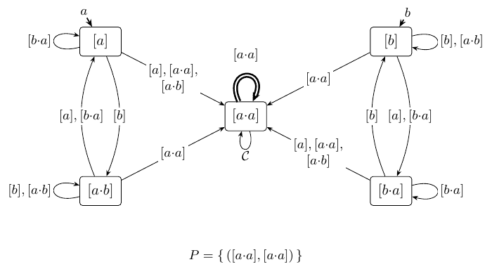

# Example — `GF(aa)`

| aspect | `GF(aa)` |
|---|---|
| Language (informal) | "infinitely many aa : an a followed by an a." |
| ω-regular | `((a\|b)*·a·a)^ω` |
| LTL | `G F(a ∧ X a)` |
| Det. Emerson–Lei `D` |  |
| Invariant `𝓘` |  |

`[a]` is the class of words that start with an `a` and have never seen two
`a`'s in a row. `[a·b]` is the class of words that start with an `a`, have most
recently seen a `b`, and so far contain only isolated `a`'s — no block of two.
These two classes cycle: extending `[a·b]` by `[a]` returns to `[a]`
(`[a·b]·[a] = [a]`, forgetting that `b`'s were ever seen), and `[a]·[b] = [a·b]`
goes back. Note that this length-2 cycle is not a *counter* of period 2 since 
to and from edges do not carry the same classes. This language is indeed aperiodic (with p > 1)
hence LTL.

`[a·a]` is the class of all words that contain at least one block of two
consecutive `a`'s. It is a sink: once two `a`'s in a row have been seen the stamp classifier
is content, and any further extension is absorbed and stays in `[a·a]`. A word
starting with `a` reaches it either from `[a]` or from `[a·b]`, as soon as an
`a` lands next to another `a`.

Since acceptance asks for infinitely many such blocks, the only accepted pair is
`([a·a], [a·a])`, and it is only logical that `[a·a]` be the loop component.
Less obvious is that the stem component must also be `[a·a]`: this is always
arrangeable by the rotation lemma, which pushes letters of the looped part back
into the prefix until the prefix, too, is seen to carry two consecutive `a`'s.
That is the canonical presentation of all accepted lassos of the language here.

The classes `[b]` and `[b·a]` play the same waiting-room game for words that
start with a `b`, counting until the first block of two `a`'s is met.
