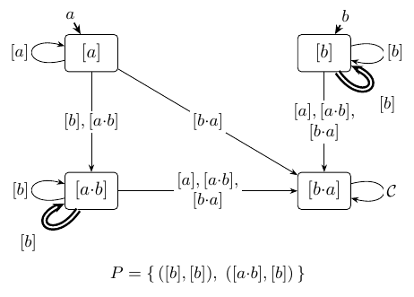

# Example — `aUGb`

| aspect | `aUGb` |
|---|---|
| Language (informal) | "a finitely until always b" |
| ω-regular | `a*·b^ω` |
| LTL | `a U G !a` |
| Det. Emerson–Lei `D` |  |
| Invariant `𝓘` |  |

*describe here example aUGb*
