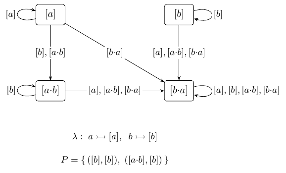

# Example figure pages (floats — no section, no body text)

*Editors' note: these are the paper's worked examples as full-page float
figures, pointed at from anywhere in the text (LaTeX will place them,
likely facing pages near the end). Captions only, up to one paragraph each.*

|  |  |
|:--:|:--:|
|  |  |

*Figure 2 — the four invariants, complete: for each language the stamp core
drawn as in Figure 1 — vertices the classes, edges the table, `λ` and `P`
beneath; the label `𝒞` abbreviates a self-loop carrying every class.
`aUGb` (top left, 4 classes) repeats Figure 1's left panel for comparison.
`GF(aa)` (top right, 5 classes): `[a·a]` — "has seen `aa`" — is a two-sided
zero, every power cycle has period 1 — aperiodic, the LTL side of the cut —
and the one accepting pair loops at the zero itself: `aa` recurs.
`Even` (bottom left, 4 classes): `{[a], [a·a]}` is a period-2 cycle, a `Z₂`
in the algebra — the reason `Even` is not LTL — and `[a·a]` is an internal
neutral element of `𝒞`, kept apart from the fresh `[ε]` (Definition 3.1);
`[b]` and `[a·b]` are left zeros, and once `[b]` is reached every loop
accepts. `EvenBlocks` (bottom right, 7 classes): the same `Z₂` returns, and
the zero `[b·a·b]` — a completed odd block — is no death sentence: two of the
six accepting pairs sit at it — what has happened is absorbed, what loops
forever decides.*

|  |  |  |
|:--:|:--:|:--:|
|  |  | |

*Figure 3 — the four languages as deterministic Emerson–Lei automata
(Definition 4.1), the input format of §4. `aUGb`: three states, the `b`
self-loop marked, `Acc = Inf(0)`. `GF(aa)` twice: the run-parity presentation
(`a` transposes the two states, the transposition closing an `aa` marked) and
the reset presentation (each letter sends every state to one place, an
aperiodic transition monoid) — non-isomorphic machines on the same two
states, same language, with nothing intrinsic to prefer either; §4.4 sends
both to the one invariant of Figure 2. `Even`: the parity pair plus two
sinks, `Acc = Inf(0)`. `EvenBlocks`: `b` closes a block, marked `1` when the
block is even, `0` when odd, `Acc = Fin(0) ∧ Inf(1)`.
[Interim: drawings still label edges `!a`/`a`; redraw to this paper's
`a`/`b`, one letter per edge, comma-fused, is pending.]*
