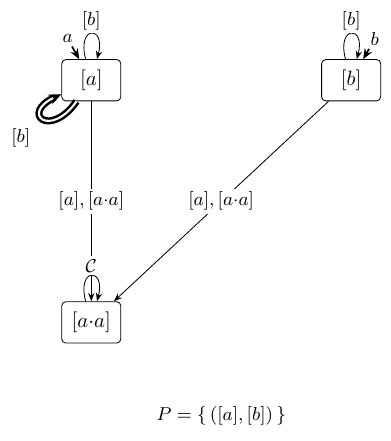

### 2.3 The running examples, and the teacher

For the reader who wants to check every
bit below by hand, here are the running examples — descriptions and automata
reproduced from [SωS26]:

- **`GF(aa) := GF(a ∧ Xa)`** — "infinitely many `aa`-factors." It *is* LTL, but a
  natural presentation encodes the letter `a` as a transposition, so its transition
  monoid carries a spurious group. The SωS *destroys* that group.
- **`Even := (aa)*·b·Σ^ω`** — over the single atom `a`, an even number of `a`'s then a
  `b` then anything; in PSL, the words with a prefix matching the SERE
  `{a[*2]}[*] ; !a`. The canonical mod-2 language; *not* LTL, its group genuine, and —
  because a prefix fixes the parity — refuted by Arnold's *linear* (first) shape.
- **`EvenBlocks`** — "infinitely many `b`'s, and eventually every completed `a`-block
  has even length"; the same `{a[*2]}` even-block SERE, now recurring. Also *not* LTL
  with a genuine mod-2 group, but *prefix-independent*: no finite prefix changes
  membership, so its group is invisible to the linear shape and only Arnold's
  *ω-power* (second) shape can witness it. This is the example that keeps both shapes
  honest.

<table>
<tr>
<td align="center"></td>
<td align="center"></td>
<td align="center"></td>
</tr>
<tr>
<td align="center"><b>(a) <code>GF(aa)</code></b> 2 states, <code>Inf(0)</code> (Büchi). The <code>a</code>-letter transposes the two states — a <code>Z₂</code> in the transition monoid.</td>
<td align="center"><b>(b) <code>Even</code></b> 4 states, <code>Inf(0)</code> (Büchi). Parity pair <code>0/2</code>, an accepting sink <code>1</code>, a rejecting sink <code>3</code>.</td>
<td align="center"><b>(c) <code>EvenBlocks</code></b> 2 states, <code>Fin(0) ∧ Inf(1)</code>. Prefix-independent; the parity of a completed block lives on the <code>!a</code>-transitions' marks. PSL: <code>GF!a ∧ FG(!a → X{a[*2][*];!a}!)</code></td>
</tr>
</table>

**Figure 1.** The deterministic, complete, transition-based Emerson–Lei
automata of the three running examples, reproduced from [SωS26] (acceptance
reads the transition marks seen infinitely often: `Inf(c)` — mark `c` recurs,
`Fin(c)` — it does not). In this paper the automata belong to the *teacher*:
the learner only ever sees their answers.

<table>
<tr>
<td align="center"></td>
<td align="center"></td>
<td align="center"></td>
</tr>
<tr>
<td align="center"><b>(a) <code>𝓘(GF(aa))</code></b> <code>|𝒞| = 5</code>, <code>N = 6</code>.</td>
<td align="center"><b>(b) <code>𝓘(Even)</code></b> <code>|𝒞| = 4</code>, <code>N = 5</code>.</td>
<td align="center"><b>(c) <code>𝓘(EvenBlocks)</code></b> <code>|𝒞| = 7</code>, <code>N = 8</code>.</td>
</tr>
</table>

**Figure 2.** The targets, drawn: the syntactic invariants of the three
running examples, reproduced from [SωS26]. Reading key: vertices are the
classes, named by their shortlex keys; following an edge multiplies on the
right by its label; the entry arrows give the letter map `λ`; the accepting
pairs `P` are listed beneath the drawing, and a label `𝒞` abbreviates a
self-loop carrying every class. These drawings are the paper's answer key:
the learner reconstructs each of them, byte for byte, from lasso queries
alone — the automata of Figure 1 stay on the teacher's side of the wall.

**The stall specimens.** Two more examples run against the grain of the three
above, and were *searched for* rather than chosen: the smallest languages, by
class count, that we could find — by exhaustive enumeration of the smallest
automaton shapes — on which a learner without the saturation sweep of §4.3
fails *permanently*. Both are two-letter LTL formulas, simpler than the
classical trivial-right-congruence example `FG(a ∨ Xa)` [AF21]:

- **`a → Xa`** — if the first letter is `a`, so is the second. A safety
  language, LTL-definable; `N = 5`, and its algebra carries *two* accepting
  idempotents, `[b]` and `[aa]` — right-indistinguishable, separated only by
  the left context `a`, and that is the trap (§4.2).
- **`a ∧ XG¬a`** — the language of the single ω-word `a·b^ω`;
  `N = 4`. The same trap one step deeper: the canonical `[b·a]` is separated
  from `[b]` only from the left.

<table>
<tr>
<td align="center"></td>
<td align="center"></td>
</tr>
<tr>
<td align="center"><b>(a) <code>a → Xa</code></b> 4 states, <code>Inf(0)</code> (Büchi).</td>
<td align="center"><b>(b) <code>a ∧ XG¬a</code></b> 3 states, <code>Inf(0)</code> (Büchi).</td>
</tr>
<tr>
<td align="center"></td>
<td align="center"></td>
</tr>
<tr>
<td align="center"><b>(c) <code>𝓘(a → Xa)</code></b>, <code>N = 5</code>. Both committed-in stems <code>[b]</code>, <code>[aa]</code> accept with every idempotent loop — six pairs, two stems the stall merges.</td>
<td align="center"><b>(d) <code>𝓘(a ∧ XG¬a)</code></b>, <code>N = 4</code>. A single accepting pair <code>([a],[b])</code> — the one lasso the language contains.</td>
</tr>
</table>

**Figure 3.** The stall specimens: teacher automata (top, edge labels in
the tool's letters) and target invariants (bottom), drawn with Figure 2's
conventions. §4.2 proves the saturation-free
learner stops one class short of each target, certified by an exact oracle.

**The query model, instantiated.** The MAT teacher of §2.1, for this paper:
membership queries are lassos (`u·v^ω ∈ L`?); equivalence queries take a
hypothesis `𝓗` (an invariant-shaped tuple, §3) and return a lasso
counterexample on failure. The restriction to ultimately-periodic words costs
nothing — lassos determine `L` (§2.2) — and every query the algorithm ever
poses is one.

In our experiments the teacher is built on the construction of [SωS26]:
membership is one deterministic run, and an equivalence query is decided
*exactly*, against the language's own invariant `𝓘(L)` — constructed once,
after which the automaton leaves the equivalence loop. The realization — an
align-and-scan of the hypothesis against `𝓘(L)`, with a functionality guard
and a fallback — is detailed with the experimental protocol (§6.1); two of
its properties are used before then. The returned counterexample is the
globally *minimal* one (shortest stem, then shortest loop, then shortlex) —
which makes runs deterministic and the worked examples reproducible; §6
measures what non-minimal policies cost. And nothing in the learner's
correctness depends on this realization.
