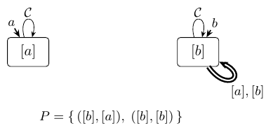
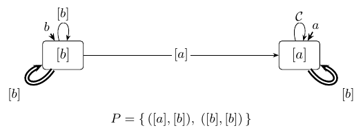
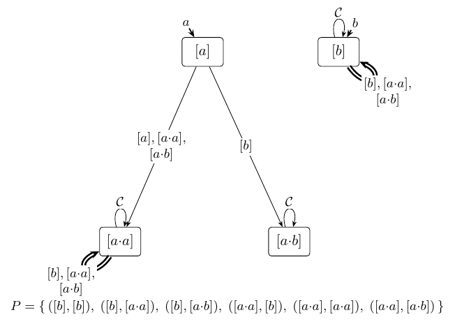

<!-- ASSEMBLED by research_notes/sos_learning2/Makefile — do not edit here; edit the parts in sos_learning2/ and re-run make. -->

# Learning the Syntactic ω-Semigroup

**Yann Thierry-Mieg**

With significant inputs from
**Claude (Anthropic)**

*Shadow draft — rev. 2026-07-19. §7's data traces to the committed census
record; regeneration status in the folder README.*

## Abstract

The syntactic ω-semigroup of a regular ω-language `L` is its canonical
algebra: presentation-independent, complete, and the object from which
membership, equivalence, and every definability property of `L` —
LTL-definability included — are read. It was recently materialized as a
computable, serializable invariant `𝓘(L)`, constructed from a deterministic
automaton [SωS26]. This paper shows the invariant is *learnable*, in
Angluin's MAT model, from lasso membership and equivalence queries alone.
The design rests on one typing discipline: **the learner never poses a
hypothesis that is not a language**. Its belief is at all times an
ω-regular language held in canonical form — every hypothesis it presents is
a well-formed invariant, the syntactic invariant of its own belief
language. The discipline pays structurally: a well-formed invariant denotes
exactly one language, so an exact equivalence oracle can never falsely
assent, and the permanent stalls that afflict acceptor-typed learners are
impossible by construction. Keeping the belief legal is cheap: two
query-free checks — the candidate stamp a genuine morphism, the pair set
saturated under conjugacy — and every violation is a free progress signal,
a disagreement the learner catches on its own and converts, by the same
chain mechanism that processes the teacher's counterexamples, into a
witnessed class split. The fixpoint is `𝓘(L)` itself, byte-equal to the
constructed reference, at output-polynomial query cost. Where the boundary
lies is itself a theorem: a fixpoint that counterexample-guided refinement
alone certifies is either the canonical algebra already or carries no
algebra at all — realized on the two-letter implication `a → Xa`, which
stalls permanently one class short. On a
complement-closed census of 6222 languages the learner reconstructs every
syntactic invariant byte-for-byte; without the legality discipline half of
them stall permanently; and LTL-definability is read off each learned
invariant: the aperiodicity check of [SωS26] applied verbatim to the
learner's output — a decision no current tool derives from an acceptor.

---

## 1. Introduction

Active learning asks a machine to reconstruct an unknown language *exactly*,
from experiments alone. In Angluin's minimally adequate teacher (MAT) model
[Ang87] the learner poses membership queries — is this word in the
language? — and equivalence queries — is this hypothesis the language?,
answered by *yes* or by a counterexample — and the L\* algorithm learns the
minimal DFA of any regular language with polynomially many queries. The
paradigm's reach is practical — assume–guarantee verification [FCC+08],
state machines learned from black-box implementations of smart cards and
network protocols [Vaa17] — but its engine is a theorem: by Myhill–Nerode,
the right congruence of the language *is* its minimal acceptor. Everything
one wants from L\* flows from the canonicity of that target: progress is
irreversible, cost is measured against the language's own invariant, and
questions about the language are answered on the learned object itself.

On infinite words the query interface survives — ultimately-periodic words,
*lassos*, are finite objects that determine an ω-regular language
completely — but the engine fails: the right congruence of an ω-regular
language can be trivial while the language is complex [AF21]. There is no
minimal deterministic ω-automaton to converge to, and the history of
ω-learning is a history of substitute targets: the subclass where the right
congruence still carries everything [MP95], encodings back into finite words
[FCC+08], and the standard modern route, *families of DFAs* (FDFAs) in three
competing canonical forms, the choice among them the learner's [AF16,
ABF18]. All of these targets are acceptors. The canonical FDFA forms are
even functions of the language alone — but each is a *family* of
one-slot acceptors: none carries the language's algebra, and none answers
a definability question without further construction.

Yet the canonical object exists. Arnold's syntactic congruence [Arn85]
quotients finite words by interchangeability in every lasso context — in
the stem, or inside the loop — and its quotient, the syntactic ω-semigroup,
is the exact ω-analogue of the syntactic monoid. It was recently
materialized as the invariant `𝓘(L)`: a finite classifier of finite words
plus a set of accepting stem–loop pairs, serialized to a byte-canonical
file [SωS26]. Two results of that construction matter here beyond the
object itself. A *rotation lemma* — carrying a factor from a loop's front
onto the stem leaves the infinite word unchanged — turns every left demand
of the two-sided congruence into a right computation. And a
*canonicalization theorem* carries every well-formed invariant, however
obtained, onto the syntactic invariant of its own language, by partition
refinement on its own table. [SωS26]'s larger case is that the invariant,
rather than any automaton, can serve as the unit of discourse for
ω-regular languages — identity, complement, classification as facts of one
file; this paper is that program's learning instance.

This paper shows the same object is learnable, and its design can be said
in one sentence: **the learner never poses a hypothesis that is not a
language.** Internally it keeps an observation table — rows, two sorts of
columns matching Arnold's two context shapes, membership bits: the private
ledger where separations are recorded and open slots tracked. But the table
is bookkeeping, not belief. Whenever the learner draws a conclusion or
faces the teacher, it first certifies that its table presents a legal
algebraic object — two query-free checks: the candidate classifier is a
genuine semigroup morphism, and the acceptance pairs are saturated under
conjugacy — and then holds that object in canonical form. What the teacher
sees, every time, is a *well-formed invariant*: the syntactic invariant of
the learner's current belief language.

The discipline is not hygiene for its own sake; it is where the learning
happens. A well-formed invariant denotes exactly one language, so if the
belief is not yet `L`, some lasso disagrees and an exact equivalence oracle
must surrender it: false assent is impossible. Each legality violation,
conversely, is a disagreement the learner catches without the teacher —
two concrete lassos that its own classes name identically, on which the
teacher's answers differ — and one chain of membership queries converts it
into a class split witnessed by a genuine Arnold context. Counterexamples
and legality violations are processed by the *same* mechanism; the teacher
is just one of three sources of disagreement, and the cheapest two are
self-served. Where the self-served queries become indispensable is itself
a theorem: counterexample-guided refinement alone — the engine of every
ω-learner to date — reaches acceptors and nothing finer; a fixpoint it
certifies is either the canonical algebra already or carries no algebra at
all, stalling permanently already on `a → Xa` (§6). The FDFA line and this
paper thus draw different consequences from one shared observation [AF21]:
the field enriches the acceptor family on the near side of that boundary;
the legality discipline is what crosses it, and the rotation lemma —
embedded already in the invariant's definitions — is what makes the
crossing computable.

**Contributions.**

1. A learning algorithm for the syntactic invariant `𝓘(L)` of any
   ω-regular language — to our knowledge the first: plain lasso membership
   and equivalence queries, every hypothesis a well-formed invariant, and a
   limit byte-equal to what the construction of [SωS26] produces (§3–§4),
   at output-polynomial query cost (§5).
2. A typing theorem and a boundary theorem. Legal beliefs make the error
   signal two-sided: no exact oracle ever falsely assents, and the
   certified fixpoint is the canonical algebra (§5). The boundary, refining
   [AF21]'s observation: a fixpoint that counterexample-guided refinement
   alone certifies is either canonical or carries no algebra at all — its
   partition is never a congruence — realized already on the two-letter
   `a → Xa`, before the first counterexample (§6).
3. Experimental evidence from a complete tool implementation: on a
   complement-closed census of 6222 languages every syntactic invariant is
   reconstructed byte-for-byte; the acceptor-typed relaxation stalls
   permanently on half of them; a comparison to the state-of-the-art FDFA
   learner ROLL shows comparable sizes and queries — with LTL-definability
   read off our result by [SωS26]'s aperiodicity check, a decision
   currently tooled on no acceptor representation (§7).

The closest prior work, Urbat and Schröder's algebraic automata learning
[US20], identified the syntactic algebra as the right learnable target for
ω-regular languages — but obtained no effective algorithm: their instance
needs infinitely many alphabet letters, one per possible loop, known in
advance. The rotation lemma supplies the missing finiteness; §8 details the
comparison.


## 2. Background

This section fixes notation and recalls the two bodies of prior work the
paper stands on: active learning in the MAT model (§2.1), and the syntactic
theory of ω-regular languages in the invariant form of [SωS26] (§2.2); §2.3
introduces the running examples and the teacher used in the experiments.
Nothing in it is new.

### 2.1 Active learning in the MAT model

**Exact learning from queries.** Active learning reconstructs a finite
description of an unknown language `L` that is available only through an
interface — a black-box implementation, a simulator, a system too opaque to
open. In Angluin's *minimally adequate teacher* (MAT) model [Ang87] the
interface is two queries: a **membership query** — is the word `w` in
`L`? — answered by a bit, and an **equivalence query** — is the hypothesis
`𝓗` exactly `L`? — answered by *yes* or by a **counterexample**, a word on
which `𝓗` and `L` disagree. The learner chooses its queries adaptively and
must terminate with an exact description of `L`.

**L\* in one paragraph.** For regular languages of finite words the model is
solved by Angluin's L\* [Ang87]. The learner maintains an **observation
table**: rows are access words (prefixes), columns are distinguishing
experiments (suffixes), and the entry at `(u, e)` is the membership bit of
`u·e`. A table that is **closed** (every one-letter extension of a row
matches some row's bit-vector) and **consistent** (rows with equal
bit-vectors have equal one-letter successors) induces a deterministic
automaton on the row classes — the hypothesis. Each counterexample is
processed into a new distinguishing experiment that splits at least one row
class — refinement is *counterexample-guided*, progress arriving exactly
when the hypothesis is caught being wrong; the binary search of Rivest and
Schapire [RS93] finds the split with logarithmically many membership
queries. §3 will reuse every one of these notions, changed only where
ω-words force a change.

**Why it converges: a canonical target.** The bookkeeping above is not what
makes L\* work; the Myhill–Nerode theorem is. The right congruence
`u ~_L v ⟺ (∀y: u·y ∈ L ⟺ v·y ∈ L)` of a regular language has finitely many
classes, and its quotient *is* the minimal DFA — a **canonical object**, a
function of `L` and not of any machine presenting it. Canonicity is
load-bearing three times over. It is the progress measure: every split is
witnessed by a genuine `~_L`-separation, so the class count is bounded by
the target's size and each counterexample makes irreversible progress. It
makes complexity meaningful: queries are counted against the size of the
language's own invariant — *output-polynomial* — not against whichever
automaton the teacher happens to hold. And it makes the result usable:
questions about `L` are answered on the learned object itself. On this
view, active learning *is* the reconstruction of a canonical invariant
through queries, and the table is its bookkeeping.

**What survives at ω, and what breaks.** For ω-regular languages the query
interface survives intact. Infinite words cannot be typed into a teacher,
but the **lassos** — ultimately-periodic words `u·v^ω`, finite objects —
determine an ω-regular language completely (§2.2), so membership queries
are posed on lassos and counterexamples are returned as lassos; this has
been the standard move since [MP95, FCC+08, AF16]. What breaks is the
target. Myhill–Nerode fails at ω: the right congruence of an ω-regular `L`
can be trivial while `L` is complex [AF21], so there is no minimal
deterministic acceptor to converge to — and the history of ω-learning (§8)
is a history of substitute targets: a subclass where the right congruence
happens to suffice [MP95], encodings into finite words [FCC+08], families
of DFAs in three canonical normal forms [AF16, ABF18]. All are acceptors —
the FDFA forms canonical ones, functions of `L` alone — and what none of
them is, is the language's *algebra*: no composition, hence no idempotents,
no power orbits, no definability read-off. This paper keeps the L\* view
and moves the target to that algebra: the quotient of Arnold's syntactic
congruence, materialized as the invariant `𝓘(L)` — recalled next — and the
discipline of §3 is what makes it reachable through queries: the learner's
beliefs are held to the same standard as the target, well-formed
invariants throughout.

**Conventions.** One lasso membership query counts as one query; equivalence
queries are counted separately; all bounds are stated against the size of
the canonical target.


### 2.2 The syntactic ω-semigroup, and its invariant

Everything in this subsection is prior work — the congruence is Arnold's
[Arn85], its algebraic packaging Wilke's and Perrin–Pin's [Wil93, PP04], and
its materialization as the computable invariant `𝓘(L)`, whose notation and
results this paper adopts wholesale, is [SωS26] — restated in the exact form
the learner consumes.

**Lassos.** `Σ` is a finite alphabet (for temporal-logic applications,
`Σ = 2^AP`). A **lasso** is an ultimately-periodic word `u·v^ω`: a finite
stem `u`, a finite non-empty loop `v` repeated forever. Two ω-regular
languages are equal iff they agree on all lassos [PP04], so lassos are the
only infinite words that ever need to be mentioned: every query below is
one, and "the language" means its lasso membership function.

**The congruence.** Fix an ω-regular `L ⊆ Σ^ω`. Two finite words are
**syntactically congruent**, `u ≈_L v`, when swapping one for the other never
changes membership; Arnold matches the swap positions to the anatomy of a
lasso — the swapped factor sits in the stem, or recurs inside the loop —
giving two context shapes [Arn85; SωS26, Def 3.5]:

```
    (linear)    ∀ x, y ∈ Σ*, t ∈ Σ⁺ :   x·u·y·t^ω ∈ L  ⟺  x·v·y·t^ω ∈ L
    (ω-power)   ∀ x, y ∈ Σ*         :   x·(u·y)^ω  ∈ L  ⟺  x·(v·y)^ω  ∈ L
```

For ω-regular `L` the congruence has **finitely many classes** [Arn85], and
its quotient, completed by the verdicts on lassos, is the **syntactic
ω-semigroup** of `L`: the exact ω-analogue of the syntactic monoid, a
function of `L` alone. The abstract algebra is two-sorted — classes of
finite words, classes of ω-words [PP04] — but on a finite carrier the second
sort is determined by the first and need not be carried [SωS26, §2]; what
this paper computes with, end to end, is the one-sorted *representation*
assembled next.

**The stamp.** The vocabulary that materializes quotients of `Σ⁺` is the
**stamp** [SωS26, Def 3.1]: a surjective semigroup morphism `𝒮 : Σ⁺ → 𝒞`
onto a finite semigroup whose elements are the **classes**, written `[u]` —
and a two-sided congruence supports exactly one: the class of a
concatenation is a function of the classes, `[u]·[v] := [u·v]` well defined.
A stamp is finitely presented by `(𝒞, λ, ·)` — the classes, the **letter
map** `λ := 𝒮|_Σ`, the multiplication table — and evaluating `𝒮` is one
table lookup per letter. It extends to all finite words by adjoining a
**fresh** identity: `M := 𝒞 ∪ {[ε]}`, `𝒮(ε) := [ε]`, making `𝒮 : Σ* → M` a
surjective monoid morphism. Freshness — `[ε]` never identified with the
class of a non-empty word — holds even when `𝒞` owns a neutral element of
its own, which happens: in `Even` below, `[aa]` multiplies as the identity
on every word class. The fresh unit costs one redundant class and buys a
guarantee the learner leans on throughout: every class other than `[ε]`
consists of non-empty words, so it carries a non-empty shortlex key, and
every keyed lasso (§3) has a non-empty loop. Canonicity is unaffected: the
adjunction is a function of `L` alone [SωS26, §3.1].

**Linked pairs name lassos.** Iterate a class: the powers `c, c², c³, …`
move in a finite semigroup, so they eventually cycle, and exactly one power
is **idempotent**; a single **exponent** `π ≥ 1` with `c^π` idempotent for
every class exists (any common multiple serves, e.g. `|𝒞|!`), and we write
`c^π` [SωS26, Def 3.2]. A **linked pair** is a pair of classes `(s, e)` with
`e·e = e` and `s·e = s`, both classes of non-empty words — the basepoint
`[ε]` appears in no pair; rewriting a lasso `u·v^ω` as `(u·v^π)·(v^π)^ω` lands
on one — `e = 𝒮(v)^π`, `s = 𝒮(u)·e` — and membership of the lasso depends
*only* on that pair [PP04]. So the acceptance datum of the algebra is a set
of accepting pairs, not a set of accepting classes: loops are named
separately from stems.

**The invariant.** An **invariant** is `𝓘 = ⟨𝒮, P⟩`: a stamp together with a
**pair set** `P` of linked pairs [SωS26, Def 3.3]. It decides lassos with
its own data and nothing else — **lasso membership** [SωS26, Def 3.4]: for a
presentation `(u, v)` of `w = u·v^ω`, set `e := 𝒮(v)^π`, `s := 𝒮(u)·e`; then
`w ∈ L(𝓘)` iff `(s, e) ∈ P`. The queried pair **names** the lasso, and a
lasso bears several names — already `(u, v)` and `(u·v, v)` may land on
distinct pairs. The **syntactic invariant** of `L` is
`𝓘(L) := ⟨𝒮_L, P(L)⟩` — the quotient stamp `𝒮_L : Σ⁺ → 𝒞_L := Σ⁺/≈_L`,
with the pair set collecting the names of all accepted lassos
[SωS26, Def 3.6]: the material representation of the syntactic ω-semigroup,
and the learner's target. Canonicity [SωS26, Thm I]: on `𝓘(L)`, lasso
membership is membership in `L` itself, on every presentation of every
lasso; and `𝓘` is a **complete invariant** — two ω-regular languages over
the same alphabet are equal iff a (unique) isomorphism matches their
invariants, and, with each class keyed by its shortlex-least member
(shortlex throughout this paper uses the letter order of the
serialization — valuation bitvectors ascending; on the examples' alphabet
`Σ = {b, a}`, where `b` stands in for the valuation `!a` in tool support,
that order is `b < a`), iff the serialized invariants are byte-identical.
The target answers definability directly: `L` is LTL-expressible iff no
power sequence `c, c², c³, …` cycles with period `> 1` — the aperiodicity
read-off [SωS26, Thm 6.1]. Throughout, `N` counts the classes of the target
*including* the adjoined identity — `N = |𝒞_L| + 1`, the `classes:` line of
the serialized file [SωS26, §6.2] — so class counts here match the
serialization.

**Well-formed and denoting invariants.** Two notions from [SωS26, §4]
organize everything downstream. An invariant **denotes** `L` when every
presentation of every lasso receives `L`'s verdict from lasso membership
[SωS26, Def 4.1]. An invariant is **well-formed** when its pair set is
saturated under conjugacy of linked pairs — the equivalence generated by the
rotation steps `(s, (cd)^π) ∼ (s·c, (dc)^π)` [SωS26, Def 4.2].
Well-formedness is exactly the law that gives every lasso one verdict
through all its presentations, and a well-formed invariant denotes exactly
one language, its own [SωS26, Prop 4.1] — the fact behind this paper's
no-false-assent theorem (§5). Second, [SωS26, Cor 4.2]: **an invariant
denoting `L` exists exactly at the stamps whose kernel refines `≈_L`, and
over each such stamp the pair set is forced** — the names of the accepted
lassos, nothing else. Coarser than the syntactic stamp, no invariant
denotes `L` at all.

**The rotation lemma, and the membership tests.** The computational heart of
[SωS26] is a **rotation lemma** [SωS26, Lem 4.1]: a factor carried from a
loop's front onto the stem leaves the ω-word unchanged —
`x·(u·y)^ω = x·u·(y·u)^ω` — so on classes `(s·c, (dc)^π)` names the same
lasso as `(s, (cd)^π)`: a left extension of a loop is a rotation of it, a
right extension read at a shifted starting slot. The construction draws two
services from the lemma, and both transport to the query model (§4). The
first forces the conjugacy closure above: a pair set cannot help being
saturated when it speaks the truth about a language. The second makes the
two-sided congruence right-computable: [SωS26, Def 4.3] poses to each class
`c` the **membership tests**

```
    Λ(d, f)(c) = [ (d·c·f, f) ∈ P ]        Ω(d)(c) = [ (d·c^π, c^π) ∈ P ]
```

— one lasso membership each, the slot `d` ranging over the finitely many
elements of `M` — and agreement under all tests at all right extensions *is*
`≈_L` [SωS26, Lem 4.2]; that this agreement is left-invariant is the
rotation lemma again — a left factor shifts a linear test's slot and
*rotates* an ω test's loop, carrying no information of its own
[SωS26, Lem 4.3]. §3's columns are these tests sampled at word level.

**Canonicalization.** The last result the learner consumes is
[SωS26, Thm II]: every well-formed invariant is carried onto the syntactic
invariant of its own language by quotienting under the test equivalence —
computed by ordinary partition refinement on the invariant's own table, at
most `|𝒞|` splits, no queries, and *language-preserving*: the quotient
denotes the same language. §3 uses it to hold the belief in canonical form,
and §5's canonicity proof is one application of it.


### 2.3 The running examples, and the teacher

For the reader who wants to check every bit below by hand, here are the
running examples — descriptions and automata reproduced from [SωS26]:

- **`GF(aa) := GF(a ∧ Xa)`** — "infinitely many `aa`-factors." It *is* LTL, but a
  natural presentation encodes the letter `a` as a transposition, so its transition
  monoid carries a spurious group. The SωS *destroys* that group.
- **`Even := (aa)*·b·Σ^ω`** — over the single atom `a`, an even number of `a`'s then a
  `b` then anything; in PSL, the words with a prefix matching the SERE
  `{a[*2]}[*] ; !a`. The canonical mod-2 language; *not* LTL, its group genuine, and —
  because a prefix fixes the parity — refuted by Arnold's *linear* (first) shape.
- **`EvenBlocks`** — "infinitely many `b`'s, and eventually every completed `a`-block
  has even length"; the same `{a[*2]}` even-block SERE, now recurring. Also *not* LTL
  with a genuine mod-2 group, but *prefix-independent*: no finite prefix changes
  membership, so its group is invisible to the linear shape and only Arnold's
  *ω-power* (second) shape can witness it. This is the example that keeps both shapes
  honest.

<table>
<tr>
<td align="center"></td>
<td align="center"></td>
<td align="center"></td>
</tr>
<tr>
<td align="center"><b>(a) <code>GF(aa)</code></b><br>2 states, <code>Inf(0)</code> (Büchi).<br>The <code>a</code>-letter transposes the<br>two states — a <code>Z₂</code> in the<br>transition monoid.</td>
<td align="center"><b>(b) <code>Even</code></b><br>4 states, <code>Inf(0)</code> (Büchi).<br>Parity pair <code>0/2</code>, an accepting<br>sink <code>1</code>, a rejecting sink <code>3</code>.</td>
<td align="center"><b>(c) <code>EvenBlocks</code></b><br>2 states, <code>Fin(0) ∧ Inf(1)</code>.<br>Prefix-independent; the parity<br>of a completed block lives on<br>the <code>!a</code>-transitions' marks.<br>PSL: <code>GF!a ∧ FG(!a → X{a[*2][*];!a}!)</code></td>
</tr>
</table>

**Figure 1.** The deterministic, complete, transition-based Emerson–Lei
automata of the three running examples, reproduced from [SωS26] (acceptance
reads the transition marks seen infinitely often: `Inf(c)` — mark `c` recurs,
`Fin(c)` — it does not). In this paper the automata belong to the *teacher*:
the learner only ever sees their answers.

<table>
<tr>
<td align="center"></td>
<td align="center"></td>
<td align="center"></td>
</tr>
<tr>
<td align="center"><b>(a) <code>𝓘(GF(aa))</code></b><br><code>|𝒞| = 5</code>, <code>N = 6</code>.</td>
<td align="center"><b>(b) <code>𝓘(Even)</code></b><br><code>|𝒞| = 4</code>, <code>N = 5</code>.</td>
<td align="center"><b>(c) <code>𝓘(EvenBlocks)</code></b><br><code>|𝒞| = 7</code>, <code>N = 8</code>.</td>
</tr>
</table>

**Figure 2.** The targets, drawn: the syntactic invariants of the three
running examples, reproduced from [SωS26]. Reading key: vertices are the
classes, named by their shortlex keys; following an edge multiplies on the
right by its label; the entry arrows give the letter map `λ`; the accepting
pairs `P` are listed beneath the drawing, and a label `𝒞` abbreviates a
self-loop carrying every class. These drawings are the paper's answer key:
the learner reconstructs each of them, byte for byte, from lasso queries
alone — the automata of Figure 1 stay on the teacher's side of the wall.

Two further two-letter specimens, `a → Xa` and `a ∧ XG¬a`, enter with the
boundary result (§6, Figure 4).

**The query model, instantiated.** The MAT teacher of §2.1, for this paper:
membership queries are lassos (`u·v^ω ∈ L`?); equivalence queries take a
hypothesis — which, by the discipline of §3, is always a well-formed
invariant — and return a lasso counterexample on failure. The restriction to
ultimately-periodic words costs nothing — lassos determine `L` (§2.2) — and
every query the algorithm ever poses is one.

In our experiments the teacher is built on the construction of [SωS26]:
membership is one deterministic run, and an equivalence query is decided
*exactly*, against the language's own invariant `𝓘(L)` — constructed once,
after which the automaton leaves the equivalence loop. Because hypothesis
and reference are both genuine invariants, the query is an align-and-scan
of the *product of the two stamps*: on its reachable pair graph, each cell
is decided by the one keyed lasso the cell's shortlex keys spell, both
verdicts factoring through the cell — no further assumption is needed on
either side. The returned counterexample is the globally *minimal* one
(shortest stem, then shortest loop, then shortlex), found by BFS on the
product — which makes runs deterministic and the worked examples
reproducible; §7 measures what non-minimal policies cost. And nothing in
the learner's correctness depends on this realization.


## 3. The learner's state

The learner's state has two layers, and keeping them apart is the design.
The **table** (§3.1) is private bookkeeping: rows, columns, membership
bits — the ledger where separations are recorded, open slots tracked, and
witnesses stored. The **belief** (§3.2) is what the learner actually
holds true: a well-formed invariant, exported from the table once two
legality checks pass, and held in canonical form. Conclusions are drawn
from the belief; the teacher sees the belief; the table never crosses the
wall.

### 3.1 The observation table

**Definition 3.1 (table).** A table is `T = (R, E_lin, E_ω)` where `R ⊆ Σ*` is a
finite set of **rows** containing `ε`, observed together with its
frontier `R·Σ`, and the columns are of two sorts:

- `E_lin ⊆ Σ* × Σ* × Σ⁺` — **linear columns**; the entry of row `u` at
  `(x, y, t)` is the bit `[ x·u·y·t^ω ∈ L ]`;
- `E_ω ⊆ Σ* × Σ*` — **ω-columns**; the entry of row `u` at `(x, y)` is the bit
  `[ x·(u·y)^ω ∈ L ]`.

Rows `u, v` are **table-equivalent**, `u ≡_T v`, when all entries agree.

Every entry is one membership query. By construction `≈_L` refines `≡_T` for
any column set — columns are particular Arnold contexts — so learning is the
business of growing `E_lin ∪ E_ω` until `≡_T` *is* `≈_L` on the rows, and
growing `R` until the rows exhaust `𝒞_L`. In the vocabulary of §2.2, the
columns are the membership tests of [SωS26, Def 4.3] sampled at word level —
a linear column `(x, y, t)` reads `Λ(𝒮_L(x), 𝒮_L(t)^π)` at the right
extension `𝒮_L(y)`, an ω-column `(x, y)` reads `Ω(𝒮_L(x))` — except that the
learner owns no stamp of `L`: its slots and extensions are concrete words it
has queried, and [SωS26, Lem 4.2] is the guarantee that some finite family
of such tests characterizes `≈_L`.

The two sorts divide the labor exactly as Arnold's two shapes do. On `Even`,
linear columns already separate everything — the stem decides membership. On
`EvenBlocks`, *every* linear column is a constant row-function
(prefix-independence: a stem mutation is swallowed), and the entire language
lives in the ω-sort: the column `(ε, b)` separates rows `a` and `aa`, since
`(a·b)^ω ∉ L` and `(aa·b)^ω ∈ L`. A learner without the ω-sort cannot even
represent what distinguishes them — this is [AF21]'s obstruction, met
head-on. (§4.1 shows the learner *finding* a rotated cousin, `(a, a)`,
unaided — and the last legality escalation mints `(ε, b)` itself, Table 7.)

**Definition 3.2 (closed, consistent; access words; keys; minting).** The
table is observed on its **words** `W(T) = R ∪ R·Σ` (rows and frontier).
`T` is **closed** when every frontier word is `≡_T` to some row (else the
offending frontier word is promoted to `R`), and **consistent** when
`u ≡_T v` implies `u·a ≡_T v·a` for all rows `u, v` and letters `a` — §2.1's
notions, with two sorts of experiments in place of suffixes. Rows are
maintained as **access words**: `R` starts as `{ε}`, and every other row is
a promoted frontier word `u_c·a` — letters included, promoted from `ε`'s
own frontier (§4.5) — where the **key** of a class `c`,
written `u_c`, is its shortlex-least row. Two structural facts follow and
are used below: every letter-prefix of a row is itself a row (rows are only
ever created by extending a row with one letter), and each promotion adds
one letter to an existing row while creating a new class, so rows — hence
keys — have length `O(|𝒞_T|)`. A consistency violation at column `c`
**mints** a new column by migrating the letter into the column: for
`c = (x, y, t)` linear, the column `(x, a·y, t)`; for `c = (x, y)` ω, the
column `(x, a·y)`. Minting is sound bookkeeping — the entry of `u` at the
minted column *is* the entry of `u·a` at `c`, by the identities
`x·u·(a·y)·t^ω = x·(u·a)·y·t^ω` and `x·(u·(a·y))^ω = x·((u·a)·y)^ω` — so the
minted column separates `u` from `v` exactly because `c` separated their
`a`-successors. The empty word is kept as a permanent row for the adjoined
identity `[ε]` (it seeds the evaluation and is never compared), matching the
fresh-identity convention of the target (§2.2).

**Lemma 3.3 (the letter action).** On a closed and consistent table, setting
`c·a := (the class of the table word u_c·a)` defines a **letter action** of
`Σ` on the classes `𝒞_T`, and the action agrees on every member of a class:
for any row `u` of class `c`, the table word `u·a` has class `c·a`. The
action extends letterwise to all finite words, `c·w`, and every table word
`u` satisfies `⟨u⟩ = [ε]·u`, writing `⟨u⟩` for the class of `u`; the kernel
of `⟨·⟩` is a right congruence on rows.

*Proof.* *Well-definedness:* `u_c·a` is a table word (a row, or a frontier
word), and closedness assigns every table word the class of some row.
*Agreement:* for a row `u` of class `c` we have `u ≡_T u_c`, both rows, so
consistency gives `u·a ≡_T u_c·a`, i.e. the class of `u·a` is `c·a`.
*Coherence* (`⟨u⟩ = [ε]·u`), by induction on `|u|` over table words. Base:
`⟨ε⟩ = [ε]` by definition. Step: every non-empty table word is `u = p·a`
with `p` a row — a frontier word extends a row by definition, and a
non-empty row was created as a one-letter extension of a row
(Definition 3.2's access discipline) — and `p`, a shorter table word, is
covered by the induction hypothesis:
`[ε]·u = ([ε]·p)·a = ⟨p⟩·a = ⟨p·a⟩ = ⟨u⟩`, the third equality by agreement.
*Right congruence:* for rows `u ≡_T v` and a letter `a`, agreement twice
gives `⟨u·a⟩ = ⟨u⟩·a = ⟨v⟩·a = ⟨v·a⟩`. ∎

The action composes over *literal* concatenation — `d·(x·y) = (d·x)·y`,
immediately from the letterwise definition — a small identity used
repeatedly below. Note carefully what it does *not* say: nothing yet
relates `d·u` to `d·u_{⟨u⟩}` — the action of a word against the action of
its class's key. That gap is exactly where an acceptor can hide inside an
algebra's clothing, and §6 turns on it.

**The candidate stamp.** A closed, consistent table thus presents a
**candidate stamp**: the classes `𝒞_T` (written with weak brackets `⟨u⟩`,
kept apart from the target's syntactic classes `[u]`), the letter map
`λ(a) = ⟨a⟩`, and the evaluation `𝒮_T(u) := [ε]·u` — a letterwise
classifier of all finite words. It is *not yet a stamp*: a stamp is a
morphism, `𝒮_T(u·v) = 𝒮_T(u)·𝒮_T(v)`, and no product of classes has even
been defined — let alone one the evaluation respects. Turning the candidate
into a genuine algebra is not a formality; it is the first legality check
below, and §6 shows what happens to a learner that skips it.

*Example (day one, on `Even` and `EvenBlocks`).* `Even = (aa)*·b·Σ^ω` over
`Σ = {b, a}` — an even block of `a`, then `b`, then anything; membership of
any word is fixed by the parity of the `a`-count before its first `b`.
Initialize `R = {ε, a, b}`, `E_ω = {(ε, ε)}`, `E_lin = ∅`; Table 1 is the
whole state of knowledge. `a` and `b` split at once, and every frontier word
merges into one of them by its single bit. Two of these merges are quietly
wrong — `aa ≉_L a` (alive with opposite parity) and `a·b ≉_L a` (`a·b` is
doomed: its first `b` closed an odd block) — and the single column cannot
see either. The run below catches both, by two different mechanisms (§4.1,
§4.2). On `EvenBlocks` — infinitely many `b`, and eventually every completed
`a`-block even — day one has the same shape with one telling difference:
`b·a` lands with `a` (`(b·a)^ω` completes an odd block forever, bit `0`), so
`⟨a⟩` is absorbing and the candidate's worldview is "have I read an `a`
yet".

*(Table 1 — day one on `Even`; Table 2 — day one on `EvenBlocks`. Rows
above the frontier line, one ω-column — the entry of word `p` is
`[p^ω ∈ L]` — and `→` the class each frontier word joins.)*

| word | `(ε,ε)_ω` | class |
|---|:--:|---|
| `ε` | — | `[ε]` |
| `a` | `0` | `⟨a⟩` |
| `b` | `1` | `⟨b⟩` |
| *frontier:* | | |
| `a·a` | `0` | → `⟨a⟩` ✗ |
| `a·b` | `0` | → `⟨a⟩` ✗ |
| `b·a` | `1` | → `⟨b⟩` |
| `b·b` | `1` | → `⟨b⟩` |

**Table 1.** Day one on `Even`. The two merges marked `✗` are wrong
(`≉_L`) but invisible: no observed context separates the words yet.

| word | `(ε,ε)_ω` | class |
|---|:--:|---|
| `ε` | — | `[ε]` |
| `a` | `0` | `⟨a⟩` |
| `b` | `1` | `⟨b⟩` |
| *frontier:* | | |
| `a·a` | `0` | → `⟨a⟩` |
| `a·b` | `0` | → `⟨a⟩` |
| `b·a` | `0` | → `⟨a⟩`  (≠ `Even`!) |
| `b·b` | `1` | → `⟨b⟩` |

**Table 2.** Day one on `EvenBlocks`: same shape, one telling difference —
`b·a` joins `⟨a⟩`, so `⟨a⟩` is absorbing under the letter action.

### 3.2 The belief: a well-formed invariant

**Stamp legality.** The first check asks whether the candidate is an
algebra at all:

```
    for every table word u and class d:      d·u  =  d·u_{⟨u⟩}
```

— the action of every table word agrees with the action of its class's
key. A pure table computation, zero queries. The check is complete:

**Lemma 3.4 (the check decides morphism-hood).** On a closed, consistent
table, the induced product `⟨u⟩·⟨v⟩ := ⟨u·v⟩` on `𝒞_T` is well defined —
equivalently, the kernel of `𝒮_T` on `Σ*` is a two-sided congruence,
making `𝒮_T` restricted to `Σ⁺` a stamp — iff the stamp-legality check is
clean.

*Proof.* (⟸) Write `(S)` for the check's instances at frontier words:
`d·(u_c·a) = d·u_{c·a}` for all `d, c ∈ 𝒞_T`, `a ∈ Σ` — frontier words are
table words, so a clean check includes them. Induction on `|u|` extends the
check to *every* word `u ∈ Σ*` (not only table words): the base is `(S)` at
`c = [ε]`, and the step is
`d·(u'·a) = (d·u')·a = (d·u_{⟨u'⟩})·a = d·(u_{⟨u'⟩}·a) = d·u_{⟨u'·a⟩}`,
the last equality by `(S)` at `c = ⟨u'⟩` (coherence, Lemma 3.3, gives
`⟨u_{⟨u'⟩}·a⟩ = ⟨u'⟩·a = ⟨u'·a⟩`). Now the kernel is two-sided: right
invariance is Lemma 3.3; for left invariance, if `𝒮_T(u) = 𝒮_T(v)` then
for any `x`,
`𝒮_T(x·u) = ([ε]·x)·u = 𝒮_T(x)·u = 𝒮_T(x)·u_{⟨u⟩} = 𝒮_T(x)·v_{...} = 𝒮_T(x·v)`
— the extended check makes the action of a word a function of its class.
The induced product is then well defined and `𝒮_T` multiplicative by
construction: `𝒮_T(u·v) = 𝒮_T(u)·v = 𝒮_T(u)·𝒮_T(v)`. (⟹) With the product
well defined, `d·u = d·𝒮_T(u)` is a function of `(d, ⟨u⟩)` for every word
`u` reaching class `d` — and `⟨u_{⟨u⟩}⟩ = ⟨u⟩` on table words is coherence
(Lemma 3.3), so `d·u = d·u_{⟨u⟩}`. ∎

**Pair legality.** With stamp legality in hand the table's classes carry a
genuine finite semigroup, and its acceptance layer is filled from the
teacher: for every linked pair `(s, e)` of the induced product,

```
    P(s, e)  :=  teacher[ u_s·(u_e)^ω ]
```

— one membership query per pair, on the **keyed lasso** the pair's shortlex
keys spell, memoized by lasso across the whole run. `P` is a cache of
teacher truths: never "wrong," only indexed by classes that may later
split. The second check asks whether `⟨𝒮_T, P⟩` is *well-formed*: `P`
saturated under the conjugacy steps `(s, (cd)^π) ∼ (s·c, (dc)^π)`
([SωS26, Def 4.2]) — a scan of the triples `s, c, d ∈ 𝒞_T` with
`s·(cd)^π = s`, `O(|𝒞_T|³)` table work, zero queries beyond the `P`
entries themselves. Mid-run the check can genuinely fail: two conjugate
pairs name a common lasso, but their *keyed* lassos are different concrete
ω-words, and while the stamp is still coarser than `≈_L` the teacher may
answer them differently. Such a violation is not a defect to paper over but
a gift — §4.2 converts it into a class split.

**The export, and the belief.** When both checks are clean, `⟨𝒮_T, P⟩` is a
well-formed invariant. Its canonicalization

```
    𝓘_i  :=  ⟨𝒮_T, P⟩ / ∼        ([SωS26, Thm II] — partition refinement,
                                   zero queries, language-preserving)
```

is the **belief**: the syntactic invariant of the **belief language**
`K_i := L(𝓘_i)`, the unique language the belief denotes
([SωS26, Prop 4.1]). The belief — not the table — is what conclusions are
drawn from, and what the teacher receives at every equivalence query. Note
what the discipline buys even before any correctness argument: at every
stage the learner's epistemic state is an actual ω-regular language, in the
same canonical form as the target; learning is a walk through the space of
languages, each step forced by one disagreement. Canonicalizing costs no
queries and loses nothing: merges happen only in the exported view, while
the table underneath keeps every witnessed separation.

**How the belief answers a lasso.** Prediction is not a new definition — it
is lasso membership [SωS26, Def 3.4] evaluated on the belief: for `w·z^ω`,
set `e := 𝒮_T(z)^π` (iterate the loop's class to its idempotent power),
`s := 𝒮_T(w)·e`, and answer `P(s, e)` — by construction the teacher's own
bit on the keyed lasso `u_s·(u_e)^ω`, a genuine lasso since no class but
the permanent singleton `[ε]` contains the empty word (§2.2's fresh
identity earning its keep). That definition is deliberate: a disagreement
is therefore always **two concrete lassos bearing one name** — the queried
lasso and the keyed lasso of its name — on which the *teacher's own bits*
differ. §4's single split mechanism consumes exactly this shape.

*Example (day one's beliefs, exported).* Both day-one tables pass both
checks — each induced product is a two-sided congruence, each two-pair
acceptance layer is conjugacy-closed — so each exports a well-formed
invariant, drawn in Figure 3: the learner's opening beliefs are themselves
ω-regular languages, rougher than the targets they will be revised into.
`Even`'s day-one belief denotes `b·Σ^ω` — "the first letter decides";
`EvenBlocks`' denotes `FG¬a` — "finitely many `a`". The two algebras differ
in a single edge — `⟨b⟩·⟨a⟩`, Table 2's telling entry, drawn.

<table>
<tr>
<td align="center"></td>
<td align="center"></td>
</tr>
<tr>
<td align="center"><b>(a) day one on <code>Even</code></b> (Table 1).<br><code>x·y = x</code>: the stem decides.<br>Denotes <code>b·Σ^ω</code> — "the first letter decides."</td>
<td align="center"><b>(b) day one on <code>EvenBlocks</code></b> (Table 2).<br><code>⟨a⟩</code> absorbing: "have I read an <code>a</code> yet".<br>Denotes <code>FG¬a</code> — "finitely many <code>a</code>".</td>
</tr>
</table>

**Figure 3.** The opening frames: the day-one beliefs of Tables 1 and 2 as
handed to the first equivalence query, drawn with Figure 2's conventions.
Each is a well-formed invariant — a language — and the runs of §4 revise
them, frame by frame, into Figure 2 (b) and (c).

*Example (a name, and its crack).* On `EvenBlocks`' day-one belief, take
the lasso `(ε, b·aa)`. The loop's class: `𝒮_T(b·aa)` walks
`[ε] →_b ⟨b⟩ →_a ⟨a⟩ →_a ⟨a⟩` — crossing the telling entry — and `⟨a⟩` is
idempotent here, so `e = ⟨a⟩`, `s = [ε]·e = ⟨a⟩`: the belief **names** the
lasso by the pair `(⟨a⟩, ⟨a⟩)` — the same name it gives `a·a^ω`, `(a·b)^ω`,
`(b·a)^ω`, and every other lasso whose classes collapse into `⟨a⟩` — and one
name gets one verdict: `P(⟨a⟩, ⟨a⟩)` is the teacher's bit on the keyed lasso
`a·a^ω`, which is `0` — no `b` at all. But `(b·aa)^ω ∈ EvenBlocks`:
infinitely many `b`, every completed block `aa`. The belief gave one name to
two lassos that the language distinguishes; the teacher's minimal-
counterexample policy returns exactly this lasso (every shorter loop
happens to be named truthfully), and §4.1 shows the harvest turning it into
the column that cracks the name.


## 4. Alignment: from discordance to belief

Every answer the teacher returns is one of two signals. A **concordant**
bit — the answer the belief already predicts — is recorded, in the table
or in the pair cache, and confirms the worldview: no learning happens. A
**discordant** bit contradicts a prediction, and only there does the
belief move. Agreement confirms, error teaches — and the learner runs
this engine with exactly one process, **alignment**: from one
discordance, by membership queries alone, through a cascade of witnessed
class splits, to the next belief — the table re-certified legal, its
export again a well-formed invariant.

By §3.2's prediction rule, every discordance in the entire algorithm has
one shape:

> **Two concrete lassos bear one name, and the teacher's bits on them
> differ.**

The sources differ only in who finds the lassos, and the learner finds
most of them itself: by **rereading its evidence** — a bit already
witnessed that the current belief contradicts, lasso and verdict both
in hand (§4.3); by **probing** — posing a lasso on its own initiative
and catching the answer contradicting its belief, the bootstrap sweep
of §4.5; and through its **legality checks**, which
catch two kinds by pure table inspection, zero queries: a stamp
violation, a divergence of actions escalated through two probe queries;
a pair violation, two conjugate pairs with differing cached bits,
refereed on their common rotated lasso (§4.2). The last source is
**teacher-found**: the lasso returned by a failed equivalence query
(§4.5), the one discordance the learner cannot locate itself. All feed
the same mechanism (§4.1): the name
is a pair `(s, e)` of current classes; a *chain* interpolates between
the two lassos, substituting, position by position, a growing prefix by
its class's key; the chain's bits flip at some adjacent step; the flip
convicts a frontier word against a row — currently one class, provably
`≈_L`-distinct — and mints the separating Arnold context as a new
column. §4.3 assembles the whole into alignment — a fixpoint over the
learner's evidence; §4.4 gives the structure prefix-independence
imposes on what alignment mints; §4.5 closes the loop around it —
bootstrap, then alternation with the teacher.

### 4.1 The chain: one discordance, one split

A **context** is a column read as a word-with-a-hole: a linear column
`C = (x, y, t)` evaluates `C[w] := x·w·y·t^ω`, an ω-column `C = (x, y)`
evaluates `C[w] := x·(w·y)^ω`; write `[C[w]]` for the teacher's bit on
the resulting lasso, and `⟨w⟩ := [ε]·w` for the letter action's class of
any finite word (Lemma 3.3). The chain compares a word against its own
class's key inside one context:

**Lemma 4.1 (substitution chain).** Let the table be closed and
consistent, `C` a context, and `s = s_1⋯s_k` a finite word with
`[C[s]] ≠ [C[u_{⟨s⟩}]]`. The **chain**

```
    χ_j  =  [ C[ u_{⟨s_1⋯s_j⟩} · s_{j+1}⋯s_k ] ]        j = 0..k
```

— replace a growing prefix of `s` by its class's key — runs from
`χ_0 = [C[s]]` to `χ_k = [C[u_{⟨s⟩}]]`: its endpoints differ, so some
adjacent pair flips, and a binary search finds a flip in `O(log k)`
membership queries. At a flip `χ_j ≠ χ_{j+1}`, the frontier word
`u = u_{⟨s_1⋯s_j⟩}·s_{j+1}` and the row `v = u_{⟨s_1⋯s_{j+1}⟩}` —
currently one class — are separated by the **minted column**
`(x, s_{j+2}⋯s_k·y, t)` (for the ω sort, `(x, s_{j+2}⋯s_k·y)`): a
genuine Arnold context, so `u ≉_L v`.

*Proof.* The two flipped bits are exactly the entries of `u` and `v` at
the minted column — substitute and compare, the context absorbing the
unconsumed suffix `s_{j+2}⋯s_k` into its middle component:
`C[u·s_{j+2}⋯s_k] = x·u·(s_{j+2}⋯s_k·y)·t^ω`, and for the ω sort
`x·(u·(s_{j+2}⋯s_k·y))^ω`, likewise for `v`. That `u` and `v` currently
share a class is Lemma 3.3: `⟨u⟩ = ⟨s_1⋯s_j⟩·s_{j+1} = ⟨s_1⋯s_{j+1}⟩ =
⟨v⟩` — agreement, coherence, and the action composing over literal
concatenation. The flip separates them at the minted column, an Arnold
context, so the separation is genuine. The endpoints: at `j = 0` the key
of `[ε]` is `ε`, so `χ_0 = [C[s]]`; at `j = k` the whole word is its
class's key. ∎

The lemma is instantiated four times in the paper — the two halves of
Theorem 4.2 below, the in-context probe of a stamp escalation
(Lemma 4.3), and the pair escalation's rotated lasso (Lemma 4.4) —
always the same search, only the context and the segment changing.

**Processing a discordant lasso.** Let `w·z^ω` be a lasso on which
teacher and belief disagree. **Normalize**
`(w', z') := (w·z^k, z^k)`, `k` least with `𝒮_T(z)^k` idempotent
(`k ≤ 2·|𝒞_T|`) — the same ω-word, now presented so that
`s = 𝒮_T(w')`, `e = 𝒮_T(z')` is the predicting name. Write `n = |w'|`,
`m = |z'|`. Two chain instances interpolate between the discordant lasso
and the keyed lasso of its name:

```
    stem chain  γ:  C = (ε, ε, z') linear, segment w' —
                    from γ_0 = [w'·z'^ω] to the junction γ_n = [u_s·z'^ω]
    loop chain  δ:  C = (u_s, ε) ω, segment z' —
                    from δ_0 = the junction to δ_m = [u_s·(u_e)^ω] = P(s, e)
```

**Theorem 4.2 (one discordance, one split).** The concatenated bit
sequence runs from the teacher's bit on the discordant lasso to the
belief's answer, so its endpoints differ; **one junction query** decides
which chain flips, and Lemma 4.1 splits one class — the frontier word
leaves the row's class — at `O(log(|w| + |𝒞_T|·|z|))` membership queries
in total (`n ≤ |w| + 2|𝒞_T|·|z|`, `m ≤ 2|𝒞_T|·|z|`). A stem flip mints a
linear column, a loop flip an ω-column; replacing a prefix *at the head
of the loop* and letting the ω-column's `(x, y)` format carry the rest
is the rotation lemma [SωS26, Lem 4.1] enacted — no search over
rotations is ever needed.

*Proof.* `γ_0 = [w'·z'^ω]` is the teacher's bit on the discordant lasso;
`γ_n = δ_0 = [u_s·z'^ω]` is the junction (the stem chain at `j = n`
replaces all of `w'` by `u_{⟨w'⟩} = u_s`, and the loop chain at `j = 0`
touches nothing); `δ_m = [u_s·(u_e)^ω]` is the belief's answer, the
cached `P(s, e)` (§3.2). The endpoints of the concatenation differ by
assumption, so one of the two chains has differing endpoints; the
junction query identifies it, and Lemma 4.1 supplies flip, mint, and
split. The cost is the junction query plus one binary search over `n`
resp. `m` positions, with the stated normalization bounds. ∎

*Example (two discordances, one wrong name, two shapes).* The running
examples' first *teacher-found* discordances — returned by the
alternation's first equivalence queries (§4.5), the bootstrap probes
already aligned — are `(ε, aab)` on `Even` and the shortlex-earlier
`(ε, b·aa)` on `EvenBlocks`; they carry the same failure: each lasso is named `(⟨a⟩, ⟨a⟩)`, i.e. answered through the
keyed lasso `a·a^ω`, and each is truly in its language. Normalization is
trivial in both (`k = 1`, so `w' = z'` is the loop itself), the stem key
is `u_s = a` in both, and the junction query routes them oppositely. On
`Even`, `[a·(aab)^ω] = 0` — the prepended `a` flips the parity — against
`γ_0 = [(aab)^ω] = 1`: the flip is in the **stem chain**, Table 3(a). On
`EvenBlocks`, `[a·(b·aa)^ω] = 1` — a prefix cannot harm a
prefix-independent language — equal to `γ_0`, so the stem chain is flat
and the flip is in the **loop chain**, Table 3(c). Both flips sit at
position `1 → 2` of their chains, but they convict different words: from
(a), the frontier word `u = u_{⟨a⟩}·a = aa` against the row
`v = u_{⟨aa⟩} = a`, minting the linear column `(ε, b, aab)`, entries `1`
for `aa` and `0` for `a` — the parity merge of day one, split; from (c),
the frontier word `u = u_{⟨b⟩}·a = b·a` against the row
`v = u_{⟨b·a⟩} = a`, minting the ω-column `(a, a)` — a rotated cousin of
the `(ε, b)` we exhibited in §3.1, found by the machinery rather than by
inspection. Tables 3(b) and 3(d) show the tables after the split. Two
lassos, one wrong name, Arnold's two shapes: discordance analysis is the
two-shape split of the congruence, run backwards.

*(a) `Even`, the stem chain `γ` — replace a growing stem prefix by its
key:*

| `i` | prefix | its key | queried lasso | `γ_i` |
|:--:|---|:--:|---|:--:|
| 0 | — | — | `aab·(aab)^ω` | `1` |
| 1 | `a` | `a` | `a·ab·(aab)^ω` | `1` |
| 2 | `aa` | `a` | `a·b·(aab)^ω` | **`0`** |
| 3 | `aab` | `a` | `a·(aab)^ω` | `0` |

*(b) `Even`, after the stem split:*

| word | `(ε,ε)_ω` | **`(ε, b, aab)_lin`** | class |
|---|:--:|:--:|---|
| `a` | `0` | **`0`** | `⟨a⟩` |
| `b` | `1` | **`1`** | `⟨b⟩` |
| **`aa`** | `0` | **`1`** | **`⟨aa⟩`** |
| *frontier:* | | | |
| `a·b` | `0` | **`0`** | → `⟨a⟩` ✗ still |
| `aa·b` | `1` | **`1`** | → `⟨b⟩` |

*(c) `EvenBlocks`, the loop chain `δ` — stem pinned to `u_s = a`, replace a
growing loop prefix by its key:*

| `i` | prefix | its key | queried lasso | `δ_i` |
|:--:|---|:--:|---|:--:|
| 0 | — | — | `a·(b·aa)^ω` | `1` |
| 1 | `b` | `b` | `a·(b·aa)^ω` | `1` |
| 2 | `b·a` | `a` | `a·(a·a)^ω` | **`0`** |
| 3 | `b·aa` | `a` | `a·(a)^ω` | `0` |

*(d) `EvenBlocks`, after the loop split:*

| word | `(ε,ε)_ω` | **`(a, a)_ω`** | class |
|---|:--:|:--:|---|
| `a` | `0` | **`0`** | `⟨a⟩` |
| `b` | `1` | **`0`** | `⟨b⟩` |
| **`b·a`** | `0` | **`1`** | **`⟨b·a⟩`** |

**Table 3.** The two first teacher-found discordances, processed (minted
column and promoted row in bold; `ε`-row and unchanged frontier
omitted). In both chains, row `i = 1` replaces a one-letter prefix by
its own key — a no-op, bit unchanged — and the flips sit at `1 → 2`. In
(a), row 3 is the junction `γ_3 = δ_0`, already `0`: the stem chain
flipped, minting a *linear* column. In (c) the junction is `1` and the
loop chain flips instead, minting an *ω-column*; note row 3's lasso is
`a·a^ω` — the keyed lasso of the name, i.e. the belief's answer, closing
the chain. (a) pulls `aa` out of `⟨a⟩`; (c) pulls `b·a` out — and in (b)
the doomed `a·b` still hides in `⟨a⟩`, which is §4.2's catch.


### 4.2 Self-served: the legality escalations

Re-stabilizing after a split — the interior of every align call, §4.3 —
the learner re-runs the two legality checks of §3.2. A clean pass
certifies the export; a violation is a discordance caught without the
teacher, escalated to a split by the same chain.

**Stamp escalation.** The check compares, for every table word `u` with
key `v := u_{⟨u⟩}`, `u ≠ v`, and every class `d` with key `r := u_d`, the
actions `d·u` and `d·v` — zero queries.

**Lemma 4.3 (stamp escalation).** If `d·u =: c_a ≠ c_b := d·v`, then two
membership queries and at most one chain yield a new separating column
and a class split.

*Proof.* Since `c_a ≠ c_b`, some existing column `κ` separates their keys —
distinct classes differ on some column, by definition of `≡_T`; say
`κ = (x°, y°, t°)` linear, so the table already holds
`[κ[u_{c_a}]] ≠ [κ[u_{c_b}]]` (for the ω-sort `κ = (x°, y°)`, read
`[x°·(u_c·y°)^ω]` throughout). Query the two candidate words under the
same context: `A = [κ[r·u]]`, `B = [κ[r·v]]`.

- If `A ≠ B`: mint the column that reproduces "`r·w` under `κ`" as a bit on
  the bare candidate `w` — and the two sorts here differ. For a *linear* `κ`
  the candidate sits in the finite prefix, so `r` prepends there:
  `(x°·r, y°, t°)`. For an *ω* `κ` the candidate rides in the period, and
  peeling one `r` off the repeating block gives
  `x°·(r·w·y°)^ω = x°·r·(w·y°·r)^ω`: `r` must seed *both* the prefix and
  the period's tail — `(x°·r, y°·r)`. (The bare-prefix form `(x°·r, y°)`
  keeps the period `w·y°` unchanged and need not separate at all: for a
  prefix-independent `L` its added prefix is vacuous outright,
  Proposition 4.5.) Either way the minted column separates `u` from `v`
  directly — a genuine Arnold context — splitting their shared class.
- If `A = B`: the bits `A, B` cannot both agree with the two differing
  key bits; say `A ≠ [κ[u_{c_a}]]`, where
  `c_a = d·u = ([ε]·r)·u = [ε]·(r·u) = ⟨r·u⟩` — the action composing
  over the literal concatenation `r·u`. So the segment `r·u` and its own
  class's key behave differently under `κ`: exactly Lemma 4.1's
  precondition, with context `κ` and segment `r·u`. The chain

  ```
      χ_j = [ x° · u_{⟨(r·u)[1..j]⟩} · (r·u)[j+1..] · y°·t°^ω ]
  ```

  runs from `χ_0 = A` to `χ_{|ru|} = [κ[u_{c_a}]] ≠ A`; the flip exists,
  binary search finds it, and the minted column
  `(x°, (r·u)[j+2..]·y°, t°)` — `κ`'s own prefix kept in place, the
  unconsumed segment migrating into the middle component — splits the
  frontier word `u_{⟨(r·u)[1..j]⟩}·(r·u)[j+1]` from the row
  `u_{⟨(r·u)[1..j+1]⟩}`. Either way one class splits. ∎

*Remark (the ω-mint's shape matters).* Implemented with the bare-prefix
form `(x°·r, y°)`, the escalation on `GF(aa)` — prefix-independent, so the
added prefix is swallowed — separates nothing and never converges; only the
reseeded period of `(x°·r, y°·r)` carries `r`'s left action into the loop.

*Example (a stamp-legality pass on `Even`, in full).* Resume `Even` after
§4.1's split: four classes `[ε], ⟨a⟩, ⟨b⟩, ⟨aa⟩`, with `a·b` still merged
into `⟨a⟩` — the doomed word still passing for an alive one. The check's
subjects are the five table words that are not keys; against the four
classes `d`, that is twenty comparisons, each a pure table computation.
Table 4 is the *entire* check phase — zero membership queries on this page.
(The scan order is pinned, for reproducible traces: subjects in shortlex
order, classes in key order; a different order changes which cell fires
first — never the fixpoint.)

| `u` (vs its key `v`) | `d = [ε]` | `d = ⟨b⟩` | `d = ⟨a⟩` | `d = ⟨aa⟩` |
|---|:--:|:--:|:--:|:--:|
| `b·b` (vs `b`) | `⟨b⟩` | `⟨b⟩` | `⟨a⟩` | `⟨b⟩` |
| `b·a` (vs `b`) | `⟨b⟩` | `⟨b⟩` | **`⟨aa⟩` ≠ `⟨a⟩`** | `⟨b⟩` |
| `a·b` (vs `a`) | `⟨a⟩` | `⟨b⟩` | **`⟨b⟩` ≠ `⟨aa⟩`** | `⟨a⟩` |
| `aa·b` (vs `b`) | `⟨b⟩` | `⟨b⟩` | `⟨a⟩` | `⟨b⟩` |
| `aa·a` (vs `a`) | `⟨a⟩` | `⟨b⟩` | `⟨aa⟩` | `⟨a⟩` |

**Table 4.** The stamp-legality check on `Even`'s four-class table: cell
`(u, d)` compares `d·u` against `d·u_{⟨u⟩}`; a single value means they
agree. Twenty comparisons, zero queries, two hits — both at `d = ⟨a⟩`, both
symptoms of the one wrong merge. In scan order the first to fire is
`(b·a, ⟨a⟩)`.

Escalate the fired cell (Lemma 4.3): `u = b·a`, `v = b`, `d = ⟨a⟩`,
`r = a`, diverging actions `c_a = ⟨a⟩·(b·a) = ⟨aa⟩` and
`c_b = ⟨a⟩·b = ⟨a⟩`. Pause on what fired: `b·a` is *correctly* merged with
`b` — the divergence arises because its action from `⟨a⟩` walks through the
wrong merge, not because the subject is misplaced. The escalation convicts
the guilty word anyway. The column separating `u_{⟨aa⟩} = aa` from
`u_{⟨a⟩} = a` is the harvested `κ = (ε, b, aab)`, and the two probe
queries — the escalation's only queries — are

```
    A = [ a·b·a ·b·(aab)^ω ] = 0        (r·u under κ's context)
    B = [ a·b   ·b·(aab)^ω ] = 0        (r·v under κ's context)
```

`A = B`: the first branch yields nothing, so we are in the second. Which
side disagrees with its own class's key? `⟨a·b·a⟩ = c_a = ⟨aa⟩`, whose
key `aa` holds κ-bit `1 ≠ A` — the `u`-side. Run the chain in `κ`'s own
context on the segment `r·u = a·b·a` (here `x° = ε`, so `κ` contributes
no prefix; a genuinely frozen prefix arises when it carries one):

| `j` | prefix of `a·b·a` | its key | queried lasso | bit |
|:--:|---|:--:|---|:--:|
| 0 | — | — | `aba·b·(aab)^ω` | `0` |
| 1 | `a` | `a` | `a·ba·b·(aab)^ω` | `0` |
| 2 | `a·b` | `a` | `a·a·b·(aab)^ω` | **`1`** |
| 3 | `a·b·a` | `aa` | `aa·b·(aab)^ω` | `1` |

**Table 5.** The escalation's chain: replace a growing prefix of `a·b·a` by
its class's key, query under κ's context. The flip at `j = 1 → 2` hands
over the frontier word `a·b` (that is, `u_{⟨a⟩}·b`) and the row `a` (that
is, `u_{⟨a·b⟩}`), separated by the minted **linear column `(ε, ab, aab)`**
— entries `0` for `a·b`, `1` for `a`. The doomed word leaves `⟨a⟩`.

Two membership bits and a two-probe chain did the work of an equivalence
round. One remark completes the picture: the *other* hit, `(a·b, ⟨a⟩)`,
escalates through the **first** branch — there `c_a = ⟨b⟩`, `c_b = ⟨aa⟩`,
the separating column is the original ω-column `κ = (ε, ε)`, and the probes
`A = [(a·ab)^ω] = 1 ≠ 0 = [(a·a)^ω] = B` differ, minting the ω-column
`(a, a)` directly — the left factor absorbed into the prefix *and* reseeded
at the period's tail, branch 1's ω-form in action. Same split, other arm:
one four-class table exercises both branches of Lemma 4.3, and the fixpoint
is the same five classes either way — only the *trace* needs the pinned
order. Table 6 shows the resulting table, which is final.

| word | `(ε,ε)_ω` | `(ε,b,aab)_lin` | **`(ε,ab,aab)_lin`** | class |
|---|:--:|:--:|:--:|---|
| `a` | `0` | `0` | **`1`** | `⟨a⟩` |
| `b` | `1` | `1` | **`1`** | `⟨b⟩` |
| `aa` | `0` | `1` | **`0`** | `⟨aa⟩` |
| **`a·b`** | `0` | `0` | **`0`** | **`⟨ab⟩`** |

**Table 6.** `Even` at the fixpoint (minted column and promoted row in
bold; `ε`-row omitted). The four bit-signatures are pairwise distinct —
with `[ε]`, the `N = 5` classes of `𝓘(Even)` — and every frontier word now
lands cleanly: `a·b·a` carries the all-zero signature of the absorbing
reject and joins `⟨ab⟩`; `aa·b` carries the all-one signature of the
committed accept and joins `⟨b⟩`.

**Pair escalation.** The second check compares cached teacher bits across
conjugacy steps, and its escalation is Theorem 4.2 run on a discordance
the learner finds itself:

**Lemma 4.4 (pair escalation).** Let the stabilized table be stamp-legal,
with `P` total on the linked pairs of the induced product, and let a
conjugacy step connect `p₁ = (s, (cd)^π)` and `p₂ = (s·c, (dc)^π)` with
`P(p₁) ≠ P(p₂)`. Then one membership query and one chain yield a witnessed
class split, at `O(log |𝒞_T|)` further queries.

*Proof.* Instantiate the rotation lemma [SωS26, Lem 4.1] on the keys: the
concrete lasso `w := u_s·(u_c·u_d)^ω` is named `p₁` by its presentation
`(u_s, (u_c·u_d)^π)` and `p₂` by `(u_s·u_c, (u_d·u_c)^π)` — one ω-word, two
names, and the cached bits of the two names differ. Query `b₀ :=
teacher[w]`; `b₀` disagrees with `P(p₁)` or with `P(p₂)` — say `P(p₁)`,
the teacher's bit on the keyed lasso of `p₁`. Then `w`, normalized on the
presentation naming `p₁`, and the keyed lasso of `p₁` are two concrete
lassos bearing one name with differing teacher bits: exactly the
discordance shape, and Theorem 4.2 applies verbatim — junction query,
binary search, flip, split. The chain lengths are `O(|𝒞_T|²)`: keys have
length `O(|𝒞_T|)` (Definition 3.2) and the normalization power is at most
`2|𝒞_T|`, so the search costs `O(log |𝒞_T|)` queries. ∎

The escalation needs no new machinery and no equivalence query: the learner
noticed, by pure table inspection, that its own acceptance layer gives one
ω-word two verdicts — the well-formedness law of [SωS26, Prop 4.1] violated
— and referees the contradiction with one membership query. This is the
use the discipline makes of the teacher's cheapest interface: the belief's
legality is *tested from inside*.


### 4.3 Alignment, assembled

The learner's ground truth is its **evidence** `E`: the finite set of
teacher bits witnessed so far, one per queried lasso, however the query
arose — a fill, a probe, a chain step, a `P`-slot, a counterexample.
Everything else is derived: the table arranges the evidence for
comparison, the classes partition it, the belief completes it into a
language. The **normal form** asks four things of the derived state,
each checkable without a query:

- **closed and consistent** — the table presents a classifier
  (Definition 3.2);
- **morphism** — the induced product is well defined (Lemma 3.4);
- **saturated** — the pair set gives one lasso one verdict through all
  its presentations (§3.2);
- **evidence-coherent** — the exported belief contradicts no bit of
  `E`: every prediction replayed against the cache.

**Repair** resolves the first failure in pinned order. Bits the table
or the pair set demand and the evidence does not yet hold are fetched —
the confirm motion: evidence grows, nothing moves. A closedness failure
promotes; a consistency failure mints (Definition 3.2). A morphism
failure escalates (Lemma 4.3); a saturation failure escalates
(Lemma 4.4); an evidence failure is a discordant lasso whose teacher
bit is already in hand — no query at all, the chain directly
(Theorem 4.2). Every resolution splits at least one class, witnessed by
an Arnold context.

**Align is the fixpoint**: seed the evidence with one discordant lasso,
repair until the normal form holds. The fixpoint exists and is reached:
evidence only grows, the partition only refines — every split is
`≈_L`-witnessed, so distinct classes stay `≈_L`-distinct — and
refinement is bounded by `N` across the entire run, not per call: at
most `N` resolutions ever, anywhere. At the fixpoint the export,
canonicalized ([SωS26, Thm II]), is a well-formed invariant — the
syntactic invariant of its own belief language (§3.2). That is the
paper's thesis in one statement:

> **At every fixpoint the belief is an ω-regular language, held in
> canonical form, contradicting no bit of evidence — a potentially
> correct worldview, built and rebuilt from membership queries alone.**

Only new evidence can move a fixpoint belief: a bit the learner elects
to fetch (a probe), or one the teacher is asked to find (§4.5).

*Example (the `EvenBlocks` run: one align call).* The whole run is
bootstrap, one align call, and a certifying equivalence query. The call
is seeded by the teacher-found discordance traced in §4.1 — the lasso
`(ε, b·aa)` — and its repair fires two stamp escalations,
carrying the table from four to its eight classes — keys
`ε, b, a, b·a, a·b, a·a, b·a·b, a·b·a`, the count and keys fixed by the
reference invariant. Table 7 is the call as a split ledger, one row per
event, from the implementation's transcript — deterministic under the
pinned scan and minimal-counterexample policies, and reproducing §4.1's
row exactly. One reading note: a single mint can split more than one
class once the table re-stabilizes — rows 2 and 3 each split two.

| # | trigger | chain | minted column | splits | `\|𝒞_T\|` after |
|:--:|---|---|---|---|:--:|
| 1 | EQ: `(ε, b·aa)` | loop | `(a, a)_ω` | `b·a` out of `⟨a⟩` | 4 |
| 2 | stamp escalation | in-context | `(a, b·a)_ω` | `aa` out of `⟨a⟩`; `a·b` out of `⟨b·a⟩` | 6 |
| 3 | stamp escalation | in-context | `(ε, b)_ω` | `a·b·a` out of `⟨b⟩`; `b·a·b` out of `⟨aa⟩` | 8 |

**Table 7.** The `EvenBlocks` align call as a split ledger: trigger (the
teacher-found seed, then legality escalations), the chain that processed
it, the minted column, the words separated. The day-one checks are
clean — Figure 3(b) is a legal frame — so row 1, §4.1's split, is the
call's first event; rows 2–3 are the stamp check enforcing
two-sidedness: no second discordance is ever teacher-found, and the
run's second equivalence query certifies. Every one of the four columns
is of the ω-sort: prefix-independence in action (the linear shape is
blind, Proposition 4.5, so every separation lives in the loop). The
final escalation mints `(ε, b)` — the very column §3.1 exhibited by
inspection. The resulting bit-signatures are the fixpoint (the Table 6
analogue), pairwise distinct — with `[ε]`, the `N = 8` classes of
`𝓘(EvenBlocks)`:

| word | `(ε,ε)_ω` | `(a,a)_ω` | `(a,b·a)_ω` | `(ε,b)_ω` |
|---|:--:|:--:|:--:|:--:|
| `b` | `1` | `0` | `0` | `1` |
| `a` | `0` | `0` | `1` | `0` |
| `b·a` | `0` | `1` | `0` | `0` |
| `a·b` | `0` | `1` | `1` | `0` |
| `a·a` | `0` | `0` | `0` | `1` |
| `b·a·b` | `0` | `0` | `0` | `0` |
| `a·b·a` | `1` | `0` | `0` | `0` |

### 4.4 What alignment mints: prefix-independence and the two shapes

The left contexts the escalations enforce come in Arnold's two shapes,
and prefix-independence silences exactly one of them:

**Proposition 4.5 (prefix-independence and the two shapes).** Let `L` be
prefix-independent (`w ∈ L ⟺ σ·w ∈ L` for every finite `σ`). Then the
prefix slot `x` of every Arnold context is vacuous —
`x·u·y·t^ω ∈ L ⟺ u·y·t^ω ∈ L` and `x·(u·y)^ω ∈ L ⟺ (u·y)^ω ∈ L` — so the
*linear* shape degenerates to pure right extensions: a linear context
separates `u` from `v` iff one with `x = ε` does. The *ω-power* shape does
not degenerate: in `(u·y)^ω` every occurrence of `u` after the first is
preceded by `y`, so the context acts on `u` from the left through the
wrap-around — a left action that is a rotation of the loop, not a deletable
prefix.

*Proof.* The vacuity of `x` is prefix-independence applied to the finite
prefix `x`. For the wrap-around: `(u·y)^ω = u·(y·u)^ω`, so by
prefix-independence `(u·y)^ω ∈ L ⟺ (y·u)^ω ∈ L` — the membership constraint
on `u` under the ω-context `(_·y)^ω` is exactly its behavior under the left
factor `y`, read as a rotation (§2.2), which deleting finite prefixes never
touches. ∎

**Corollary 4.6 (a prefix-independent gap is ω-sorted).** Let `L` be
prefix-independent. (a) `u ≈_L v` iff `u` and `v` agree under every pure
right extension (`u·y·t^ω ∈ L ⟺ v·y·t^ω ∈ L` for all `y ∈ Σ*, t ∈ Σ⁺` —
that is, `u ~_L v`, the right congruence) *and* under every bare ω-power
(`(u·y)^ω ∈ L ⟺ (v·y)^ω ∈ L` for all `y ∈ Σ*`). Consequently two words the
right congruence identifies but `≈_L` separates are separated by ω-power
contexts *only*. (b) On the learner's side the sort discipline is absolute:
every column of every run on `L` is of the ω-sort.

*Proof.* (a) By Proposition 4.5 the prefix `x` is vacuous in both shapes.
The linear shape's remaining contexts `y·t^ω` range over the lassos of the
residual languages, which are ω-regular and hence determined by them
[PP04] — agreement under all of them is exactly `u ~_L v` — and the ω-power
shape's remaining contexts are the bare ω-powers. If `u ~_L v` and
`u ≉_L v`, the separating Arnold context is therefore of the ω-power shape.
(b) By induction over the run's mints — under the bootstrap of §4.5 no
column is given: every column is minted. A consistency mint preserves its
source column's sort (Definition 3.2); a stamp escalation preserves `κ`'s
sort in both branches (branch 1 reproduces `κ` in `κ`'s own sort; branch 2
is the chain run in `κ`'s own context, the segment migrating into the
middle component). Every remaining mint comes from processing a discordant
lasso (Theorem 4.2 — a bootstrap probe's, the teacher's, or the pair
escalation's, Lemma 4.4: the same chains), and on a prefix-independent
language every stem chain is *flat*: its bits belong to words differing
only in their finite prefixes, so every flip lands in the loop chain,
whose mint is an ω-column (Lemma 4.1). The run's first column is therefore
already ω-sorted, and no later mint can introduce the linear sort. ∎

Table 7's run is the corollary performed — four columns, all ω.

Prefix-independence also has a floor, which bounds where such witnesses can
live at all:

**Lemma 4.7 (prefix-independence needs depth).** A prefix-independent
language that is topologically closed — a safety language — is `∅` or
`Σ^ω`; dually for open. A nontrivial prefix-independent language is
therefore neither closed nor open.

*Proof.* Let `L` be closed, prefix-independent, and nonempty, and pick
`w ∈ L`. Every `x ∈ Σ^ω` is the limit of the words `x[0..n]·w`, each in `L`
by prefix-independence; closedness puts the limit in `L`, so `L = Σ^ω`. An
open prefix-independent language has a closed prefix-independent
complement. ∎

### 4.5 The learner's life: bootstrap and alternation

**Bootstrap.** The learner opens with the least state the definitions
admit: `R = {ε}` and no columns at all. Repair runs on it as on any
state: closedness promotes the shortlex-least letter — no other row
exists to absorb it — and every remaining letter merges with it, no
column yet separating anything; the induced product is the one-class
semigroup, and the `P`-fill of its single linked pair poses the run's
first membership query, the ω-power of the promoted letter. That single bit decides the zeroth belief: the
empty language or `Σ^ω`, the two smallest invariants there are
(`N = 2`). Nothing is ever assumed — the opening belief is the answer
to the opening query.

A one-class belief coheres with its one bit of evidence — nothing
self-served remains — so the learner probes: each remaining letter's
ω-power, queried in
shortlex order and treated by the general rule — concordant, recorded;
discordant, one align call seeded by `(ε, a)`. **Day one** is the
belief at the fixpoint of this sweep: every contradiction among the
opening bits resolved by membership queries alone, no equivalence query
anywhere. The letter sweep is the minimal self-served probe policy —
the only experiments available before anything is known — and it is the
last a-priori experimentation the learner ever performs: every column
of every run is *minted* by a discordance; no experiment is given, all
are found.

**Alternation.** The whole learner is now a few lines around align:

```
    learner:
        R ← {ε};   E_lin ← ∅;   E_ω ← ∅
        𝓘 ← repair                   # the first query decides ∅ vs Σ^ω
        for each remaining letter a, in shortlex order:    # probe sweep
            query a^ω; on discordance:  𝓘 ← align((ε, a))
        repeat:                                            # alternation
            pose EQ(𝓘)
            if assent:  output 𝓘 and stop
            else:       𝓘 ← align(counterexample)
```

An equivalence query is the **delegated discordance search** — "is there
a lasso I would get wrong?" — and it is posed exactly at quiescence:
the belief in normal form, every self-served finder exhausted —
evidence reread, legality checked, letters probed — no computation of
the learner's own points at any lasso as suspect. Answering it is a
comparison of two languages at invariant level (§2.3), and its return
is a witness: one lasso in one language and not the other. A failed query contributes precisely one discordant lasso and
nothing else; even its bit is redundant, the flip of the belief's
prediction. There is no counterexample-processing phase distinct from
alignment — the teacher's lasso enters align exactly as a pair
escalation's self-found one does. And assent is not a learning event at
all: it is *global* concordance, agreement on every lasso — a
certificate no finite set of membership bits can supply — and the exit.
The alternation is thus extreme by design: membership queries as much as
needed, equivalence queries only when the learner cannot help itself.

The belief sequence `𝓘_0, 𝓘_1, …` is the run's *frame sequence*, each
frame an ω-regular language, opening at the one-class frame the first
query decides and closing at Figure 2; successive frames differ by
exactly one align call.


## 5. Correctness and complexity

**Theorem 5.1 (legality).** At every equivalence query, the presented
object `𝓘_i` is a well-formed invariant: the syntactic invariant of its
belief language `K_i = L(𝓘_i)`, the unique language it denotes.

*Proof.* The loop reaches an equivalence query only with both checks
clean. Stamp legality makes the induced product well defined and `𝒮_T`
(restricted to `Σ⁺`) a stamp (Lemma 3.4) — surjective onto the non-identity
classes, `[ε]` the permanent singleton. `P` is total on the linked pairs of
that product by construction, so `⟨𝒮_T, P⟩` is an invariant
([SωS26, Def 3.3]); pair legality is precisely saturation, so it is
well-formed ([SωS26, Def 4.2]). Canonicalization carries a well-formed
invariant onto the syntactic invariant of its own language, preserving that
language ([SωS26, Thm II]), and a well-formed invariant denotes exactly one
language, its own ([SωS26, Prop 4.1]). ∎

**Theorem 5.2 (no false assent; the limit is `𝓘(L)`).** The loop terminates
after at most `N` class splits and at most `N` equivalence queries. An
exact equivalence oracle assents *iff* `K_i = L`; when it assents, the
belief is exactly `𝓘(L)` — byte-equal, under shortlex keys, to the output
of the construction of [SωS26], whatever automaton the teacher held.

*Proof.* *Progress.* Every mechanism that keeps a round going splits a
class: a promotion introduces a frontier word differing from every row on
some column, a consistency mint separates the violating pair on the minted
column, a stamp escalation (Lemma 4.4), a pair escalation (Lemma 4.5), and
a harvest (Theorem 4.3) each split a class. Every such witness is an Arnold
context separating two concrete words, so distinct classes are
`≈_L`-distinct at all times, and `|𝒞_T| ≤ N` bounds the total; each
equivalence query either assents or funds a harvest split, so at most `N`
are posed. *No false assent.* By Theorem 5.1 the presented belief denotes
exactly `K_i`; two ω-regular languages agreeing on all lassos are equal
(§2.2), so an exact oracle assents iff `K_i = L`. *Canonicity.* When it
assents, the belief — the syntactic invariant of `K_i` (Theorem 5.1) — is
the syntactic invariant of `L`; byte equality is canonicity plus shortlex
keying [SωS26, Thm I]. ∎

The theorem earns the paper's title with an argument whose weight sits
entirely in the typing discipline: nothing about the *language* forces a
learner's fixpoint to be canonical — §6 exhibits certified non-canonical
fixpoints — it is the legality of the belief that pins every certified
fixpoint to the syntactic object. Note also the division of labor: the
*discipline* (the learner's own work, query-free checks and cheap
escalations) delivers "the belief is always some language's canonical
algebra"; the *oracle's exactness* is consumed only by the last step, the
identification `K_i = L`. Under a bounded oracle the belief is still a
well-formed invariant — still the syntactic algebra of a genuine ω-regular
language, one that agrees with `L` on everything the oracle checked — and
every split still witnesses a genuine `≈_L`-separation; only the
coincidence with `𝓘(L)` is certified no further than the oracle checked.

**Proposition 5.3 (query complexity).** Recall `N` — the class count of the
canonical target, identity included (§2.2) — and write `ℓ` for the longest
counterexample returned. The learner poses at most `N` equivalence queries
and `O(N²·|Σ| + N·log(N·ℓ))` membership queries, itemized by mechanism:

- *table entries* — `O(N·|Σ|)` table words (at most `N` rows, each with its
  `|Σ|`-letter frontier) against `O(N)` columns (one initial; every other
  column is minted by an event that also splits a class, so at most one per
  split);
- *per harvest split* (at most one per equivalence query) — one junction
  query and one binary search over a chain of length
  `|w'| + |z'| = O(N·ℓ)` (the normalization power is at most `2N`), so
  `O(log(N·ℓ))` queries;
- *per stamp escalation* — two probe queries and at most one frozen-prefix
  binary search over the segment `r·u`, of length `O(N)` since keys and
  table words are access words of length `O(N)` (Definition 3.2), so
  `O(log N)` queries;
- *per pair escalation* — one query on the rotated lasso and one chain over
  key-built words of length `O(N²)`, so `O(log N)` queries (Lemma 4.5);
- *the `P`-cache* — one membership query per linked pair of the final
  table, at most `N²`, memoized by lasso across rounds and absorbed by the
  entry term.

All queried words have length polynomial in `N`, `ℓ`, and the column
lengths — themselves harvested substrings of counterexamples, or
`O(N)`-long segments contributed by escalations. Output-polynomial in the
canonical target `N` is the honest yardstick — `N` can be exponentially
larger than a smallest acceptor (Proposition 5.4 makes both directions of
the size comparison exact), and §7 measures exactly that.

The converse of the yardstick is the selling point: on languages with
trivial or near-trivial right congruence — `EvenBlocks`, `FG(a ∨ Xa)`
[AF21], and generically tail properties — the right-congruence-seeded part
of any FDFA degenerates while nothing here does, because nothing here is
seeded by the right congruence: the ω-columns query the loop structure
directly. The historical arc makes the point structural: [MP95] is exactly
the fragment where the right congruence is the whole story, and every
extension since has been a workaround for its failure — this one replaces
the seed rather than patching it.

The size relationship between the two kinds of target can be settled
exactly rather than empirically, and it cuts one way:

**Proposition 5.4 (sizes cut one way).** (a) Every canonical FDFA of `L` —
periodic, syntactic, or recurrent [AF16] — has at most `N + N²` states.
(b) The converse fails exponentially: for every `n` there is a co-safety
`L_n` over a fixed five-letter alphabet with a deterministic acceptor of
`n + 2` states, a recurrent FDFA of size `O(n)` and a syntactic FDFA of
size `O(n²)`, but `N ≥ (n+1)^n`.

*Proof.* (a) `≈_L` refines every congruence an FDFA is built from. Leading:
`u ≈_L v` gives agreement under every continuation `y·t^ω` (the linear
shape at `x = ε`), and residual languages are ω-regular, hence determined
by their lassos [PP04] — so `u ~_L v`, and the leading automaton has at
most `N` states. Progress, at a leading class `[u]`: if `v ≈_L v'` then
`vw ≈_L v'w` for every `w`, and the ω-power shape at `x = u`, `y = ε` gives
`u·(vw)^ω ∈ L ⟺ u·(v'w)^ω ∈ L` — exactly the periodic progress congruence;
the syntactic and recurrent congruences add only clauses of the forms
`uv ~_L uv'` and `uvw ~_L u`, which `≈_L`-equal words satisfy equally. So
each progress automaton has at most `N` states, and there is one per
leading state. (b) Take four letters acting on `{1, …, n}` and generating
the monoid `PT_n` of all partial transformations (two generate the
permutations, one lowers rank, one restricts the domain — a standard
generating set; undefined images go to a rejecting sink `⊥`), plus a letter
`c` sending state `1` to an accepting sink `⊤` and every other state to
`⊥`; let `L_n` be "the run reaches `⊤`" — a run *commits* when it does, is
*doomed* at `⊥`, and is *uncommitted* otherwise. Distinct partial maps
`f ≠ g` are `≈_{L_n}`-inequivalent: pick `q` with `f(q) ≠ g(q)`, reach `q`
from `1` by a permutation word `x` (action letters never touch `⊤`, so
nothing commits en route), and append a permutation `π` carrying `f(q)` to
`1`, then `c`: the linear context `x·_·π·c·(c)^ω` accepts through `f` and
rejects through `g`. Hence `N ≥ |PT_n| = (n+1)^n`. For the FDFAs, the
leading congruence has `n + 2` classes (the current state, or committed, or
doomed), and for a co-safety language the progress clauses *collapse*: if
`u` is uncommitted and `uvw ~_L u`, the loop returned to `u`'s state
without ever committing, so `u·(vw)^ω ∉ L` — the ω-clause is constantly
false. The recurrent conjunction is therefore constant on every leading
class (false on uncommitted and doomed, true on committed), giving `O(1)`
progress states each; the syntactic congruence reduces to its `uv ~_L uv'`
clause, giving at most `n + 2` each. ∎

Read as economics, Proposition 5.4 settles the size question in both
directions: an FDFA never pays more than a quadratic premium over the
algebra, while the algebra can cost exponentially more than any acceptor —
on `L_n`, an FDFA learner spends queries polynomial in `n` where ours
spends queries polynomial in `(n+1)^n`. That is not an inefficiency to
engineer away; it is the price of the deliverable. The algebra `L_n` owns
*is* that large, every definability read-off consumes it, and any route to
it — learned here, constructed in [SωS26] — pays `N`. Output-polynomial in
`N` (Proposition 5.3) is the strongest guarantee compatible with delivering
the object.

*Remark (an FDFA is the invariant, sliced).* The proof of (a) is worth
reading structurally. The leading congruence is agreement under the
*linear* membership tests at the single slot `d = [ε]`, and each progress
congruence, at leading class `[u]`, is built from the tests read at the
single slot `d = 𝒮(u)` — the ω tests for the periodic flavor, with
per-flavor linear clauses added ([SωS26, Def 4.3]). A canonical FDFA is
thus the algebra's test data *sliced per slot*: canonical quotients of the
invariant, one per component, computable from it by table scans — with the
composition discarded, and with it the idempotents, power orbits, and
group content the read-offs consume. Recovering the invariant from the
family runs the other way only through a full reconstruction, at the
exponential price (b) makes exact. We suspect, without pursuing it here,
that the completeness of the canonical families [AF16] can itself be
reread this way — each flavor a scheme by which the per-slot slices
jointly exhaust the tests — and leave the question open.

*Example (the run, completed, on `Even`).* After §4.2's split the table is
Table 6, and the next round's checks and equivalence query are clean. The
whole run, Tables 1 → 3(b) → 6: five classes from **two splits — one per
source** (the stem chain split `aa` from `a`, the stamp escalation split
`a·b` from `a`) — on **three columns** (`(ε,ε)_ω` initial, `(ε, b, aab)_lin`
harvested, `(ε, ab, aab)_lin` escalated). The BFS re-keying returns
`ε, b, a, ab, aa`, and the exported product *is* Figure 2(b), edge for
edge — the same drawing, computed there from a deterministic automaton and
here from lasso queries alone: Theorem 5.2, performed. Two read-offs
complete the export (Table 8): the accepting pairs, and the aperiodicity
check.

*(a) linked pairs `(s, e)`, `e` ranging over the idempotents; cell = the
accept bit of `u_s·(u_e)^ω`, `–` = not linked (`s·e ≠ s`):*

| `s` \ `e` | `[b]` | `[ab]` | `[aa]` |
|---|:--:|:--:|:--:|
| `[b]` | **1** | **1** | **1** |
| `[a]` | – | – | `0` |
| `[ab]` | `0` | `0` | `0` |
| `[aa]` | – | – | `0` |

*(b) power orbits `c, c², c³, …`:*

| `c` | `c²` | `c³` | eventual period |
|---|:--:|:--:|:--:|
| `[b]` | `[b]` | `[b]` | 1 |
| `[a]` | `[aa]` | `[a]` | **2** |
| `[ab]` | `[ab]` | `[ab]` | 1 |
| `[aa]` | `[aa]` | `[aa]` | 1 |

**Table 8.** The learned `𝓘(Even)`'s two read-offs (classes written `[·]`:
the run is certified, so these are the syntactic classes). (a) Eight linked
pairs, three accepting — the whole `[b]` stem row: once the good prefix has
happened, every loop accepts; this is `P`. (b) Power iteration of every
class: a single orbit of period two, `[a] → [aa] → [a]` — the genuine
`Z₂` — so `Even` is **not** LTL-definable, read off the learned object in
four lines (the aperiodicity read-off, [SωS26, Thm 6.1]). Five classes is
exactly `N = 5`, and the exported invariant is byte-equal to the
construction from the automaton — the harness's final check.

The per-phase membership ledgers of the two runs ground Proposition 5.3's
itemization in the two small instances (`fill` — table entries; `harvest` —
junction and chain probes; `legality` — escalation probes and frozen
chains; `P` — the pair cache):

| run | fill | harvest | legality | `P`-cache | total | EQ | escalations | columns lin/ω |
|---|:--:|:--:|:--:|:--:|:--:|:--:|:--:|:--:|
| `Even` | 32 | 4 | 7 | 8 | **51** | 2 | 1 | 2 / 1 |
| `EvenBlocks` | 67 | 4 | 14 | 14 | **99** | 2 | 2 | 0 / 4 |

Both runs finish on a *single* counterexample — every other split is an
escalation's, two-probe repairs in place of whole equivalence rounds — and
both exported invariants are byte-equal to the reference construction.


## 6. The boundary: what counterexamples alone reach

The legality discipline is self-motivating — without it there is no
invariant to present — but it is fair to ask what a learner loses by
skipping it. The answer is everything past a precise boundary. Define the
**relaxed learner**: the same table, closedness, consistency, and harvest,
but no legality checks and no canonicalization; its hypothesis is the bare
classifier — the classes with their letter action and an on-demand pair
cache — predicting on `w·z^ω` operationally: compute the action orbit
`c_j = [ε]·z^j`, take the least `k` with `c_{2k} = c_k`, answer
`P([ε]·(w·z^k), c_k)`. This is precisely the hypothesis shape of
counterexample-guided ω-learning: a deterministic automaton on classes with
a verdict table. Its error signal is one-sided — predictions read the
literal word through the action and never consult a class under a left
context — so a merge of `≈_L`-distinct words whose separating prefix no
harvested column happens to carry is invisible to every prediction. The
consequence is not hypothetical:

**Proposition 6.1 (a certified stall).** Let `L = L(a → Xa)` — if the
first letter is `a`, so is the second — over `Σ = {b, a}`. The relaxed
learner reaches, before its first equivalence query, a closed and
consistent four-class table — `[ε]`, the singleton `⟨a⟩`, a committed-in
class `C₁ = b·Σ* ∪ aa·Σ*`, a committed-out class `C₀ = ab·Σ*` — whose
hypothesis language is exactly `L`. Every equivalence oracle therefore
assents, bounded or exact, and the fixpoint is permanent, one class short
of `N = 5`: the two accepting idempotents `[b]` and `[aa]`,
right-indistinguishable but `≈_L`-separated by the left context `a`, stay
merged inside `C₁`.

*Proof.* Membership of an ω-word depends only on its first two letters, so
on lassos it is a function of the *commitment* of the literal prefix:
every word of `C₁` begins a member, every word of `C₀` a non-member, and
the only uncommitted non-empty word is the single letter `a`. The
four-class partition is closed and consistent (`C₁` and `C₀` absorb both
letters; `a` steps into one or the other), and the relaxed learner
provably lands on it: every pre-equivalence column has prefix `x = ε` —
the initial column does, and consistency mints preserve the prefix
(Definition 3.2) — and an `x = ε` context evaluates any word of length ≥ 2
by its commitment alone, so no such column can split `C₁` or `C₀`, while
the inconsistency of `a` against `b` at `(ε, ε)` forces the mint `(ε, b)`
that isolates `⟨a⟩`. Now take any lasso `w·z^ω`. The normalized stem
`w·z^k` can never be the word `a` (either it is longer, or `w = ε`,
`z = a`, where `k = 1` fails the stabilization test and `k = 2` gives stem
`aa`), so its class is `C₁` or `C₀`, and the prediction — the teacher's
bit on the keyed lasso, with `u_{C₁} = b`, `u_{C₀} = ab` — equals the
commitment of the stem, which equals the truth of the queried lasso. No
counterexample exists. ∎

<table>
<tr>
<td align="center"></td>
<td align="center"></td>
</tr>
<tr>
<td align="center"><b>(a) <code>a → Xa</code></b>: 4 states, <code>Inf(0)</code> (Büchi).</td>
<td align="center"><b>(b) <code>𝓘(a → Xa)</code></b>, <code>N = 5</code>: both committed-in stems<br><code>[b]</code>, <code>[aa]</code> accept with every idempotent loop —<br>six pairs, two stems the stall merges.</td>
</tr>
</table>

**Figure 4.** The boundary's exhibit, teacher automaton and target
invariant (Figure 2's conventions). The specimen was *searched for*: an
exhaustive census of the smallest one-atom automaton shapes (at one state
every fixpoint is canonical, so two states are minimal) finds the
permanent stall already here, simpler than the classical
trivial-right-congruence example `FG(a ∨ Xa)` [AF21].

The same search yields one more two-letter witness, `a ∧ XG¬a` — the
language of the single ω-word `a·b^ω`, `N = 4`, stalled at 3 after one
counterexample, the canonical `[b·a]` merged into `[b]` — the fourth named
case of §7's tables. And "one class short" undersells what is lost: the
stalled partition supports no export at all. Forcing §3.2's product recipe
on it yields a table that is not associative —
`(⟨a⟩·⟨a⟩)·⟨a⟩ = ⟨b⟩·⟨a⟩ = ⟨b⟩` against
`⟨a⟩·(⟨a⟩·⟨a⟩) = ⟨a⟩·⟨b⟩ = ⟨ab⟩`, the second bracketing substituting a
key mid-product, which a merely-right-invariant quotient does not
license — and whose bracketing-dependent read-off gives `a^ω` two
verdicts: no language. The general theorem says this is no accident of the
specimen:

**Theorem 6.2 (certified fixpoints: canonical or no algebra).** Let a
closed, consistent table's relaxed hypothesis be certified by an exact
equivalence oracle — its prediction agrees with `L` on every lasso. Then
the following are equivalent: (i) the stamp-legality check is clean (the
kernel is a congruence, Lemma 3.4); (ii) the export is exactly `𝓘(L)`,
byte-equal after re-keying. In particular a certified *non-canonical*
fixpoint — a permanent stall — is never a congruence: its product
`c·c' = c·u_{c'}` genuinely depends on the choice of keys, and no
operation on its classes recognizes anything. What the relaxed learner
delivers is its operational acceptor — correct — and, provably, nothing
more.

*Proof.* (ii)⟹(i): `𝓘(L)`'s classes form a semigroup. (i)⟹(ii): with the
kernel a congruence (Lemma 3.4), the export is an invariant whose lasso
membership is the hypothesis's operational prediction — multiplicativity
makes the action orbit the power sequence, so the stabilized `c_k` is the
idempotent power of `𝒮_T(z)` and the predicting pair is
[SωS26, Def 3.4]'s queried name — and the certification makes it denote
`L`; [SωS26, Cor 4.2] then forces the kernel to refine `≈_L` and the pair
set to be the names of `L`'s accepted lassos. Every split — promotion,
consistency mint, harvest — was witnessed by an Arnold context, so `≈_L`
refines the kernel; the two inclusions pin the kernel to `≈_L`, and the
export is `𝓘(L)`, byte-equal after re-keying. *In particular*: a certified
fixpoint whose kernel were a congruence would be canonical; a certified
stall is non-canonical, so its kernel is no congruence. ∎

(One asymmetry is worth a sentence: exactness is what closes the door —
under a bounded oracle a congruent relaxed fixpoint may be a genuine
algebra strictly coarser than the syntactic one, a correct-so-far quotient
the oracle was too weak to refute; certified *and* congruent forces
canonical, [SωS26, Cor 4.2]'s *nowhere else* met from below.)

The right vocabulary for this result is not defect but **boundary**, and
the boundary is a shared observation. That the right congruence
under-determines an ω-regular language is [AF21]; the field's two
responses to it bracket this paper. The FDFA line stays on the near side:
right-congruence-seeded families of acceptors, which counterexample-guided
refinement does reach — completely and canonically, at acceptor precision
[AF16, LCZL21]. This paper wants the far side, where the algebra and its
read-offs live, and Theorem 6.2 is [AF21]'s observation refined in tighter
vocabulary: what separates the two sides is not the size of the right
congruence but the absence, at every certified stall, of a congruence at
all. Crossing requires a query no counterexample will ever supply, posed
on the learner's own initiative — the legality escalations of §4.2 are
exactly those queries. §7.3 measures the boundary at census scale: half of
6222 languages sit strictly beyond it.


## 7. Evaluation

*Status note (to be removed once regeneration lands).* The numbers in this
section were measured with the implementation as of the committed census
record: a learner enforcing stamp legality with an on-demand pair cache,
and an align-and-scan oracle with a functionality guard. The presentation
of §3–§5 additionally holds the belief canonicalized with a total,
pair-legal `P` at every equivalence query, and simplifies the oracle to the
product scan of §2.3. No verdict is expected to change — the relaxed leg of
§7.3 *is* §6's learner, unchanged, and every certified run was already
validated by byte-equality of its export — but per-phase query counts will
shift (a `legality` phase absorbs part of `fill`/`P`); regeneration is
queued in the engineering plan.

The algorithm of §3–§5 is implemented as a pure query learner: its only
source of truth is the teacher interface, and no automaton is ever visible
to it. The evaluation answers three questions, each measured against the
canonical target `N`. **Q1 — cost:** do measured queries track the
output-polynomial bounds of Proposition 5.3? **Q2 — the boundary at
scale:** how often does the relaxed learner of §6 stall, and are the
stalls permanent? **Q3 — the baseline:** against an established FDFA learner on
identical teachers, what does the algebra cost, and what does it buy? A
fourth, smaller question calibrates a constant: how sensitive is the cost
to the teacher's counterexample policy — the `log(N·ℓ)` term of
Proposition 5.3.

### 7.1 Protocol

**Teacher.** As fixed in §2.3: membership is one deterministic run,
`O(|u| + |Q|·|v|)`; equivalence is an exact align-and-scan against the
reference invariant `𝓘(L)`, computed once by the construction of [SωS26],
with minimal counterexamples (shortest stem, then shortest loop, then
shortlex). One honesty note: the oracle and the byte-equality validation
share their trust anchor, the constructed `𝓘(L)`; independence from the
automaton is retained through a teacher self-check, which cross-checks
direct simulation against the invariant read-off on 10⁴ random lassos per
case. One lasso membership is one query; equivalence queries are counted
separately (§2.1).

**Corpus.** The census is a flat, complement-closed catalogue of **6222**
ω-regular languages over one to three atomic propositions (`|Σ| = 2^AP`,
up to 8): each language appears exactly once, one canonical representative
up to atomic-proposition relabeling, and each is accompanied by its
complement. Every language with a small presentation is in the catalogue —
nondeterministic presentations count: `a → Xa`, whose smallest
*deterministic* acceptor has four states (its four residuals force them),
enters through a two-state presentation. Every input is determinized on
import; ground truth is computed by the construction of [SωS26]: the
reference `𝓘(L)`, its class count `N` — from 2 to 208 — and its LTL
verdict. The three running examples are mandatory in every experiment, as
are the two stall specimens of §6. One convention governs every count that
depends on a per-case budget: the relaxed-leg classification of §7.3 is
made at a stated 60 s budget, decided verdicts are floors — a decided case
never flips between drops — and undecided cases are reported, never folded
into a count.

**Reproducibility and validation.** Runs are deterministic — the legality
scan order is pinned (§4.2), counterexamples are minimal — so the traces of
§3–§5 are the transcripts of the corresponding runs. Validation is Theorem
5.2 exercised end-to-end: the learned invariant is byte-equal to the
constructed reference, on **all 6222** languages, `N` from 2 to 208, zero
mismatches. Two automata for `GF(aa)` yield byte-identical ledgers and
signature matrices: presentation-independence, on the learner's side.

### 7.2 Cost against the canonical target (Q1)

For every case we record membership queries by phase — table fill,
counterexample harvest, legality escalations, the `P`-cache — plus
equivalence queries, splits, and columns by sort, against `N`. The named
cases in full, the two §5 ledgers among them:

| case | `N` | initial | splits | member (fill/harvest/leg/`P`) | equiv | cex |
|---|--:|--:|--:|---|--:|--:|
| `a ∧ XG¬a` | 4 | 2 | 2 | 35 (26/3/2/4) | 2 | 1 |
| `a → Xa` | 5 | 4 | 1 | 43 (32/0/2/9) | 1 | 0 |
| `Even` | 5 | 3 | 2 | 51 (32/4/7/8) | 2 | 1 |
| `GF(aa)` | 6 | 3 | 3 | 74 (51/4/9/10) | 2 | 1 |
| `EvenBlocks` | 8 | 3 | 5 | 99 (67/4/14/14) | 2 | 1 |

(*initial* = classes of the first stabilized table; on every row the split
count is exactly `N −` initial.) Note the `a → Xa` row: one legality
escalation, zero counterexamples, a single assenting equivalence query —
the legal learner never even presents the acceptor §6's relaxed learner
stalls on. The `GF(aa)` row pays off §2.3's promise: the learned
invariant's power orbits all have period one — aperiodic, the
presentation's `Z₂` destroyed — so its LTL verdict is read off the learned
object, as `Even`'s non-LTL verdict was in Table 8(b). The designed bounds
hold on every case: `splits ≤ N`, the fill term inside `N²·|Σ|` (at
`N = 8`, 67 against 128), harvest and legality adding the analysis term.
Over the whole census `splits ≤ N` holds on every language — the sharpest,
at `N = 208`, splits 194 times — and the fill term tracks the quadratic
envelope at every alphabet size; the per-`N` aggregates mix alphabets, so a
bucket reads against `N²·|Σ|` at its own `|Σ|`. Equivalence queries never
leave the single digits — at most 6, across the entire catalogue,
`N = 208` included. Median membership by class count traces the quadratic
growth (the two `N = 2` languages are `∅` and `Σ^ω`, as the adjoined
identity demands):

| `N` | 2 | 4 | 8 | 13 | 21 | 32 | 50 | 72 | 97 | 121 | 208 |
|---|--:|--:|--:|--:|--:|--:|--:|--:|--:|--:|--:|
| median member | 3 | 151 | 124 | 262 | 567 | 1007 | 2043 | 3098 | 4768 | 7449 | 27054 |
| median equiv | 1 | 1 | 2 | 2 | 2 | 2 | 2 | 2 | 1 | 2 | 1 |

The fill term dominates, harvest is logarithmic (§7.4), legality a small
constant per split. Soundness is uniform across the LTL cut; raw cost is
not — the genuinely ω-counting half is the expensive half:

| definability | languages | median `N` | median splits | median member |
|---|--:|--:|--:|--:|
| LTL (aperiodic) | 3738 | 12 | 9 | 291 |
| non-LTL | 2484 | 20 | 16 | 557 |

But the entire signal is `N` itself. Normalized by the designed bounds the
cut disappears — median `splits/N` is 0.71 against 0.81, the fill envelope
ratio 0.71 against 0.57 — and the same holds across the Wagner hierarchy:
no degree is intrinsically harder to learn. The group structure that
defeats LTL-definability inflates the algebra the learner must reconstruct;
given its size, the learner is classification-blind. Wall time follows the
same account: the full census costs 10733 s single-threaded — median
0.12 s per language, the worst case 49.6 s at `N = 68`.

### 7.3 The boundary at scale (Q2)

The relaxed learner of §6 runs under the exact oracle, and each language is
classified by its stall: **none** — the first closed, consistent fixpoint
is already canonical; **transient** — a non-canonical fixpoint, broken by a
later counterexample; **permanent** — a non-canonical fixpoint the exact
oracle certifies, which no counterexample breaks. By Theorem 6.2 a
certified stall's partition is never a congruence, so there is no algebra
on its classes to export: on the relaxed leg "export" is a refusal, the
recorded outcome *correct acceptor, no algebra*. Theorem 6.2 is also
performed at census scale: on every one of the 3137 certified permanent
stalls, the stamp-legality check fails, and on every one of the 2336
byte-equal recoveries it passes — zero off-diagonal mass, and the verdicts
agree on all 2733 dual pairs with both sides decided. At the 60 s budget
the partition reads 3137 permanent / 2336 recovered / 736 undecided, with
13 languages beyond the exact oracle's reach in the recording pipeline,
recorded as deferred and never folded into the counts, while their legal
runs remain byte-exact. Decided counts are floors: undecided cases can
later resolve, decided ones never flip.

Permanent stalls are not rare — they are the majority of decided cases.
**3137 of the 6222 languages stall permanently**: without the legality
discipline the learner loses the algebra on half the catalogue. The gap
between the stalled right congruence and the syntactic algebra reaches
**53** classes; its head:

| gap `N − stall` | 1 | 2 | 3 | 4 | 5 | 6 | 7 | 8 | 9 | 10 | ⋯ | 46 | 48 | 53 |
|---|:--:|:--:|:--:|:--:|:--:|:--:|:--:|:--:|:--:|:--:|:--:|:--:|:--:|:--:|
| languages | 661 | 533 | 467 | 332 | 242 | 140 | 149 | 99 | 75 | 31 | ⋯ | 2 | 2 | 2 |

The median gap is 3 — most stalls are a few classes short — but the tail is
long, and its sharpest specimens come in dual pairs: at gap 53, a language
and its complement with `N = 68` stalled at 15 classes, the stalled
acceptor barely a fifth of its algebra. Permanence and gap are
complement-invariant — a run on the complement of `L` is the bit-flip of
the run on `L` — and the data confirms it wherever both duals are decided;
the raw counts above are budget-censored floors, so buckets need not pair
off exactly.

Two structural facts. Permanence **cuts across the LTL boundary** — 1741 of
the 3137 are LTL-definable, tracking the catalogue's own composition: the
permanent stall measures the gap between the right and the two-sided
congruence, not ω-counting power; aperiodic languages stall as readily as
group-bearing ones. And prefix-dependence is **not necessary** — but where
prefix-independent stalls live is sharply structured. Of the 3137, **231
are prefix-independent** (the check is algebraic, on the canonical
invariant: acceptance invariant under every left multiplication of the stem
class), and every one of them sits at a transfinite Wagner degree: all 2164
permanent stalls of finite degree — safety and guarantee prominent among
them — are prefix-dependent. That is the mechanism split of §4 realized at
census scale: a permanent stall is a separation only a left context
recovers; prefix-independence silences the linear shape's left contexts
(Proposition 4.6), while the ω-power shape's left action survives it as a
rotation (Corollary 4.7) — and it is from the ω-th degree upward, starting
at deterministic-Büchi and co-Büchi power, that prefix-independent
permanent stalls in fact appear. Two of them, with their complements, carry
the full Corollary 4.7 certificate: `N = 10` stalled at 8 and `N = 16`
stalled at 14, prefix-independence verified algebraically on the canonical
invariant, and every column their legal runs mint an ω-column (4.7(b)) —
the recovering left contexts acting inside the loop, where no prefix
exists to delete. On every one of the 3137, at every scale, the legality
discipline recovers the canonical algebra (the census-wide soundness of
§7.1); `a → Xa` does it with zero counterexamples and a single equivalence
query: the escalations supply what the oracle cannot (Proposition 6.1).

### 7.4 The FDFA baseline (Q3)

The baseline is ROLL [LCZL21, LSTCX19], the classification-tree FDFA
learner, in its periodic / syntactic / recurrent modes, on the same census
languages under the same counting rule (one lasso = one membership query).
Two adaptations follow from ROLL's interface. ROLL learns the language of a
Büchi automaton, so it receives a state-based Büchi presentation of each
language (ROLL misreads a transition-based Büchi input as a trivial
language): the language is the same, the presentation ROLL's, so ROLL's
membership counts are relative to that presentation — reported as
measured, with that caveat, rather than suppressed. And the two learners
certify equivalence by different but both exact mechanisms — ours the
align-and-scan against the language's invariant (§2.3), ROLL's its native
automaton equivalence (RABIT). The paired comparison records, per case
and per census aggregate: membership and equivalence queries, wall time,
and output size; the query and time columns land with the regeneration
(status note above), the sizes below are from the census record.

The named-case paired table (ROLL's size is the summed states of its FDFA,
leading plus progress DFAs; ROLL MQ/EQ and runtime columns to be added
from the regenerated record):

| case | ours `N` (MQ/EQ) | ROLL periodic | syntactic | recurrent |
|---|---|:--:|:--:|:--:|
| `GF(aa)` | 6 (74/2) | 4 | 4 | 4 |
| `Even` | 5 (51/2) | 12 | 15 | 9 |
| `EvenBlocks` | 8 (99/2) | 8 | 8 | 8 |
| `a → Xa` | 5 (43/1) | 12 | 14 | 9 |
| `a ∧ XG¬a` | 4 (35/2) | 8 | 10 | 7 |

Every entry lies inside Proposition 5.4(a)'s `N + N²` envelope, and within
it the two objects trade places. Across the census the median class count
is `N = 16`, against FDFA-size medians 16 / 21 / 12 (periodic / syntactic /
recurrent); over the 5960 languages both learners decide, against each
language's smallest FDFA the algebra is smaller on 2032, larger on 3574,
tied on 354. Size is comparable — a wash inside the envelope; the
exponential separation of Proposition 5.4(b) needs larger algebras than the
census reaches. The trade is not noise, though — it correlates with the LTL
cut. On aperiodic languages the two objects are near parity (algebra
smaller on 1524, larger on 1842, tied on 207); on group-bearing languages
the FDFA usually wins the size comparison (508 / 1732 / 147): the group
structure that blocks LTL-definability is also what inflates the algebra
against an acceptor — Proposition 5.4(b)'s mechanism, visible at census
scale.

The comparison's second axis is capability, and its attribution matters:
LTL-definability is not a product of this paper — it is [SωS26]'s solved
read-off, the aperiodicity test of §2.2 — and the learner inherits it
because its output *is* the object that read-off consumes. Computed on
every case, it agrees with ground truth on all 6222: every run certifies
exact, so the read-off is evaluated on an invariant byte-equal to the
reference. From an FDFA the question is answerable in principle — build an
automaton from the family and run the construction of [SωS26] — but no
tool in the current state of the art implements that route: this is not a
fact about representations, only about what stands solved on which
object. One learner returns the object on which definability is already
decided; the other returns one where it is still a construction away.

### 7.5 Counterexample sensitivity

Proposition 5.3 depends on the teacher only through the `log(N·ℓ)` harvest
term. The counterexample-bearing named cases are re-run under
counterexample policies — minimal (the default) and adversarially padded,
stem and loop pumped by factors 2 to 32 — comparing total and harvest-only
membership queries. As the loop is pumped from length 3 to 96 the harvest
term grows from 4 to 9 queries: one query per doubling,
`harvest ≈ log₂ ℓ`, the binary search over the stem/loop chain, the
learned invariant unchanged. Padding costs queries, not correctness. (A
first-found policy coincides with minimal for the shortlex-least oracles
used here, so it forms no separate series.)


## 8. Related work

**Active learning of ω-regular languages.** The line begins with Maler and
Pnueli [MP95], who lift L\* [Ang87] to the subclass of languages `L` with
both `L` and its complement deterministic-Büchi-recognizable — exactly the
class where, by the Staiger theorem they build on [Sta83], the syntactic
right congruence carries the whole language, so a prefix observation table
converges. Farzan et al. [FCC+08] reach the full class by learning the
`$`-language `{u$v : u·v^ω ∈ L}` — introduced, and proved regular and
complete for `L`, by Calbrix, Nivat and Podelski [CNP93] — with plain L\*
and extracting a nondeterministic Büchi automaton. Angluin and Fisman
[AF16] systematize this direction as families of DFAs — a leading
right-congruence automaton with per-state progress DFAs — in three
canonical flavors (periodic, syntactic, recurrent), the periodic one being
the FDFA rendering of the `$`-language [LCZL21]; Angluin, Boker and Fisman
[ABF18] study FDFAs as acceptors in their own right, and the observation
that the right congruence under-determines the language is [AF21]. Li,
Chen, Zhang and Liu [LCZL21] give the classification-tree FDFA learner
implemented in ROLL [LSTCX19], our experimental baseline. On the passive
side, Bohn and Löding extend RPNI to deterministic ω-automata [BL21] and
learn deterministic Büchi automata from samples by combinations of DFAs
[BL22]. Every one of these targets is an acceptor, and each learner is
complete for its target; §6's boundary theorem is our account of why
acceptors are what counterexample-guided refinement reaches — the FDFA
line and this paper are the two sides of [AF21]'s observation. Nearest to our
ω-columns in spirit are Michaliszyn and Otop's *loop-index queries* [MO22]:
alongside membership and equivalence, their teacher reveals, for each
lasso, after how many letters *the target automaton* enters its final
cycle — an oracle that, by design, "depend[s] on a particular automaton"
[MO22]. It buys polynomial-time learning of deterministic Büchi automata
and, through LimSup-weighted automata, of deterministic parity automata —
the full ω-regular class — at the price that both the auxiliary query and
the learned object are tied to the teacher's presentation. Our ω-columns
probe the same loop structure through plain lasso memberships, and the
limit is presentation-independent; indeed [MO22]'s own motivation notes
that at ω "there is no notion of the canonical (syntactic) automaton" —
true of automata, and precisely the gap the algebra fills.

**Algebraic learning.** Van Heerdt, Sammartino and Silva's CALF [vHSS17]
frames automata learning categorically but instantiates no ω-algorithm.
The decisive step is Urbat and Schröder [US20], and the relationship is
precise. Generically, for languages recognized by a monad `T`, they prove
that the syntactic `T`-algebra is the minimal automaton of a *linearized*
language over the alphabet of an automata presentation of the free
algebra — `Syn(L) ≅ Min(lin(L))` [US20, Thm 5.14] — and learn that
automaton by a generalized L\*. Instantiated to Wilke algebras this covers
ω-regular languages, in principle. In instance it is not effective: the
presentation validating the isomorphism carries the sorted alphabet
`Σ₊,ω = {ω} ∪ {·v^ω : v ∈ Σ⁺}`, whose letters are *operations* — `ω` sends
`w` to `w^ω`, and `·v^ω` sends `w` to `w·v^ω`: one letter per finite word
`v`, Arnold's ω-power contexts recast as an *infinite alphabet* — while
the finite restriction to `{ω}` alone is only a *weak* presentation,
outside the theorem, of which [US20] itself notes that the resulting
learned object resembles a family of DFAs. The rotation lemma is exactly
the missing finiteness: no ω-power context need be an alphabet letter
known in advance, because a counterexample- and legality-driven harvest of
at most `|𝒞|` ω-columns reaches the same congruence (§4, Theorem 5.2).
[US20] settles what the target is; this paper makes the ω-instance an
algorithm, and runs it. Counterexample processing in §4 adapts the
binary-search analysis of Rivest and Schapire [RS93].

**The algebra itself.** The two-sorted finite-word/ω-word algebra is
Wilke's [Wil93], in the ω-semigroup form of Perrin and Pin [PP04]; the
congruence is Arnold's [Arn85], its finitary/infinitary display Maler and
Staiger's [MS97], and its materialization as the invariant `𝓘(L)` — with
the rotation lemma and canonicalization theorem this paper transports —
is [SωS26]. In sum: [MP95] learned the class where the right congruence
suffices; the FDFA line patched the right congruence with families of
acceptors; [US20] identified the canonical algebraic target without an
effective ω-instance; this paper learns that target, effectively.

## 9. Conclusion

The syntactic ω-semigroup was constructible [SωS26]; it is now learnable —
by a student who refuses to believe anything that is not a language. The
learner's belief is at every step a well-formed invariant, the canonical
form of an ω-regular language; the rotation lemma, which on the
construction side made the two-sided congruence computable from an
automaton, splits on the learner's side into a harvest, where every
teacher counterexample pays for a witnessed split, and a legality
discipline, whose checks cost no queries and whose violations the learner
referees itself. Because a well-formed invariant denotes exactly one
language, an exact oracle can never falsely assent — and the boundary is a
theorem: what counterexample-guided refinement alone certifies is either
the canonical algebra or no algebra at all, the stall on a two-letter
implication made general. With the discipline, the limit is not an
acceptor chosen from a family but the language's syntactic invariant, the
object definability questions are read from: learning and classification
cease to be separate activities. A complement-closed census of 6222
languages bears this out — every invariant reconstructed byte-for-byte,
half of the census reachable only through the discipline.


---

## References

- **[ABF18]** D. Angluin, U. Boker, D. Fisman. *Families of DFAs as acceptors of
  ω-regular languages.* LMCS 14(1) 2018.
- **[AF16]** D. Angluin, D. Fisman. *Learning regular omega languages.* TCS 650
  (2016) 57–72.
- **[AF21]** D. Angluin, D. Fisman. *Regular ω-languages with an informative right
  congruence.* Inf. Comput. 278 (2021).
- **[Ang87]** D. Angluin. *Learning regular sets from queries and
  counterexamples.* Inf. Comput. 75 (1987) 87–106.
- **[Arn85]** A. Arnold. *A syntactic congruence for rational ω-languages.* TCS 39
  (1985) 333–335.
- **[BL21]** L. Bohn, C. Löding. *Constructing deterministic ω-automata from
  examples by an extension of the RPNI algorithm.* MFCS 2021.
- **[BL22]** L. Bohn, C. Löding. *Passive learning of deterministic Büchi automata
  by combinations of DFAs.* ICALP 2022.
- **[CNP93]** H. Calbrix, M. Nivat, A. Podelski. *Ultimately periodic words of
  rational ω-languages.* MFPS 1993 (LNCS 802, 1994) 554–566.
- **[FCC+08]** A. Farzan, Y.-F. Chen, E. M. Clarke, Y.-K. Tsay, B.-Y. Wang.
  *Extending automated compositional verification to the full class of
  omega-regular languages.* TACAS 2008.
- **[LCZL21]** Y. Li, Y.-F. Chen, L. Zhang, D. Liu. *A novel learning algorithm
  for Büchi automata based on family of DFAs and classification trees.* Inf.
  Comput. 281 (2021) 104678.
- **[LSTCX19]** Y. Li, X. Sun, A. Turrini, Y.-F. Chen, J. Xu. *ROLL 1.0:
  ω-regular language learning library.* TACAS 2019.
- **[MO22]** J. Michaliszyn, J. Otop. *Learning infinite-word automata with
  loop-index queries.* Artif. Intell. 307 (2022) 103710.
- **[MP95]** O. Maler, A. Pnueli. *On the learnability of infinitary regular
  sets.* Inf. Comput. 118 (1995).
- **[MS97]** O. Maler, L. Staiger. *On syntactic congruences for ω-languages.* TCS
  183 (1997) 93–112 (rev. 2008).
- **[PP04]** D. Perrin, J.-É. Pin. *Infinite Words: Automata, Semigroups, Logic
  and Games.* Elsevier, 2004.
- **[RS93]** R. L. Rivest, R. E. Schapire. *Inference of finite automata using
  homing sequences.* Inf. Comput. 103 (1993).
- **[Sta83]** L. Staiger. *Finite-state ω-languages.* J. Comput. Syst. Sci.
  27(3) (1983) 434–448.
- **[SωS26]** Y. Thierry-Mieg, with Claude (Anthropic). *Materializing the
  Syntactic ω-Semigroup: a Canonical Representation of Regular ω-Languages.*
  Working draft, 2026.
- **[US20]** H. Urbat, L. Schröder. *Automata learning: an algebraic approach.*
  LICS 2020.
- **[Vaa17]** F. Vaandrager. *Model learning.* Commun. ACM 60(2) (2017)
  86–95.
- **[vHSS17]** G. van Heerdt, M. Sammartino, A. Silva. *CALF: categorical
  automata learning framework.* CSL 2017.
- **[Wil93]** T. Wilke. *An algebraic theory for regular languages of finite and
  infinite words.* Int. J. Algebra Comput. 3(4) (1993) 447–489.


