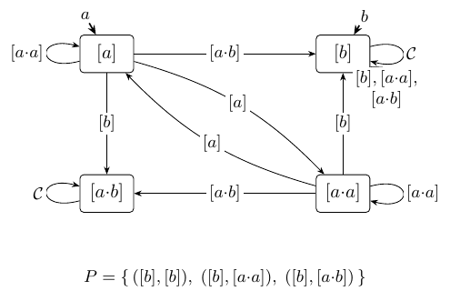
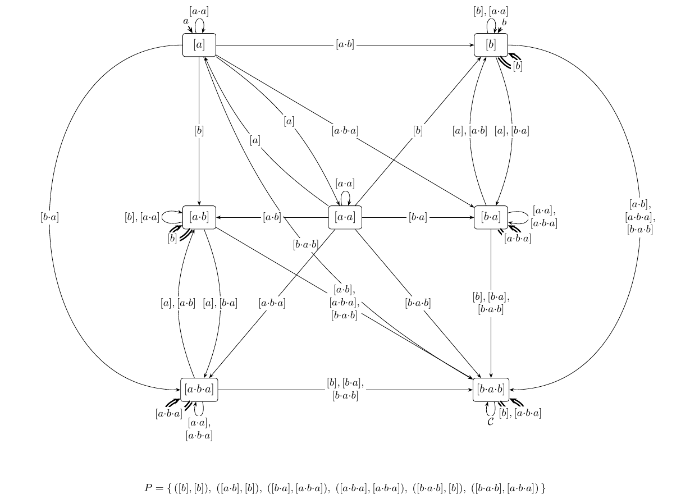

<!-- ASSEMBLED by research_notes/sos_learning/Makefile — do not edit here; edit the parts in sos_learning/ and re-run make. -->

# Learning the Syntactic ω-Semigroup

**Yann Thierry-Mieg**

With significant inputs from
**Claude (Anthropic)**

*Shadow draft — rev. 2026-07-18. Remaining `⟨TBD: …⟩` placeholders await the
M4 campaign's completed sweep.*

## Abstract

The syntactic ω-semigroup of a regular ω-language `L` is its canonical algebra:
presentation-independent, complete, and the object from which membership,
equivalence, and every definability property of `L` — LTL-definability included —
are read. It has recently been materialized for the first time [SωS26]: the
abstract algebra represented by a computable, serializable invariant
`𝓘(L) = ⟨𝒮, P⟩` — a stamp classifying the finite words, a set of accepting
linked pairs over it — constructed there from a deterministic automaton. This
paper shows the algebra is *learnable*: we give an active-learning algorithm in
the MAT model whose queries are memberships of ultimately-periodic words only,
whose target is the invariant `𝓘(L)`, and whose hypotheses are its
automaton-like Cayley form.
To our knowledge it is
the first MAT learner for the full ω-regular class whose limit is the
language's own algebra — a canonical object of `L` itself, rather than an
acceptor chosen from a family.
Two results carry the
paper. First, a *harvest theorem*:
any lasso on which a hypothesis errs surrenders a separating table column, by a
two-phase replacement chain — stem first, then loop-head, where a left extension
of a loop is nothing but a rotation of it — with a binary search in each phase. Second,
a finding of independent interest: an observation table with two-sided columns is
*still not enough*, because membership's error signal is one-sided — the table can
stabilize on a correct acceptor coarser than the algebra, an FDFA in algebraic
clothing, and does so *permanently* on a language as plain as `a → Xa`; such a
certified stall is provably never a congruence — a correct acceptor and no
algebra at all. What restores two-sidedness is a *left-saturation* sweep over class
representatives whose checks cost no queries at all — the rotation lemma's slot
collapse transported to the learner's
side; with it, the fixpoint is exactly Arnold's quotient, after at most `|𝒞|`
class splits
and `O(|𝒞|²·|Σ|)` membership queries plus a logarithmic-cost analysis per
counterexample — output-polynomial in the canonical target. The established FDFA
approach learns one of three competing canonical families of DFAs — none of them
the language's own algebra, all of them acceptors, answering no definability
question by themselves; this learner converges to the one object such questions
are read from — and two learned invariants are compared by byte-equality, whereas
acceptors need a product construction. On a complement-closed census of 3938
ω-regular languages the learner reconstructs every canonical invariant
byte-for-byte, at class counts past a hundred; over a thousand of them stall
permanently without the sweep — the right congruence falling as many as
fifty-three classes short of an algebra that counterexample-guided refinement
provably never reaches — and the family includes prefix-independent
languages, whose recovering left contexts act entirely inside the loop, as
rotations.

---

## 1. Introduction

Active learning asks a machine to reconstruct an unknown language *exactly*,
from experiments alone. In Angluin's minimally adequate teacher (MAT) model
[Ang87] — the setting of this paper, recalled in §2.1 — the learner poses
membership queries ("is this word in the language?") and equivalence queries
("is this hypothesis the language?", answered by *yes* or by a
counterexample), and the L\* algorithm learns the minimal DFA of any regular
language with polynomially many queries. The paradigm's reach is practical —
assume–guarantee verification [FCC+08]; state-machine models learned from
black-box implementations of smart cards, network protocols, and legacy
software (see [Vaa17] for a survey) — and its
engine is always the same: convergence to a *canonical* target, an object
owned by the language rather than by any machine presenting it.

Active learning of ω-regular languages has a structural handicap that finite words
never had. For finite words, Angluin's L\* rests on the Myhill–Nerode theorem: the
right congruence of the language *is* the minimal acceptor, so an observation table
of prefixes against suffixes converges to a canonical object. For ω-words the right
congruence is not informative: it can be trivial while the language is complex, and
languages as plain as `FG(a ∨ Xa)` have a one-class right congruence [AF21]. The
earliest ω-learner drew the line honestly: Maler and Pnueli's L\* extension [MP95]
covers exactly the languages whose right congruence carries everything — `L` and
its complement both deterministic-Büchi, by the Staiger theorem they build on
[Sta83] — and stops there. The field's route past the line — families of DFAs (FDFAs) covering
the lasso structure [AF16, ABF18] — works, at a price: *three* canonical normal
forms per language (periodic, syntactic, recurrent) instead of one object, the
choice among them the learner's; and what is learned is an *acceptor*, not the
language's algebra — no definability question is answerable from it without
further construction.

The canonical object exists. Arnold's syntactic congruence [Arn85] quotients finite
words by interchangeability in every ultimately-periodic context, in two shapes —
in the stem, or inside the loop — and its quotient, the syntactic ω-semigroup
(SωS), is the exact ω-analogue of the syntactic monoid: presentation-independent,
finite, and complete for definability. It was recently materialized for the
first time [SωS26] — represented by the computable invariant `𝓘(L)`,
constructed from a deterministic automaton; the key computational step
there is a **rotation lemma** [SωS26, Lem 4.1] — a left factor prepended to a
loop merely *rotates* it, `x·(u·y)^ω = x·u·(y·u)^ω`, a right extension read at a
shifted starting slot — which renders the two-sided congruence as the coarsest
right-invariant refinement of a seed relation [SωS26, Thm II].

This paper's observation is that the rotation lemma is not about automata at all —
but transporting it to the query model splits it in two, and the split is the
story. Its *right-extension* half becomes a harvest procedure: any lasso on which
the hypothesis errs is interpolated, through representative replacements at the
stem and then at the head of the loop, into a chain of membership queries whose
bit must flip — and the flip *is* a new separating column (§4). Its *slot* half —
left factors act only by re-indexing finitely many slots [SωS26, Lem 4.3] —
becomes a saturation
rule: the columns' left prefixes need range only over class representatives, so
the two-sidedness that membership errors cannot signal (§4.2, the failure we did
not anticipate) is enforced by a query-free sweep (§4.3). On top of the two halves
we build an L\*-style learner whose hypotheses are not automata but the invariant
`𝓘(L)` itself, in its finite presentation `(𝒞, λ, ·, P)`: classes keyed by
shortlex representatives, letter map,
multiplication table, accepting linked pairs. The result is, to our
knowledge, the first active-learning algorithm for the *full* class of
ω-regular languages whose limit is a canonical object of the language — the
algebra its definability questions are read from — rather than an acceptor
chosen from a family; placing ω-learning back on the L\* footing that
Myhill–Nerode's failure at ω seemed to forbid is what this paper is for.

**Contributions.**
1. A two-sorted observation table for Arnold's congruence, with lasso membership
   queries only, and a hypothesis in *Cayley form* — a deterministic automaton on
   classes plus accepting pairs — requiring no monoid products mid-learning (§3).
2. The harvest theorem: every disagreeing lasso surrenders a separating column,
   found by a two-phase replacement chain with binary search — the loop phase
   enacting the rotation; this is the finiteness ingredient the generic algebraic
   approach lacks at ω [US20] (§4.1).
3. The finding: two-sided columns are not enough. Membership's error signal is
   one-sided, and the table can stabilize on a correct acceptor strictly coarser
   than the algebra — the right-congruence obstruction [AF21] reborn one level up.
   The stall is real and minimal: `a → Xa` stalls permanently, four classes
   against five, with zero counterexamples (Proposition 4.4). A query-free
   left-saturation sweep over class representatives — the rotation
   lemma's slot collapse [SωS26, Lem 4.3] — restores two-sidedness (§4.2–4.3).
4. The saturated-fixpoint theorem: termination after at most `|𝒞|` splits, and
   canonicity — the fixpoint *is* the syntactic stamp, exported as `𝓘(L)`;
   equivalence between
   hypotheses is invariant equality, replacing product constructions — with a
   converse: an exactly-certified fixpoint is either canonical or carries no
   algebra at all (§5, Theorem 5.3).
5. An implementation as a pure query learner, and an evaluation against the
   canonical target: byte-exact reconstruction across a complement-closed
   census of 3938 languages (`N` past 100, zero mismatches), the query bounds
   of Proposition 5.4 confirmed (harvest logarithmic in counterexample
   length), saturation shown indispensable on a family of over a thousand
   permanent stalls whose canonical algebras are provably beyond
   counterexample-guided refinement — prefix-independent languages among
   them, the ω-power left action of Corollary 4.7 realized — and a comparison
   to the FDFA baseline (ROLL) on which only the algebra answers
   LTL-definability, the FDFA answering it not at all (§6).

**Relation to the algebraic approach.** The closest work is Urbat and Schröder's
algebraic automata learning [US20], and the relationship is precise. Generically,
for languages recognized by a monad `T`, they prove that the syntactic `T`-algebra
is the minimal automaton of a *linearized* language over the alphabet of an
automata presentation of the free algebra — `Syn(L) ≅ Min(lin(L))` [US20,
Thm 5.14] — and learn that automaton by a generalized L\*. Instantiated to Wilke
algebras this covers ω-regular languages, in principle. In instance it is not
effective: the presentation validating the isomorphism carries the sorted alphabet
`Σ₊,ω = {ω} ∪ {·v^ω : v ∈ Σ⁺}`, whose letters are *operations* — `ω` sends `w` to
`w^ω`, and `·v^ω` sends `w` to `w·v^ω`: one letter per finite word `v`, Arnold's
ω-power contexts recast as an *infinite alphabet* — while the finite restriction to `{ω}`
alone is only a *weak* presentation, outside the theorem, of which [US20] itself
notes that the resulting learned object resembles a family of DFAs. The rotation
lemma is exactly the missing finiteness: no ω-power context need be an alphabet
letter known in advance, because a counterexample-driven harvest of at most `|𝒞|`
ω-columns reaches the same congruence (§4, Theorem 5.1). [US20] settles what the
target is; this paper makes the ω-instance an algorithm, and runs it.

Three running examples — `GF(aa)`, `Even`, `EvenBlocks` [SωS26] — recur
throughout (descriptions, automata and target invariants in §2.3,
Figures 1–2). Two of them are traced *live* through §3–5: `Even`
(`(aa)*·!a·Σ^ω`, co-safety: membership is decided by a finite prefix, i.e. on
the stem) and `EvenBlocks`
(prefix-independent, trivial right congruence — outside [MP95]'s class,
degenerate for any FDFA's leading automaton, and precisely the case the ω-sort
of our columns is built for). The trace has a punchline worth spoiling: the two
languages hand the learner first counterexamples that break the *same wrong
name* — in both, the pair `([a],[a])` and its representative lasso `a·a^ω` have
absorbed everything that ever read an `a` — and the algorithm routes the two
repairs through opposite Arnold shapes. `GF(aa)`, whose transition-monoid
group is a presentation artifact the algebra destroys, remains the evaluation's
third specimen (§6).


## 2. Background

This section fixes notation and recalls the two bodies of prior work the
paper stands on: active learning in the MAT model (§2.1), and the syntactic
theory of ω-regular languages in the invariant form of [SωS26] (§2.2); §2.3
introduces the running examples and the teacher used in the experiments.
Nothing in it is new.

### 2.1 Active learning in the MAT model

**Exact learning from queries.** Active learning reconstructs a finite
description of an unknown language `L` that is available only through an
interface — a black-box implementation, a simulator, a system too opaque to
open. In Angluin's *minimally adequate teacher* (MAT) model [Ang87] the
interface is two queries: a **membership query** — is the word `w` in
`L`? — answered by a bit, and an **equivalence query** — is the hypothesis
`𝓗` exactly `L`? — answered by *yes* or by a **counterexample**, a word on
which `𝓗` and `L` disagree. The learner chooses its queries adaptively and
must terminate with an exact description of `L`.

**L\* in one paragraph.** For regular languages of finite words the model is
solved by Angluin's L\* [Ang87]. The learner maintains an **observation
table**: rows are access words (prefixes), columns are distinguishing
experiments (suffixes), and the entry at `(u, e)` is the membership bit of
`u·e`. A table that is **closed** (every one-letter extension of a row
matches some row's bit-vector) and **consistent** (rows with equal
bit-vectors have equal one-letter successors) induces a deterministic
automaton on the row classes — the hypothesis. Each counterexample is
processed into a new distinguishing experiment that splits at least one row
class — refinement is *counterexample-guided*, progress arriving exactly when
the hypothesis is caught being wrong; the binary search of Rivest and Schapire
[RS93] finds the split with logarithmically many membership queries. §3 will reuse every one of these
notions, changed only where ω-words force a change.

**Why it converges: a canonical target.** The bookkeeping above is not what
makes L\* work; the Myhill–Nerode theorem is. The right congruence
`u ~_L v ⟺ (∀y: u·y ∈ L ⟺ v·y ∈ L)` of a regular language has finitely many
classes, and its quotient *is* the minimal DFA — a **canonical object**, a
function of `L` and not of any machine presenting it. Canonicity is
load-bearing three times over. It is the progress measure: every split is
witnessed by a genuine `~_L`-separation, so the class count is bounded by
the target's size and each counterexample makes irreversible progress. It
makes complexity meaningful: queries are counted against the size of the
language's own invariant — *output-polynomial* — not against whichever
automaton the teacher happens to hold. And it makes the result usable:
questions about `L` are answered on the learned object itself. On this
view, active learning *is* the reconstruction of a canonical invariant
through queries, and the table is its bookkeeping.

**What survives at ω, and what breaks.** For ω-regular languages the query
interface survives intact. Infinite words cannot be typed into a teacher,
but the **lassos** — ultimately-periodic words `u·v^ω`, finite objects —
determine an ω-regular language completely (§2.2), so membership queries
are posed on lassos and counterexamples are returned as lassos; this has
been the standard move since [MP95, FCC+08, AF16]. What breaks is the
target. Myhill–Nerode fails at ω: the right congruence of an ω-regular `L`
can be trivial while `L` is complex [AF21], so there is no minimal
deterministic acceptor to converge to — and the history of ω-learning (§7)
is a history of substitute targets: a subclass where the right congruence
happens to suffice [MP95], encodings into finite words [FCC+08], families
of DFAs in three competing normal forms [AF16, ABF18]. All are acceptors;
none is a canonical object of `L` alone. This paper keeps the L\* view and
changes the target: the canonical object an ω-regular language actually
owns is the quotient of Arnold's syntactic congruence, materialized as the
invariant `𝓘(L)` — recalled next — and §§3–5 supply what was missing, a
query-level route to a *two-sided* congruence.

**Conventions.** One lasso membership query counts as one query; equivalence
queries are counted separately; all bounds are stated against the size of
the canonical target.


### 2.2 The syntactic ω-semigroup, and its invariant

Everything in this subsection is prior work — the congruence is Arnold's
[Arn85], its algebraic packaging Wilke's and Perrin–Pin's [Wil93, PP04], and
its materialization as the computable invariant `𝓘(L)`, whose notation and
results this paper adopts wholesale, is [SωS26] — restated in the exact form
the learner consumes.

**Lassos.** `Σ` is a finite alphabet (for temporal-logic applications,
`Σ = 2^AP`). A **lasso** is an ultimately-periodic word `u·v^ω`: a finite stem
`u`, a finite non-empty loop `v` repeated forever. Two ω-regular languages are
equal iff they agree on all lassos [PP04], so lassos are the only infinite
words that
ever need to be mentioned: every query below is one, and "the language" means
its lasso membership function.

**The congruence.** Fix an ω-regular `L ⊆ Σ^ω`. Two finite words are
**syntactically congruent**, `u ≈_L v`, when swapping one for the other never
changes membership; Arnold matches the swap positions to the anatomy of a
lasso — the swapped factor sits in the stem, or recurs inside the loop —
giving two context shapes [Arn85; SωS26, Def 3.5]:

```
    (linear)    ∀ x, y ∈ Σ*, t ∈ Σ⁺ :   x·u·y·t^ω ∈ L  ⟺  x·v·y·t^ω ∈ L
    (ω-power)   ∀ x, y ∈ Σ*         :   x·(u·y)^ω  ∈ L  ⟺  x·(v·y)^ω  ∈ L
```

For ω-regular `L` the congruence has **finitely many classes** [Arn85], and
its quotient, completed by the verdicts on lassos, is the **syntactic
ω-semigroup** of `L`: the exact ω-analogue of the syntactic monoid, a
function of `L` alone. The abstract algebra is two-sorted — classes of
finite words, classes of ω-words [PP04] — but on a finite carrier the second
sort is determined by the first and need not be carried [SωS26, §2]; what
this paper computes with, end to end, is the one-sorted *representation*
assembled next.

**The stamp.** The vocabulary that materializes quotients of `Σ⁺` is the
**stamp** [SωS26, Def 3.1]: a surjective semigroup morphism `𝒮 : Σ⁺ → 𝒞`
onto a finite semigroup whose elements are the **classes**, written `[u]` —
and a two-sided congruence supports exactly one: the class of a
concatenation is a function of the classes, `[u]·[v] := [u·v]` well defined.
A stamp is finitely presented by `(𝒞, λ, ·)` — the classes, the **letter
map** `λ := 𝒮|_Σ`, the multiplication table — and evaluating `𝒮` is one
table lookup per letter. It extends to all finite words by adjoining a
**fresh** identity: `M := 𝒞 ∪ {[ε]}`, `𝒮(ε) := [ε]`, making `𝒮 : Σ* → M` a
surjective monoid morphism. Freshness — `[ε]` never identified with the
class of a non-empty word — holds even when `𝒞` owns a neutral element of
its own, which happens: in `Even` below, `[aa]` multiplies as the identity
on every word class. The fresh unit costs one redundant class and buys a
guarantee the learner leans on throughout: every class other than `[ε]`
consists of non-empty words, so it carries a non-empty shortlex key, and
every representative lasso built from keys (§3) has a non-empty loop.
Canonicity is unaffected: the adjunction is a function of `L` alone
[SωS26, §3.1].

**Linked pairs name lassos.** Iterate a class: the powers `c, c², c³, …`
move in a finite semigroup, so they eventually cycle, and exactly one power
is **idempotent**; a single **exponent** `π ≥ 1` with `c^π` idempotent for
every class exists (any common multiple serves, e.g. `|𝒞|!`), and we write
`c^π` [SωS26, Def 3.2]. A **linked pair** is
a pair of classes `(s, e)` with `e·e = e` and `s·e = s`, both classes of
non-empty words — the basepoint `[ε]` appears in no pair; folding a lasso
`u·v^ω` as `(u·v^π)·(v^π)^ω` lands on one — `e = 𝒮(v)^π`, `s = 𝒮(u)·e` — and
membership of the lasso depends *only* on that pair [PP04]. So the
acceptance datum of the algebra is a set of accepting pairs, not a set of
accepting classes: loops are named separately from stems.

**The invariant.** An **invariant** is `𝓘 = ⟨𝒮, P⟩`: a stamp together with a
**pair set** `P` of linked pairs [SωS26, Def 3.3]. It decides lassos with
its own data and nothing else — **lasso membership** [SωS26, Def 3.4]: for a
presentation `(u, v)` of `w = u·v^ω`, set `e := 𝒮(v)^π`, `s := 𝒮(u)·e`; then
`w ∈ L(𝓘)` iff `(s, e) ∈ P`. The queried pair **names** the lasso, and a
lasso bears several names — already `(u, v)` and `(u·v, v)` may land on
distinct pairs. The **syntactic invariant** of `L` is
`𝓘(L) := ⟨𝒮_L, P(L)⟩` — the quotient stamp `𝒮_L : Σ⁺ → 𝒞_L := Σ⁺/≈_L`,
with the pair set collecting the names of all accepted lassos
[SωS26, Def 3.6]: the material representation of the syntactic ω-semigroup,
and the learner's target. Canonicity [SωS26, Thm I]: on `𝓘(L)`, lasso
membership is membership in `L` itself, on every presentation of every
lasso; and `𝓘` is a **complete invariant** — two ω-regular languages over
the same alphabet are equal iff a (unique) isomorphism matches their
invariants, and, with each class keyed by its shortlex-least member
(shortlex throughout this paper uses the letter order of the
serialization — valuation bitvectors ascending, so `!a < a` in the
examples), iff the serialized invariants are byte-identical. The target
answers definability directly: `L` is LTL-expressible iff no power sequence
`c, c², c³, …` cycles with period `> 1` — the aperiodicity read-off
[SωS26, Thm 6.1]. Throughout, `N` counts the classes of the target
*including* the adjoined identity — `N = |𝒞_L| + 1`, the `classes:` line of
the serialized file [SωS26, §6.2] — so class counts here match the
serialization.

**Well-formed and denoting invariants.** Two notions from [SωS26, §4]
organize everything downstream. An invariant **denotes** `L` when every
presentation of every lasso receives `L`'s verdict from lasso membership
[SωS26, Def 4.1]. An invariant is **well-formed** when its pair set is
saturated under conjugacy of linked pairs — the equivalence generated by the
rotation steps `(s, (cd)^π) ∼ (s·c, (dc)^π)` [SωS26, Def 4.2].
Well-formedness is exactly the law that gives every lasso one verdict
through all its presentations, and a well-formed invariant denotes exactly
one language, its own [SωS26, Prop 4.1]. The fact this paper leans on
hardest is [SωS26, Cor 4.2]: **an invariant denoting `L` exists exactly at
the stamps whose kernel refines `≈_L`, and over each such stamp the pair set
is forced** — the names of the accepted lassos, nothing else. Coarser than
the syntactic stamp, no invariant denotes `L` at all. §5 turns this into the
learner's canonicity argument, and §4.2's permanent stall is the phenomenon
it forbids, observed from below.

**The rotation lemma, and the membership tests.** The computational heart of
[SωS26] is a **rotation lemma** [SωS26, Lem 4.1]: a factor carried from a
loop's front onto the stem leaves the ω-word unchanged —
`x·(u·y)^ω = x·u·(y·u)^ω` — so on classes `(s·c, (dc)^π)` names the same
lasso as `(s, (cd)^π)`: a left extension of a loop is a rotation of it, a
right extension read at a shifted starting slot. The construction draws two
services from the lemma, and both transport to the query model (§4). The
first forces the conjugacy closure above: a pair set cannot help being
saturated when it speaks the truth about a language. The second makes the
two-sided congruence right-computable: [SωS26, Def 4.3] poses to each class
`c` the **membership tests**

```
    Λ(d, f)(c) = [ (d·c·f, f) ∈ P ]        Ω(d)(c) = [ (d·c^π, c^π) ∈ P ]
```

— one lasso membership each, the slot `d` ranging over the finitely many
elements of `M` — and agreement under all tests at all right extensions *is*
`≈_L` [SωS26, Lem 4.2]; that this agreement is left-invariant is the
rotation lemma again — a left factor shifts a linear test's slot and
*rotates* an ω test's loop, carrying no information of its own
[SωS26, Lem 4.3]. §3's columns are these tests sampled at word level; §4.3's
sweep is Lemma 4.3 enforced on a table the learner can only probe by
queries. ([SωS26, Thm II] packages the second service on the construction
side — canonicalization by partition refinement — but nothing below depends
on it: the learner's proofs consume Theorem I and Corollary 4.2 only.)


### 2.3 The running examples, and the teacher

For the reader who wants to check every
bit below by hand, here are the running examples — descriptions and automata
reproduced from [SωS26]:

- **`GF(aa) := GF(a ∧ Xa)`** — "infinitely many `aa`-factors." It *is* LTL, but a
  natural presentation encodes the letter `a` as a transposition, so its transition
  monoid carries a spurious group. The SωS *destroys* that group.
- **`Even := (aa)*·!a·Σ^ω`** — over the single atom `a`, an even number of `a`'s then a
  `!a` then anything; in PSL, the words with a prefix matching the SERE
  `{a[*2]}[*] ; !a`. The canonical mod-2 language; *not* LTL, its group genuine, and —
  because a prefix fixes the parity — refuted by Arnold's *linear* (first) shape.
- **`EvenBlocks`** — "infinitely many `!a`'s, and eventually every completed `a`-block
  has even length"; the same `{a[*2]}` even-block SERE, now recurring. Also *not* LTL
  with a genuine mod-2 group, but *prefix-independent*: no finite prefix changes
  membership, so its group is invisible to the linear shape and only Arnold's
  *ω-power* (second) shape can witness it. This is the example that keeps both shapes
  honest.

<table>
<tr>
<td align="center"></td>
<td align="center"></td>
<td align="center"></td>
</tr>
<tr>
<td align="center"><b>(a) <code>GF(aa)</code></b><br>2 states, <code>Inf(0)</code> (Büchi).<br>The <code>a</code>-letter transposes the<br>two states — a <code>Z₂</code> in the<br>transition monoid.</td>
<td align="center"><b>(b) <code>Even</code></b><br>4 states, <code>Inf(0)</code> (Büchi).<br>Parity pair <code>2/1</code>, an accepting<br>sink <code>0</code>, a rejecting sink <code>3</code>.</td>
<td align="center"><b>(c) <code>EvenBlocks</code></b><br>2 states, <code>Fin(0) ∧ Inf(1)</code>.<br>Prefix-independent; the parity<br>of a completed block lives on<br>the <code>!a</code>-transitions' marks.<br>PSL: <code>GF!a ∧ FG(!a → X{a[*2][*];!a}!)</code></td>
</tr>
</table>

**Figure 1.** The deterministic, complete, transition-based Emerson–Lei
automata of the three running examples, reproduced from [SωS26] (acceptance
reads the transition marks seen infinitely often: `Inf(c)` — mark `c` recurs,
`Fin(c)` — it does not). In this paper the automata belong to the *teacher*:
the learner only ever sees their answers.

<table>
<tr>
<td align="center"></td>
<td align="center"></td>
<td align="center"></td>
</tr>
<tr>
<td align="center"><b>(a) <code>𝓘(GF(aa))</code></b><br><code>|𝒞| = 5</code>, <code>N = 6</code>.</td>
<td align="center"><b>(b) <code>𝓘(Even)</code></b><br><code>|𝒞| = 4</code>, <code>N = 5</code>.</td>
<td align="center"><b>(c) <code>𝓘(EvenBlocks)</code></b><br><code>|𝒞| = 7</code>, <code>N = 8</code>.</td>
</tr>
</table>

**Figure 2.** The targets, drawn: the syntactic invariants of the three
running examples, reproduced from [SωS26]. Reading key: vertices are the
classes, named by their shortlex keys; following an edge multiplies on the
right by its label; the entry arrows give the letter map `λ`; the accepting
pairs `P` are listed beneath the drawing, and a label `𝒞` abbreviates a
self-loop carrying every class. These drawings are the paper's answer key:
the learner reconstructs each of them, byte for byte, from lasso queries
alone — the automata of Figure 1 stay on the teacher's side of the wall.

**The query model, instantiated.** The MAT teacher of §2.1, for this paper:
membership queries are lassos (`u·v^ω ∈ L`?); equivalence queries take a
hypothesis `𝓗` (an invariant-shaped tuple, §3) and return a lasso
counterexample on failure. The restriction to ultimately-periodic words costs
nothing — lassos determine `L` (§2.2) — and every query the algorithm ever
poses is one.

In our experiments the teacher is built on the construction of [SωS26]:
membership is one deterministic run, and an equivalence query is decided
*exactly*, against the language's own invariant `𝓘(L)` — constructed once,
after which the automaton leaves the equivalence loop. The realization — an
align-and-scan of the hypothesis against `𝓘(L)`, with a functionality guard
and a fallback — is detailed with the experimental protocol (§6.1); two of
its properties are used before then. The returned counterexample is the
globally *minimal* one (shortest stem, then shortest loop, then shortlex) —
which makes runs deterministic and the worked examples reproducible; §6
measures what non-minimal policies cost. And nothing in the learner's
correctness depends on this realization.


## 3. The observation table

**Definition 3.1 (table).** A table is `T = (R, E_lin, E_ω)` where `R ⊆ Σ*` is a
finite set of **rows** containing `ε` and `Σ`, observed together with its
frontier `R·Σ`, and the columns are of two sorts:

- `E_lin ⊆ Σ* × Σ* × Σ⁺` — **linear columns**; the entry of row `u` at
  `(x, y, t)` is the bit `[ x·u·y·t^ω ∈ L ]`;
- `E_ω ⊆ Σ* × Σ*` — **ω-columns**; the entry of row `u` at `(x, y)` is the bit
  `[ x·(u·y)^ω ∈ L ]`.

Rows `u, v` are **table-equivalent**, `u ≡_T v`, when all entries agree.

Every entry is one membership query. By construction `≈_L` refines `≡_T` for any
column set — columns are particular Arnold contexts — so learning is the business
of growing `E_lin ∪ E_ω` until `≡_T` *is* `≈_L` on the rows, and growing `R` until
the rows exhaust `𝒞_L`. In the vocabulary of §2.2, the columns are the
membership tests of [SωS26, Def 4.3] sampled at word level — a linear column
`(x, y, t)` reads `Λ(𝒮_L(x), 𝒮_L(t)^π)` at the right extension `𝒮_L(y)`, an
ω-column `(x, y)` reads `Ω(𝒮_L(x))` — except that the learner owns no stamp:
its slots and extensions are concrete words it has queried, and
[SωS26, Lem 4.2] is the guarantee that some finite family of such tests
characterizes `≈_L`.

The two sorts divide the labor exactly as Arnold's two shapes do. On `Even`,
linear columns already separate everything —
the stem decides membership. On `EvenBlocks`, *every* linear column is a constant
row-function (prefix-independence: a stem mutation is swallowed), and the entire
language lives in the ω-sort: the column `(ε, !a)` separates rows `a` and `aa`,
since `(a·!a)^ω ∉ L` and `(aa·!a)^ω ∈ L`. A learner without the ω-sort cannot even
represent what distinguishes them — this is [AF21]'s obstruction, met head-on.
(§4.1 shows the learner *finding* a rotated cousin, `(a, a)`, unaided — and the
final sweep mints `(ε, !a)` itself, Table 8.)

*Example (day one, on `Even`).* `Even = (aa)*·!a·Σ^ω` over `Σ = {a, !a}` — an
even block of `a`, then `!a`, then anything; membership of any word is fixed by
the parity of the `a`-count before its first `!a`. Initialize `R = {ε, a, !a}`,
`E_ω = {(ε, ε)}`, `E_lin = ∅`; Table 1 is the whole state of knowledge.
`a` and `!a` split at once, and every frontier word folds into one of them by
its single bit. Two of these merges are quietly wrong — `aa ≉_L a` (alive with
opposite parity) and `a·!a ≉_L a` (`a·!a` is doomed: its first `!a` closed an
odd block) — and the single column cannot see either. The run below catches
both, by two different mechanisms (§4.1, §4.3).

| word | `(ε,ε)_ω` | class |
|---|:--:|---|
| `ε` | — | `[ε]` |
| `a` | `0` | `[a]` |
| `!a` | `1` | `[!a]` |
| *frontier:* | | |
| `a·a` | `0` | → `[a]` ✗ |
| `a·!a` | `0` | → `[a]` ✗ |
| `!a·a` | `1` | → `[!a]` |
| `!a·!a` | `1` | → `[!a]` |

**Table 1.** Day one on `Even`: rows above the frontier line, one ω-column
(the entry of word `p` is `[p^ω ∈ L]`), `→` the class each frontier word folds
into. The two merges marked `✗` are wrong (`≉_L`) but invisible: no observed
context separates the words yet.

**Definition 3.2 (closed, consistent; access words; minting).** The table is
observed on its
**words** `W(T) = R ∪ R·Σ` (rows and frontier). `T` is **closed** when every
frontier word is `≡_T` to some row (else the offending frontier word is promoted
to `R`), and **consistent** when `u ≡_T v` implies `u·a ≡_T v·a` for all rows
`u, v` and letters `a` — §2.1's notions, with two sorts of experiments in
place of suffixes. Rows are maintained as **access words**: `R` starts as
`{ε} ∪ Σ`, and every later row is a promoted frontier word `w_c·a`, where
the **representative** `rep(c)` of a class, written `w_c`, is its
shortlex-least row. Two structural facts follow and are used below: every
letter-prefix of a row is itself a row (rows are only ever created by
extending a row with one letter), and each promotion adds one letter to an
existing row while creating a new class, so rows — hence representatives —
have length `O(|𝒞_T|)`. A consistency violation at column `c` **mints** a new
column by migrating the letter into the column: for `c = (x, y, t)` linear, the
column `(x, a·y, t)`; for `c = (x, y)` ω, the column `(x, a·y)`. Minting is sound
bookkeeping — the entry of `u` at the minted column *is* the entry of `u·a` at
`c`, by the identities `x·u·(a·y)·t^ω = x·(u·a)·y·t^ω` and
`x·(u·(a·y))^ω = x·((u·a)·y)^ω` — so the minted column separates `u` from `v`
exactly because `c` separated their `a`-successors. The empty word is kept as a
permanent row for the adjoined identity `[ε]` (it seeds folds and is never
compared), matching the fresh-identity convention of the target (§2.2).

**Lemma 3.3 (coherence).** On a closed and consistent table, the transition
`step(c, a) := class of w_c·a` is well defined and agrees on every member of
`c` — for any row `u` of class `c`, the table word `u·a` has class
`step(c, a)`. Consequently the letterwise **fold**
`ψ(u) := step(…step([ε], u₁)…, u_n)` satisfies `ψ(u) = [u]_{≡_T}` for every
table word `u`, and `≡_T` is a right congruence on rows.

*Proof.* *Well-definedness:* `w_c·a` is a table word (a row, or a frontier
word), and closedness assigns every table word the class of some row.
*Agreement:* for a row `u` of class `c` we have `u ≡_T w_c`, both rows, so
consistency gives `u·a ≡_T w_c·a`, i.e. `class(u·a) = step(c, a)`.
*Coherence*, by induction on `|u|` over table words. Base: `ψ(ε) = [ε]` by
definition. Step: every non-empty table word is `u = p·a` with `p` a row —
a frontier word extends a row by definition, and a non-empty row was created
as a one-letter extension of a row (Definition 3.2's access discipline) — and
`p`, a shorter table word, is covered by the induction hypothesis:
`ψ(u) = step(ψ(p), a) = step([p], a) = class(p·a) = [u]`, the third equality
by agreement. *Right congruence:* for rows `u ≡_T v` and a letter `a`,
agreement twice gives `[u·a] = step([u], a) = step([v], a) = [v·a]`. ∎

More generally, write `fold(d, u)` for the letterwise `step`-walk on `u`
started at an arbitrary class `d`, so that `ψ(u) = fold([ε], u)`. Folds compose
over *literal* concatenation — `ψ(x·y) = fold(ψ(x), y)`, immediately from the
definition — a small identity used repeatedly below; note that it concatenates
*words*, not classes: nothing yet says `fold(d, u)` and `fold(d, w_{ψ(u)})`
agree, and §4.2 turns exactly on that gap.

**The hypothesis, in Cayley form.** A closed, consistent table presents the
hypothesis `𝓗 = (𝒞_T, λ, step, P)`: the table's class set (written `𝒞_T`, to
keep it apart from the target's `𝒞_L`), `λ(a) = ψ(a)`, the transition
function `step` — a deterministic automaton *on classes* — and an accepting-pair
cache `P`. No monoid product is computed mid-learning; the multiplication table
is exported only at the end (§5). `P` is a **cache of teacher truths**: on demand,
`P(s, e) := teacher[ w_s·(w_e)^ω ]`, one membership query per pair, memoized —
so `P` is never "wrong," only indexed by classes that may later split.

**Prediction.** For a lasso `w·z^ω`: compute the fold orbit `c_j = ψ(z^j)` (each
step folds the literal `z` once); the orbit is deterministic over `𝒞_T`, so its
index and period are each at most `|𝒞_T|` and there is
`k ≤ 2·|𝒞_T|` with `c_{2k} = c_k` — take the least — and predict with
the pair `s = ψ(w·z^k)`, `e = c_k`:  `𝓗` answers `P(s, e)`. By construction the
prediction *is* the teacher's verdict on the representative lasso
`w_s·(w_e)^ω` — a genuine lasso: no word ever joins the permanent singleton
`[ε]`, so `e ≠ [ε]` and the loop `w_e` is non-empty, §2's fresh-identity
convention earning its keep. That definition is deliberate: a counterexample is therefore
always a pair of concrete lassos — the queried one and its representative
collapse — on which the *teacher's own bits differ*.

*Example (a prediction, and its miss).* We now run the prediction procedure in
slow motion, on `EvenBlocks`: infinitely many `!a`, and eventually every
completed `a`-block has even length — a *block* being a maximal run of `a`,
*completed* when the next `!a` closes it. Day one (Table 2) has the same shape
as `Even`'s: the single ω-column splits `a` from `!a`, and every frontier word
merges by its one bit. One entry deserves a pause: `!a·a` lands with `a` here,
not with `!a` as it did in `Even` — `(!a·a)^ω` completes an odd block forever,
bit `0`. So the hypothesis's worldview is: there are three kinds of finite
words — the empty one, the pure `!a`-blocks, and *everything that has ever
seen an `a`*. Its `step` function says exactly that: from `[!a]`, reading `a`
moves to `[a]`; from `[a]`, no letter ever leaves.

| word | `(ε,ε)_ω` | class |
|---|:--:|---|
| `ε` | — | `[ε]` |
| `a` | `0` | `[a]` |
| `!a` | `1` | `[!a]` |
| *frontier:* | | |
| `a·a` | `0` | → `[a]` |
| `a·!a` | `0` | → `[a]` |
| `!a·a` | `0` | → `[a]`  (≠ `Even`!) |
| `!a·!a` | `1` | → `[!a]` |

**Table 2.** Day one on `EvenBlocks`: same shape as Table 1, one telling
difference — `!a·a` folds to `[a]`, so `[a]` is absorbing and the fold sees
only "have I read an `a` yet".

Now predict the lasso `(ε, !a·aa)`, following the definition step by step.
*Fold the loop:* `ψ(!a·aa)` walks `[ε] →_{!a} [!a] →_a [a] →_a [a]` — the
middle step crossing the telling entry above — so `c_1 = [a]`. *Find the
idempotent power:* `c_2 = ψ((!a·aa)²)` continues the walk from `[a]` —
absorbed, so `c_2 = [a]` — and the least `k` with `c_{2k} = c_k` is `k = 1`:
the hypothesis believes `[a]` is already idempotent. *Form the pair:*
`s = ψ(ε·!a·aa) = [a]`, `e = [a]`. This step is the whole point of a
prediction: the hypothesis has just **named** the queried lasso by the pair
`([a], [a])` — the same name it gives `a·a^ω`, `(a·!a)^ω`, `(!a·a)^ω`, and
every other lasso whose folds collapse into `[a]` — and one name gets one
verdict. *Look up the name:* the cache has no entry for `([a],[a])`, so it
costs one membership query on the shortlex keys,
`w_{[a]}·(w_{[a]})^ω = a·a^ω` — rejected, no `!a` at all. Cached; prediction
`0`.

The miss: `(!a·aa)^ω ∈ L` — infinitely many `!a`, and every completed block it
ever closes is `aa`, length two. The hypothesis gave one name to two lassos
that the language distinguishes, and that is all a counterexample ever is in
this design: the queried lasso and its representative collapse, two concrete
lassos, teacher bits `1` and `0`.

The minimization policy of §2.3 explains why this exact lasso is the one
returned. Enumerating stems shortest-first and loops shortest-then-shortlex
(`!a < a`): `(ε, !a)`, `(ε, a)`, the four two-letter loops, and then
`(ε, !a!a!a)`, `(ε, !a!a·a)`, `(ε, !a·a!a)` are all predicted correctly — each
folds to a name whose representative lasso the language happens to treat the
same way — and `(ε, !a·aa)` is the first place the name `([a],[a])` cracks. A
misprediction is an equality the table wrongly believes; the harvest of §4.1
turns this one into the column that refutes it.


## 4. The learner

### 4.1 The harvest: every disagreeing lasso surrenders a column

Let `w·z^ω` be a lasso on which prediction and teacher disagree. **Normalize**
`(w', z') = (w·z^k, z^k)` with `k` as in the prediction — the same ω-word, now
with `s = ψ(w')`, `e = ψ(z')` the predicting pair. Write `n = |w'|`, `m = |z'|`.
Interpolate between the counterexample and its representative collapse by two
chains of teacher bits, each replacing a growing prefix by its class
representative:

```
    stem chain:   γ_i = [ rep(ψ(w'[1..i])) · w'[i+1..n] · z'^ω ∈ L ]      i = 0..n
    loop chain:   δ_i = [ w_s · ( rep(ψ(z'[1..i])) · z'[i+1..m] )^ω ∈ L ]  i = 0..m
```

Then `γ_0 = [w'·z'^ω ∈ L]` is the teacher's bit on the counterexample,
`γ_n = δ_0 = [w_s·z'^ω ∈ L]` is the junction, and `δ_m = [w_s·(w_e)^ω ∈ L]` is
the prediction. The concatenated bit sequence has differing endpoints, so it
flips at an adjacent pair; **one junction query** decides the half, and a
Rivest–Schapire binary search [RS93] — each probe one membership query — finds a
flip in `O(log n)` resp. `O(log m)` queries.

**Lemma 4.1 (stem harvest).** A flip `γ_i ≠ γ_{i+1}` yields the frontier word
`u = rep(ψ(w'[1..i]))·w'[i+1]` and the row `v = rep(ψ(w'[1..i+1]))`, currently
assigned the same class, separated by the **linear column**
`(ε, w'[i+2..n], z')`.

**Lemma 4.2 (loop harvest).** A flip `δ_i ≠ δ_{i+1}` yields the frontier word
`u = rep(ψ(z'[1..i]))·z'[i+1]` and the row `v = rep(ψ(z'[1..i+1]))`, currently
assigned the same class, separated by the **ω-column** `(w_s, z'[i+2..m])`.

*Proof of both.* The two flipped bits are exactly the entries of `u` and `v` at
the stated column — substitute and compare — and the columns are Arnold contexts,
so the separation is genuine: `u ≉_L v`. That `u` and `v` currently share a class
is the definition of `step`. Replacing the prefix *at the head of the loop* and
letting the ω-column's `(x, y)` format carry the rest is the rotation lemma
[SωS26, Lem 4.1] enacted: no search over rotations is ever needed. ∎

**Theorem 4.3 (harvest).** Each counterexample adds the flip column and splits
one class — the frontier word `u` leaves the class of `v` — so `|𝒞_T|` grows by
one per equivalence query, at a cost of `O(log(|w| + |𝒞_T|·|z|))` membership
queries: the normalized lengths are `n ≤ |w| + 2|𝒞_T|·|z|` and
`m ≤ 2|𝒞_T|·|z|`, since the stabilization power satisfies `k ≤ 2|𝒞_T|`.

*Proof.* A flip exists: the concatenated chain runs from the teacher's bit on
the counterexample to the (wrong) prediction, so its endpoints differ, and
the junction bit `γ_n = δ_0` decides which half flips. The flip splits a
class by Lemma 4.1 resp. 4.2: the frontier word `u` differs from the row `v`
on the minted column, so `u` leaves `v`'s class when the table refills. The
cost: the two chains total `n + m` positions with the stated bounds, and one
junction query plus a binary search over a bit sequence with differing
endpoints finds an adjacent flip in the stated logarithm. ∎

*Example (two counterexamples, one wrong name, two shapes).* The two running
specimens' first equivalence queries return different lassos — `Even`'s
teacher hands back `(ε, aa!a)`, `EvenBlocks`'s the shortlex-earlier
`(ε, !a·aa)` — but the same failure: each is predicted `0` through the pair
`([a],[a])`, i.e. through the representative lasso `a·a^ω`, and each is truly
in its language. Normalization is trivial in both (`k = 1`, so `w' = z'` is
the loop itself), the stem representative is `w_s = a` in both, and the
junction query routes them oppositely. On `Even`, `[a·(aa!a)^ω] = 0` — the
prepended `a` flips the parity — against `γ_0 = [(aa!a)^ω] = 1`: the flip is
in the **stem chain**, Table 3(a). On `EvenBlocks`, `[a·(!a·aa)^ω] = 1` — a
prefix cannot harm a prefix-independent language — equal to `γ_0`, so the
stem chain is flat and the flip is in the **loop chain**, Table 3(c). Both
flips sit at position `1 → 2` of their chains, but they convict different
words: from (a), the frontier word `u = rep(ψ(a))·a = aa` against the row
`v = rep(ψ(aa)) = a`, minting the linear column `(ε, !a, aa!a)`, entries `1`
for `aa` and `0` for `a` — the parity merge of day one, split; from (c), the
frontier word `u = rep(ψ(!a))·a = !a·a` against the row
`v = rep(ψ(!a·a)) = a`, minting the ω-column `(a, a)` — a rotated cousin of
the `(ε, !a)` we exhibited in §3, found by the machinery rather than by
inspection. Tables 3(b) and 3(d) show the tables after the split. Two lassos,
one wrong name, Arnold's two shapes: the counterexample analysis is the
two-shape split of the congruence, run backwards.

*(a) `Even`, the stem chain `γ` — replace a growing stem prefix by its rep:*

| `i` | prefix | its rep | queried lasso | `γ_i` |
|:--:|---|:--:|---|:--:|
| 0 | — | — | `aa!a·(aa!a)^ω` | `1` |
| 1 | `a` | `a` | `a·a!a·(aa!a)^ω` | `1` |
| 2 | `aa` | `a` | `a·!a·(aa!a)^ω` | **`0`** |
| 3 | `aa!a` | `a` | `a·(aa!a)^ω` | `0` |

*(b) `Even`, after the stem harvest:*

| word | `(ε,ε)_ω` | **`(ε, !a, aa!a)_lin`** | class |
|---|:--:|:--:|---|
| `a` | `0` | **`0`** | `[a]` |
| `!a` | `1` | **`1`** | `[!a]` |
| **`aa`** | `0` | **`1`** | **`[aa]`** |
| *frontier:* | | | |
| `a·!a` | `0` | **`0`** | → `[a]` ✗ still |
| `aa·!a` | `1` | **`1`** | → `[!a]` |

*(c) `EvenBlocks`, the loop chain `δ` — stem pinned to `w_s = a`, replace a
growing loop prefix by its rep:*

| `i` | prefix | its rep | queried lasso | `δ_i` |
|:--:|---|:--:|---|:--:|
| 0 | — | — | `a·(!a·aa)^ω` | `1` |
| 1 | `!a` | `!a` | `a·(!a·aa)^ω` | `1` |
| 2 | `!a·a` | `a` | `a·(a·a)^ω` | **`0`** |
| 3 | `!a·aa` | `a` | `a·(a)^ω` | `0` |

*(d) `EvenBlocks`, after the loop harvest:*

| word | `(ε,ε)_ω` | **`(a, a)_ω`** | class |
|---|:--:|:--:|---|
| `a` | `0` | **`0`** | `[a]` |
| `!a` | `1` | **`0`** | `[!a]` |
| **`!a·a`** | `0` | **`1`** | **`[!a·a]`** |

**Table 3.** The two first counterexamples, processed (minted column and
promoted row in bold; `ε`-row and unchanged frontier omitted). In both
chains, row `i = 1` replaces a one-letter prefix by its own representative —
a no-op, bit unchanged — and the flips sit at `1 → 2`. In (a), row 3 is the
junction `γ_3 = δ_0`, already `0`: the stem chain flipped, minting a *linear*
column. In (c) the junction is `1` and the loop chain flips instead, minting
an *ω-column*; note row 3's lasso is `a·a^ω` — the representative lasso of
the predicting pair, i.e. the prediction itself, closing the chain. (a) pulls
`aa` out of `[a]`; (c) pulls `!a·a` out — and in (b) the doomed `a·!a` still
hides in `[a]`, which is §4.3's catch.


### 4.2 The gap: acceptance-correct is not algebra-correct

The harvest reacts to *membership* disagreements — and membership's error signal
is structurally one-sided. Predictions fold the **literal** words of the queried
lasso; they never consult the class of a row *embedded under a left context*. So
if two rows `u, v` with `u ≉_L v` are merged, and no harvested column happens to carry
the separating prefix `x`, nothing observable ever goes wrong: every prediction
is computed from literal prefixes, every lasso verdict can be correct, the
equivalence oracle assents — and the learner stops with a table **coarser than
the syntactic congruence**. The fixpoint object is then a
right-congruence-flavored acceptor: an FDFA in algebraic clothing. This is the obstruction of
[AF21] reborn one level up — the table's *columns* are two-sided, but its *error
signal* is not — and it is, we believe, the true reason no observation-table
route to the syntactic algebra existed: the missing ingredient is not a cleverer
column format, but a repair that lives outside the counterexample loop. Neither running specimen realizes the stall *permanently* — in
both, the wrong merge eventually poisons some prediction, and a later
equivalence query catches it (a transient stall). But the permanent stall is
not a hypothetical, and it does not take an exotic language: an exhaustive
census of the smallest automaton shapes (nondeterministic transition-based
Büchi over one atomic proposition, §6.1; at one state every fixpoint is
canonical, so two states are the smallest possible) finds it already at
`a → Xa`.

**Proposition 4.4 (the stall, realized).** Let `L = L(a → Xa)` — if the first
letter is `a`, so is the second — over `Σ = {a, !a}`. The saturation-free
learner reaches, before its first equivalence query, a closed and consistent
four-class table — `[ε]`, the singleton `[a]`, a committed-in class
`C₁ = !a·Σ* ∪ aa·Σ*`, a committed-out class `C₀ = a!a·Σ*` — whose hypothesis
language is exactly `L`. Every equivalence oracle therefore assents, bounded
or exact; the fixpoint is strictly coarser than the syntactic congruence —
four classes against `N = 5`: the two accepting idempotents `[!a]` and `[aa]`,
right-indistinguishable but separated by the left context `x = a`, stay merged
inside `C₁` — and the export is broken as an algebra: its multiplication table
is not associative, and its membership read-off is not even
presentation-invariant — it accepts `a^ω` written as the lasso `(ε, a)` and
rejects the same ω-word written `(a, a)`.

*Proof.* Membership of an ω-word depends only on its first two letters, so on
lassos it is a function of the *commitment* of the literal prefix: every word
of `C₁` begins a member, every word of `C₀` begins a non-member, and the only
uncommitted non-empty word is the single letter `a` — the class `[a]` is a
singleton. The four-class partition is closed and consistent (`C₁` and `C₀`
absorb both letters; `a` steps into one or the other), and the learner
provably lands on it: every pre-equivalence column has prefix `x = ε` — the
initial column does, and consistency mints preserve the prefix
(Definition 3.2) — and an `x = ε` context evaluates any word of length ≥ 2 by
its commitment alone, so no such column can split `C₁` or `C₀`; conversely
the inconsistency of `a` against `!a` at `(ε, ε)` (their `!a`-successors'
bits differ) forces the mint `(ε, !a)` that isolates `[a]`. Now take any
lasso `w·z^ω` with predicting pair
`s = ψ(w·z^k)`, `e = ψ(z^k)`. The stem `w·z^k` can never be the word `a`:
either it is longer than one letter, or `w = ε` and `z = a` — and there
`k = 1` fails the stabilization test (`ψ(a) = [a]` but `ψ(aa) = C₁`), so
normalization takes `k = 2` and the stem is `aa`. Hence `s ∈ {C₁, C₀}`
always, and the prediction — the teacher's bit on `w_s·(w_e)^ω`, with
`w_{C₁} = !a` and `w_{C₀} = a!a` — equals the commitment of `s`, which equals
the truth of the queried lasso. No counterexample exists. ∎

The census's second specimen, `a ∧ XG¬a` — the language of the single ω-word
`a·(!a)^ω` — stalls the same way one step deeper, and the same argument
proves it permanent: the canonical `[!a·a]` stays
merged into `[!a]`, again separated only by `x = a`. There the alive class
`{a·!a^m}` squares to the dead class, so the loop idempotent `e` is always
dead, and the stem class `s` stays alive only when the literal `w·z^k` is of
the form `a·!a^m` — which forces a pure-`!a` loop, on which the representative
lasso `a·(!a)^ω` answers correctly; any stray `a` in the loop drags `s` to
dead through the literal fold before the faulty merge can matter — every
predicting pair again answers with the truth, and no counterexample exists.
Two exhibits, one mechanism, and both minimal:

| specimen | `N` | stalled fixpoint | merged pair | separated by | export error (read as `(a, a)`) |
|---|:--:|---|---|:--:|---|
| `a → Xa` | 5 | **4 — zero counterexamples** | `[!a] = [aa]`, both accepting idempotents | `x = a` only | rejects `a^ω` |
| `a ∧ XG¬a` | 4 | 3 — one counterexample | `[!a] = [!a·a]` | `x = a` only | accepts `a^ω` |

"One class short" undersells the defect. Export the stalled fixpoint of
`a → Xa` by §5's recipe, `c·c' := fold(c, rep(c'))`, next to the
canonical algebra of the language:

```
    canonical table  (5 classes)           stalled export  (4 classes)
    ·      ε    !a   a    a!a  aa          ·      ε    !a   a    a!a
    ε      ε    !a   a    a!a  aa          ε      ε    !a   a    a!a
    !a     !a   !a   !a   !a   !a          !a     !a   !a   !a   !a
    a      a    a!a  aa   aa   aa          a      a    a!a  !a   !a
    a!a    a!a  a!a  a!a  a!a  a!a         a!a    a!a  a!a  a!a  a!a
    aa     aa   aa   aa   aa   aa
```

(cells name classes by their keys; in the stalled table `[!a]` is the merged
`C₁` and `[a!a]` is `C₀`). The stalled table is **not associative**:
`([a]·[a])·[a] = [!a]·[a] = [!a]`, but `[a]·([a]·[a]) = [a]·[!a] = [a!a]`.
The first bracketing folds the literal word `aaa` and lands where it should;
the second substitutes the merged class's representative `!a` into the middle
of the product — and substituting a representative mid-product is exactly what
a merely-right congruence does not license. The hypothesis is immune, because
it folds the literal letters of the queried lasso and never substitutes — that
is how one partition carries a correct acceptor and a broken algebra at once.
Broken means broken downstream: on a non-associative table the linked-pair
reduction is bracketing-dependent, so the export does not even define a
*language* — its verdict depends on how the lasso is written. On
[SωS26]'s ladder the defect sits below the bottom rung: not associative, the
export is not a stamp, hence not an invariant that could be well-formed or
not [SωS26, Defs 3.1, 4.2] — and its read-off visibly breaks the one law an
invariant's semantics must obey, one lasso one verdict [SωS26, Prop 4.1].
Read `a^ω` as
the lasso `(ε, a)`: `e = [a]² = [!a]`, `s = [ε]·e = [!a]`, the pair
`([!a],[!a])` — accept, agreeing with the teacher. Read the same ω-word as
`(a, a)`: the stem class now multiplies the merged idempotent,
`s = [a]·[!a] = [a!a]`, pair `([a!a],[!a])` — reject. The exhibit table
reports this second reading, the shortlex-least divergence from the teacher.
On the second specimen the same defect points the other way: the canonical
algebra of `a ∧ XG¬a` keeps `[a]·[a] = [!a·a]` as its own non-accepting
idempotent, the stalled export merges it into `[!a]`, and the `(a, a)`
reading of `a^ω` lands on the accepting pair `([a], [!a])` — the bit of
`a·(!a)^ω`, the one word the language contains — while its `(ε, a)` reading
agrees with the teacher: one ω-word, two verdicts, no language.

Both languages are LTL-definable and utterly plain: the flagship stall is a
two-letter implication, on which the saturation-free learner converges and is
certified by a *complete* equivalence oracle. (Mechanically confirmed: the exact oracle of §2.3
certifies both stalled fixpoints — these permanence proofs turn those two runs
into fixtures for the oracle itself, a counterexample there being an oracle bug —
and with saturation on, both reach their canonical algebras, byte-equal to
the reference.) Canonicity is therefore beyond counterexample-guided
refinement: the CEGAR loop that carries L\* — and every ω-learner since — has
no error signal left to react to, and what breaks the stall must be a query
the learner poses on its own initiative. The repair below is that query — not
an optimization but the difference between the algebra and an acceptor. (§5
closes the account: by Theorem 5.3 *every* exactly-certified stall is like
these two — its partition is never a congruence, so there is no algebra on
its classes to mis-export.)


### 4.3 The repair: left-saturation over class representatives

The missing ingredient is the other half of the rotation lemma (§2.2): a left
factor acts only by re-indexing a slot, and slots are finitely many
[SωS26, Lem 4.3]; on the
learner's side, left contexts need range only over **class representatives**. Augment the loop with a **left-saturation sweep**: for every
table word `u` with class representative `v = rep(ψ(u))`, `u ≠ v`, and every
class `d` with representative `r = rep(d)`,

```
    check   fold(d, u) = fold(d, v)          (a pure table computation — zero queries)
```

**Lemma 4.5 (saturation progress).** If `fold(d, u) =: c_a ≠ c_b := fold(d, v)`,
then two membership queries and at most one frozen-prefix binary search yield a
new separating column and a class split.

*Proof.* Since `c_a ≠ c_b`, some existing column `κ` separates their
representatives — distinct classes differ on some column, by definition of
`≡_T`; say `κ = (x°, y°, t°)` linear, so the table already holds
`[x°·w_{c_a}·y°·t°^ω] ≠ [x°·w_{c_b}·y°·t°^ω]` (for the ω-sort `κ = (x°, y°)`,
read `[x°·(w_{c}·y°)^ω]` throughout). Query the two words under the same
context: `A = [x°·r·u·y°·t°^ω]`, `B = [x°·r·v·y°·t°^ω]` (ω-sort:
`A = [x°·(r·u·y°)^ω]`, `B = [x°·(r·v·y°)^ω]`).
- If `A ≠ B`: mint the column that reproduces "`r·w` under `κ`" as a bit on
  the bare candidate `w` — and the two sorts here differ. For a *linear* `κ`
  the candidate sits in the finite prefix, so `r` prepends there:
  `(x°·r, y°, t°)`. For an *ω* `κ` the candidate rides in the period, and
  peeling one `r` off the repeating block gives
  `x°·(r·w·y°)^ω = x°·r·(w·y°·r)^ω`: `r` must seed *both* the prefix and the
  period's tail — `(x°·r, y°·r)`. (The bare-prefix form `(x°·r, y°)` keeps
  the period `w·y°` unchanged and need not separate at all: for a
  prefix-independent `L` its added prefix is vacuous outright,
  Proposition 4.6.) Either way the minted column
  separates `u` from `v` directly — a genuine Arnold context — splitting
  their shared class.
- If `A = B`: the bits `A, B` cannot both agree with the two differing
  representative bits; say `A ≠ [x°·w_{c_a}·y°·t°^ω]`, where
  `c_a = fold(d, u) = fold(ψ(r), u) = ψ(r·u)` — folds composing over the
  literal concatenation `r·u`. So the word `r·u` and its own class
  representative behave differently under `x°·_·y°·t°^ω`. Run the stem
  chain of §4.1 on the segment `r·u` with the prefix `x°` **frozen** in place:
  `γ''_j = [ x° · rep(ψ((r·u)[1..j])) · (r·u)[j+1..] · y°·t°^ω ]`, from
  `γ''_0 = A` to `γ''_{|ru|} = [x°·w_{c_a}·y°·t°^ω] ≠ A`. The flip exists,
  binary search finds it, and Lemma 4.1's argument applies verbatim with `x°`
  frozen: the flip at position `j` separates the frontier word
  `rep(ψ((r·u)[1..j]))·(r·u)[j+1]` from the row `rep(ψ((r·u)[1..j+1]))` by the
  column `(x°, (r·u)[j+2..]·y°, t°)` — the prefix is `x°` alone, the unconsumed
  segment migrating into the middle component. Either way one class splits. ∎

*Remark (the ω-mint's shape matters).* Implemented with the bare-prefix form
`(x°·r, y°)`, the sweep on `GF(aa)` — prefix-independent, so the added prefix
is swallowed — separates nothing and never converges; only the reseeded
period of `(x°·r, y°·r)` carries `r`'s left action into the loop.

*Example (a saturation sweep on `Even`, in full).* Resume `Even` after §4.1's
split: four classes `[ε], [a], [!a], [aa]`, with `a·!a` still merged into
`[a]` — the doomed word still passing for an alive one. The sweep's subjects
are the five table words that are not class representatives; against the four
classes `d`, that is twenty checks, each a pure fold computation. Table 4 is
the *entire* sweep — zero membership queries on this page. (The scan order is
pinned, for reproducible traces: subjects in shortlex order, classes in key
order; a different order changes which cell fires first — never the
fixpoint.)

| `u` (vs `v = rep`) | `d = [ε]` | `d = [!a]` | `d = [a]` | `d = [aa]` |
|---|:--:|:--:|:--:|:--:|
| `!a·!a` (vs `!a`) | `[!a]` | `[!a]` | `[a]` | `[!a]` |
| `!a·a` (vs `!a`) | `[!a]` | `[!a]` | **`[aa]` ≠ `[a]`** | `[!a]` |
| `a·!a` (vs `a`) | `[a]` | `[!a]` | **`[!a]` ≠ `[aa]`** | `[a]` |
| `aa·!a` (vs `!a`) | `[!a]` | `[!a]` | `[a]` | `[!a]` |
| `aa·a` (vs `a`) | `[a]` | `[!a]` | `[aa]` | `[a]` |

**Table 4.** The left-saturation sweep on `Even`'s four-class table: cell
`(u, d)` compares `fold(d, u)` against `fold(d, rep(ψ(u)))`; a single value
means they agree. Twenty checks, zero queries, two hits — both at `d = [a]`,
both symptoms of the one wrong merge. In scan order the first to fire is
`(!a·a, [a])`.

Escalate the fired cell (Lemma 4.5): `u = !a·a`, `v = !a`, `d = [a]`,
`r = a`, diverging folds `c_a = fold([a], !a·a) = [aa]` and
`c_b = fold([a], !a) = [a]`. Pause on what fired: `!a·a` is *correctly*
merged with `!a` — the divergence arises because its fold from `[a]` walks
through the wrong merge, not because the subject is misplaced. The escalation
convicts the guilty word anyway. The column separating `rep([aa]) = aa` from
`rep([a]) = a` is the harvested `κ = (ε, !a, aa!a)`, and the two probe
queries — the escalation's only queries — are

```
    A = [ a·!a·a ·!a·(aa!a)^ω ] = 0        (r·u under κ's context)
    B = [ a·!a   ·!a·(aa!a)^ω ] = 0        (r·v under κ's context)
```

`A = B`: the first branch yields nothing, so we are in the second. Which side
disagrees with its own fold class? `ψ(r·u) = c_a = [aa]`, whose
representative `aa` holds κ-bit `1 ≠ A` — the `u`-side. Run the frozen-prefix
chain on the segment `r·u = a·!a·a` inside κ's context (here `x° = ε`, so the
freeze is invisible; a genuinely frozen prefix arises when κ carries one):

| `j` | prefix of `a·!a·a` | its rep | queried lasso | bit |
|:--:|---|:--:|---|:--:|
| 0 | — | — | `a!aa·!a·(aa!a)^ω` | `0` |
| 1 | `a` | `a` | `a·!aa·!a·(aa!a)^ω` | `0` |
| 2 | `a·!a` | `a` | `a·a·!a·(aa!a)^ω` | **`1`** |
| 3 | `a·!a·a` | `aa` | `aa·!a·(aa!a)^ω` | `1` |

**Table 5.** The escalation's chain: replace a growing prefix of `a·!a·a` by
its class representative, query under κ's context. The flip at `j = 1 → 2`
hands over the frontier word `a·!a` (that is, `rep(ψ(a))·!a`) and the row `a`
(that is, `rep(ψ(a·!a))`), separated by the minted **linear column
`(ε, a!a, aa!a)`** — entries `0` for `a·!a`, `1` for `a`. The doomed word
leaves `[a]`.

Two membership bits and a two-probe chain did the work of an equivalence
round: this merge was transient (the very next equivalence query would have
returned `(ε, a!a)`), but the sweep neither knew nor needed to know that —
and §4.2's permanent stall is caught by nothing else. One
remark completes the picture: the *other* hit, `(a·!a, [a])`, escalates
through the **first** branch — there `c_a = [!a]`, `c_b = [aa]`, the
separating column is the original ω-column `κ = (ε, ε)`, and the probes
`A = [(a·a!a)^ω] = 1 ≠ 0 = [(a·a)^ω] = B` differ, minting the ω-column
`(a, a)` directly — the left factor absorbed into the prefix *and* reseeded
at the period's tail, branch 1's ω-form in action. Same
split, other arm: one four-class table exercises both branches of Lemma 4.5,
and the fixpoint is the same five classes either way — only the *trace*
needs the pinned order. Table 6 shows the resulting table, which is final.

| word | `(ε,ε)_ω` | `(ε,!a,aa!a)_lin` | **`(ε,a!a,aa!a)_lin`** | class |
|---|:--:|:--:|:--:|---|
| `a` | `0` | `0` | **`1`** | `[a]` |
| `!a` | `1` | `1` | **`1`** | `[!a]` |
| `aa` | `0` | `1` | **`0`** | `[aa]` |
| **`a·!a`** | `0` | `0` | **`0`** | **`[a!a]`** |

**Table 6.** `Even` at the fixpoint (saturated column and promoted row in
bold; `ε`-row omitted). The four bit-signatures are pairwise distinct — with
`[ε]`, the `N = 5` classes of `𝓘(Even)` — and every frontier word now folds
cleanly: `a·!a·a` carries the all-zero signature of the absorbing reject and
joins `[a!a]`; `aa·!a` carries the all-one signature of the committed accept
and joins `[!a]`.

Saturation checks are free; escalations are bounded by the total number of
splits. The sweep runs after closedness and consistency, before each equivalence
query; a clean sweep certifies that `ψ`'s kernel is a **left** congruence on
table words — and it was a right congruence by Lemma 3.3.

The left contexts the sweep enforces come in Arnold's two shapes, and
prefix-independence silences exactly one of them:

**Proposition 4.6 (prefix-independence and the two shapes).** Let `L` be
prefix-independent (`w ∈ L ⟺ σ·w ∈ L` for every finite `σ`). Then the prefix
slot `x` of every Arnold context is vacuous — `x·u·y·t^ω ∈ L ⟺ u·y·t^ω ∈ L`
and `x·(u·y)^ω ∈ L ⟺ (u·y)^ω ∈ L` — so the *linear* shape degenerates to pure
right extensions: a linear context separates `u` from `v` iff one with `x = ε`
does. The *ω-power* shape does not degenerate: in `(u·y)^ω` every occurrence
of `u` after the first is preceded by `y`, so the context acts on `u` from the
left through the wrap-around — a left action that is a rotation of the loop,
not a deletable prefix.

*Proof.* The vacuity of `x` is prefix-independence applied to the finite
prefix `x`. For the wrap-around: `(u·y)^ω = u·(y·u)^ω`, so by
prefix-independence `(u·y)^ω ∈ L ⟺ (y·u)^ω ∈ L` — the membership constraint
on `u` under the ω-context `(_·y)^ω` is exactly its behavior under the left
factor `y`, read as a rotation (§2.2), which deleting finite prefixes never
touches. ∎

**Corollary 4.7 (a prefix-independent gap is ω-sorted).** Let `L` be
prefix-independent. (a) `u ≈_L v` iff `u` and `v` agree under every pure
right extension (`u·y·t^ω ∈ L ⟺ v·y·t^ω ∈ L` for all `y ∈ Σ*, t ∈ Σ⁺` —
that is, `u ~_L v`, the right congruence) *and* under every bare ω-power
(`(u·y)^ω ∈ L ⟺ (v·y)^ω ∈ L` for all `y ∈ Σ*`). Consequently two words the
right congruence identifies but `≈_L` separates are separated by ω-power
contexts *only*. (b) On the learner's side the sort discipline is absolute:
every column of every run on `L` is of the ω-sort.

*Proof.* (a) By Proposition 4.6 the prefix `x` is vacuous in both shapes.
The linear shape's remaining contexts `y·t^ω` range over the lassos of the
residual languages, which are ω-regular and hence determined by them [PP04] —
agreement under all of them is exactly `u ~_L v` — and the ω-power shape's
remaining contexts are the bare ω-powers. If `u ~_L v` and `u ≉_L v`, the
separating Arnold context is therefore of the ω-power shape. (b) By
induction over the run. The initial column is the ω-column `(ε, ε)`, and
every mint inherits the sort of the column it derives from: consistency
mints by Definition 3.2, both saturation branches by Lemma 4.5 (branch 1
reproduces `κ` in `κ`'s own sort; branch 2's frozen chain mints `κ`'s sort,
the segment migrating into the middle component). The only source of a
linear column left is the harvest's stem chain (Lemma 4.1) — and on a
prefix-independent language the stem chain is *flat*: its bits `γ_i` belong
to words that differ only in their finite prefixes, so `γ_0 = ⋯ = γ_n`,
every flip lands in the loop chain, and Lemma 4.2 mints an ω-column. ∎

Table 8's run is the corollary performed — four columns, all ω — and §6.3
uses it in the other direction, as a certificate: a permanent stall of a
prefix-independent language must be recovered entirely by ω-sort mints, a
machine-checkable signature of every such census witness.

Prefix-independence also has a floor, which bounds where such witnesses
can live at all:

**Lemma 4.8 (prefix-independence needs depth).** A prefix-independent
language that is topologically closed — a safety language — is `∅` or
`Σ^ω`; dually for open. A nontrivial prefix-independent language is
therefore neither closed nor open.

*Proof.* Let `L` be closed, prefix-independent, and nonempty, and pick
`w ∈ L`. Every `x ∈ Σ^ω` is the limit of the words `x[0..n]·w`, each in
`L` by prefix-independence; closedness puts the limit in `L`, so
`L = Σ^ω`. An open prefix-independent language has a closed
prefix-independent complement. ∎

**The loop, assembled.**

```
    R ← {ε} ∪ Σ;   E_ω ← {(ε, ε)};   E_lin ← ∅;   P ← ∅
    repeat:
        fill entries (membership queries)
        repair closedness (promote) and consistency (mint) to fixpoint
        left-saturation sweep; on escalation (Lemma 4.5): split, restart loop
        pose EQ(𝓗 = (𝒞_T, λ, step, P))
        if yes: export 𝓘 (§5) and stop
        else: normalize the counterexample; junction query; binary-search the
              flip; mint the harvested column (Lemma 4.1 or 4.2); split
```


## 5. Correctness and complexity

**Theorem 5.1 (saturated fixpoint = the syntactic ω-semigroup).** The loop
terminates after at most `N` class splits. At its fixpoint — closed,
consistent, left-saturated, equivalence granted — the kernel of `ψ` on `Σ⁺` is
exactly `≈_L`, the map `c ↦ [rep(c)]_{≈_L}` identifies `𝒞_T` with the classes
of the target, identity included, and the export

```
    c·c' := fold(c, rep(c')),    λ, P as maintained,
    keys: shortlex-least word reaching each class — a BFS on the fold automaton
```

is exactly the finite presentation `(𝒞, λ, ·, P)` of `𝓘(L)` — in particular
byte-equal to the output of any construction of it [SωS26, Thms I, III].

*Proof.* *Termination.* Every mechanism that keeps a round going adds a class:
a promotion introduces a frontier word differing from every row on some column,
a consistency minting separates the violating pair on the minted column, a
saturation escalation and a counterexample harvest each split a class
(Theorem 4.3, Lemma 4.5). Every such witness is an Arnold context separating
two concrete words, so distinct classes are `≈_L`-distinct at all times, and
`|𝒞_T| ≤ N` bounds the total.

*The kernel is a two-sided congruence.* Right-invariance is Lemma 3.3. For
left-invariance, first extend the sweep's guarantee from table words to all
words: **claim** — `fold(d, u) = fold(d, w_{ψ(u)})` for every `d ∈ 𝒞_T` and
every `u ∈ Σ⁺`. Induction on `|u|`; for `u = u₁·a`:

```
    fold(d, u₁·a) = step(fold(d, u₁), a)             (definition)
                  = step(fold(d, w_{ψ(u₁)}), a)      (induction hypothesis)
                  = fold(d, w_{ψ(u₁)}·a)             (definition)
                  = fold(d, w_{ψ(u)})                (sweep: w_{ψ(u₁)}·a is a
                                                      frontier word, and
                                                      ψ(w_{ψ(u₁)}·a) = ψ(u))
```

The claim gives left-invariance: if `ψ(u) = ψ(v)` then for any `x`,
`ψ(x·u) = fold(ψ(x), u) = fold(ψ(x), w_{ψ(u)}) = fold(ψ(x), w_{ψ(v)})
= fold(ψ(x), v) = ψ(x·v)`.

*The export is an invariant, and it denotes `L`.* On `Σ⁺` the kernel is then
a two-sided congruence of finite index, so `ψ` restricted to the non-empty
words is a stamp `𝒮_T : Σ⁺ → 𝒞_T ∖ {[ε]}` [SωS26, Def 3.1] — surjective onto
the non-identity classes, `[ε]` being the permanent singleton — whose
multiplication is the exported table: `c·c' = fold(c, w_{c'}) = ψ(w_c·w_{c'})`,
folds composing over literal concatenation. The export `⟨𝒮_T, P⟩` is
therefore an invariant, and the prediction of §3 computes exactly its lasso
membership [SωS26, Def 3.4]: multiplicativity makes the fold orbit the power
sequence — `c_j = ψ(z^j) = ψ(z)^j` — so the stabilization test `c_{2k} = c_k`
reads `(ψ(z)^k)² = ψ(z)^k`: the orbit's stable value is the idempotent power
of `ψ(z)`, unique among its powers, and the predicting pair
`(ψ(w·z^k), c_k) = (𝒮_T(w)·e, e)` is Definition 3.4's queried name; the
cached bit is the teacher's verdict on a lasso bearing that name.
Equivalence granted, predictions agree with `L` on every lasso, through
every presentation: the export **denotes** `L` [SωS26, Def 4.1].

*Canonicity, by [SωS26, Cor 4.2].* An invariant denoting `L` has a kernel
refining `≈_L`, and carries the forced pair set — the names of the accepted
lassos, nothing else. Termination's witnesses give the reverse inclusion —
distinct classes are `≈_L`-distinct — so the kernel is exactly `≈_L`: `𝒮_T`
*is* the syntactic stamp, its pair set *is* `P(L)`, and the export is
`𝓘(L)`. The shortlex keys are recovered exactly because the fold is a
deterministic automaton: the shortlex-least word reaching class `c` under
BFS is the shortlex-least word of its `≈_L`-class. Byte equality with any
other construction of `𝓘(L)` is canonicity plus shortlex keying
[SωS26, Thm I]. ∎

The theorem earns the paper's title: nothing about the *language* forced the
fixpoint to be canonical — §4.2 exhibits the non-canonical stall — it is the
saturation rule, i.e. the rotation lemma's slot collapse, that pins the fixpoint
to the syntactic object. The step
*the export denotes `L`* consumes the equivalence oracle's exactness. Under
a bounded oracle the fixpoint is still a two-sided congruence (the sweep, not
the oracle, delivered left-invariance) and every split still witnesses a
genuine `≈_L`-separation, so the export is a well-defined finite algebra with
`≈_L`-distinct classes — but denotation of `L`, hence the coincidence with
`𝓘(L)` that [SωS26, Cor 4.2] extracts from it, is certified only as far as
the oracle checked.

The dual question — the fixpoint an exact oracle *did* certify, but the
sweep never touched — closes the unsaturated stall's account: such a
fixpoint is not merely short of the algebra; certified, it cannot carry an
algebra at all. The instrument is the sweep's own check, which turns out to
be a complete congruence test:

**Lemma 5.2 (the sweep check decides congruence).** On a closed, consistent
table, the kernel of `ψ` on `Σ*` — a right congruence by construction, being
the reachability kernel of the deterministic automaton `step` — is a
two-sided congruence iff the saturation sweep's check phase is clean:
`fold(d, u) = fold(d, w_{ψ(u)})` for every table word `u` and class `d`.

*Proof.* (⟸) Write `(S)` for the check's instances at frontier words:
`fold(d, w_c·a) = fold(d, w_{step(c,a)})` for all `d, c ∈ 𝒞_T`, `a ∈ Σ` — all
table words, so a clean check includes them. Induction on `|u|` extends the
check to every word, `fold(d, u) = fold(d, w_{ψ(u)})`: the base case is `(S)`
at `c = [ε]`, and the step is
`fold(d, u'·a) = step(fold(d, u'), a) = step(fold(d, w_{ψ(u')}), a)
= fold(d, w_{ψ(u')}·a) = fold(d, w_{ψ(u'·a)})`, the last equality by `(S)` at
`c = ψ(u')`. Left-invariance follows as in Theorem 5.1's proof; right-
invariance is automatic. (⟹) Two-sidedness makes
`fold(d, u) = ψ(w_d·u)` a function of `(d, ψ(u))`, and `ψ(u) = ψ(w_{ψ(u)})`
on table words is coherence (Lemma 3.3). ∎

(The forward direction is the claim inside Theorem 5.1's proof, extracted;
the lemma adds its converse, making the check a *classifier*: zero queries,
run on any fixpoint, saturated or not.)

**Theorem 5.3 (certified fixpoints: canonical or no algebra).** Let a
closed, consistent table's hypothesis be certified by an exact equivalence
oracle — its prediction agrees with `L` on every lasso. Then the following
are equivalent: (i) the kernel of `ψ` is a congruence (Lemma 5.2's check is
clean); (ii) the export of Theorem 5.1 is exactly `𝓘(L)`, byte-equal after
re-keying. In particular a certified *non-canonical* fixpoint — a permanent
stall — is never a congruence: its product `c·c' = fold(c, w_{c'})`
genuinely depends on the choice of representatives, and no operation on its
classes recognizes anything. What the ablation of §6.3 delivers is the
Cayley hypothesis itself — a correct acceptor — and, provably, nothing more.

*Proof.* (ii)⟹(i): `𝓘(L)`'s classes form a monoid. (i)⟹(ii): Theorem 5.1's
last two steps consume exactly these hypotheses and nothing else. With the
kernel a congruence — (i), via Lemma 5.2 — the export is an invariant whose
lasso membership is the hypothesis's prediction, and the certification makes
it denote `L`; [SωS26, Cor 4.2] then forces the kernel to refine `≈_L` and
the pair set to be the names of `L`'s accepted lassos. Every split —
promotion, consistency mint, harvest — was witnessed by an Arnold context
(saturation escalations, absent here, were only ever one more witnessed
mechanism), so `≈_L` refines the kernel; the two inclusions pin the kernel
to `≈_L`, and the export is `𝓘(L)` — byte-equal after re-keying (with (i),
`mult` by letter classes *is* `step`, so the two BFS orders coincide, and
`P` — teacher bits on representative lassos — is the forced pair set). *In
particular*: by (i)⟹(ii), a certified fixpoint whose kernel were a
congruence would be canonical; a certified stall is non-canonical, so its
kernel is no congruence, its product depends on representatives, and no
operation on its classes recognizes anything. ∎

Note the asymmetry the exactness buys: under a bounded oracle a congruent
unsaturated fixpoint may still be a genuine algebra strictly coarser than
the syntactic quotient — a correct-so-far quotient the oracle was too weak
to refute. Exactness closes that door: congruent and certified *forces*
canonical — [SωS26, Cor 4.2]'s *nowhere else*, met from below — so
the two-sided/one-sided divide of §4.2 is also the algebra/no-algebra
divide. Proposition 4.4's non-associative display is Theorem 5.3 made
concrete on the smallest specimen — the display shows *how* the product
breaks; the theorem says it always does.

*Example (the run, completed, on `Even`).* After §4.3's split the table is
Table 6, and the next sweep and equivalence query are clean. The whole run,
Tables 1 → 3(b) → 6: five classes from **two splits — one per mechanism** (the
stem chain split `aa` from `a`, the saturation escalation split `a·!a` from
`a`) — on **three columns** (`(ε,ε)_ω` initial, `(ε, !a, aa!a)_lin` harvested,
`(ε, a!a, aa!a)_lin` saturated). The BFS re-keying returns
`ε, !a, a, a!a, aa`, and the exported table `c·c' = fold(c, w_{c'})` is

```
  ·      [ε]  [!a]  [a]  [a!a]  [aa]
  [ε]     0    1     2     3     4
  [!a]    1    1     1     1     1
  [a]     2    3     4     1     2
  [a!a]   3    3     3     3     3
  [aa]    4    1     2     3     4
```

— cell for cell the syntactic table of [SωS26], computed there from a
deterministic automaton and here from lasso queries alone: Theorem 5.1,
performed. Two read-offs complete the export (Table 7): the accepting pairs,
and the aperiodicity check.

*(a) linked pairs `(s, e)`, `e` ranging over the idempotents; cell = the
accept bit of `w_s·(w_e)^ω`, `–` = not linked (`s·e ≠ s`):*

| `s` \ `e` | `[!a]` | `[a!a]` | `[aa]` |
|---|:--:|:--:|:--:|
| `[!a]` | **1** | **1** | **1** |
| `[a]` | – | – | `0` |
| `[a!a]` | `0` | `0` | `0` |
| `[aa]` | – | – | `0` |

*(b) power orbits `c, c², c³, …`:*

| `c` | `c²` | `c³` | eventual period |
|---|:--:|:--:|:--:|
| `[!a]` | `[!a]` | `[!a]` | 1 |
| `[a]` | `[aa]` | `[a]` | **2** |
| `[a!a]` | `[a!a]` | `[a!a]` | 1 |
| `[aa]` | `[aa]` | `[aa]` | 1 |

**Table 7.** The learned `𝓘(Even)`'s two read-offs. (a) Eight linked pairs,
three accepting — the whole `[!a]` stem row: once the good prefix has
happened, every loop accepts; this is `P`. (b) Power iteration of every
class: a single orbit of period two, `[a] → [aa] → [a]` — the genuine `Z₂` —
so `Even` is **not** LTL-definable, read off the learned object in four
lines (the aperiodicity read-off, [SωS26, Thm 6.1]). Five classes is exactly
`N = 5`, and the exported invariant is byte-equal to the construction from
the automaton — the harness's final check.

`EvenBlocks` completes the same way, and entirely in the ω-sort: beyond the
counterexample traced in §4.1, two saturation escalations carry the table
from four to its eight classes — keys
`ε, !a, a, !a·a, a·!a, a·a, !a·a·!a, a·!a·a`, the count and keys fixed by the
reference invariant. Table 8 is the run as a split ledger, one row per event,
from the implementation's transcript — deterministic under the pinned scan
and minimal-counterexample policies, and reproducing §4.1's row exactly. One
reading note: a single sweep mint can split more than one class once the
table re-stabilizes — rows 2 and 3 each split two.

| # | trigger | chain | minted column | splits | `\|𝒞_T\|` after |
|:--:|---|---|---|---|:--:|
| 1 | EQ: `(ε, !a·aa)` | loop | `(a, a)_ω` | `!a·a` out of `[a]` | 4 |
| 2 | sweep escalation | frozen | `(a, !a·a)_ω` | `aa` out of `[a]`; `a·!a` out of `[!a·a]` | 6 |
| 3 | sweep escalation | frozen | `(ε, !a)_ω` | `a·!a·a` out of `[!a]`; `!a·a·!a` out of `[aa]` | 8 |

**Table 8.** The `EvenBlocks` run as a split ledger: trigger (equivalence
counterexample or sweep escalation), the chain that processed it, the minted
column, the words separated. The day-one sweep is clean — every fold check
on Table 2's three-class table agrees, the computation Table 4 spells out
for `Even` — so row 1, §4.1's split, is the run's first event; rows 2–3 are the sweep
enforcing two-sidedness — no second counterexample is ever needed, and the
run's second equivalence query certifies. Every one of the four columns is
of the ω-sort: prefix-independence in action (the linear shape is blind —
Proposition 4.6 — so every separation lives in the loop). The final sweep mints `(ε, !a)` — the very
column §3 exhibited by inspection. The resulting bit-signatures are the
fixpoint (the Table 6 analogue), pairwise distinct — with `[ε]`, the `N = 8`
classes of `𝓘(EvenBlocks)`:

| word | `(ε,ε)_ω` | `(a,a)_ω` | `(a,!a·a)_ω` | `(ε,!a)_ω` |
|---|:--:|:--:|:--:|:--:|
| `!a` | `1` | `0` | `0` | `1` |
| `a` | `0` | `0` | `1` | `0` |
| `!a·a` | `0` | `1` | `0` | `0` |
| `a·!a` | `0` | `1` | `1` | `0` |
| `a·a` | `0` | `0` | `0` | `1` |
| `!a·a·!a` | `0` | `0` | `0` | `0` |
| `a·!a·a` | `1` | `0` | `0` | `0` |

The per-phase membership ledgers of the two runs ground Proposition 5.4's
itemization in the two small instances (`fill` — table entries; `harvest` —
junction and chain probes; `saturation` — escalation probes and frozen
chains; `P` — the pair cache):

| run | fill | harvest | saturation | `P`-cache | total | EQ | sweep escalations | columns lin/ω |
|---|:--:|:--:|:--:|:--:|:--:|:--:|:--:|:--:|
| `Even` | 32 | 4 | 7 | 8 | **51** | 2 | 1 | 2 / 1 |
| `EvenBlocks` | 67 | 4 | 14 | 14 | **99** | 2 | 2 | 0 / 4 |

Both runs finish on a *single* counterexample — every other split is the
sweep's, two-probe escalations in place of whole equivalence rounds — and
both exported invariants are byte-equal to the reference construction.

**Proposition 5.4 (query complexity).** Recall `N` — the class count of the
canonical target, identity included (§2.2) — and write `ℓ` for the
longest counterexample returned. The learner poses at most `N` equivalence
queries and `O(N²·|Σ| + N·log(N·ℓ))` membership queries, itemized by
mechanism:

- *table entries* — `O(N·|Σ|)` table words (at most `N` rows, each with its
  `|Σ|`-letter frontier) against `O(N)` columns (one initial; every other
  column is minted by an event that also splits a class, so at most one per
  split);
- *per harvest split* (at most one per equivalence query) — one junction
  query and one binary search over a chain of length
  `|w'| + |z'| = O(N·ℓ)` (the normalization power is at most `2N`), so
  `O(log(N·ℓ))` queries;
- *per saturation split* — two probe queries and at most one frozen-prefix
  binary search over the segment `r·u`, of length `O(N)` since
  representatives and table words are access words of length `O(N)`
  (Definition 3.2), so `O(log N)` queries;
- *the `P`-cache* — one membership query per linked pair of the final
  table, at most `N²`, absorbed by the entry term.

All queried words have length polynomial in `N`, `ℓ`, and the column
lengths — themselves harvested substrings of counterexamples, or `O(N)`-long
segments contributed by saturation. Output-polynomial in the canonical
target `N` is the honest yardstick — `N` can be exponentially larger than a
smallest acceptor (Proposition 5.5 makes both directions of the size
comparison exact), and §6 measures exactly that.

The converse of the yardstick is the selling point: on languages with trivial or
near-trivial right congruence — `EvenBlocks`, `FG(a ∨ Xa)` [AF21], and
generically tail properties — the right-congruence-seeded part of any FDFA
degenerates while nothing here does, because nothing here is seeded by the right
congruence: the ω-columns query the loop structure directly. The historical arc
makes the point structural: [MP95] is exactly the fragment where the right
congruence is the whole story, and every extension since has been a workaround
for its failure — this one replaces the seed rather than patching it.

The size relationship between the two kinds of target can be settled exactly
rather than empirically, and it cuts one way:

**Proposition 5.5 (sizes cut one way).** (a) Every
canonical FDFA of `L` — periodic, syntactic, or recurrent [AF16] — has at
most `N + N²` states. (b) The converse fails exponentially: for every `n`
there is a co-safety `L_n` over a fixed five-letter alphabet with a
deterministic acceptor of `n + 2` states, a recurrent FDFA of size `O(n)`
and a syntactic FDFA of size `O(n²)`, but `N ≥ (n+1)^n`.

*Proof.* (a) `≈_L` refines every congruence an FDFA is built from. Leading:
`u ≈_L v` gives agreement under every continuation `y·t^ω` (the linear shape
at `x = ε`), and residual languages are ω-regular, hence determined by their
lassos [PP04] — so `u ~_L v`, and the leading automaton has at most `N`
states. Progress, at a leading class `[u]`: if `v ≈_L v'` then `vw ≈_L v'w`
for every `w`, and the ω-power shape at `x = u`, `y = ε` gives
`u·(vw)^ω ∈ L ⟺ u·(v'w)^ω ∈ L` — exactly the periodic progress congruence;
the syntactic and recurrent congruences add only clauses of the forms
`uv ~_L uv'` and `uvw ~_L u`, which `≈_L`-equal words satisfy equally. So
each progress automaton has at most `N` states, and there is one per leading
state. (b) Take four letters acting on `{1, …, n}` and generating the monoid
`PT_n` of all partial transformations (two generate the permutations, one
lowers rank, one restricts the domain — a standard generating set; undefined
images go to a rejecting sink `⊥`), plus a letter `c` sending state `1` to an
accepting sink `⊤` and every other state to `⊥`; let `L_n` be "the run
reaches `⊤`" — a run *commits* when it does, is *doomed* at `⊥`, and is
*uncommitted* otherwise. Distinct
partial maps `f ≠ g` are `≈_{L_n}`-inequivalent: pick `q` with
`f(q) ≠ g(q)`, reach `q` from `1` by a permutation word `x` (action letters
never touch `⊤`, so nothing commits en route), and append a permutation `π`
carrying `f(q)` to `1`, then `c`: the linear context `x·_·π·c·(c)^ω` accepts
through `f` and rejects through `g`. Hence `N ≥ |PT_n| = (n+1)^n`. For the
FDFAs, the leading congruence has `n + 2` classes (the current state, or
committed, or doomed), and for a co-safety language the progress clauses
*collapse*: if `u` is uncommitted and `uvw ~_L u`, the loop returned to
`u`'s state without ever committing, so `u·(vw)^ω ∉ L` — the ω-clause is
constantly false. The recurrent conjunction is therefore constant on every
leading class (false on uncommitted and doomed, true on committed), giving
`O(1)` progress states each; the syntactic congruence reduces to its
`uv ~_L uv'` clause, giving at most `n + 2` each. ∎

Read as economics, Proposition 5.5 settles the size question in both directions:
an FDFA never pays more than a quadratic premium over the algebra, while the
algebra can cost exponentially more than any acceptor — on `L_n`, an FDFA
learner spends queries polynomial in `n` where ours spends queries
polynomial in `(n+1)^n`. That is not an inefficiency to engineer away; it is
the price of the deliverable. The algebra `L_n` owns *is* that large, every
definability read-off consumes it, and any route to it — learned here,
constructed in [SωS26] — pays `N`. Output-polynomial in `N`
(Proposition 5.4) is the strongest guarantee compatible with delivering the
object. The unsaturated stall of §4.2, for its part, is not an isolated
artifact: Proposition 4.4's `a → Xa` is the smallest exhibit an exhaustive
census of one-atom automata can produce, and §6.3 measures the family at
census scale.


## 6. Evaluation

*⟨The census sweep is complete on every shape but the largest, which
supplies the large-`N` tail; counts that depend on it can only grow and are
marked. Open, marked ⟨TBD-M4⟩ below: the shape manifest (§6.1), a wall-time
note (§6.2), the per-shape confirmation of §6.3's exhaustive negative, and
the LTL-agreement count (§6.4).⟩*

The algorithm of §3–5 is implemented as a pure query learner: its only source
of truth is the teacher interface, and no automaton is ever visible to it. The
evaluation answers three questions, each measured against the canonical target
`N`. **Q1 — cost:** do measured queries track the
output-polynomial bounds of Proposition 5.4? **Q2 — the ablation:** how often
does the learner without saturation stall, and are the stalls §4.2's — is
saturation doing real work across a corpus, not only on Proposition 4.4's two
specimens? **Q3 — the baseline:** against an established FDFA learner on
identical teachers, what does the algebra cost, and what does it buy? A
fourth, smaller question calibrates a constant: how sensitive is the cost to
the teacher's counterexample policy — the `log(N·ℓ)` term of Proposition 5.4.
Across a complement-closed census of 3938 languages the learner returns every
canonical invariant exactly; saturation is indispensable on over a thousand of
them, prefix-independent languages included — no counterexample can deliver
their algebras; and the invariant answers LTL-definability, which no FDFA
does.

### 6.1 Protocol

**Teacher.** As fixed in §2.3: membership is one deterministic run,
`O(|u| + |Q|·|v|)`; equivalence is a cheap representative audit followed by
an exact *align-and-scan* against the reference invariant. The hypothesis's
fold automaton is aligned with `𝓘(L)`: the letter-generated graph of pairs
`(ψ(w), 𝒮_L(w))` — the hypothesis's fold against the syntactic stamp —
is built lazily and memoized, and on every cell (stem node, loop node) two
verdicts are compared: the hypothesis's prediction on the cell's keyed
lasso, and the invariant's algebraic verdict `(s·e^π, e^π) ∈ P`. A flagged
cell's keyed lasso is a genuine counterexample outright — both verdicts are
evaluated on that concrete lasso. That one keyed lasso per cell also
*decides* the cell — the certification and minimality claims — because both
verdicts are constant on cells: the invariant's is, since membership
factors through `𝒮_L` of stem and loop; the hypothesis's is *provided the
aligned graph is functional* — no two nodes share their `𝓘(L)`-component,
i.e. the fold never splits a syntactic class — for then the loop orbit, the
stabilization power, and the predicting pair are all determined by the
cell. Functionality is not assumed, and it genuinely fails mid-run — the
fold of a closed, consistent table can *split* a syntactic class beyond its
table words (realized on a census language: `!a·!a·a ≈_L a·!a·!a`, yet the
two words fold to different classes), so a mid-run hypothesis is not merely
coarser than the algebra (§4.2) but incomparable with it. The oracle
therefore asserts functionality on the built graph at every query, and a
firing hands the query to the fallback — the product of the automaton with
the hypothesis's transformation closure, which needs no such assumption —
so certification stays exact except on the handful of runs where the
fallback exceeds its work cap ⟨TBD-M4: the guard and cap tallies⟩: those
certify by bounded enumeration on the default leg, standing on
byte-equality, and are recorded as deferred on the ablation leg. The
ablation leg of §6.3 leans
hardest on that exactness — a permanence verdict certifies a *non-canonical*
fixpoint, the one claim byte-equality cannot re-validate — while every other
reported run is additionally validated end-to-end by byte-equality of the
exported invariant against the constructed reference. One honesty note: the
oracle and the byte-equality validation now share their trust anchor, the
constructed `𝓘(L)`; independence from the automaton is retained through the
teacher self-check, which cross-checks `D`-simulation against the invariant
read-off on 10⁴ random lassos per case. Counterexamples are minimal
(shortest stem, then shortest loop, then shortlex) — keys being
shortlex-least and cells scanned in lasso order, the least disagreeing cell
yields exactly that. One lasso membership is
one query; equivalence queries are counted separately (§2.1).

**Corpus.** The census is a flat, complement-closed catalogue: **3938**
ω-regular languages up to atomic-proposition relabeling, one representative
per language, every language accompanied by its complement. Its sources are
automaton *shapes* — transition-based generalized-Büchi automata over one to
three atomic propositions (`|Σ| = 2^AP`, up to 8) with `n` states and `k`
acceptance sets (`nstate·map·kacc`), nondeterminism allowed, each shape
doubled by a parity-acceptance variant of the same skeleton — the smallest
enumerated exhaustively, the deeper reached by reproducible sampling, all
deduplicated by language. Nondeterminism matters for where a language first appears:
`a → Xa`, whose smallest *deterministic* acceptor has four states (its four
residuals `L`, `a·Σ^ω`, `Σ^ω`, `∅` force them), has a two-state
nondeterministic presentation and so belongs to the two-state shapes. Every
input is determinized on import; ground truth is computed by the construction
of [SωS26]: the reference `𝓘(L)`, its class count `N` — from 2 to 121 — and
its LTL verdict. The three running examples are mandatory in every
experiment, as are the two permanent-stall specimens of §4.2. The smallest
shape at which non-LTL languages appear, `2state1ap1acc` (129 languages; its
parity twin re-presents the same languages), is enumerated exhaustively and
carries §6.3's exhaustive claims. ⟨TBD-M4: the full shape-family manifest
with per-shape counts.⟩

**Reproducibility and validation.** Runs are deterministic — the sweep's scan
order is pinned (§4.3), counterexamples are minimal — so the traces of §3–5 are
the transcripts of the corresponding runs. Validation is Theorem 5.1 exercised
end-to-end: the learned invariant is byte-equal to the constructed reference.
This holds on every language the sweep has reached — **2492** of the 3938,
`N` from 2 to 121, zero mismatches ⟨TBD-M4: the completed sweep⟩ — and
includes an exhaustive enumeration of the smallest non-LTL shape
(`2state1ap1acc` and its parity twin). Two automata for `GF(aa)` yield
byte-identical ledgers and signature matrices: Theorem 5.1's
presentation-independence, on the learner's side.

### 6.2 Cost against the canonical target (Q1)

For every case we record membership queries by phase — table fill,
counterexample harvest, saturation, the `P`-cache — plus equivalence queries,
splits, and columns by sort, against `N`. The named cases in full, the two
§5 ledgers among them:

| case | `N` | initial | splits | member (fill/harvest/sat/`P`) | equiv | cex |
|---|--:|--:|--:|---|--:|--:|
| `a ∧ XG¬a` | 4 | 2 | 2 | 35 (26/3/2/4) | 2 | 1 |
| `a → Xa` | 5 | 4 | 1 | 43 (32/0/2/9) | 1 | 0 |
| `Even` | 5 | 3 | 2 | 51 (32/4/7/8) | 2 | 1 |
| `GF(aa)` | 6 | 3 | 3 | 74 (51/4/9/10) | 2 | 1 |
| `EvenBlocks` | 8 | 3 | 5 | 99 (67/4/14/14) | 2 | 1 |

(*initial* = classes of the first stabilized table; on every row the split
count is exactly `N −` initial.) The `GF(aa)` row also pays off §2.3's
promise: the learned invariant's power orbits all have period one — aperiodic,
the presentation's `Z₂` destroyed — so its LTL verdict is read off the
learned object, as `Even`'s non-LTL verdict was in Table 7(b). The designed
bounds hold on every case:
`splits ≤ N`, the fill term inside `N²·|Σ|` (at `N = 8`, 67 against 128),
harvest and saturation adding the counterexample-analysis term. Over the
whole census `splits ≤ N` holds on every language — the sharpest, at
`N = 121`, splits 118 times — and the fill term tracks the quadratic
envelope at every alphabet size; the per-`N` aggregates mix alphabets, so a
bucket reads against `N²·|Σ|` at its own `|Σ|` — the `N = 4` bucket's
median fill of 145, dominated by `|Σ| = 8` languages, sits at their
envelope of 128, its `|Σ| = 2` minority at 17 against 32. Equivalence
queries stay in the single digits across the entire range, `N = 121`
included. Median membership by class count traces the quadratic growth
(the two `N = 2` languages are `∅` and `Σ^ω`, as the adjoined identity
demands):

| `N` | 2 | 4 | 8 | 13 | 21 | 32 | 50 | 72 | 97 | 121 |
|---|--:|--:|--:|--:|--:|--:|--:|--:|--:|--:|
| median member | 3 | 151 | 104 | 248 | 514 | 883 | 2028 | 3028 | 4665 | 5696 |
| median equiv | 1 | 1 | 2 | 2 | 2 | 2 | 2 | 2 | 1 | 2 |

The fill term dominates, harvest is logarithmic (§6.5), saturation a small
constant per split. Soundness is uniform across the LTL cut; cost is not —
the genuinely ω-counting half is the expensive half:

| definability | languages | median `N` | median splits | median member |
|---|--:|--:|--:|--:|
| LTL (aperiodic) | 1486 | 7 | 4 | 151 |
| non-LTL | 1006 | 17 | 13 | 349 |

The group structure that defeats LTL-definability is also what the learner
pays to reconstruct. ⟨TBD-M4: a wall-time note.⟩

### 6.3 The saturation ablation (Q2)

The learner runs with and without the sweep, the ablated leg under the exact
oracle, and each language is classified by its stall: **none** — the first
closed, consistent fixpoint is already canonical; **transient** — a
non-canonical fixpoint, broken by a counterexample; **permanent** — a
non-canonical fixpoint the exact oracle certifies, which no counterexample
breaks. Only the left-context sweep splits a permanent stall; without it the
learner stops on the Cayley acceptor and nothing more — by Theorem 5.3 a
certified stall's partition is never a congruence, so there is no algebra on
its classes to export: on the ablation leg "export" is a refusal, the
recorded outcome *correct acceptor, no algebra*. ⟨TBD: the congruence-column
recount — every permanent stall fails Lemma 5.2's check, Theorem 5.3
performed at census scale; on a handful of languages the ill-defined product
cannot even reach every class from `ε`.⟩

Permanent stalls are not rare. Of the 2492 languages the census sweep has
reached, **1180 stall permanently** ⟨TBD-M4: final counts — the unfinished
largest shape supplies the large-gap tail⟩; the gap between the stalled
right congruence and the syntactic algebra reaches **53** classes (`N = 68`
stalled at 15, recovered by 3 counterexamples and 12 saturation
escalations). The head of the gap distribution:

| gap `N − stall` | 1 | 2 | 3 | 4 | 5 | 6 | 7 | 8 | 9 | 10 | ⋯ | 53 |
|---|:--:|:--:|:--:|:--:|:--:|:--:|:--:|:--:|:--:|:--:|:--:|:--:|
| languages | 274 | 205 | 183 | 126 | 82 | 50 | 58 | 44 | 24 | 10 | ⋯ | 2 |

Exhaustively over the smallest non-LTL shape (`2state1ap1acc`, 129
languages; its single `Inf`-set makes every member Büchi, so acceptance
carries no signal there), 44 stall permanently — the family is dense already
at the frontier, and the two specimens of §4.2 are its two smallest members.
`a → Xa` reaches its canonical five-class algebra under saturation with zero
counterexamples and a single equivalence query: the sweep supplies what the
oracle cannot (Proposition 4.4). Every member, at every scale, recovers to
its canonical algebra under saturation (the census-wide soundness of §6.1).
Since a run on the complement of `L` is the bit-flip of the run on `L`,
permanence and gap are complement-invariant, and on the complement-closed
census every count above must pair off exactly — a standing consistency
check the completed sweep must pass.

Two structural facts. Permanence **cuts across the LTL boundary** — 582 of
the 1180 are LTL-definable: the permanent stall measures the gap between the
right and the two-sided congruence, not ω-counting power; aperiodic
languages stall as readily as group-bearing ones. And prefix-dependence is
**not necessary**. At the smallest shape all 44 permanent stalls are
prefix-dependent, which fits the linear mechanism — a permanent stall is a
separation only a left context recovers, and prefix-independence silences
the linear shape's left contexts (Proposition 4.6) — but the ω-power shape's
left action survives prefix-independence as a rotation (Corollary 4.7), and
the census realizes it: two prefix-independent languages, with their
complements, stall permanently — `N = 10` stalled at 8, `N = 16` at 14, both
exact-certified, both properly requiring a three-priority parity acceptance
(beyond deterministic Büchi and co-Büchi power). The Corollary 4.7 certificate holds on all
four: prefix-independence is verified algebraically on the canonical
invariant — acceptance invariant under every left multiplication of the
stem class — and every column their saturated runs mint is an ω-column
(4.7(b)), the recovering left contexts acting inside the loop, where no
prefix exists to delete. Both witnesses come from the census's sampled
tier — necessarily: every exhaustively enumerated shape either is
completely swept with zero prefix-independent permanent stalls, or
carries trivial acceptance and so recognizes only safety languages, which
Lemma 4.8 bars from nontrivial prefix-independence. The refutation loses
nothing to sampling — an existence claim is carried by its per-language
certificate — and what exhaustion contributes is the complementary
negative: prefix-independent permanent stalls first arise beyond the
enumeration wall. Between
Lemma 4.8's floor and the witnesses' three-priority degree the territory
stays open: no witness has appeared at deterministic-Büchi, co-Büchi, or
single-Rabin-pair power. ⟨TBD-M4: the completed sweep's per-shape
confirmation of the exhaustive negative.⟩

At the top of the range a handful of languages exceed the exact oracle's
reach — their aligned graphs are non-functional and the fallback product
exceeds its work cap — so their permanent-vs-transient classification is
recorded as deferred and never folded into the counts, while their saturated
runs remain byte-exact. The deferred set is itself complement-closed, as the
bit-flip symmetry demands.

### 6.4 The FDFA baseline (Q3)

The baseline is ROLL [LCZL21, LSTCX19], the classification-tree FDFA learner,
in its periodic / syntactic / recurrent modes, on the same census languages
under the same counting rule (one lasso = one membership query). Two adaptations
follow from ROLL's interface. ROLL learns the language of a Büchi automaton, so
it receives a state-based Büchi presentation of each language (Spot's `SBAcc` —
ROLL misreads a transition-based Büchi input as a trivial language): the language is the same, the
presentation ROLL's, so membership counts are presentation-sensitive and the
comparison rests on output size and capability. And the two learners certify
equivalence by different but both exact mechanisms — ours the align-and-scan
against the language's invariant (§2.3), ROLL's its native automaton
equivalence (RABIT).

The named-case paired table (ROLL's size is the summed states of its FDFA,
leading plus progress DFAs):

| case | ours `N` (MQ/EQ) | ROLL periodic | syntactic | recurrent |
|---|---|:--:|:--:|:--:|
| `GF(aa)` | 6 (74/2) | 4 | 4 | 4 |
| `Even` | 5 (51/2) | 12 | 15 | 9 |
| `EvenBlocks` | 8 (99/2) | 8 | 8 | 8 |
| `a → Xa` | 5 (43/1) | 12 | 14 | 9 |
| `a ∧ XG¬a` | 4 (35/2) | 8 | 10 | 7 |

Every entry lies inside Proposition 5.5(a)'s `N + N²` envelope, and within it
the two objects trade places. Across the census the median class count is
`N = 12`, against FDFA-size medians 14 / 18 / 11 (periodic / syntactic /
recurrent); against each language's smallest FDFA the algebra is smaller on
1102, larger on 1239, tied on 150. Size is comparable; the exponential
separation of Proposition 5.5(b) needs larger shapes than the census
reaches. But the trade is not noise — it correlates with the LTL cut. On
aperiodic languages the algebra is more often the smaller object (862
smaller / 534 larger / 89 tied); on non-LTL languages the FDFA usually is
(240 / 705 / 61): the group structure that blocks LTL-definability is also
what inflates the algebra against an acceptor — Proposition 5.5(b)'s
mechanism, already visible at census scale. ⟨TBD-M4: restate this paragraph
from the committed 6222-scale `e3_summary` — the LTL-cut direction *inverts*
there (on LTL the algebra is more often the larger object, 1524 v 1842); the
old headline was a small-shape artifact — keep the correlation, drop the
direction claim.⟩

The comparison's result is capability. From the learned invariant,
LTL-definability is a read-off — the aperiodicity test of §2.2 — computed
on every case, agreeing with ground truth ⟨TBD-M4: n cases⟩; from an FDFA it is
not answerable without a further construction. One learner returns the
language's algebra, from which definability is read; the other returns an
acceptor, from which it is not.

### 6.5 Counterexample sensitivity

Proposition 5.4 depends on the teacher only through the `log(N·ℓ)` harvest
term. The counterexample-bearing named cases are re-run under counterexample
policies — minimal (the default) and adversarially padded, stem and loop
pumped by factors 2 to 32 — comparing total and harvest-only membership
queries. As the loop is pumped
from length 3 to 96 the harvest term grows from 4 to 9 queries: one query per
doubling, `harvest ≈ log₂ ℓ`, the binary search over the stem/loop chain, the
learned invariant unchanged. Padding costs queries, not correctness. (A
first-found policy coincides with minimal for the shortlex-least oracles used
here, so it forms no separate series.)


## 7. Related work

**Active learning of ω-regular languages.** The line begins with Maler and
Pnueli [MP95], who lift L\* [Ang87] to the subclass of languages `L` with both
`L` and its complement deterministic-Büchi-recognizable — exactly the class
where, by the Staiger theorem they build on [Sta83], the syntactic right
congruence carries the whole language, so a prefix observation table converges.
Farzan et al. [FCC+08] reach the full class by learning the `$`-language
`{u$v : u·v^ω ∈ L}` — introduced, and proved regular and complete for `L`, by
Calbrix, Nivat and Podelski [CNP93] — with plain L\* and extracting a
nondeterministic Büchi automaton. Angluin and Fisman [AF16] systematize this direction as families of
DFAs — a leading right-congruence automaton with per-state progress DFAs — in
three canonical flavors (periodic, syntactic, recurrent), the periodic one being
the FDFA rendering of the `$`-language [LCZL21]; Angluin, Boker and Fisman
[ABF18] study FDFAs as acceptors in their own right, and the trivial-right-
congruence obstruction is [AF21]. Li, Chen, Zhang and Liu [LCZL21] give the
classification-tree FDFA learner implemented in ROLL [LSTCX19], our experimental
baseline. On the passive side, Bohn and Löding extend RPNI to deterministic
ω-automata [BL21] and learn deterministic Büchi automata from samples by
combinations of DFAs [BL22]. All of these target acceptors. Nearest to our
ω-columns in spirit are Michaliszyn and Otop's *loop-index queries* [MO22]:
alongside membership and equivalence, their teacher reveals, for each lasso,
after how many letters *the target automaton* enters its final cycle — an
oracle that, by design, "depend[s] on a particular automaton" [MO22]. It buys
polynomial-time learning of deterministic Büchi automata and, through
LimSup-weighted automata, of deterministic parity automata — the full
ω-regular class — at the price that both the auxiliary query and the learned
object are tied to the teacher's presentation. Our ω-columns probe the same
loop structure through plain lasso memberships, and the limit is
presentation-independent; indeed [MO22]'s own motivation notes that at ω
"there is no notion of the canonical (syntactic) automaton" — true of
automata, and precisely the gap the algebra fills.

**Algebraic learning.** Van Heerdt, Sammartino and Silva's CALF [vHSS17] frames
automata learning categorically but instantiates no ω-algorithm. The decisive
step is Urbat and Schröder [US20], discussed in §1: the syntactic algebra is,
abstractly, the right and learnable target (`Syn(L) ≅ Min(lin(L))`), and the
Wilke-algebra instance stalls on an infinite alphabet of ω-power letters — the
finiteness supplied here by the rotation lemma. Counterexample processing in §4
adapts the binary-search analysis of Rivest and Schapire [RS93].

**The algebra itself.** The two-sorted finite-word/ω-word algebra is Wilke's
[Wil93], in the ω-semigroup form of Perrin and Pin [PP04]; the congruence is
Arnold's [Arn85], its finitary/infinitary display Maler and Staiger's [MS97],
and its materialization as the invariant `𝓘(L)` — with the rotation lemma
this paper transports — is [SωS26]. In sum: [MP95] learned the class
where the right congruence suffices; the FDFA line patched the right congruence
with families of acceptors; [US20] identified the canonical algebraic target
without an effective ω-instance; this paper learns that target, effectively.

## 8. Conclusion

The syntactic ω-semigroup was constructible [SωS26]; it is also learnable, and by
the same mechanism: the rotation lemma, which there collapsed a two-sided
congruence into right computations on a table, here splits into a harvest
procedure and a saturation rule — rows, columns, and representative slots of
lasso queries. On the way we met a finding worth the trip: two-sided columns are
*not enough*, because membership's error signal is one-sided, and without the
saturation sweep the table stalls on a correct acceptor strictly coarser than
the algebra — permanently, already on `a → Xa` (Proposition 4.4), where the
stalled export is not even associative — indeed a certified stall never
carries an algebra at all (Theorem 5.3) — a stall beyond counterexample-guided
refinement, dissolved by the same slot collapse. The learner's limit is not an acceptor
chosen from a family but the canonical invariant of the language — the object
definability questions are read from — so learning and classification cease to
be separate activities. A complement-closed census of 3938 languages bears
this out: the learner reconstructs every canonical invariant byte-for-byte,
and on over a thousand of them — right congruences falling as many as
fifty-three classes short, prefix-independent languages among them — the
algebra is reached only by the saturation sweep, the two-example finding of
§4.2 made generic.


---

## References

- **[ABF18]** D. Angluin, U. Boker, D. Fisman. *Families of DFAs as acceptors of
  ω-regular languages.* LMCS 14(1) 2018.
- **[AF16]** D. Angluin, D. Fisman. *Learning regular omega languages.* TCS 650
  (2016) 57–72.
- **[AF21]** D. Angluin, D. Fisman. *Regular ω-languages with an informative right
  congruence.* Inf. Comput. 278 (2021).
- **[Ang87]** D. Angluin. *Learning regular sets from queries and
  counterexamples.* Inf. Comput. 75 (1987) 87–106.
- **[Arn85]** A. Arnold. *A syntactic congruence for rational ω-languages.* TCS 39
  (1985) 333–335.
- **[BL21]** L. Bohn, C. Löding. *Constructing deterministic ω-automata from
  examples by an extension of the RPNI algorithm.* MFCS 2021.
- **[BL22]** L. Bohn, C. Löding. *Passive learning of deterministic Büchi automata
  by combinations of DFAs.* ICALP 2022.
- **[CNP93]** H. Calbrix, M. Nivat, A. Podelski. *Ultimately periodic words of
  rational ω-languages.* MFPS 1993 (LNCS 802, 1994) 554–566.
- **[FCC+08]** A. Farzan, Y.-F. Chen, E. M. Clarke, Y.-K. Tsay, B.-Y. Wang.
  *Extending automated compositional verification to the full class of
  omega-regular languages.* TACAS 2008.
- **[LCZL21]** Y. Li, Y.-F. Chen, L. Zhang, D. Liu. *A novel learning algorithm
  for Büchi automata based on family of DFAs and classification trees.* Inf.
  Comput. 281 (2021) 104678.
- **[LSTCX19]** Y. Li, X. Sun, A. Turrini, Y.-F. Chen, J. Xu. *ROLL 1.0:
  ω-regular language learning library.* TACAS 2019.
- **[MO22]** J. Michaliszyn, J. Otop. *Learning infinite-word automata with
  loop-index queries.* Artif. Intell. 307 (2022) 103710.
- **[MP95]** O. Maler, A. Pnueli. *On the learnability of infinitary regular
  sets.* Inf. Comput. 118 (1995).
- **[MS97]** O. Maler, L. Staiger. *On syntactic congruences for ω-languages.* TCS
  183 (1997) 93–112 (rev. 2008).
- **[PP04]** D. Perrin, J.-É. Pin. *Infinite Words: Automata, Semigroups, Logic
  and Games.* Elsevier, 2004.
- **[RS93]** R. L. Rivest, R. E. Schapire. *Inference of finite automata using
  homing sequences.* Inf. Comput. 103 (1993).
- **[Sta83]** L. Staiger. *Finite-state ω-languages.* J. Comput. Syst. Sci.
  27(3) (1983) 434–448.
- **[SωS26]** Y. Thierry-Mieg, with Claude (Anthropic). *Materializing the
  Syntactic ω-Semigroup: a Canonical Representation of Regular ω-Languages.*
  Working draft, 2026.
- **[US20]** H. Urbat, L. Schröder. *Automata learning: an algebraic approach.*
  LICS 2020.
- **[Vaa17]** F. Vaandrager. *Model learning.* Commun. ACM 60(2) (2017)
  86–95.
- **[vHSS17]** G. van Heerdt, M. Sammartino, A. Silva. *CALF: categorical
  automata learning framework.* CSL 2017.
- **[Wil93]** T. Wilke. *An algebraic theory for regular languages of finite and
  infinite words.* Int. J. Algebra Comput. 3(4) (1993) 447–489.


