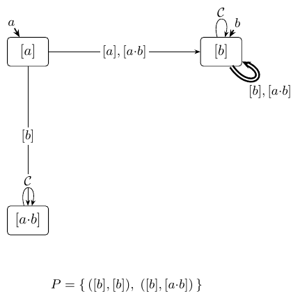

## 6. Necessity: the acceptor-typed learner stalls

The discipline of §3 is not hygiene; this section proves it is the
difference between the algebra and an acceptor. Define the **relaxed
learner**: the same table, closedness, consistency, and harvest — but no
legality checks, no canonicalization, and a hypothesis that is the bare
classifier itself: the classes with their letter action, plus the pair
cache filled on demand. Its prediction on `w·z^ω` is operational — compute
the action orbit `c_j = [ε]·z^j`, take the least `k` with `c_{2k} = c_k`,
answer `P([ε]·(w·z^k), c_k)` — and this is precisely the hypothesis shape
of counterexample-guided ω-learning: a deterministic automaton on classes
with a verdict table, an FDFA in algebraic clothing.

The relaxed learner's error signal is structurally one-sided. Predictions
read the **literal** words of the queried lasso through the action; they
never consult the class of a word *embedded under a left context*. So if
two words `u, v` with `u ≉_L v` are merged, and no harvested column happens
to carry the separating prefix, nothing observable ever goes wrong: every
prediction can be correct, the equivalence oracle assents — and the learner
stops with a partition **coarser than the syntactic congruence**. This is
the obstruction of [AF21] reborn one level up — the table's *columns* are
two-sided, but its *error signal* is not — and it is, we believe, the true
reason no observation-table route to the syntactic algebra existed: the
missing ingredient is not a cleverer column format, but a query the learner
poses on its own initiative. §4.2's escalations are those queries; here we
prove that without them the stall is realized, permanent, and algebraically
fatal.

**The specimens.** The two witnesses were *searched for* rather than
chosen: an exhaustive census of the smallest automaton shapes
(nondeterministic transition-based Büchi over one atomic proposition; at
one state every fixpoint is canonical, so two states are the smallest
possible) finds the permanent stall already at two-letter LTL formulas,
simpler than the classical trivial-right-congruence example `FG(a ∨ Xa)`
[AF21]:

- **`a → Xa`** — if the first letter is `a`, so is the second. A safety
  language, LTL-definable; `N = 5`, and its algebra carries *two* accepting
  idempotents, `[b]` and `[aa]` — right-indistinguishable, separated only
  by the left context `a`, and that is the trap.
- **`a ∧ XG¬a`** — the language of the single ω-word `a·b^ω`; `N = 4`. The
  same trap one step deeper: the canonical `[b·a]` is separated from `[b]`
  only from the left.

<table>
<tr>
<td align="center"></td>
<td align="center"></td>
</tr>
<tr>
<td align="center"><b>(a) <code>a → Xa</code></b> 4 states, <code>Inf(0)</code> (Büchi).</td>
<td align="center"><b>(b) <code>a ∧ XG¬a</code></b> 3 states, <code>Inf(0)</code> (Büchi).</td>
</tr>
<tr>
<td align="center"></td>
<td align="center"></td>
</tr>
<tr>
<td align="center"><b>(c) <code>𝓘(a → Xa)</code></b>, <code>N = 5</code>. Both committed-in stems <code>[b]</code>, <code>[aa]</code> accept with every idempotent loop — six pairs, two stems the stall merges.</td>
<td align="center"><b>(d) <code>𝓘(a ∧ XG¬a)</code></b>, <code>N = 4</code>. A single accepting pair <code>([a],[b])</code> — the one lasso the language contains.</td>
</tr>
</table>

**Figure 4.** The stall specimens: teacher automata (top, edge labels in
the tool's letters) and target invariants (bottom), drawn with Figure 2's
conventions. Proposition 6.1 proves the relaxed learner stops one class
short of each target, certified by an exact oracle.

**Proposition 6.1 (the stall, realized).** Let `L = L(a → Xa)` — if the
first letter is `a`, so is the second — over `Σ = {b, a}`. The relaxed
learner reaches, before its first equivalence query, a closed and
consistent four-class table — `[ε]`, the singleton `⟨a⟩`, a committed-in
class `C₁ = b·Σ* ∪ aa·Σ*`, a committed-out class `C₀ = ab·Σ*` — whose
hypothesis language is exactly `L`. Every equivalence oracle therefore
assents, bounded or exact; the fixpoint is strictly coarser than the
syntactic congruence — four classes against `N = 5`: the two accepting
idempotents `[b]` and `[aa]`, right-indistinguishable but separated by the
left context `x = a`, stay merged inside `C₁`.

*Proof.* Membership of an ω-word depends only on its first two letters, so
on lassos it is a function of the *commitment* of the literal prefix: every
word of `C₁` begins a member, every word of `C₀` begins a non-member, and
the only uncommitted non-empty word is the single letter `a` — the class
`⟨a⟩` is a singleton. The four-class partition is closed and consistent
(`C₁` and `C₀` absorb both letters; `a` steps into one or the other), and
the relaxed learner provably lands on it: every pre-equivalence column has
prefix `x = ε` — the initial column does, and consistency mints preserve
the prefix (Definition 3.2) — and an `x = ε` context evaluates any word of
length ≥ 2 by its commitment alone, so no such column can split `C₁` or
`C₀`; conversely the inconsistency of `a` against `b` at `(ε, ε)` (their
`b`-successors' bits differ) forces the mint `(ε, b)` that isolates `⟨a⟩`.
Now take any lasso `w·z^ω` with predicting pair `s = [ε]·(w·z^k)`,
`e = [ε]·z^k`. The stem `w·z^k` can never be the word `a`: either it is
longer than one letter, or `w = ε` and `z = a` — and there `k = 1` fails
the stabilization test (`[ε]·a = ⟨a⟩` but `[ε]·aa = C₁`), so normalization
takes `k = 2` and the stem is `aa`. Hence `s ∈ {C₁, C₀}` always, and the
prediction — the teacher's bit on `u_s·(u_e)^ω`, with `u_{C₁} = b` and
`u_{C₀} = ab` — equals the commitment of `s`, which equals the truth of the
queried lasso. No counterexample exists. ∎

The second specimen, `a ∧ XG¬a` — the language of the single ω-word
`a·b^ω` — stalls the same way one step deeper, and the same argument proves
it permanent: the canonical `[b·a]` stays merged into `[b]`, again
separated only by `x = a`. There the alive class `{a·b^m}` squares to the
dead class, so the loop idempotent `e` is always dead, and the stem class
`s` stays alive only when the literal `w·z^k` is of the form `a·b^m` —
which forces a pure-`b` loop, on which the keyed lasso `a·(b)^ω` answers
correctly; any stray `a` in the loop drags `s` to dead through the literal
action before the faulty merge can matter — every predicting pair again
answers with the truth, and no counterexample exists. Two exhibits, one
mechanism, and both minimal:

| specimen | `N` | stalled fixpoint | merged pair | separated by | export error (read as `(a, a)`) |
|---|:--:|---|---|:--:|---|
| `a → Xa` | 5 | **4 — zero counterexamples** | `[b] = [aa]`, both accepting idempotents | `x = a` only | rejects `a^ω` |
| `a ∧ XG¬a` | 4 | 3 — one counterexample | `[b] = [b·a]` | `x = a` only | accepts `a^ω` |

**No algebra to export.** "One class short" undersells the defect. Force
the export recipe of §3.2 on the stalled fixpoint of `a → Xa` — the product
`c·c' := c·u_{c'}`, the action of the key — and draw it next to the
canonical algebra (Figure 5):

<table>
<tr>
<td align="center"></td>
<td align="center"></td>
</tr>
<tr>
<td align="center"><b>(a) canonical <code>𝓘(a → Xa)</code></b>, 5 classes (Figure 4(c), repeated for comparison).</td>
<td align="center"><b>(b) the stalled export</b>, 4 classes: <code>⟨b⟩</code> is the merged <code>C₁</code> — the canonical <code>[aa]</code> swallowed — and <code>⟨a·b⟩</code> is <code>C₀</code>.</td>
</tr>
</table>

**Figure 5.** The certified stall, drawn with Figure 2's conventions. The
merge is visible — (a)'s two accepting idempotents `[b]` and `[aa]`, six
pairs, are one node and two pairs in (b) — and what no drawing can show is
the deeper defect, read off (b)'s edges below: its table is *not
associative*.

The stalled table is **not associative**:
`(⟨a⟩·⟨a⟩)·⟨a⟩ = ⟨b⟩·⟨a⟩ = ⟨b⟩`, but `⟨a⟩·(⟨a⟩·⟨a⟩) = ⟨a⟩·⟨b⟩ = ⟨ab⟩`.
The first bracketing reads the literal word `aaa` through the action and
lands where it should; the second substitutes the merged class's key `b`
into the middle of the product — and substituting a key mid-product is
exactly what a merely-right-invariant quotient does not license. The
relaxed hypothesis is immune, because it reads the literal letters of the
queried lasso and never substitutes — that is how one partition carries a
correct acceptor and a broken algebra at once. Broken means broken
downstream: on a non-associative table the linked-pair reduction is
bracketing-dependent, so the export does not even define a *language* — its
verdict depends on how the lasso is written. On [SωS26]'s ladder the defect
sits below the bottom rung: not associative, the export is not a stamp,
hence not an invariant that could be well-formed or not, and its read-off
visibly breaks the one law an invariant's semantics must obey — one lasso,
one verdict [SωS26, Prop 4.1]. Read `a^ω` as the lasso `(ε, a)`:
`e = ⟨a⟩² = ⟨b⟩`, `s = [ε]·e = ⟨b⟩`, the pair `(⟨b⟩,⟨b⟩)` — accept,
agreeing with the teacher. Read the same ω-word as `(a, a)`: the stem class
now multiplies the merged idempotent, `s = ⟨a⟩·⟨b⟩ = ⟨ab⟩`, pair
`(⟨ab⟩,⟨b⟩)` — reject. One ω-word, two verdicts, no language. On the second
specimen the same defect points the other way: the canonical algebra of
`a ∧ XG¬a` keeps `[a]·[a] = [b·a]` as its own non-accepting idempotent, the
stalled export merges it into `⟨b⟩`, and the `(a, a)` reading of `a^ω`
lands on the accepting pair `(⟨a⟩, ⟨b⟩)` — the bit of `a·(b)^ω`, the one
word the language contains — while its `(ε, a)` reading agrees with the
teacher.

Both languages are LTL-definable and utterly plain: the flagship stall is a
two-letter implication, on which the relaxed learner converges and is
certified by a *complete* equivalence oracle. (Mechanically confirmed: the
exact oracle of §2.3 certifies both stalled fixpoints — these permanence
proofs turn the two runs into fixtures for the oracle itself, a
counterexample there being an oracle bug — and with the legality discipline
on, both reach their canonical algebras, byte-equal to the reference.)

The general theorem closes the account: *every* exactly-certified stall is
like these two.

**Theorem 6.2 (certified fixpoints: canonical or no algebra).** Let a
closed, consistent table's relaxed hypothesis be certified by an exact
equivalence oracle — its prediction agrees with `L` on every lasso. Then
the following are equivalent: (i) the stamp-legality check is clean (the
kernel is a congruence, Lemma 3.4); (ii) the export is exactly `𝓘(L)`,
byte-equal after re-keying. In particular a certified *non-canonical*
fixpoint — a permanent stall — is never a congruence: its product
`c·c' = c·u_{c'}` genuinely depends on the choice of keys, and no operation
on its classes recognizes anything. What the relaxed learner delivers is
its operational acceptor — correct — and, provably, nothing more.

*Proof.* (ii)⟹(i): `𝓘(L)`'s classes form a semigroup. (i)⟹(ii): with the
kernel a congruence (Lemma 3.4), the export is an invariant whose lasso
membership is the hypothesis's operational prediction — multiplicativity
makes the action orbit the power sequence, so the stabilized `c_k` is the
idempotent power of `𝒮_T(z)` and the predicting pair is
[SωS26, Def 3.4]'s queried name — and the certification makes it denote
`L`; [SωS26, Cor 4.2] then forces the kernel to refine `≈_L` and the pair
set to be the names of `L`'s accepted lassos. Every split — promotion,
consistency mint, harvest — was witnessed by an Arnold context, so `≈_L`
refines the kernel; the two inclusions pin the kernel to `≈_L`, and the
export is `𝓘(L)` — byte-equal after re-keying (with (i), the product by
letter classes *is* the letter action, so the two BFS orders coincide, and
`P` — teacher bits on keyed lassos — is the forced pair set). *In
particular*: by (i)⟹(ii), a certified fixpoint whose kernel were a
congruence would be canonical; a certified stall is non-canonical, so its
kernel is no congruence, its product depends on keys, and no operation on
its classes recognizes anything. ∎

Note the asymmetry the exactness buys: under a bounded oracle a congruent
relaxed fixpoint may still be a genuine algebra strictly coarser than the
syntactic quotient — a correct-so-far quotient the oracle was too weak to
refute. Exactness closes that door: congruent and certified *forces*
canonical — [SωS26, Cor 4.2]'s *nowhere else*, met from below — so the
legal/relaxed divide is also the algebra/no-algebra divide. Proposition
6.1's non-associative display is Theorem 6.2 made concrete on the smallest
specimen — the display shows *how* the product breaks; the theorem says it
always does.

The section's moral, stated once for the field: the refinement loop that
drives L\* — and every counterexample-guided ω-learner since — has, at a
certified stall, nothing left to react to. What breaks the stall must be a
query the learner poses on its own initiative, and the legality discipline
is the principled source of such queries: not an optimization, but the
difference between learning a language's algebra and learning one of its
acceptors. §7.3 measures how often the difference bites: on half of a
6222-language census, permanently.
