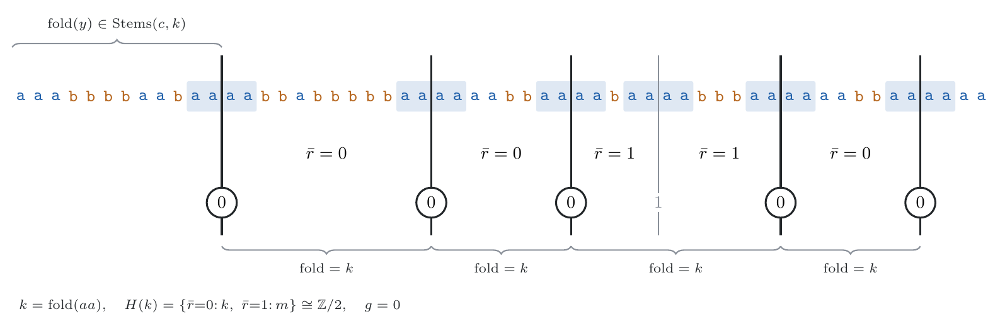
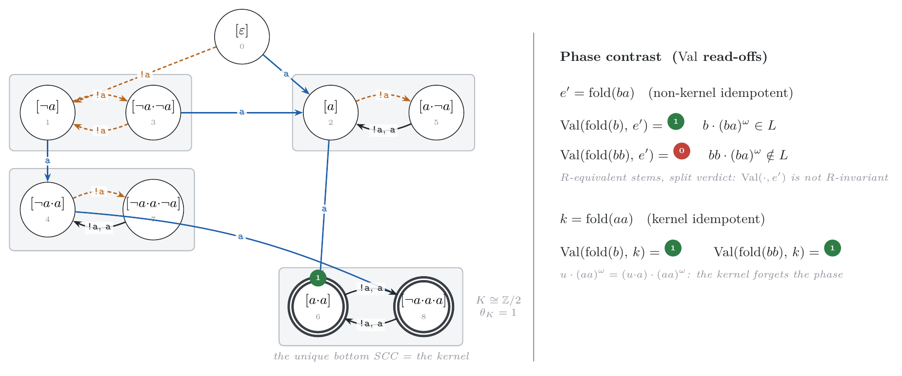
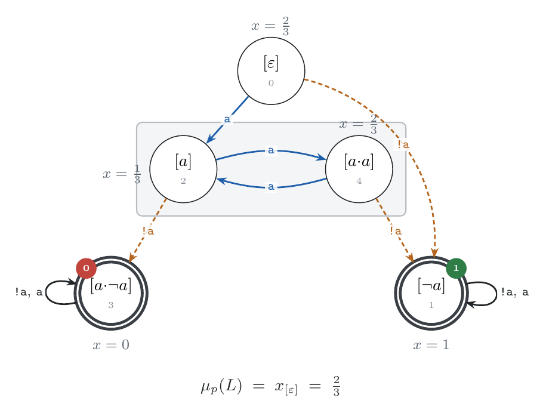

# Measure, Distance, and Entropy on the Syntactic ω-Semigroup

**Yann Thierry-Mieg**

With significant inputs from
**Claude (Anthropic)**

*Working draft — 2026-07-11. Structure complete; §3 (including the
product form 3.5) at full rigor; Figures 1–3 in place (companion
artifact `sos_measure_figs/`); §6 carries ⟨TBD⟩ slots to be filled
from `sos_measure_report.md`.*

## Abstract

The syntactic ω-semigroup of an ω-regular language `L`, reified as the
invariant `𝓘(L) = (𝒞, λ, M, P)`, is by now a computational substrate: the
qualitative toolbox — Boolean operations, decision procedures,
classification — runs on it as surgeries and scans, canonical and
certificate-bearing. This paper adds numbers. The technical heart is a
**generic-verdict theorem**: under any Bernoulli measure with full support
(more generally, along any finite-state Markov source), almost every word
is absorbed into a bottom strongly connected component of the invariant's
right-Cayley graph, and its membership verdict is a single canonical bit
per component — read off by *one* table lookup at an idempotent of the
kernel of the transition semigroup. The proof is two moves on the held
object: a doubled-word cut that factors almost every word over a kernel
idempotent `k`, and a conjugacy argument showing the achievable stems form
a single orbit of the finite group `H(k)`, on which the verdict is
constant. Everything quantitative follows as read-offs. The measure
`μ_p(L)` is one linear system over the rationals — `O(n³)` exact
arithmetic, rationality included, certificate the θ-labeled component map.
The probability that a finite Markov chain satisfies `L` is the same
computation on a product chain: the classical probabilistic-verification
algorithm with the deterministic automaton replaced by the canonical
algebra, normal-formed and shared across a whole verification campaign.
On an aligned table, measure turns the free `xor` into a computable
pseudometric whose null pairs are exactly characterized — and a
one-surgery *shadow* renders every language null-equivalent to a
canonical open one: up to measure, all of ω-regularity is co-safety,
and the topological hierarchies live entirely on null sets. A finer
quotient, by the residual-measure series, yields the *essential form*
— the least, canonical member of each null-class — and decides whether
a language is measure-equivalent to an LTL-definable one. Topological
entropy is one Perron eigenvalue over the live classes — the class set
that already carries the safety hull, so the classical invariance of
entropy under safety closure is visible in the object itself. Each quantity
becomes a census column, and the census of small ω-regular languages
becomes a measured metric space. ⟨TBD: one-sentence headline number from
the census campaign.⟩

## 1. Introduction

Three quantities attach to an ω-regular language `L ⊆ Σ^ω` beyond its
membership relation. Its **measure**: fix a Bernoulli measure `p` on `Σ`
(letters drawn i.i.d.; uniform as default) — what is the probability
`μ_p(L)` that a random word belongs to `L`? Its **distance** to another
language: how much probability mass sits in the symmetric difference
`L₁ Δ L₂`? Its **entropy**: at what exponential rate does the number of
finite prefixes of `L` grow — how fast does the language branch? The
**syntactic ω-semigroup** is the canonical finite algebra Arnold's
congruence assigns to `L`, held as the exportable invariant
`𝓘(L) = (𝒞, λ, M, P)`: a keyed class set, a letter map, a multiplication
table, and the accepting linked pairs [SωS26]. It determines `L` exactly,
and the qualitative calculus [SωSC26] operates the everyday toolbox on it:
complement is a bit-flip, equivalence a byte comparison, classification a
scan.

The quantitative questions matter for three reasons. First, they are the
missing half of the substrate thesis. If the invariant is to replace
automata as *the* held form of a specification, it must answer what
probabilistic model checkers answer: the flagship query of that world —
the probability that a finite-state Markov chain satisfies a linear-time
specification [CY95] — is answered today by product constructions against
a deterministic (or determinized) automaton, an object that is neither
canonical nor stable under the pipeline's rewrites. Second, quantities
compose with the calculus's economy: on one aligned table, the measure of
any Boolean combination of two held languages is available at no further
alignment cost, so regression after a rewrite can report not just
*whether* the language moved (byte comparison) but *how much* (a
distance) — and a census of languages becomes a metric space with
computable geometry. Third, there is a structural payoff independent of
any application: probability *localizes* in the algebra. Almost sure
behavior is kernel behavior — the minimal ideal of the transition
semigroup decides the verdict of almost every word, the transient
structure carries only the arithmetic — and this refines, quantitatively,
the qualitative picture in which the same bottom components carry the
safety hull and the obligation band.

Contributions:

1. **The generic-verdict theorem** (§3): for a.e. word absorbed into a
   bottom SCC `C` of the right-Cayley graph, the membership verdict is a
   constant `θ_C`, computed by one `Val` lookup at any idempotent of the
   kernel; the constant is independent of the entry class, of the chosen
   kernel idempotent, and of the (full-support) measure. The proof —
   a doubled-word factorization and an `H(k)`-orbit conjugacy argument —
   uses only the conjugacy law and classical structure theory of finite
   semigroups. The theorem relativizes to any product with a finite
   Markov chain, the kernel taken in the cycle semigroup of the absorbing
   component (§3.5).
2. **The measure read-off** (§4): `μ_p(L)` is one linear system on the
   held object — polynomially many exact rational operations — with
   rationality as a corollary rather than an import; the **θ-profile**
   (the per-component bit vector) is a new, measure-free canonical
   invariant of `L`, deciding in particular whether `μ_p(L)` is `0`, `1`,
   or strictly between, uniformly over all full-support `p`.
3. **Probabilistic model checking on the canonical spec object** (§4.3):
   `Pr_M(L)` for a labeled Markov chain `M` by the same theorem on the
   product chain — the algorithm of Courcoubetis–Yannakakis [CY95] with
   the automaton replaced by the invariant, inheriting the calculus's
   canonicity dividend (normal form, byte-comparable, one spec object per
   campaign); stationary Markov letter sources subsume the Bernoulli case
   at no extra cost.
4. **Distance and entropy as read-offs** (§4.2, §5): on an aligned table,
   `d_p(L₁, L₂) = μ_p(L₁ Δ L₂)` is computable exactly, is a pseudometric
   whose null pairs are characterized by an all-zero θ-profile of the
   aligned `xor`; a one-surgery **measure shadow** `sh(L)` gives every
   language a canonical open null-equivalent representative — up to
   measure, every ω-regular language is co-safety — and the null-class
   itself is characterized by the residual-measure series, whose
   monoid quotient yields the class's *least* canonical member and
   decides the measure-blind LTL frontier (Theorem 4.4); topological
   entropy is `log ρ` of the letter-count
   matrix restricted to the live classes — one Perron eigenvalue on top
   of the calculus's liveness scan — with Staiger's closure identity
   `h(cl(L)) = h(L)` recovered structurally.
5. **The census as a measured metric space** (§6): measure, θ-profile,
   entropy, and sampled distance geometry as columns of the census of
   small ω-regular languages, under the reproducibility discipline of the
   prior campaigns. ⟨TBD: findings.⟩

§2 recalls the objects and the classical facts we build on. §3 proves the
generic-verdict theorem. §4 derives measure, distance, and the Markov
product. §5 handles entropy. §6 reports the campaign. §7 positions the
work; §8 concludes.

## 2. Background

Nothing in this section is new to this paper; we fix notation and quote
what the proofs consume.

### 2.1 The invariant and its membership oracle

`Σ` is a finite alphabet, `L ⊆ Σ^ω` ω-regular,
`𝓘(L) = (𝒞, λ, M, P)` its syntactic invariant as in [SωS26]: classes `𝒞`
(`n = |𝒞|`, fresh identity `[ε]` adjoined), letter map `λ`, multiplication
table `M`, accepting linked pairs `P`. `S := fold(Σ⁺) ⊆ 𝒞` denotes the
image semigroup and `S¹ := S ∪ {[ε]}`; `fold` is the evaluation of
finite words through `λ` and `M` (`fold(ε) = [ε]`); `idem(d)`, also
written `d^π`, is the unique idempotent power of `d` (`d ≠ [ε]`). A pair
`(s, e)` is **linked** if `e` is idempotent, `e ≠ [ε]`, and `s·e = s`;
`P` is a set of linked pairs. A **cell** is any pair `(c, d)` with
`d ≠ [ε]`, and its **verdict** is the membership oracle
`Val_P(c, d) := (M(c, idem(d)), idem(d)) ∈ P` — total, because the pair
looked up is automatically linked; we drop the subscript when `P` is
fixed. The membership theorem of [SωS26]:
`u·v^ω ∈ L ⟺ Val_P(fold(u), fold(v))`. We use the **strong factoring
theorem** throughout [SωS26; PP04]: for any ω-word `α` and any
factorization `α = w₀·w₁·w₂⋯` whose blocks `w_{j≥1}` all fold to one
idempotent `e`, membership is decided by the associated pair,
`α ∈ L ⟺ (fold(w₀)·e, e) ∈ P`. We also use the **conjugacy law**
[SωSC26, Prop 3.1]: for a linked pair `(s, e)` and any factorization
`e = x·y` (`x, y ∈ S`), the cells `(s, e)` and `(s·x, y·x)` carry one
verdict, the conjugate renormalizing to the linked pair
`((s·x)·f, f)`, `f = (y·x)^π`.

Three conventions complete the kit. Each class carries a canonical
**key**, the shortlex-least word folding to it; "least-keyed" always
refers to this order. We write `1` for `[ε]` in algebraic
computations, and `T¹ := T ∪ {1}` for a subsemigroup `T ⊆ S`. A pair
set `P'` on the table is **saturated** if it is closed under the
renormalized conjugacy moves; a saturated pair set denotes an
ω-regular language `L(P')`, with `Val_{P'}` as its membership oracle,
and **reduce** re-quotients the table by the congruence `Val_{P'}`
induces, returning *the* syntactic invariant of `L(P')` — whose
canonical serialization makes language equality byte equality
[SωSC26, §3.1; SωS26, Thm 5.1].

**The right-Cayley graph** of the invariant has vertex set `𝒞` and edges
`c → c·λ(a)` for `a ∈ Σ`: a complete deterministic automaton with initial
state `[ε]`, canonical because the invariant is. Its SCCs are exactly the
`R`-classes of `𝒞` (mutual right-divisibility), and a *bottom* SCC `C` is
a closed `R`-class: `c·S ⊆ C` for every `c ∈ C` [SωSC26, §6].

### 2.2 Finite semigroups: kernel and maximal groups

Every finite semigroup `S` has a unique minimal two-sided ideal, the
**kernel** `K`, which is completely simple; for every idempotent
`k ∈ K`, the set `H(k) = k·S·k = k·K·k` is a finite group with identity
`k` (Suschkewitsch; see [PP04]). We freely use `k·t·k ∈ H(k)` for
`t ∈ S¹` and the existence, for any `t ∈ K`, of the idempotent
`t^π ∈ K`. A monoid **divides** another if it is a quotient of a
submonoid; division is transitive. `S` is **aperiodic** if it contains
no nontrivial group — equivalently `t^m = t^{m+1}` for some `m`, for
every `t` — a property inherited by divisors; an ω-regular language is
LTL-definable iff its syntactic object is aperiodic [DG08].

### 2.3 Measures on `Σ^ω` and the probabilistic verification problem

Equip `Σ^ω` with the Cantor topology, whose basic open sets are the
cylinders `w·Σ^ω`, and with the Borel σ-field they generate. `cl(L)`
denotes topological closure — the *safety closure* of `L`, computed on
the invariant by the hull surgery of [SωSC26, Prop 6.1]. A
**Bernoulli measure** `p` assigns i.i.d. letters,
`μ_p(w·Σ^ω) = Π p(w_i)`; it has *full support* if `p(a) > 0` for all
`a`. A **labeled Markov chain** `M = (Q, P, ι, ℓ)` is a finite-state
chain — transition matrix `P` (every present transition with positive
probability), initial distribution `ι` — with a letter on each state,
`ℓ : Q → Σ`. This is the classical model of probabilistic
verification [CY95] and the input model of the probabilistic model
checkers. A run `s₀s₁s₂…` (with `s₀ ~ ι`) emits the path word
`ℓ(s₀)ℓ(s₁)ℓ(s₂)…` — the initial state's letter opens the word — and
`Pr_M(L)` is the probability that this word lies in `L`.
(Transition-emitting chains embed: one state per (letter, target)
pair with `ℓ(a, q) = a`, `ι` the first-step distribution; nothing is
lost by reading letters on states.) The **Bernoulli chain** `B_p` has
states `Σ`, `ℓ = id`, and every row of `P` as well as `ι` equal to
`p`; its emitted word is i.i.d. `p`, so `μ_p = Pr_{B_p}`. Both
`μ_p(L)` and `Pr_M(L)` are measurable for
ω-regular `L`, and
computable in polynomial time from a *deterministic* ω-automaton for `L`
by the classical recipe — product with the chain, classification of the
bottom SCCs of the product, one linear system for the absorption
probabilities [CY95, §4.1]. Our §3–§4 re-derive this pipeline with the
canonical algebra in the spec-side seat; no probability theory beyond
Borel–Cantelli and finite Markov chain absorption is needed.

### 2.4 Entropy of an ω-language

The **topological entropy** of `L` is the exponential growth rate of its
prefix set: `h(L) := limsup_n (1/n)·log₂ |pref_n(L)|`, where `pref_n(L)`
is the set of length-`n` finite prefixes of members of `L` (and
`pref(L) := ∪_n pref_n(L)`). This is
Staiger's entropy of an ω-language — defined through the structure
function of the prefix language [Sta93, Eq. (2.3) and p. 168:
`H_F := H_{A(F)}`], itself the classical entropy of symbolic dynamics
read on prefix sets rather than block sets [LM95, Def. 4.1.1]. Two
classical facts we will meet again: for shift spaces presented by
graphs, entropy is the log of the Perron eigenvalue of the adjacency
matrix [LM95, Thm 4.3.1, Thm 4.3.3, and §4.4 for the reducible case];
and the entropy of an ω-language equals that of its topological closure
[Sta93, p. 168]. (Staiger normalizes `log` to base `|Σ|`; we keep
base 2.) We prove what we use in §5, on our own object.

## 3. The generic-verdict theorem

Throughout, `p` is a full-support Bernoulli measure on `Σ`. A random word
`α` walks the right-Cayley graph; since the graph is finite and complete,
the walk almost surely enters a bottom SCC, which it then never leaves —
we say `α` is **absorbed** in the bottom SCC `C`, **entering at** `c ∈ C`
(the first class of the walk lying in `C`).
The entry time is a stopping time, so the tail after entry is again an
i.i.d. word. Fix once and for all the kernel `K` of `S` and an idempotent
`k ∈ K`; fix a word `w ∈ Σ⁺` with `fold(w) = k` (every class is the fold
of some word; pick `w₀` folding into `K` and replace it by the power
whose fold is idempotent — `K` is closed under powers).

For `c ∈ 𝒞` and idempotent `k`, write
`Stems(c, k) := c·S¹·k = { c·t·k : t ∈ S¹ }` — the **achievable stems**.
Every `s ∈ Stems(c, k)` satisfies `s·k = s`, so `(s, k)` is a linked pair
and `Val(s, k) = ((s, k) ∈ P)`.

### 3.1 Almost every word factors over a kernel idempotent

**Lemma 3.1 (doubled-word cut).** For a.e. `α` absorbed in `C` entering
at `c`, there is a factorization `α = y·z₁·z₂⋯` with `fold(z_i) = k` for
all `i` and `fold(y) ∈ Stems(c, k)`; consequently
`α ∈ L ⟺ Val(fold(y), k)`.

*Proof.* Partition the tail after entry into consecutive blocks of length
`2|w|`; writing `p(w) := Π_i p(w_i)`, each block equals `w·w` with
probability `p(w)² > 0`, independently, so
by Borel–Cantelli the tail a.s. contains infinitely many disjoint
occurrences of `w·w`. Cut at the *midpoints* of these occurrences. Every
inter-cut block starts and ends with a full `w`, hence folds into
`k·S¹·k = H(k)` — a finite group (§2.2); this is the point of doubling
`w` (a block guaranteed to *end* with `w` folds only into `S¹·k`, where
no group structure is available). The cumulative products of the block
folds live in `H(k)` and take finitely many values, so some value `g`
recurs along an infinite set `J` of cut points; between consecutive
`J`-cuts the blocks multiply to `g^{-1}·g = k` — *exactly* the identity,
by group inverses. Take the `z_i` to be the inter-`J`-cut blocks and `y` the
prefix of `α` up to the first `J`-cut. Writing `y = u·y'` with `u` the
entry prefix (`fold(u) = c`), the tail part `y'` ends with a full `w`,
so `fold(y) = c·fold(y') ∈ c·S¹·k`. The strong factoring theorem (§2.1)
gives `α ∈ L ⟺ (fold(y)·k, k) ∈ P`, i.e. `Val(fold(y), k)`. ∎



**Figure 2 (the doubled-word cut, run on one word).** Lemma 3.1's
mechanism on a uniformly sampled length-56 word over the §3.4 example
language ("some `a` at infinitely many even positions"), whose kernel
idempotent is `k = fold(aa)` with `H(k) ≅ ℤ/2` — so folds in `H(k)`
render as parities. Disjoint occurrences of the doubled word
`w·w = aaaa` are highlighted and cut at their midpoints (bars); each
inter-cut block reads `w·x·w` and folds into `H(k)`, its parity
printed beneath; the cumulative product is a running XOR, and the cuts
where it hits the recurring value are circled — the `J`-cuts — between
which the blocks fold to `k` exactly (brackets), including across the
one excursion (two parity-`1` blocks about a non-`J` cut whose product
returns to `k`). Left of the first cut, the stem folds into
`Stems(c, k)`. A reader who follows the ruler has re-run the proof.

### 3.2 The achievable stems form one `H(k)`-orbit

**Lemma 3.2 (stem invariance).** Let `C` be a closed `R`-class,
`c ∈ C`, `k ∈ K` idempotent. Then `Val(·, k)` is constant on
`Stems(c, k)`.

*Proof.* Let `s₁, s₂ ∈ Stems(c, k)`. Closedness puts both in `C`, so
`s₁ R s₂` and `s₂ = s₁·u` for some `u ∈ S¹` (if `u = 1` there is nothing
to prove). Since `s₁·k = s₁` and `s₂·k = s₂`:

```
s₂ = s₁·u·k = s₁·k·u·k = s₁·m,        m := k·u·k ∈ H(k).
```

Factor the loop as `k = m·m^{-1}` — the identity of the group `H(k)` —
and apply the conjugacy law (§2.1) to the linked pair `(s₁, k)`: the
cells `(s₁, k)` and `(s₁·m, m^{-1}·m) = (s₂, k)` carry one verdict, the
renormalization being trivial because `m^{-1}·m = k` is already
idempotent. ∎

The mechanism deserves one line of intuition: `s₁·k^ω` and
`(s₁·m)·k^ω` are *the same ω-word class* — a phase inside the kernel
group is invisible at infinity. This is exactly where the argument
evades the standard obstruction that `R` is not a right congruence: the
multiplier connecting two achievable stems can always be *chosen inside*
`H(k)`, and there conjugacy cancels it.

### 3.3 The bit is canonical

**Lemma 3.3.** The common value of Lemma 3.2 depends neither on the
entry class within `C` nor on the choice of `k`:

1. for `c, c' ∈ C`: `c' ∈ c·S¹` by `R`-equivalence, so
   `Stems(c', k) = c'·S¹·k ⊆ c·S¹·k = Stems(c, k)`; both sets carry a
   constant `Val(·, k)` (Lemma 3.2), so the constants agree;
2. for `c ∈ C` and idempotents `k, k' ∈ K`, set `g := k·k'·k ∈ H(k)` and let
   `g^{-1}` be its group inverse. With `x := g^{-1}·k'` and `y := k'·k`:
   `x·y = g^{-1}·(k·k'·k) = g^{-1}·g = k` (using `g^{-1}·k = g^{-1}`),
   while `y·x = (k'·k)·(g^{-1}·k') = k'·g^{-1}·k' ∈ H(k')` (using
   `k·g^{-1} = g^{-1}`) has idempotent power `k'`, the identity of the
   group `H(k')`. The
   conjugacy law transports the cell `(c·k, k)` to a cell with loop `k'`
   and stem `c·g^{-1}·k' ∈ Stems(c, k')`, where Lemma 3.2 applies. ∎

**Definition.** For a bottom SCC `C` of the right-Cayley graph, the
**generic verdict** of `C` is

```
θ_C := Val(c, k)          any c ∈ C, any idempotent k ∈ K
```

— one table lookup (`Val(c, k) = ((c·k, k) ∈ P)`, and `c·k` is itself an
achievable stem).

### 3.4 The theorem

**Theorem 3.4 (generic verdict).** For a.e. `α` (any full-support
Bernoulli `p`): `1_{α ∈ L} = θ_C`, where `C` is the bottom SCC absorbing
`α`'s walk. Consequently

```
μ_p(L) = Σ_C θ_C · Pr[absorption in C],
```

and the absorption probabilities solve the standard transient system
`x_c = Σ_a p(a)·x_{c·λ(a)}` with boundary `x_c = θ_C` on bottom SCCs:
`μ_p(L) = x_{[ε]}`, a system of at most `n` rational linear equations.

*Proof.* Lemmas 3.1–3.3: a.e. absorbed word has its verdict computed at
a cell `(s, k)` with `s ∈ Stems(c, k)`, where `Val` is the constant
`θ_C`. The decomposition of `μ_p(L)` over the (a.s. exhaustive,
disjoint) absorption events and the linear system for absorption
probabilities are classical finite-chain facts. ∎

Two corollaries are worth displaying. **Rationality**: `μ_p(L) ∈ ℚ` for
rational `p`, by Gaussian elimination — a by-product of the read-off
rather than a quotation from the automata-side theory.
**Measure-freeness of the profile**: the bit vector `(θ_C)` over bottom
SCCs — the **θ-profile** of `L` — is computed without any reference to
`p`; since every full-support `p` charges every bottom SCC positively,
whether `μ_p(L)` is `0`, `1`, or strictly interior is the same for all
full-support `p`, decided by the profile being all-`0`, all-`1`, or
mixed.

**Example (a kernel with a group: phases, and why only the kernel
forgets them).** Over `Σ = {a, b}`, let
`L` = "some `a` occurs at infinitely many even positions". Its
syntactic invariant has eight non-identity classes, transparently coded
as pairs `(r, E)` — `r ∈ ℤ/2` the word's length parity, `E ⊆ ℤ/2` the
set of parities of offsets carrying an `a` — with `λ(a) = (1, {0})`,
`λ(b) = (1, ∅)` and

```
(r, E) · (r', F)  =  (r + r',  E ∪ (F + r)).
```

(Each coordinate is observable — `r` by a sliding loop, each flag of
`E` by a shifted loop — so no two classes merge.) The idempotents are
exactly the `(0, F)`, and a linked pair `((r, E), (0, F))` is accepting
iff `r ∈ F`: the stem's parity decides which of the loop's `a`-offsets
land on even global positions, and `E` is irrelevant — `L` is
prefix-independent. The kernel is

```
K = { (0, {0,1}), (1, {0,1}) } ≅ ℤ/2,
```

a single closed `R`-class, hence the unique bottom SCC; its idempotent
is `k = (0, {0,1}) = fold(aa)`, and `H(k) = K` is a genuine group.

The stem-phase worry that Lemma 3.2 dissolves is *real* for non-kernel
loops. The class `e' = (0, {1}) = fold(ba)` is idempotent, and
`Val(·, e')` is exactly the stem's parity: `b·(ba)^ω ∈ L` (its `a`'s
sit at positions 2, 4, …) while `bb·(ba)^ω ∉ L` (positions 3, 5, …) —
although `fold(b)` and `fold(bb)` are `R`-equivalent. So `Val(·, e')`
is not an `R`-class function, and no generic-verdict statement could
hold at `e'`. On the kernel loop the phase is forgotten, exactly as
Lemma 3.2 forces: the achievable stems `(0,{0,1})` and `(1,{0,1})`
differ by `m = (1,{0,1}) ∈ H(k)` with `m·m = k`, and the conjugacy
`k = m·m^{-1}` is, in words, the re-bracketing
`u·(aa)^ω = (u·a)·(aa)^ω`. Indeed `Val((r, E), k) = (r ∈ {0,1})` is
identically true: `θ_K = 1` and `μ_p(L) = 1` for every full-support
`p`. A word like `(ba)^ω`, which threads its `a`'s onto odd positions
forever, lives precisely in the null set that avoids the doubled word
`aaaa`; and the complement flips `P`, hence the bit: `μ_p(L^c) = 0`.



**Figure 3 (the kernel group and the phase contrast).** The example's
two halves. Left: the right-Cayley graph of the nine classes `(r, E)`
plus `[ε]` (solid blue = step under `a`, dashed amber = under `b`,
grey boxes = SCCs; nodes carry canonical shortlex keys, here
`K = {[a·a], [¬a·a·a]}`); the unique bottom SCC is the kernel
`K ≅ ℤ/2` (double circles, thick borders), verdict `θ_K = 1`, so
`μ_p(L) = 1` for every full-support `p`. Right: the phase contrast —
the non-kernel idempotent `e' = fold(ba)` *splits* the `R`-equivalent
stems `fold(b)` and `fold(bb)` (`b·(ba)^ω ∈ L`, `bb·(ba)^ω ∉ L`), so
`Val(·, e')` is not an `R`-class function; the kernel loop
`k = fold(aa)` *merges* them, the re-bracketing
`u·(aa)^ω = (u·a)·(aa)^ω` forgetting the phase exactly as Lemma 3.2
forces.

### 3.5 The product form: Markov chains and Markov sources

Theorem 3.4 relativizes to the product with a finite labeled Markov
chain `M`; the only change is *where the kernel is taken* — the tail is
no longer free to realize every word, only those labeling cycles at a
recurrent state, so the kernel moves to the semigroup of those cycles.
The **label** of a finite path `q₀q₁…q_m` of `M` is the word
`ℓ(q₁)⋯ℓ(q_m)` read on the states the path *enters* (the start's
letter belongs to the preceding step, so labels of consecutive paths
concatenate); the emitted word of a run is `ℓ(s₀)` followed by the
label of its path.

**Theorem 3.5.** Let `M` be a finite labeled Markov chain, and form the
product chain on the reachable part of `states(M) × 𝒞` (the chain moves
by `M`, the second coordinate folds the letter of the state entered,
starting at `(s₀, λ(ℓ(s₀)))` with `s₀ ~ ι`). Let `B` be a bottom SCC
of the product, `q̂` a state of `M` occurring in `B`, and

```
T := { fold(z) : z labels a cycle of M at q̂ }
```

— a finite subsemigroup of `S`. Let `k` be an idempotent in the kernel
of `T`, and fix a cycle `γ` of `M` at `q̂` whose label `w` folds to `k`.
Then for a.e. run absorbed in `B`, the emitted word's verdict is the
constant `θ_B := Val(c, k)` (any `(q̂, c) ∈ B`), and
`Pr_M(L) = Σ_B θ_B · Pr[absorption in B]`, one linear system on the
product chain.

*Proof.* After entry the product run stays in `B` (a bottom SCC is
closed) and a.s. visits every state of `B` infinitely often
(finite-chain recurrence). Closedness has a consequence used silently
below: from any `(q̂, c) ∈ B`, traversing *any* cycle of `M` at `q̂`
keeps the product run inside `B`.

*(i) The cycle semigroup and its kernel.* Cycles of `M` at `q̂` exist
(`M` is finite and every state has a successor) and concatenate, so `T`
is a finite subsemigroup of `S`, and §2.2 applies to it. The pair
`(γ, k)` of the statement exists: any element of `T`'s kernel is
`fold(label(γ₀))` for some cycle `γ₀` at `q̂`; powers of `γ₀` are again
cycles, and the power whose label folds idempotently stays in the
kernel.

*(ii) Infinitely many doubled cycles.* `γ·γ` is a cycle at `q̂`
traversed, from `q̂`, with probability `δ > 0` (the product of its
transition probabilities — note the event is that the run follows the
*transitions* of `γ·γ`, not merely that it emits `w·w`: labels need not
determine the successor). Define stopping times `σ₁ < σ₂ < ⋯`: `σ₁` the
first visit of the product run to first coordinate `q̂` after
absorption, `σ_{i+1}` the first such visit at least `2|w|` steps after
`σ_i` — each a.s. finite by recurrence. By the strong Markov property
the events `A_i` = "the run traverses `γ·γ` starting at `σ_i`" satisfy
`Pr[A_i | F_{σ_i}] = δ` (`F_{σ_i}` the σ-field of the run up to
`σ_i`), so by the conditional Borel–Cantelli lemma
a.s. infinitely many `A_i` occur; each success emits `w·w` from first
coordinate `q̂`, and the successes are disjoint.

*(iii) Blocks fold in a group; pigeonhole.* Cut the emitted word at the
midpoints `σ_i + |w|` of the successful traversals; at each cut the
chain sits at `q̂` (`γ` is a cycle). An inter-cut block is therefore
emitted along a path of `M` from `q̂` to `q̂`, and reads `w·x·w` with `x`
the label of a cycle at `q̂`: its fold lies in `k·T¹·k = H_T(k)`, the
maximal group at `k` in `T` — a group because `k` lies in `T`'s kernel.
Exactly as in Lemma 3.1: the cumulative block products take finitely
many values in `H_T(k)`; a value recurring along an infinite set `J` of
cuts makes the inter-`J` blocks fold to `k` exactly.

*(iv) Stem invariance.* At a `J`-cut the product run sits at `(q̂, s)`,
where `s` is the fold of the entire emitted prefix, and `s·k = s`
(the prefix ends with `w`). So every achievable stem lies in
`Stems_B := { s : (q̂, s) ∈ B, s·k = s }`, and the run's verdict is
`Val(s, k)` by the strong factoring theorem. `Val(·, k)` is constant on
`Stems_B`: for `s, s' ∈ Stems_B`, strong connectivity of `B` gives a product
path `(q̂, s) → (q̂, s')`, whose emitted word `z` labels a cycle of `M`
at `q̂`; hence `fold(z) ∈ T` and

```
s' = s'·k = s·fold(z)·k = s·(k·fold(z)·k) = s·m,      m ∈ H_T(k),
```

and the conjugacy law with `k = m·m^{-1}` transports `(s, k)` to
`(s', k)` as in Lemma 3.2. Finally, for any `(q̂, c) ∈ B`, traversing
`γ` from `(q̂, c)` shows `(q̂, c·k) ∈ B`, so `c·k ∈ Stems_B` and
`θ_B = Val(c·k, k) = Val(c, k)` — the displayed one-lookup formula.

*(v) Well-definedness.* Two choices of the data `(q̂, k, γ)`
each equate, on a full-measure set of runs absorbed in `B`, the
indicator `1_{α ∈ L}` with their constant; the intersection of the two
sets has full measure, so the constants coincide. The decomposition
`Pr_M(L) = Σ_B θ_B · Pr[absorption in B]` and the linear system are the
classical absorption facts, now with exact boundary bits. ∎

Two consequences. `Pr_M(L)` — the flagship query of probabilistic model
checking [CY95] — is computable with the *canonical* object on the spec
side: polynomial in `|M|·n`, exact rational arithmetic, the spec held
once per campaign, byte-comparable across rewrites, every verdict
certificate-bearing (the θ-labeled product-component map). And a
**stationary Markov letter source** is just such an `M`, so the measure
of `L` under Markov (not merely Bernoulli) sources is the same read-off;
Theorem 3.4 is the case `M = B_p` (§2.3).

## 4. Measure and distance read-offs

### 4.1 The algorithm

On the held invariant, computing `μ_p(L)`:

1. SCC pass on the right-Cayley graph, `O(n·|Σ|)` (shared with the
   calculus's hull/obligation scans); identify bottom SCCs.
2. Kernel idempotent: the two-sided Cayley graph on `S` (edges
   `c → λ(a)·c` and `c → c·λ(a)`) has SCCs the `J`-classes and a unique
   bottom SCC — the minimum of the `J`-order, which is the kernel `K`
   [PP04]; take any `t ∈ K` and `k := idem(t)` (`K` is closed under
   powers). `O(n·|Σ|)`.
3. `θ_C := Val(c, k)` for one representative `c` per bottom SCC —
   `O(1)` lookups each.
4. Solve the transient linear system over `ℚ`; `μ_p(L) = x_{[ε]}`.
   Polynomially many arithmetic operations on rationals of polynomial
   bit size (fraction-free Gaussian elimination).

The certificate is the θ-labeled bottom-SCC map plus the linear system
itself; a checker replays steps 3–4 independently of steps 1–2.

**Example (the read-off, end to end).** Over `Σ = {a, b}`, let
`L` = "`b` occurs, and the first `b` is at an even position". Five
classes: `[ε]`; the `b`-free classes `A₁ = fold(a)`, `A₀ = fold(aa)`
(odd/even length); and the absorbing classes `F₀ = fold(b)`,
`F₁ = fold(ab)` (first `b` at even/odd position; `F_i·x = F_i`), with
`P = {(F₀, A₀), (F₀, F₀), (F₀, F₁)}`. The steps of the algorithm:

1. Bottom SCCs: `{F₀}` and `{F₁}`; the pair `{A₀, A₁}` is a transient
   SCC (the two classes exchange under `a` and exit under `b`).
2. The two-sided graph's unique sink is `K = {F₀, F₁}` — the kernel
   here *spans both bottom SCCs*, which are its two `R`-classes. Both
   elements are idempotent; the least-keyed is `k = F₀`.
3. `θ_{F₀} = Val(F₀, F₀) = 1` and `θ_{F₁} = Val(F₁, F₀) =
   ((F₁, F₀) ∈ P) = 0`: one global `k` serves both components, each
   lookup staying inside its own closed `R`-class (`F₁·F₀ = F₁`).
4. With letter probabilities `(p_a, p_b)` the transient system is
   `x_{A₁} = p_a·x_{A₀}`, `x_{A₀} = p_a·x_{A₁} + p_b`,
   `x_{[ε]} = p_a·x_{A₁} + p_b`, giving

   ```
   μ_p(L)  =  x_{[ε]}  =  p_b / (1 − p_a²)
   ```

   — `2/3` at uniform — matching the direct series
   `Σ_j p_a^{2j}·p_b`. The certificate is the labeled map
   `{F₀} ↦ 1, {F₁} ↦ 0` together with the `2×2` system; a checker
   replays it without re-deriving the SCC structure.



**Figure 1 (the worked read-off, end to end).** The whole algorithm in
one picture, on the example above (nodes carry canonical shortlex
keys: `A₁ = [a]`, `A₀ = [a·a]`, `F₀ = [¬a]`, `F₁ = [a·¬a]`). The
transient SCC `{A₀, A₁}` is boxed — the `a`-edges exchange its two
classes, the `b`-edges exit; the bottom SCCs `{F₀}` and `{F₁}` are
double-circled with self-loops on both letters. The kernel *spans both
bottom SCCs* — its two `R`-classes — so both carry the thick border:
one global idempotent `k = F₀` serves both components, each `θ`-lookup
staying inside its own closed `R`-class. Badges give `θ_{F₀} = 1`,
`θ_{F₁} = 0`; under each class its exact value at uniform `p` —
`x_{[ε]} = 2/3`, `x_{A₁} = 1/3`, `x_{A₀} = 2/3`, `x_{F₀} = 1`,
`x_{F₁} = 0` — and the read-off is `μ_p(L) = x_{[ε]} = 2/3`.

### 4.2 Distance on an aligned table

For `L₁, L₂` held on one aligned table [SωSC26, §3.3], the pair set of
`L₁ Δ L₂` is the free surgery `P₁ xor P₂`, and

```
d_p(L₁, L₂) := μ_p(L₁ Δ L₂)
```

is computable by §4.1 on the same table. `d_p` is a **pseudometric**
(symmetry and triangle inequality from measure additivity), not a
metric: ω-regular null sets exist, and `d_p(L₁, L₂) = 0` iff the
θ-profile of the aligned `xor` is all-zero — by Theorem 3.4, a
language has measure zero iff its θ-profile is all-zero, every bottom
component being charged — a decidable, `p`-free
characterization of "the disagreement is measure-null". That is a
feature, not a defect: exact separation remains the byte comparison of
the reduced invariants, while `d_p` measures the *mass* of the
disagreement, and the two verdicts together distinguish "different but
almost surely agreeing" from "different where it counts". Uses:
quantitative regression after a rewrite (the byte test says *whether*
the language moved, `d_p` says *how much*); nearest-neighbor queries in
the census ("the closest LTL-definable language to this non-LTL one" is
a scan); weighting of counterexamples (the minimal witness of
[SωSC26, Prop 3.2] is the *shortest* disagreement, `d_p` its mass).

**The measure shadow.** The zero set of `d_p` has a canonical witness.
On the invariant of `L`, let `D := ∪ { C bottom SCC : θ_C = 1 }` — a
union of closed `R`-classes, itself closed under right multiplication —
and

```
P_sh := { (s, e) ∈ linked : s ∈ D },        sh(L) := L(P_sh).
```

**Proposition 4.1 (the shadow).** (i) `P_sh` is saturated, and
`sh(L) = W_D·Σ^ω` with `W_D = { u ∈ Σ⁺ : fold(u) ∈ D }`: an *open*
ω-regular language on the same table. (ii) `μ_p(L Δ sh(L)) = 0` for
every full-support `p`; the construction is `p`-free and idempotent.
(iii) `d_p(L₁, L₂) = d_p(sh(L₁), sh(L₂))`, and byte-equality of the
reduced shadows implies `d_p(L₁, L₂) = 0` — a sufficient zero test
needing no alignment.

*Proof.* (i) Let `C_D := { α : some finite prefix of α folds into D }`
— evidently `W_D·Σ^ω` and open. We show `C_D` is pair-determined with
pair set `P_sh`; this yields the language identity and saturation at
once, membership being word-semantic. Take a Ramsey factorization
`α = w₀·w₁·⋯` with idempotent block image `e` and associated pair
`(s, e)`, `s = fold(w₀)·e`; every boundary prefix `w₀⋯w_k` (`k ≥ 1`)
folds to `s`. If `s ∈ D`, the boundary prefixes witness `α ∈ C_D`.
Conversely, if some prefix `q` folds into `D`, extend `q` to a boundary
prefix: its fold `s` is a right multiple of `fold(q)`, and `D` is
closed, so `s ∈ D`. (ii) For a.e. `α`, absorbed in bottom SCC `C₀`:
`1_L(α) = θ_{C₀}` (Theorem 3.4). If `θ_{C₀} = 1`, then `C₀ ⊆ D` and
the walk enters `D`. If `θ_{C₀} = 0`, the walk never enters `D`:
entering the closed set `D` means being absorbed inside it,
contradicting `C₀ ⊄ D`. So `1_{sh(L)} = θ_{C₀} = 1_L` a.e., under
every full-support `p`. Idempotence: on the same table, the θ-bits of
`P_sh` are `[C ⊆ D] = θ_C`, so the shadow of the shadow has the same
`D`. (iii) `|1_{L₁} − 1_{L₂}| = |1_{sh(L₁)} − 1_{sh(L₂)}|` a.e., and
equal reduced invariants denote equal languages. ∎

Part (i)'s argument uses only that `D` is a union of bottom SCCs of
the graph at hand — closed under right multiplication — not where its
bits came from; Theorem 4.4 will reuse it verbatim on a quotient of
the table.

**Corollary 4.2 (measure-blind topology).** Every ω-regular language
differs by a null set from an *open* — co-safety — ω-regular language
on its own table (its shadow), and dually from a closed one (flip,
shadow, flip). Up to measure, the safety-progress ladder and the
Wagner hierarchy collapse to their first rung: topological hardness is
carried entirely by null sets.

A warning: `sh` is canonical *given* `L`, but it is not a complete
invariant of the null-class. Over `Σ = {a, b}`, the languages
`Σ*·b·Σ^ω` and `Σ^ω` differ by the null set `{a^ω}` yet have distinct
reduced shadows — the never-absorbed words form a null set that
depends on the table, and `sh` excludes them. The *exact* zero test
remains the aligned xor-profile above. What does characterize the
null-class is one level more quantitative:

**Proposition 4.3 (the null-class is the residual-measure series).**
For ω-regular `L₁, L₂` and a full-support Bernoulli `p`:
`μ_p(L₁ Δ L₂) = 0` iff `μ_p(u⁻¹L₁) = μ_p(u⁻¹L₂)` for every `u ∈ Σ*`.
Moreover `μ_p(u⁻¹L) = x_{fold(u)}`, the solution vector of Theorem 3.4
extended by `x_c := θ_C` on bottom classes — so the null-class of `L`
is carried by a `ℚ`-weighted word series realized on `L`'s own table.

*Proof.* (⇒) `u⁻¹L₁ Δ u⁻¹L₂ = u⁻¹(L₁ Δ L₂)`, and
`p(u)·μ_p(u⁻¹(L₁ Δ L₂)) = μ_p((L₁ Δ L₂) ∩ u·Σ^ω) = 0` with
`p(u) > 0`. (⇐) The finite measures `E ↦ μ_p(L_i ∩ E)` agree on the
π-system of cylinders (`μ_p(L_i ∩ u·Σ^ω) = p(u)·μ_p(u⁻¹L_i)`), hence
on all Borel sets; taking `E = L₁^c` gives
`μ_p(L₂ ∩ L₁^c) = μ_p(L₁ ∩ L₁^c) = 0`, and symmetrically — so
`μ_p(L₁ Δ L₂) = 0`. For the rooted measure: `u⁻¹L` is the rooting
`P_{fold(u)}` on the same table, and Theorem 3.4 started at `fold(u)`
is the same chain. ∎

The series does more than characterize the class: quotienting `L`'s
monoid by it produces the class's canonical member and decides its
logic. Fix a full-support rational `p` (uniform as the convention),
let `x` be the vector of Theorem 3.4 extended by `x_c := θ_C` on
bottom classes, let `≈` be the syntactic congruence of the map
`c ↦ x_c` — `c ≈ c'` iff `x(w·c·z) = x(w·c'·z)` for all
`w, z ∈ 𝒞¹` — and let `M_x := 𝒞/≈` be the quotient monoid, `x̄` the
induced map.

**Theorem 4.4 (the essential form).**

1. *(least recognizer)* `M_x` divides the syntactic monoid of every
   member of the null-class of `L`.
2. *(canonical member)* On the right-Cayley graph of `M_x`, `x̄` is
   constant with value in `{0, 1}` on every bottom SCC. With `D̄` the
   union of the value-`1` ones,

   ```
   ess(L)  :=  { α : some finite prefix of α folds into D̄ }
   ```

   — the shadow construction of Proposition 4.1, performed on the
   quotient — is a member of the null-class, its syntactic monoid is
   exactly `M_x`, and it depends only on the class: for any ω-regular
   `L₁, L₂`, `μ_p(L₁ Δ L₂) = 0` iff the reduced invariants of
   `ess(L₁)` and `ess(L₂)` are byte-equal.
3. *(the measure-blind LTL frontier is decidable)* The null-class of
   `L` contains an LTL-definable language iff `M_x` is aperiodic — a
   `p`-free condition — and in that case `ess(L)` is itself an LTL
   witness.

*Proof.* (1) Every member `L''` has residual-measure series `x`
(Prop 4.3), and the series factors through `L''`'s syntactic morphism
— Arnold's congruence refines residual equality [SωSC26, §6], so
`u ↦ μ_p(u⁻¹L'')` depends only on the syntactic class of `u`. Taking
`≈` on `Σ*` (`u ≈ v` iff `x(w·u·z) = x(w·v·z)` for all finite
`w, z`), the congruence therefore contains the syntactic congruence of
`L''`, so `Σ*/≈` is a quotient of `M(L'')`; and `Σ*/≈ = 𝒞/≈ = M_x`
because `x` already factors through `𝒞`.

(2) *Constancy.* Let `C̄` be a bottom SCC of the quotient graph and
`[c] ∈ C̄`. The upstairs walk from `c` reaches some bottom SCC `C` of
`𝒞`, whose image — reachable from `[c]` — lies inside `C̄`
(bottomness). For `c' ∈ C`, `x(c') = θ_C`; and any state of `C̄` is
reachable from `[c']`, say as `[c'·t]`, with `c'·t ∈ C` by
closedness, so `x̄ = θ_C` there. Hence `x̄ ≡ θ_C ∈ {0, 1}` on all of
`C̄` (and every original bottom SCC mapping into `C̄` carries the
same bit). *Membership.* `x̄` is harmonic on the quotient chain —
`x̄([c]) = Σ_a p(a)·x̄([c]·[λ(a)])`, inherited from `x` termwise — and
agrees with the `{0,1}` boundary on the quotient-bottom SCCs, so on
the transients it satisfies the same nonsingular system as the
absorption probability into `D̄`:
`x̄([c]) = Pr[the quotient walk from [c] enters D̄]`. The portability
remark after Proposition 4.1 makes `ess(L)` an open ω-regular
language with pair set `{(s̄, ē) linked : s̄ ∈ D̄}`, recognized by
`M_x`; its residual measures are exactly
`u ↦ x̄([fold(u)]) = x(fold(u))` — the residual at `u` is the
absorption event restarted at `[fold(u)]`, `D̄` being closed — i.e.
the series of `L`, so `ess(L)` is in the class by Prop 4.3. Its syntactic monoid divides `M_x`
(recognition) and is divided by it (part 1), hence equals it.
Canonicality: `ess(L)` is built from the series alone, and the series
is a complete invariant of the class (Prop 4.3).

(3) (⇒) An LTL member has aperiodic syntactic monoid [DG08], which
`M_x` divides (part 1), and divisors of aperiodic monoids are
aperiodic. (⇐) If `M_x` is aperiodic, `ess(L)`'s syntactic monoid is
aperiodic (part 2), so `ess(L)` is LTL-definable [DG08]. The frontier
bit is `p`-free: the null-class itself is `p`-free (the xor-profile
test never reads `p`), and if `M_x` at one full-support `p` is
aperiodic then the class has an LTL member, so `M_x` at any other
full-support `p'` divides that member's aperiodic monoid. ∎

Three remarks. **The warning is repaired**: the essential form is a
*complete* canonical invariant of the null-class where the shadow was
only sufficient — on the warning's pair, the series is constantly `1`,
`M_x` is trivial, and `ess(Σ*·b·Σ^ω) = ess(Σ^ω) = Σ^ω`. In
particular the exact `d_p = 0` quotient of a census is computed with
*no pairwise work at all*: one `ess` per language, byte dedup.
**The frontier genuinely cuts through the non-aperiodic languages.**
"Some `b` at an even position" (non-aperiodic, `μ = 1`) is
null-equivalent to `Σ^ω`; but the §4.1 example "first `b` at an even
position" is not null-LTL: `≈` merges `[ε]` with the neutral class
`A₀` and nothing else (`x(A₀) = 2/3 ≠ 1/3 = x(A₁)`), so
`M_x = {1̄, A₁, F₀, F₁}` retains the parity group `{1̄, A₁} ≅ ℤ/2`
and is not aperiodic. The direct argument agrees: an aperiodic `L'`
has `fold(a^j)` eventually constant, while
`μ_p((a^{j}·b)⁻¹L)` must alternate between `1` and `0`.
**And the last apparent parameter is not one** — an accidental
coincidence of values at one measure could in principle coarsen `≈`;
it cannot:

**Proposition 4.5 (measure-independence).** `≈` is the same congruence
for every full-support Bernoulli measure. Hence `M_x`, `ess(L)`, and
the byte test of Theorem 4.4 do not depend on the chosen `p` — uniform
is a convention, not a parameter.

*Proof.* Write `≈_p, ≈_{p'}` for the congruences at two full-support
measures and `≈∧ := ≈_p ∩ ≈_{p'}`, a congruence of `𝒞` with quotient
`M∧`. For every member `L''` of the null-class, *both* residual-measure
series factor through `L''`'s syntactic morphism, so — as in the proof
of Theorem 4.4(1), run at the two measures at once — `M∧` divides
`M(L'')`. Apply this to the member `ess_p(L)`, whose syntactic monoid
is exactly `M_{x^p}` (Theorem 4.4(2)): `M∧` divides `M_{x^p}`, so
`|M∧| ≤ |M_{x^p}|`. But `≈∧ ⊆ ≈_p` makes `M_{x^p}` a quotient of
`M∧`, so `|M_{x^p}| ≤ |M∧|`. The sizes are equal, the canonical
surjection `M∧ ↠ M_{x^p}` is therefore a bijection, and `≈∧ = ≈_p`;
symmetrically `≈∧ = ≈_{p'}`. ∎

The mechanism deserves the one-line reading: an accidental coincidence
at one measure would mint a class member whose monoid is too small to
carry the series at any other measure, contradicting least
recognition there. With this, the essential form is *unconditionally*
canonical, and the account of the null-class is complete: a
byte-comparable canonical form, its least recognizer, and its decided
LTL frontier, all measure-free. The construction is also the promised
beachhead of the weighted direction (§7): `M_x` is precisely the
syntactic object of a `ℚ`-weighted series, arrived at from purely
Boolean questions.

### 4.3 The verification pipeline

The applied shape of Theorem 3.5: a specification held once as `𝓘(L)`,
checked against a family of chains `M₁, M₂, …` — one product and one
linear system each, the spec side never re-translated, re-determinized,
or re-simplified; qualitative queries (emptiness of the product support,
witness lassos) and the quantitative `Pr_{M_i}(L)` read off the same
product. ⟨TBD: a worked pipeline — one spec, a family of chains,
wall-clock and canonicity dividends against the automata-side
baseline.⟩ Markov decision processes stay out of scope: optimization
over schedulers is a branching problem, the same wall the qualitative
calculus refuses.

## 5. Entropy

Call a class `c ∈ 𝒞` **live** if some word folding to `c` is a prefix
of a member of `L` — equivalently every such word, prefixhood depending
only on the class; `Live ⊆ 𝒞` is computed by the `O(n²)` scan of
[SωSC26, §6], and liveness propagates to prefixes (a prefix of a live
word is live).

**Proposition 5.1.** Let `A` be the `Live × Live` letter-count matrix,
`A[c][c'] = |{a : c·λ(a) = c'}|`. For nonempty `L`:
`h(L) = log₂ ρ(A)`, with `ρ(A)` the spectral radius of `A`.
Moreover `h(cl(L)) = h(L)`.

*Proof.* `pref(L) = { u : fold(u) ∈ Live }` by definition of liveness.
Since liveness propagates to prefixes, every state on a path from `[ε]`
to a live state is itself live: `|pref_n(L)|` is exactly the number of
length-`n` paths from `[ε]` staying inside `Live` (note `[ε] ∈ Live`
iff `L ≠ ∅`). The growth rate of this path count is `log₂ ρ(A)`: at
most, because the entries of `A^n` are bounded by `poly(n)·ρ(A)^n` for
any nonnegative matrix; at least, because `ρ(A)` is attained on some
irreducible diagonal block of `A` [LM95, §4.4], every live class — in
particular one of that block's — is reachable from `[ε]` through live
classes (every class is the fold of some word, and its prefixes fold
live), and the path count inside an irreducible block grows as
`ρ^n` [LM95, Thm 4.3.1]. For the closure: `cl(L)` is the set of words
all of whose prefixes are live [SωSC26, Prop 6.1], so
`pref(cl(L)) = pref(L)` — a live word extends to a member of `cl(L)` by
König's lemma — and the two entropies are growth rates of one prefix
set. ∎

The closure identity is classical — Staiger derives `H_F = H_{cl(F)}`
directly from `A(cl(F)) = A(F)` [Sta93, p. 168] — and our proof is the
same identity read on the invariant; what the proposition adds is the
*read-off*: `pref(L)` is recognized by the right-Cayley DFA with
accepting set `Live`, so the entropy rides the same `O(n²)` liveness
scan that already computes the safety hull, with no pruning or
co-reachability analysis (co-reachability to `Live` *is* `Live`).

Conventions and refinements: `h(∅) := 0` (Staiger's convention
[Sta93, Eq. (2.3)]; [LM95] uses `−∞` — empty `Live` either way);
`h(L) ≤ log₂|Σ|` always, with equality iff `Live` supports the full
branching; entropy is monotone under inclusion (prefix sets nest); on
an aligned table the *relative*
entropy of `L₁` inside `L₂` (growth of `pref(L₁ ∩ L₂)` against
`pref(L₂)`) is the same computation on the product's live part. Unlike
§3–§4, the eigenvalue is algebraic rather than rational; the read-off
reports a certified enclosure, and the *certificate* is the `Live`
submatrix itself. ⟨TBD: census distribution of entropies per Wagner
degree — do higher degrees concentrate at full entropy?⟩

## 6. The census as a measured metric space

⟨TBD: (i) measure and θ-profile columns over the census, distribution
per Wagner degree and per safety-progress band; (ii) the conjectured
concentration of measure-0/1 in the safety/co-safety rungs, tested;
(iii) entropy distribution per degree; (iv) the *exact* metric geometry
of the census: the `d_p = 0` quotient computed in full (all μ-0
languages collapse to one point and all μ-1 languages to another —
`μ(L) = μ(L') = 1` forces `μ(L Δ L') = 0` — so only the
strictly-interior languages can separate; the exact classes are the
byte-classes of the reduced essential forms, Theorem 4.4, with the
aligned xor-profile re-checking a sample), followed by exhaustive
all-pairs distances between class representatives per alphabet slice —
diameter, distance distribution, clustering by degree,
nearest-LTL-neighbor; (v) the measure-blind LTL frontier column: how
many non-LTL census languages are null-equivalent to LTL ones;
(vi) the pipeline demonstration of §4.3 with its baseline
comparison.⟩

## 7. Related work

**Probabilistic verification.** The measure of an ω-regular property
against a Markov chain is classical: Vardi [Var85] posed the problem and
solved qualitative ("probability 1") verification by the
automata-theoretic route; Courcoubetis–Yannakakis [CY95] settled the
complexity of both qualitative and quantitative verification, with the
recipe §2.3 recalls — product with a deterministic automaton,
recurrent-class analysis, linear system (their §4.1). The textbook
consolidation is [BK08, Ch. 10: the product of a Markov chain with a
deterministic Rabin automaton, accepting-BSCC analysis], and the
industrial embodiment PRISM ⟨Kwiatkowska–Norman–Parker 2011,
*PRISM 4.0*, CAV — pending library⟩. Our Theorem 3.5 changes none of the
asymptotics and does not intend to: the contribution is *which object
sits on the spec side* — canonical, normal-formed after every surgery,
byte-comparable, shared across a campaign — and the generic-verdict
theorem showing the canonical object suffices, deterministically, with
certificates. Measure-1 satisfaction as a notion of correctness
("fairly correct systems") is studied in [VV06]; the θ-profile gives
that notion a canonical carrier (all-1 profile ⟺ fairly correct under
every full-support noise model), and the shadow of §4.2 gives every
specification a canonical open representative that is fairly
equivalent to it.

**Measure and entropy of ω-languages.** The entropy machinery is
symbolic dynamics: block-growth entropy and its Perron-eigenvalue
computation for graph and sofic presentations are [LM95, Ch. 4]; the
prefix-set entropy of ω-languages, its finite-state theory, and the
closure identity `H_F = H_{cl(F)}` are Staiger's [Sta93, §2].
Rationality of `μ_p(L)` we re-derive (§3.4), with [CY95]
as the classical carrier. Our §5 is thus a transposition of classical
facts onto the canonical object; the new content is the identification
`pref(L) = Live` — entropy as a one-eigenvalue read-off over the same
class set the calculus's hull theory already computes.

**The algebraic line.** The syntactic ω-semigroup and its structure
theory are [PP04]; the Wagner-degree and chain machinery on the algebra
is Carton–Perrin [CP97, CP99] and Selivanov–Wagner [SW08], which the
qualitative calculus already exploits. The present paper adds, to our
knowledge, the first *probabilistic* exploitation of the syntactic
algebra: the localization of almost-sure behavior in the kernel
(Theorem 3.4) appears to be new in this form, though its ingredients —
Ramsey-type factorizations, the group structure of `H(k)` — are
classical [PP04].

**Quantitative semantics.** Weighted/quantitative languages in the
sense of ⟨Chatterjee–Doyen–Henzinger 2010, *Quantitative languages*,
ACM ToCL — pending library⟩ generalize the verdict beyond Booleans; §3's
proof is an invocation of conjugacy-invariance, so any semiring
respecting the conjugacy law inherits the generic-verdict mechanism —
we leave the weighted canonical object as future work.

## 8. Conclusion

The generic-verdict theorem localizes almost-sure membership in the
kernel of the syntactic ω-semigroup: one canonical bit per absorbing
component, one lookup each. Everything a probabilistic toolbox asks of a
specification then rides the invariant — measure, model-checking
probability, distance, entropy — in exact arithmetic, with certificates,
on an object that never needs re-simplification. The distance layer
goes further than a number: every null-class carries a canonical least
member, the essential form, so measure-equivalence is a byte test and
the measure-blind LTL frontier a decided question. The exponential
frontier of the calculus is untouched (entry still costs
determinization; MDP optimization stays refused), and the quantitative
layer inherits the same honesty: every quantity is a read-off precisely
because the qualitative object already paid for canonicity. Open
directions: the weighted invariant (semiring-valued `Val` under the
conjugacy law), Hausdorff dimension and finer fractal data alongside
entropy, and the census geometry as an instrument for conjecture-hunting
on the exact — not measure-blind — LTL frontier.

## References

- [BK08] C. Baier, J.-P. Katoen. *Principles of Model Checking.* MIT
  Press, 2008.
- [CP97] O. Carton, D. Perrin. *Chains and superchains for ω-rational
  sets, automata and semigroups.* Int. J. Algebra Comput.
  7(6):673–695, 1997.
- [CP99] O. Carton, D. Perrin. *The Wagner hierarchy.* Int. J. Algebra
  Comput., 1999.
- [CY95] C. Courcoubetis, M. Yannakakis. *The complexity of
  probabilistic verification.* J. ACM 42(4), 1995.
- [DG08] V. Diekert, P. Gastin. *First-order definable languages.* In
  *Logic and Automata: History and Perspectives*, Amsterdam University
  Press, 2008.
- [LM95] D. Lind, B. Marcus. *An Introduction to Symbolic Dynamics and
  Coding.* Cambridge University Press, 1995.
- [PP04] D. Perrin, J.-É. Pin. *Infinite Words: Automata, Semigroups,
  Logic and Games.* Elsevier, 2004.
- [Sta93] L. Staiger. *Kolmogorov complexity and Hausdorff dimension.*
  Inform. Comput. 103(2):159–194, 1993.
- [SW08] V. Selivanov, K. Wagner. *Complexity of topological properties
  of regular ω-languages.* Fund. Inform., 2008.
- [Var85] M. Y. Vardi. *Automatic verification of probabilistic
  concurrent finite-state programs.* FOCS 1985, pp. 327–338.
- [VV06] D. Varacca, H. Völzer. *Temporal logics and model checking for
  fairly correct systems.* LICS 2006.
- [SωS26], [SωSC26], [SωSX26], [SωSN26]: the project's own line;
  [SωSC26] is the calculus paper (`sos_calculus.md`), the others as
  cited there.

⟨Draft note: the two bracketed placeholders in §7 — PRISM 4.0
(Kwiatkowska–Norman–Parker, CAV 2011) and *Quantitative languages*
(Chatterjee–Doyen–Henzinger, ACM ToCL 2010) — await consultation before
becoming citations.⟩
