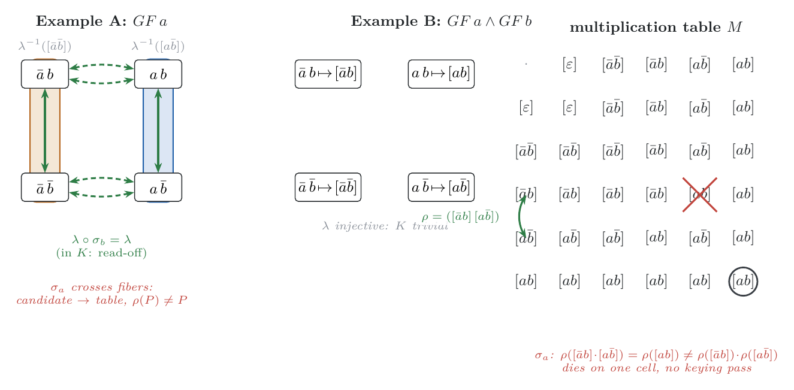

# Figures for *Symmetries on the Syntactic ω-Semigroup*

The figure artifact for [`../sos_symmetry.md`](../sos_symmetry.md), built to
the commission in [`../sos_symmetry_figures.md`](../sos_symmetry_figures.md).
Every node, edge, tag and label of FIG-1/FIG-2 is data a probe produced;
placement is the only thing hard-coded. FIG-3 is the sanctioned schema
exception (no data).

## State

| figure | file | state |
|---|---|---|
| FIG-1 | `img/fig1_levels.png` | **built** — probe `tests.symmetry.figs.fig1` |
| FIG-2 | — | not yet built (EvenHead gap triptych; uses the SY4 fallback) |
| FIG-3 | — | not yet built (envelope schema, hand layout) |

## Drawing conventions

Shared with `sos_toltl_figs/figures.md`, defined once in
[`../../sosl/tests/symmetry/figs/tikz.py`](../../sosl/tests/symmetry/figs/tikz.py):

- solid blue = a Cayley step under `a`; dashed amber = a step under `¬a`;
  black = both letters agree (hue *and* dash pattern, so the figures survive
  greyscale);
- **green double arrow** (`perm`) = a signed permutation's action on classes
  (solid when the action stays in the kernel, i.e. within a λ-fiber; dashed
  when it is a candidate that must go to the table);
- **red cross** (`xfail`) on a cell = the multiplicativity failure of a
  candidate automorphism;
- **hatched region** (`gap`) = a gap language `L♯ ∖ L♭` (used by FIG-2);
- a fat λ-fiber is a tinted rounded hull; an accepting linked pair is
  ringed near-black.

## FIG-1 — kernel vs `Aut`: the two-level structure (paper §3.1)



One look separates the two levels of Theorem 3.1. **Left (Example A, `GF a`):**
the 2-AP minterm square splits into two fat λ-fibers — the `¬a`-face ↦ `[¬a¬b]`
(the class `N`) and the `a`-face ↦ `[a¬b]` (the class `F`). The flip `σ_b` is a
green arrow *within* each fiber (`λ∘σ_b = λ` — a kernel read-off, symmetric
without any search); the flip `σ_a` is dashed green *crossing* the fibers — a
candidate that must go to the table, and there fails. **Right (Example B,
`GF a ∧ GF b`):** `λ` is injective, so the kernel is trivial (four singleton
fibers). On the 5-class multiplication table the swap `a ↔ b` acts as the
automorphism `ρ = ([¬ab]\,[a¬b])` fixing the accepting pair `([ab],[ab])`
(double-ringed); the flip `σ_a`'s forced images break multiplicativity on a
single cell — `ρ([¬ab]·[a¬b]) = ρ([ab]) ≠ ρ([¬ab])·ρ([a¬b])` — red-crossed:
most non-symmetries die on one table cell, before any keying pass.

The table (not the Cayley view) was chosen for the right panel because the
multiplicativity failure is a per-cell property and reads off the table
directly. The narrated failure cell is the product of the two classes the
*swap* exchanges, tying the two panels together; the probe asserts that cell
genuinely fails.

*Provenance.* Data from `fixtures.load("FIX_A")` / `fixtures.load("FIX_B")`
(bundled as `sources/FIX_A.sos`, `sources/FIX_B.sos`) and `sosl.sos.symmetry`
(SY1). Read-offs the probe prints and the figure draws (`§9` acceptance
oracle): FIX_A `|C|=3`, `P={(F,F)}`, `inert={b}`, `σ_b ∈ K` and symmetric,
`σ_a` not; FIX_B `|C|=5`, `P={(C,C)}`, `inert=∅`, swap symmetric, `σ_a` not,
first multiplicativity failure at the swap's moved pair `[¬ab]·[a¬b]`. All
consistent with §9 P1/P2/P3.

```sh
python3 -m tests.symmetry.figs.fig1 \
  research_notes/sos_symmetry_figs/sources/fig1_levels.tex   # run from sosl/
```

Called with no path the probe prints its read-offs (the cheapest number
check); with a path it writes the TikZ the `.pdf`/`.png` are rasterized from
(`pdflatex` + `pdftoppm -r 200`).
