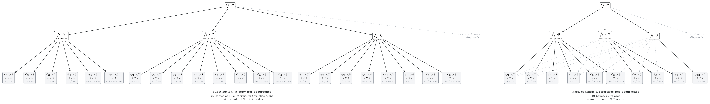
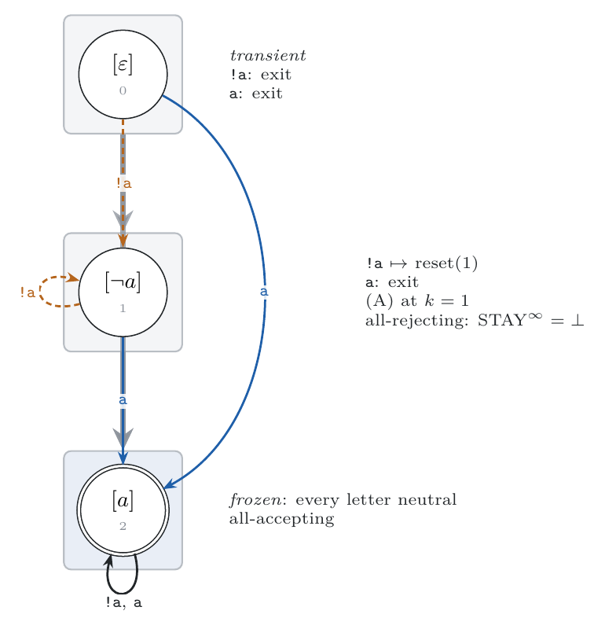
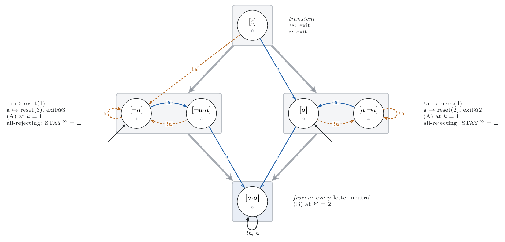
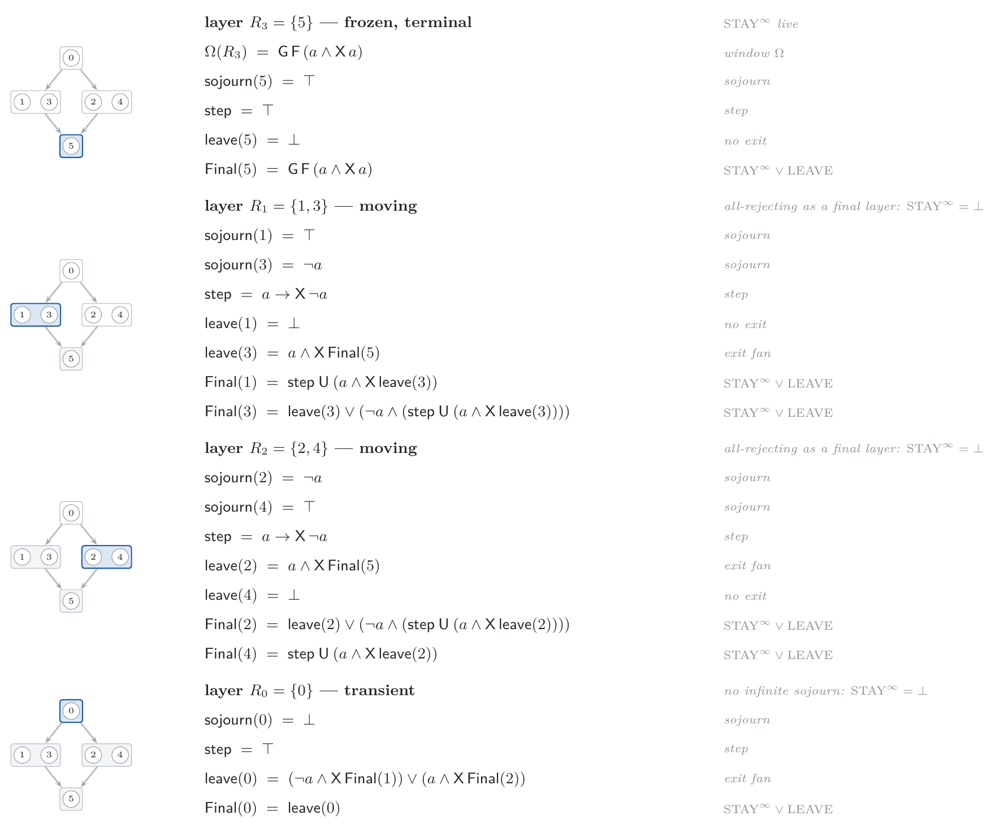

# The LTL Frontier from the Syntactic ω-Semigroup: Certificates, Formulas, and the Shape of the Cut

**Yann Thierry-Mieg**

With significant inputs from
**Claude (Anthropic)**

*Working draft — 2026-07-09 — placeholders marked `⟨TBD: …⟩`*

## Abstract

LTL-definability of an ω-regular language `L` is one read-off of its
syntactic ω-semigroup — aperiodicity — and that object is now constructible
from any deterministic automaton [SωS26]. This paper builds what lies on
either side of the verdict,
from the invariant `𝓘(L) = (𝒞, λ, M, P)` alone. On the non-LTL side: a
portable certificate — a family of lassos whose membership toggles mod
`p > 1` — extracted by three scans of the multiplication table, provably
total, and checkable by membership queries against any acceptor of `L`. On
the LTL side: a defining formula, extracted as a *transcription* of the
invariant's own deterministic machine — the right Cayley graph of
`S(L)₊¹` — rather than by the generic, and explosive, local-divisor
induction of Diekert and Gastin [DG08]. Two decidable equations on the
table — *anchoring* and *window-determinacy*, governing the stem and loop
coordinates of the accepting pair — yield an exactness theorem: under them
the width-1 transcription defines `L`, with no equivalence oracle, and a
graded extension covers higher widths. The two
engines are Arnold's two context shapes. Extraction is output-polynomial as a
class-indexed DAG; flattening it is the language's own intrinsic cost,
which we measure, bound, and, in a definitional output format, avoid. An
exhaustive census of 3 938 small canonical languages maps both
frontiers empirically, and shows neither certificate shape is universal:
ω-blind languages exist — groups only linear contexts can see — so the
certificate's two-shape scan is forced by the languages themselves.

---

## 1. Introduction

The classical chain `LTL = FO[<] = star-free = aperiodic` [Kam68, Sch65,
Tho79, Per84, DG08] makes LTL-definability of an ω-regular language `L` a property
of one canonical object: the syntactic ω-semigroup `S(L)`, aperiodic exactly
when `L` is LTL. For four decades the chain was a classification without a
workflow — the object was never built. It now is [SωS26]. The verdict is a
table lookup: power-iterate every class of the multiplication table; a cycle of
period `> 1` is a group, and the language is not LTL; no cycle, and it is.

This paper is about the day after the verdict. A verdict, alone, satisfies
nobody:

- If `L` is **not** LTL, the user holds a specification (typically PSL/SERE,
  where mod-`p` counting enters through an innocuous `{·}[*2]`) and deserves a
  *witness*: a concrete, portable, independently checkable certificate of the
  group — which words, pumped how, flip membership forever.
- If `L` **is** LTL, the user deserves the *formula*. Existence has been known
  since Kamp; the only effective route from an algebra, the local-divisor
  induction of Diekert and Gastin [DG08, §8], recalled in §2.3, is a proof of
  doability — blind to the structure of its input, never implemented against a
  real object, and explosive by construction: on the six-class algebra of
  the running example `GF(aa)`, the memoized recursion is a 1 287-node
  shared DAG whose flat unfolding is 1 991 717 nodes (§2.3).

Both rebuilds consume the same input, and the problem, stated once, is:

```
Input:   the invariant 𝓘(L) = (𝒞, λ, M, P) of [SωS26] — classes keyed by
         shortlex representatives, letter map, multiplication table,
         accepting linked pairs.
Output:  L not LTL — a counting-family certificate, checkable by lasso
         membership queries against any acceptor of L (§3);
         L LTL     — a defining formula, φ = L, as a class-indexed DAG
         with flat and definitional renderings (§4–§6).
```

The non-LTL side is the shorter story and is closed in §3. The LTL side is
the body of the paper, and its thesis is:

**The formula should be a *transcription* of the canonical object, not the
residue of a generic induction.** The invariant contains, as read-offs, every
structural fact a formula must express — which letters the language actually
distinguishes (`λ`), where it sits on the safety–progress ladder (`P`'s
closure structure), whether prefixes matter at all (the residual count),
where runs commit irrevocably (absorbing classes), and, we show, *which parts
of the language are expressible by flat temporal bricks and which genuinely
need nesting*. An extraction that consults these read-offs emits formulas
whose shape mirrors the language's shape; one that does not — DG's — pays for
its blindness in output size, and the paper quantifies the difference.

The engine of the transcription is a *phase discipline* on the canonical
deterministic machine inside the invariant — the right Cayley graph of
`S(L)₊¹`, whose states are the classes and whose walk computes the class of
every prefix. The machine is transcribed into a fixed vocabulary of flat
LTL bricks — anchored laws, sojourns, parks, exit chains — *exactly*, with
no equivalence oracle, whenever the class occupied by the walk (its
*phase*) is recoverable from the last `k` letters of the word, modulo
stuttering. Every ingredient of the discipline is a named algebraic object
(§4): the machine's components are the R-classes of the monoid, its
anchors are reset actions, stuttering is locally neutral action, the
park/fairness dichotomy is the linked pairs of `P`, and the graded window
ladder is a ladder of definiteness equations on the multiplication table.
Each precondition is an equation on `𝓘(L)`, decided once, on the canonical
object; whether a language transcribes flatly, and at which width, is
therefore itself a definability property of `L` (§4.5). Under the two
preconditions the width-1 transcription is exact by construction (§4.2);
its graded extension to higher anchoring width (§4.3) is exact away from
a near-entry seam, closed there by the committed base case and the scoped
fallback (§4.3, correction). That exactness theorem is one of the paper's
two central technical claims.

The second claim is the structural split of §5.1: the class walk
transcribes exactly the
*linear* half of Arnold's congruence, and where the walk freezes with
acceptance still open — which for a prefix-independent language is
essentially everywhere — the remaining content is exactly the *ω-power* half,
requiring its own engine with `GF`/`FG`-shaped templates read off `P`.
**Arnold's two context shapes, which [SωS26] computed as two relations,
resurface in extraction as two engines.**

**Contributions.**
1. The frontier, both directions, from one object: the aperiodicity verdict
   with, on failure, a portable non-LTL witness certificate (§3), and, on
   success, a defining formula (§4–§7).
2. A presentation-independent transcription engine targeting the accepting
   pair `(s, e)`: the walk on the right Cayley graph of `S(L)₊¹` (layers =
   R-classes) transcribes the stem coordinate under an anchoring condition
   (A), and — the walk provably cannot carry the loop coordinate (Lemma
   4.2) — a window engine transcribes `e` under a determinacy condition
   (B), relaxed on anchored layers by a vocabulary of parks (B̃); the
   conditions are equations on the object, and together they
   yield exactness by construction, assembled end to end as
   Theorem 5.13 (§4–§5).
3. The deliverable split, stated as a result: extraction is
   output-polynomial as a class-indexed DAG; the flat formula is the
   language's intrinsic cost,
   bounded by the R-depth and until-rank read-offs, and avoidable in a
   definitional format (§6).
4. The inner frontier: within LTL, the algebra grades which layers admit
   flat transcription and which demand nesting, with the until-rank as a
   per-language lower-bound certificate on formula depth (§7; the
   lower-bound leg is conditional on an ω-word transfer of the
   Thérien–Wilke characterization, an obligation §2.2 states explicitly).
5. An exhaustive census of small ω-regular languages — 3 938
   canonical invariants, language-keyed — mapping both frontiers
   empirically: where each precondition holds and at which width, where
   the fallback strata first switch on, which certificate shapes are
   available — including the ω-blind languages, whose groups only linear
   contexts can see (§3.3, §8).

**Outline.** §2 fixes notation (§2.1), recalls the syntactic
ω-semigroup, its invariant, and the running examples of [SωS26]
(§2.2), and recalls the Diekert–Gastin extraction (§2.3). The rest of
the paper follows the title's three nouns. *Certificates*: the non-LTL
witness family, its extraction and its verification contract (§3).
*Formulas*: the walk engine (§4) and the window engine with the
combinators and the assembled extractor (§5), then the deliverable
formats and the size results (§6). *The shape of the cut*: the inner
frontier the two preconditions grade inside LTL (§7). §8 evaluates
everything on the census; §9 and §10 close with related work and open
problems.

## 2. Background: the object and its read-offs

§2.1 fixes notation and the classical notions. §2.2 recalls, from
[SωS26], the syntactic ω-semigroup and its reified invariant — the
paper's sole input — with the running examples, whose tables every
derivation below can be checked against. §2.3 recalls the one prior
route from an aperiodic algebra to a formula, which the extraction of
§4–§5 is designed against.

### 2.1 Notions from the literature

**Words and formulas.** Fix a finite set `AP` of atomic propositions
and let `Σ = 2^{AP}` — a letter is the set of propositions true at an
instant; over one proposition we write the two letters `a` and `!a`.
An ω-word is `α = α₀α₁⋯ ∈ Σ^ω`, and `α_{≥i} = α_i α_{i+1} ⋯` its
suffix at position `i`. LTL formulas are

```
φ  ::=  p  |  ¬φ  |  φ ∧ φ  |  X φ  |  φ U φ          (p ∈ AP)
```

with satisfaction at a position defined by induction:

```
α, i ⊨ p      iff  p ∈ α_i
α, i ⊨ ¬φ     iff  α, i ⊭ φ            α, i ⊨ φ ∧ ψ   iff  both hold at i
α, i ⊨ X φ    iff  α, i+1 ⊨ φ
α, i ⊨ φ U ψ  iff  α, j ⊨ ψ for some j ≥ i, and α, l ⊨ φ for all i ≤ l < j
```

`φ = { α : α, 0 ⊨ φ }` is the language of `φ`, and the derived
operators are the usual `∨`, `F φ = ⊤ U φ` (eventually),
`G φ = ¬F¬φ` (always), and weak until `φ W ψ = (φ U ψ) ∨ G φ`;
`GF`/`FG` name the recurrence and persistence shapes. Two conventions
run through every formula below. A *letter* `σ ∈ Σ` used as a formula
abbreviates its cube `⋀_{p ∈ σ} p ∧ ⋀_{p ∉ σ} ¬p` — "the current
letter is `σ`". A *set* `S ⊆ Σ` used as a formula denotes the Boolean
formula over `AP` whose satisfying valuations are exactly `S`; the
disjunction of the cubes is one presentation of it, never the emitted
one — the renderer synthesizes a minimized form (`b` for the
`b`-letters, `⊤` for `S = Σ`), and that synthesis is load-bearing:
it is what lets a full guard collapse so that `S U ψ` reappears as
`⊤ U ψ = F ψ` over alphabets of any width. And satisfaction is
**future-only**: `α, i ⊨ φ` depends
only on the suffix `α_{≥i}` (immediate induction on `φ`), so
`α, i ⊨ φ ⟺ α_{≥i}, 0 ⊨ φ`. LTLf is the
same syntax evaluated on non-empty finite words, `X` demanding that a
next position exist [DV13]. On the algebra
side [PP04]: an element `e` is *idempotent* if `e·e = e`; every element
`d` of a finite semigroup has a unique idempotent among its powers,
written `d^π`; a *linked pair* is `(s, e)` with `s·e = s` and `e`
idempotent. Every ω-word `α` admits a *Ramsey factorization*
`α = u·w₁w₂⋯` in which all merged blocks `w_i⋯w_j` fall in one
idempotent class `e` and all prefixes `u·w₁⋯w_j` in one class `s` — the
*induced* linked pair `(s, e)` [PP04]. Green's R-preorder is
`s ≤_R t ⟺ s ∈ t·S¹`; an *R-class* is a class of mutual
R-reachability, and the *R-depth* of a monoid is its longest strict
`≤_R`-chain. A finite semigroup is *aperiodic* if `x^{n+1} = x^n` for
some `n` and all `x` — equivalently, no subset forms a non-trivial
group; a deterministic automaton is *counter-free* when its transition
monoid is aperiodic [MP71]. One convention of [SωS26] we lean on: the
class set `𝒞` below *already contains* the adjoined unit `[ε]`, so
`(𝒞, M)` is the unital monoid `S(L)₊¹`; ranges that exclude the unit are
written `𝒞 \ {[ε]}` explicitly.

### 2.2 The syntactic ω-semigroup and its invariant

**Arnold's congruence [Arn85].** Two finite words are interchangeable
for `L` when swapping one for the other inside any lasso never changes
membership. A lasso being a stem followed by a repeated loop, the
mutation can sit in only two places — in the stem, with a loop appended
to make the word infinite, or inside the loop — and these are Arnold's
two context shapes: `u ≈_L v` iff

```
(linear)     ∀ x, y ∈ Σ*, t ∈ Σ⁺ :   x·u·y·t^ω ∈ L  ⟺  x·v·y·t^ω ∈ L
(ω-power)    ∀ x, y ∈ Σ*         :   x·(u·y)^ω  ∈ L  ⟺  x·(v·y)^ω  ∈ L
```

Arnold proves that `≈_L` has finite index, that its quotient, completed
with the linked-pair data, is a finite ω-semigroup recognizing `L`, and
that it is the coarsest congruence saturating `L` — hence canonical: any
two acceptors of `L` yield the same quotient. That quotient
`S(L)₊ = Σ⁺/≈_L`, with its completion, is the **syntactic ω-semigroup**
`S(L)`. The two shapes are genuinely independent — a prefix-independent
language is blind to every linear context ([SωS26, Prop 4.6]; §3.1 below
makes this an extraction fact) — so neither may be dropped. [SωS26]
constructs `S(L)` from any deterministic Emerson–Lei automaton, in two
moves this paper never re-enters (an acceptance-enriched transition
monoid, and a right-computable factorization of the two shapes into two
relations `~lin` / `~ω`), and reifies it as the invariant this paper
consumes:

**The invariant.** `𝓘(L) = (𝒞, λ, M, P)`: finite class set `𝒞` with a fresh
identity `[ε]` (adjoined unconditionally — every other class carries a
non-empty shortlex key), letter map `λ : Σ → 𝒞`, multiplication table
`M : 𝒞 × 𝒞 → 𝒞`, accepting linked pairs `P ⊆ 𝒞 × 𝒞`. Membership of a lasso
`u·v^ω`: fold `u, v` through `λ` and `M`, iterate the loop class to its
idempotent `e`, and accept iff `(u-class·e, e) ∈ P`. Two languages are equal
iff their invariants are byte-equal [SωS26, Thm 5.1].

**Read-offs used below** (each a polynomial scan of the table):
- *aperiodicity* — no power orbit of period `> 1`; the frontier verdict.
- *the letter quotient* — `λ` collapses letters the language never
  distinguishes; extraction works over `λ(Σ)` and restores atomic
  propositions last.
- *the ladder position* — safety / co-safety / obligation / recurrence /
  persistence / reactivity [MP92] as closure conditions on `P`
  [SωS26, §7.1]; deciding a language's level is classical [Lan69].
- *residual count* — one residual ⟺ prefix-independent ⟺ the linear half
  is blind [SωS26, Prop 4.6].
- *absorbing classes* — two-sided zeros; runs that reach them have committed.
- *until-rank* — the minimal until-nesting depth, computable from the
  syntactic semigroup: level `k` of the until hierarchy is characterized
  by a `k`-fold semidirect power of the level-1 variety
  (Thérien–Wilke's effective characterization [TW96], surveyed in
  [Wil99, Thm 8]); a lower bound on the depth of any defining formula.
  ⟨TBD: freeze the exact semigroup condition from [TW96] — and note the
  characterization is stated on finite words; the ω-word transfer is
  this paper's own obligation.⟩
- *complementation* — `P ↦ P^c` for free; extraction may choose the cheaper
  of `L`, `L̄` and negate.

**Running examples.** The triptych of [SωS26]: `GF(aa)` — the factor
`aa` occurs infinitely often (LTL; the extraction specimen, worked in
§5.2) — and two non-LTL certificate specimens (§3): `Even` — the first
`!a` closes an even block of `a`'s (a guarantee) — and `EvenBlocks` —
infinitely many blocks complete and eventually every completed
`a`-block has even length (prefix-independent). Their invariants — six,
five, and eight classes — are reproduced in Table 1 from [SωS26] and
used here without re-derivation.

```
(a) S(GF(aa))₊¹                        P = { (5,5) }

 ·      [ε] [!a] [a] [!a·a] [a·!a] [a·a]
[ε]      0   1    2    3      4      5
[!a]     1   1    3    3      1      5
[a]      2   4    5    2      5      5
[!a·a]   3   1    5    3      5      5
[a·!a]   4   4    2    2      4      5
[a·a]    5   5    5    5      5      5

(b) S(Even)₊¹                          P = { (1,1), (1,3), (1,4) }

 ·      [ε] [!a] [a] [a·!a] [a·a]
[ε]      0   1    2    3      4
[!a]     1   1    1    1      1
[a]      2   3    4    1      2
[a·!a]   3   3    3    3      3
[a·a]    4   1    2    3      4

(c) S(EvenBlocks)₊¹                    P = { (1,1), (4,1), (6,1),
                                             (3,7), (6,7), (7,7) }
 ·          [ε] [!a] [a] [!a·a] [a·!a] [a·a] [!a·a·!a] [a·!a·a]
[ε]          0   1    2    3      4      5       6        7
[!a]         1   1    3    3      6      1       6        6
[a]          2   4    5    7      1      2       6        3
[!a·a]       3   6    1    6      1      3       6        3
[a·!a]       4   4    7    7      6      4       6        6
[a·a]        5   1    2    3      4      5       6        7
[!a·a·!a]    6   6    6    6      6      6       6        6
[a·!a·a]     7   6    4    6      4      7       6        7
```

**Table 1.** The triptych invariants, reproduced from [SωS26, Table 3]
(class ids in cells; in all three `λ(!a) = [!a]`, `λ(a) = [a]`; `P` in
class ids). **(a)** every power cycle has period 1 — `GF(aa)` is LTL;
`[a·a]` = "contains `aa`" is two-sided absorbing, and the single
accepting pair demands that very loop. **(b)** `{[a], [a·a]}` is a
period-2 cycle — the `Z₂` that makes `Even` non-LTL; once the accepting
sink `[!a]` is reached, every loop accepts. **(c)** the *same* period-2
cycle returns, but prefix-independence makes it invisible to every
linear context ([SωS26, Prop 4.6]; Proposition 3.2 below); `[!a·a·!a]` —
a completed odd block — is the two-sided zero.

### 2.3 The prior route, and why it explodes

The Diekert–Gastin induction takes any morphism `h : Σ* → M` onto a finite
aperiodic monoid recognizing `L` and builds `φ` by a double induction on
`(|M|, |Σ|)`. One step: fix any letter `c` with `h(c) ≠ 1`; factor every word
at its `c`'s; abstract each `c`-free block to a *letter* of a new alphabet
`T` (one letter per block image in `M`, one per class of `c`-free tails);
recognize the abstracted language by the **local divisor**
`M' = h(c)M ∩ Mh(c)` (product `xm ∘ my = xmy`, neutral `h(c)`), which is
aperiodic and *strictly smaller* — the only use of aperiodicity in the whole
construction; recurse on `M'` for the block-sequence language and on the
smaller alphabet `Σ \ {c}` for each block language; lift back through
relativized (`µ`-confined) subformulas and a sentinel letter.

**The procedure, operationally.** [DG08, §8] states this as an
induction; the fallback of §4.4 runs it as a procedure, so we fix it as
one (the first/last-block bookkeeping and the exact relativization are
[DG08]'s and elided — nothing below depends on them):

```
DG(h : Σ* → M, F ⊆ M):            # emits an LTLf formula φ with L(φ) = h⁻¹(F)
  if F ∈ {∅, M}: return ⊥ / ⊤
  if h(Σ) ⊆ {1}: return the trivial-image base template
  pick c ∈ Σ with h(c) ≠ 1        # the separator — any choice is legal
  Σ' = Σ \ {c}                    # every word factors uniquely as
                                  #   w₀·c·w₁·c ⋯ c·w_k with wᵢ ∈ Σ'*
  T  = { t_m : m ∈ h(Σ'*) }       # fresh alphabet: one letter per block image
  M' = h(c)M ∩ Mh(c)              # local divisor: product xm ∘ my = xmy,
                                  # neutral h(c); aperiodic, |M'| < |M|
  φ_seq = DG(h_T : T* → M', F_T)  # sequence side: smaller monoid, inflated
                                  # alphabet (h_T reads t_m as h(c)·m)
  φ_m   = DG(h|_{Σ'*}, {m})       # one block side per T-letter: same monoid,
                                  # smaller alphabet
  return φ_seq[ t_m ← rel(φ_m) ]  # substitute each occurrence of t_m by φ_m
                                  # relativized to the c-delimited block
```

Termination is the lexicographic descent of `(|M|, |Σ|)` — the sequence
call shrinks the monoid, the block calls shrink the alphabet — and
aperiodicity enters exactly once, making `|M'| < |M|` strict. For the
ω-word top level, [DG08] splits `α = u·β` at a last-forever separator
and combines a finite-word call on `u` with recursion on the tail;
§4.4's insertion operator is the same wrapper.

Four sources of explosion, each a blindness:
1. the recursion is two-dimensional and multiplicative — depth up to
   `|M|·|Σ|`, and each level *inflates* the alphabet to `O(|M| + |M|²)`
   letters before shrinking the monoid;
2. every occurrence of a `T`-letter unfolds to a full recursive formula for
   `h⁻¹(m)`, rebuilt at every occurrence — no sharing;
3. the separator `c` is arbitrary, though it determines the recursion tree;
4. nothing consults the input's structure: not the ladder position, not
   prefix-independence, not the ideal structure, not even that the
   *syntactic* algebra (the coarsest recognizer, with the smallest block
   alphabets and the smallest J-depth) is available.

The explosion is the substitution line read as arithmetic. Writing
`f(M, Σ)` for the flat size of a `DG` call: `φ_seq[t_m ← rel(φ_m)]`
copies a full block formula into *every* occurrence of every `T`-letter,
so

```
f(M, Σ)  ≈  f(M', T) · max_m f(M, Σ \ {c})
```

— multiplicative, with `T` re-inflating the alphabet to `O(|M|)`
letters just as the monoid shrinks: blindnesses (1) and (2) as a
recurrence. One distinction keeps the recurrence honest: it is a
recurrence on *formula* size, not on the recursion — every one of its
levels is the substitution *inside* one call, and the call tree itself
stays small. Measured on the six-class algebra of `GF(aa)`
(Figure 1 draws the formula both ways, copied and shared): the
recursion makes 34 call sites, 26 distinct — a 49-node tree over 4
depths, 19 nodes memoized — so memoizing the *calls* saves a factor of
≈ 2.6 and is not the story. The story is the formula: hash-consing the
emitted AST, so that a substitution installs a *reference* where the
tree copies, yields a shared arena of 1 287 nodes whose flat unfolding
is 1 991 717 — 4.4 MB of rendered formula, equivalent to
`GF(a ∧ Xa)` — and the multiplicative blow-up is confined entirely to
the unfolding step; catalogue-wide the arenas stay in the thousands
where the trees overflow (§8). Sizes here and throughout count the
nodes of the induction's own shared representation, before any
external normalization. And the output is canonical:
two presentations of the language (a parity and a reset automaton)
bridge to the byte-identical invariant and the character-identical
formula. ⟨TBD: two separate bounds to prove from `𝓘(L)`, not one — the
count of distinct sub-calls (measured tiny, plausibly polynomial) and
the arena size (the one that matters; a sub-call bound does not bound
the arena, since a single call's substitution multiplies).⟩ The
bottleneck is not computation but the deliverable format, which §6
states as a result. The extraction of §4 attacks what remains — the
flat size — by making the formula's shape follow the language's.

<table>
<tr>
<td align="center"></td>
</tr>
</table>

**Figure 1.** The DG formula for `GF(aa)`, drawn twice — nodes are
operators (`⋁`, `⋀`, `φ U ψ`, `X φ`, atoms verbatim), never ids.
Right, the hash-consed arena: a subterm used twice is one box with two
in-arcs, every arc past the first a thin dotted *reference* — 10 boxes
carry 22 in-arcs in the drawn slice. Left, the same slice as a
substituting recursion writes it: one copy per occurrence, 22 copies
of those 10 subterms. The arena's top is wide, not deep — a seven-way
`⋁` of `⋀`s of 9–19 conjuncts, 94 arcs onto 36 distinct children — so
the three cheapest disjuncts are drawn and every elision is stated in
place: `⋀`/`⋁` are associative-commutative, carrying an arity badge
instead of slot labels, and each handle `ψᵢ` states its in-degree over
all seven disjuncts and its `arena / flat` sizes (`ψ₆` alone: 114
shared nodes, 430 508 flat). The recursion behind the formula stays
small — 34 call sites, 26 distinct, 19 memoized — while the full arena
of 1 287 nodes unfolds flat to 1 991 717.

## 3. The non-LTL side: the witness certificate

On this side the read-off is a power orbit of eventual period `p > 1` among
the classes of `M` — a group, and by canonicity never a presentation
artifact [SωS26, Prop 3.4, Thm 4.5]. A verdict alone, though, is exactly
what §1 said satisfies nobody: the user holds a PSL/SERE specification in
which the offending mod-`p` count may sit in one innocuous `{·}[*2]`, and
is owed a refutation checkable *without trusting us or our algebra*. This
section defines that refutation, extracts it from `𝓘(L)` by pure table
computation — no automaton, no group-theory oracle, no language-equivalence
product is ever consulted — and proves the extraction total: on the non-LTL
side it cannot fail to assemble.

### 3.1 Counting families

Non-LTL-ness is never exhibited by a single ω-word: membership of any one
word is consistent with some LTL formula. The obstruction is inherently a
*family that toggles*, and two shapes of family suffice — Arnold's two
context shapes [Arn85], met at the word level:

```
linear     F₁(u, v, x, p) :  n ↦ [ u·vⁿ·x ∈ L ]         toggles with n mod p
ω-power    F₂(u, v, y, p) :  n ↦ [ u·(vⁿ·y)^ω ∈ L ]     toggles with n mod p
```

with `p > 1`, words `u, v, y ∈ Σ*`, `x` a lasso. "Toggles with `n mod p`"
means: membership of the `n`-th sample is determined by `n mod p` for
**all** `n ≥ 0`, and is not constant in `n`. Every sample of either shape
is a lasso, so a family is checkable by lasso-membership queries alone —
against any acceptor of `L` whatsoever.

**Theorem 3.1 (soundness).** A valid family of either shape refutes
aperiodicity of `S(L)₊`; hence `L` is not LTL, by the classical chain of §1.

*Proof.* Membership of the `n`-th sample depends on `n` only through the
class `[vⁿ]`: writing `x = x_s·(x_ℓ)^ω`, the F₁ sample's verdict is the
lasso verdict of `([u]·[v]ⁿ·[x_s], [x_ℓ])`, the F₂ sample's that of
`([u], [v]ⁿ·[y])`. Were `S(L)₊` aperiodic, `[vⁿ]` would be eventually
constant in `n`, making both membership functions eventually constant —
contradicting a non-constant pattern of exact period `p > 1` holding for
all `n`, which takes both verdicts infinitely often. ∎

Soundness is deliberately independent of everything upstream: a verifier
needs only the sample verdicts and the one classical implication
(LTL ⟹ star-free ⟹ syntactic aperiodicity). Neither the algebra, nor the
construction that produced the family, nor even its declared group is
trusted.

**Proposition 3.2 (both shapes are load-bearing).** If `L` is
prefix-independent, every linear family is constant, on every choice of
`(u, v, x)`; prefix-independent non-LTL languages exist (`EvenBlocks`), so
F₂ is a requirement, not an optimization. On the invariant the blindness
is one equation: prefix-independence makes `P` *loop-determined* —
`(s, e) ∈ P ⟺ (e, e) ∈ P` — so no stem manipulation moves any verdict.

*Proof.* `σα ∈ L ⟺ α ∈ L` gives `u·vⁿ·x ∈ L ⟺ x ∈ L`: constancy. For the
equation: a linked pair `(s, e)` names the lassos `w·z^ω` with `[w] ∈ s`
and `e` the idempotent power of `[z]`; prefix-independence gives
`w·z^ω ∈ L ⟺ z^ω ∈ L`, and the pair of `z^ω` is `(e, e)`. ∎

The converse blindness is real as well: the census exhibits non-LTL
languages whose every ω-power pattern is constant, the smallest at four
classes — worked in §3.3 beside the triptych, with the general mechanism,
itself a table read-off (Proposition 3.5: a group whose cycle absorbs
right multiplication is ω-blind). Neither shape is universally available,
and the extractor's two-shape scan is a necessity, not a defense; the
triptych contains no ω-blind specimen (both its group specimens toggle in
the ω-power shape, §3.3).

### 3.2 Extraction: three scans of the table

Everything below is a computation on `(𝒞, λ, M, P)` alone. Recall the
idempotent power `d^π` of a class `d` (§2) — computed by iterating
`d, d², …` to the first repeat, the closed cycle containing exactly one
idempotent — and write

```
Val(c, d)  =  [ (c·d^π, d^π) ∈ P ]           c ∈ 𝒞,  d ∈ 𝒞 \ {[ε]}
```

for the membership verdict of any lasso `w·z^ω` with `[w] = c`, `[z] = d`
[SωS26, Thm 5.1]: `Val` is the invariant's membership oracle, and Arnold's
two context shapes evaluate through it —

```
linear   (x, y, t) ∈ 𝒞 × 𝒞 × (𝒞 \ {[ε]}) :   phase h  ↦  Val(x·h·y, t)
ω-power  (x, y)    ∈ 𝒞 × 𝒞               :   phase h  ↦  Val(x, h·y)
```

These class contexts are complete for separation — the totality engine of
the scan below:

**Lemma 3.3 (separation descends to classes).** For any two distinct
classes `c ≠ d` in `𝒞 \ {[ε]}` some class context of one of the two
shapes separates them: `Val(x·c·y, t) ≠ Val(x·d·y, t)` for some linear
`(x, y, t)`, or `Val(x, c·y) ≠ Val(x, d·y)` for some ω-power `(x, y)`.

*Proof.* Pick non-empty representatives `w_c, w_d` of the two classes
(the shortlex keys serve — only the fresh `[ε]` lacks one). `𝒞` is the
class set of the syntactic congruence [SωS26, Thm 4.5], and Arnold's
congruence is *defined* by two families of word contexts (§2.2): `u ≈_L v`
iff `x̂·u·ŷ·t̂^ω ∈ L ⟺ x̂·v·ŷ·t̂^ω ∈ L` for all
`x̂, ŷ ∈ Σ*`, `t̂ ∈ Σ⁺`, and `x̂·(u·ŷ)^ω ∈ L ⟺ x̂·(v·ŷ)^ω ∈ L` for all
`x̂, ŷ ∈ Σ*`. So `w_c ≉_L w_d` hands over a separating *word* context of
one of the two shapes. Word contexts evaluate through classes: by
[SωS26, Thm 5.1], `x̂·u·ŷ·t̂^ω ∈ L ⟺ Val([x̂]·[u]·[ŷ], [t̂]) = 1` and
`x̂·(u·ŷ)^ω ∈ L ⟺ Val([x̂], [u]·[ŷ]) = 1` — and the identity being
fresh, the non-empty `t̂` has `[t̂] ≠ [ε]`. The class context
`([x̂], [ŷ], [t̂])`, resp. `([x̂], [ŷ])`, lies in the scanned range and
inherits the separation. ∎

**Step 1 — the group.** Power-iterate each class (shortlex order of keys,
skipping classes already met in an earlier orbit); the first repeated class
id closes the orbit, giving index `m ≥ 1` and period `p`. The first class
`g` whose orbit has `p > 1` is the group carrier; set `v = key(g)`. The
powers `g, g², …, g^{m+p−1}` are pairwise distinct classes, none of them
`[ε]` (products of non-identity classes never reach the fresh identity), so
`m + p ≤ |𝒞|`.

**Step 2 — the separating context.** Scan linear contexts in shortlex order
of `(key(x), key(y), key(t))`, then ω-power contexts likewise; for each,
evaluate the **pattern** `π = (verdict at g^{m+i})_{i=0..p−1}`; stop at the
first non-constant `π`.

The scan cannot exhaust: the cycle classes are pairwise distinct, so
`g^m ≠ g^{m+1}` (`p > 1` keeps both on the closed cycle), and Lemma 3.3
supplies a scanned context assigning them different verdicts; its
pattern differs at phases `i = 0` and `i = 1` — `m` and `m + 1` are
distinct residues mod `p`, again since `p > 1` — hence is non-constant.

**Step 3 — assembly.** Let `p′` be the minimal cyclic period of `π` (the
rotation-invariance periods of a length-`p` cycle form a subgroup of `Z_p`,
so `p′ | p`, and `p′ > 1` by non-constancy). Emit, absorbing the index so
the toggle is exact from `n = 0`:

```
linear    F₁( key(x)·vᵐ,  v,  key(y)·key(t)^ω,  p′ )
ω-power   F₂( key(x),     v,  vᵐ·key(y),        p′ )
```

Membership of the `n`-th sample is the pattern at phase `n mod p` — for
every `n ≥ 0`, since `m + n ≥ m` keeps the power on the closed cycle. The
family is valid, with declared period `p′`.

**Theorem 3.4 (totality and cost).** If `S(L)₊` is not aperiodic the
extraction emits a valid family. Every component word is a shortlex key, of
length `< |𝒞|`; the absorbed index power `vᵐ` costs a further
`m·|v| < |𝒞|²` letters, and this quadratic term is the only super-linear
one. The computation is `O(|𝒞|²)` table steps to precompute all idempotent
powers, then at most `|𝒞|³` contexts of `p ≤ |𝒞| − 1` verdicts each,
two products and one `P`-lookup per verdict — `O(|𝒞|⁴)` table operations
worst case, with no call outside the table.

*Proof.* Totality: step 1 as argued, step 2 by Lemma 3.3 applied to the
distinct cycle classes `g^m ≠ g^{m+1}`; validity and the declared period as
in step 3. Key lengths: a shortest representative of a class has length
`< |𝒞|` — in a longer word two prefixes share a class and the repeat
excises, by congruence — and the shortlex-least representative is a
shortest one. The operation counts are read off the loops. ∎

Note what the extraction does *not* need: no group-theory oracle (the group
is a cycle of class ids), no language-equivalence products (separation is a
finite scan that provably succeeds), no sampling on faith (the toggle is
exact by construction, classes being exactly periodic). Canonicity also
transfers to the output: with the scan orders fixed as above, the emitted
family is a function of `L` alone — two presentations of the language yield
the byte-identical certificate.

### 3.3 The specimens, extracted

Running the three scans on the triptych's invariants (Table 1):

- **`Even`.** Step 1: `[a]² = [a·a]`, `[a·a]·[a] = [a]` — carrier
  `g = [a]`, `v = a`, index `m = 1`, period `p = 2`, cycle `{[a], [a·a]}`.
  Step 2 stops at the very first linear context
  `(x, y, t) = ([ε], [ε], [!a])`: at phase `[a]` the pair is
  `([a]·[!a], [!a]) = ([a·!a], [!a]) ∉ P` — reject; at phase `[a·a]` it is
  `([a·a]·[!a], [!a]) = ([!a], [!a]) ∈ P` — accept. Pattern `(0, 1)`,
  `p′ = 2`. Emitted: `F₁(u = a, v = a, x = (!a)^ω, p′ = 2)` — samples
  `a^{n+1}·(!a)^ω`, accepted iff `n` is odd: the linear witness of
  [SωS26, Table 1], in canonical dress (same shape and period, the tail
  and index shift chosen by the scan order rather than by hand).
- **`EvenBlocks`.** Step 1: carrier `g = [a]`, `v = a`, index `m = 1`,
  period `p = 2`, cycle `{[a], [a·a]}`. Step 2: every linear context comes
  back constant — not an unlucky scan but Proposition 3.2 in action:
  the language is prefix-independent, `P` is loop-determined, the linear
  half has nothing to say. The ω-power scan stops at
  `(x, y) = ([ε], [!a])`: at phase `[a]` the loop class is
  `[a]·[!a] = [a·!a]`, whose idempotent power is `[!a·a·!a]`, and
  `([!a·a·!a], [!a·a·!a]) ∉ P` — reject; at phase `[a·a]` the loop class is
  `[a·a]·[!a] = [!a]`, idempotent, and `([!a], [!a]) ∈ P` — accept. Pattern
  `(0, 1)`, `p′ = 2`. Emitted: `F₂(u = ε, v = a, y = a·!a, p′ = 2)` —
  samples `(a^{n+1}·!a)^ω`, accepted iff `n` is odd: the ω-power witness
  of [SωS26, Table 1].
- **`GF(aa)`.** Step 1 exhausts with every period 1: no group, the side is
  not taken, extraction proceeds to §4. The run-parity `Z₂` of its
  transition monoid died in the quotient [SωS26, §4]; nothing of it reaches
  this section — the scan runs on the invariant, where artifacts cannot
  live.

The two derivations also exhibit, one section early, the factoring into
the two engines of §4–§5: `Even`'s toggle is caught by a *stem*
manipulation against a fixed tail (the linear shape — the walk side),
`EvenBlocks`' only by a *loop* manipulation (the ω-power shape — the
window side). The certificate machinery is the extraction machinery, run
on the other side of the verdict.

Part of the duality is visible *before* any certificate is extracted, in
§4's own statistics run on these invariants: every layer of `Even`
passes window-determinacy (Definition 4.8) trivially — each within-layer
cycle of its group layer folds to one rejecting class — so `Even`'s
group is invisible to *layer-confined* windows, as `EvenBlocks`' is to
linear contexts (Proposition 3.2). The two blindnesses are not
symmetric, and the asymmetry is instructive. Run to completion rather
than stopped at its first hit, the ω-power scan separates `Even` too:
`F₂(u=ε, v=a, y=a·!a, p′=2)`, the very family that certifies
`EvenBlocks`, toggles on `Even` as well (samples `(a^{n+1}·!a)^ω`,
accepted iff `n` odd), because the pumped block of `u·(vⁿ·y)^ω` with
`u = ε` sits at the very start of the word, exposing the prefix the
group counts.

Only `EvenBlocks`' blindness, then, is a theorem on sight
(Proposition 3.2, prefix-independence). The dual blindness is no
*symmetry* — `Even`, speaking in both shapes, refutes that — but it is a
*fact*: neither triptych specimen is ω-blind, yet ω-blind languages
exist. The census settles §3.1's availability question this way, and its
smallest witness is worked next, with its mechanism.

**The fourth specimen: the smallest ω-blind language.** The dual scan
over the language-keyed census (§8) returns, at four classes, the
exhibit

```
L₄  =  { α : |α|_a = ∞ }  ∪  { α : |α|_a < ∞ and |α|_a even }
```

— "if only finitely many `a` occur, their number is even". Its
invariant has word classes `[!a], [a], [a·a]`, the first and last
idempotent, and the group is the orbit of `[a]`: carrier `g = [a]`,
`v = a`, index `m = 1`, period `p = 2`, cycle `C = {[a], [a·a]}`. `P`
accepts `([!a],[!a])` and `([a·a],[!a])` — an `a`-free loop against an
even stem — and `([a],[a·a])`, `([a·a],[a·a])` — a loop carrying an
`a`, accepted against *both* stem phases: the count is infinite, the
parity moot. That last clause is the blindness. The ω-power shape pumps
the group into the loop of its own sample — `u·(vⁿ·y)^ω` reads `vⁿ`
infinitely often — so every context whose loop carries an `a` has
infinitely many, accepted unconditionally, and every context whose loop
is `a`-free never consults the group: all patterns constant.
Proposition 3.2 is silent here — `L₄` is not prefix-independent (two
residuals, the parity toggle itself) — and the linear scan does
succeed: step 2 emits `F₁(u = a, v = a, x = (!a)^ω, p′ = 2)` — samples
`a^{n+1}·(!a)^ω`, accepted iff `n` odd — parking the word in the
absorbing `a`-free tail, where the parity is exposed rather than
flooded. (It is `Even`'s own canonical family: the census exhibit
differs in where its group hides, not in how it is caught.)

On the table the blindness is one read-off: the rows `[a]` and `[a·a]`
of `M` land entirely in `C` — once an `a` has occurred, no continuation
leaves the counting stratum — so the cycle *absorbs right
multiplication*. That is the general mechanism:

**Proposition 3.5 (ω-blind groups).** Let `g` have index `m` and period
`p > 1`, with cycle `C = {g^m, …, g^{m+p−1}}`. Call `C` a **right
ideal** if `C·d ⊆ C` for every `d ∈ 𝒞` — a table read-off, and the
letter classes suffice: `C·λ(Σ) ⊆ C` propagates to all products. Then:

(i) if `C` is a right ideal, every ω-power pattern through `g` is
constant: `C` is closed under products (`g^{m+i}·g^{m+j} = g^{2m+i+j}`,
exponent `≥ m`), hence a finite group with a single idempotent `e_C`;
every `d ∈ C` keeps its powers in `C`, so `d^π = e_C`, and each phase
verdict is `Val(x, g^{m+i}·y) = [(x·e_C, e_C) ∈ P]`, independent of
`i`;

(ii) if every class of period `> 1` has its cycle a right ideal, no
valid F₂ family exists at all: `L` is **ω-blind**, and every
certificate of `L` is linear.

*Proof.* (i) is displayed: `g^{m+i}·y ∈ C` by the right-ideal
hypothesis, and its idempotent power is `e_C`. (ii) The `n`-th verdict
of a candidate `F₂(u, v, y, p′)` is `Val([u], [v]ⁿ·[y])`. If `[v]` has
eventual period 1 the verdicts are eventually constant. Otherwise, past
`[v]`'s index its powers lie in its cycle — a right ideal by
hypothesis — so `[v]ⁿ·[y]` lies in that cycle and folds to its single
idempotent: eventually constant again, by (i)'s computation. A valid
family's pattern is `p′`-periodic for all `n ≥ 0` and non-constant with
`p′ > 1` — non-constant on every window — contradiction. ∎

On `L₄`, `e_C = [a·a]` and the constant verdict is
`(x·[a·a], [a·a]) ∈ P` — the "infinitely many `a`" acceptance, true for
every `x`. The condition is sufficient but not necessary: of the 100
ω-blind census languages only 8 are right-ideal, the other 92 falling into
a phase-collapse tier and an acceptance-level `P`-tier (§8); the exact
ω-blindness condition is acceptance-level, so no condition on `(𝒞, ·)`
alone is necessary. Neither context shape, then, is universally available — the ω-power-only stratum is
Proposition 3.2's, the linear-only stratum Proposition 3.5's, and the
census counts both (§8): the extractor's two-shape scan is load-bearing
in both directions, no longer resting on Proposition 3.2 alone.

### 3.4 The verification contract

A family is *material*; the deliverable is the family plus its check:

- **The toggle check** — `2p′ + 1` lasso membership queries (`n = 0 … 2p′`)
  against the verifier's own acceptor of `L`, confirming the pattern is
  `p′`-periodic and non-constant on the window. Under Theorem 3.4 the
  universal claim is structural, so the finite window's role is to certify
  *transport*: that the concrete words, rendered over the verifier's
  alphabet, denote what the extraction meant.
- **The skeptic's closure** — a verifier trusting nothing but their own
  deterministic acceptor `D′` can settle the "for all `n`" claim with
  finitely many further queries: the run behavior of `vⁿ` in `D′` (states
  reached and acceptance marks collected) is eventually periodic in `n`,
  with index and period bounded by a count of run behaviors computable from
  `D′`; checking the toggle over one full stabilized cycle proves it
  forever. The certificate supports full independence, at a price the
  verifier chooses.
- **Portability** — the family references no automaton and no algebra: it
  is words and one period, `O(|𝒞|²)` symbols in total, attachable to the
  specification it refutes.

In the assembled architecture (§5.4) this extraction runs at step 0, on
`𝓘(L)` itself, before any decomposition or combinator — so there is no
boundary a negative verdict must cross, and no lifting question: the
certificate is born at the top, canonical.

## 4. The LTL side, I: the walk engine

This section and the next are the paper's core, one engine each. This
one is the *stem* side. The plan: the canonical deterministic machine
hiding in `𝓘(L)` (§4.1); the per-layer vocabulary, the two conditions
(A) and (B), the flat-brick label they license, and the width-1
exactness theorem (§4.2); the graded engine for layers that anchor only
at a width `k ≥ 2` (§4.3); the scoped fallback for layers that anchor at
no affordable width (§4.4); and canonicity — anchoring as a property of
the language, not of any presentation (§4.5). The *loop* side — the
window engine, the worked examples, the combinators, and the assembled
extractor — is §5.

### 4.1 The Cayley walk

**Definition 4.1 (the class machine).** `Cay(L)` is the deterministic,
complete automaton with states `𝒞`, initial state `[ε]`, and transitions
`c →^a M(c, λ(a))`. Reading a finite word `u` from `[ε]` lands exactly on
its class `[u]` — the *prefix-class walk* `ψ(u)`.

`Cay(L)` is a function of `L` alone: canonical where no minimal
deterministic ω-automaton exists. Its transition structure is counter-free
[MP71] exactly when `L` is LTL (aperiodicity of `M` is aperiodicity of its
right regular representation).

**Lemma 4.2 (what the walk carries — and what it cannot).** (i) The walk
computes the full syntactic class of every prefix, `ψ(u) = [u]`; in
particular, for any Ramsey factorization `α = u·w₁w₂⋯` the *stem
coordinate* `s = [u·w₁⋯w_j]` of the accepting pair is a walk value. (ii)
The *loop coordinate* `e` is **not** a function of the walk, nor of any
inf-set acceptance on `Cay(L)`: no Muller condition on recurring states and
no Emerson–Lei condition on recurring edges makes `Cay(L)` a recognizer of
`L` in general.

*Proof.* (i) is the definition of `Cay(L)`. (ii) is refuted on `GF(aa)`
itself, at both levels, off Table 1(a)
(classes `0..5 = [ε], [!a], [a], [!a·a], [a·!a], [a·a]`; `P = {(5,5)}`).
*States:* `aa·(!a)^ω` and `aa·a^ω` have the identical prefix-class walk
`2, 5, 5, 5, …` (class `5` is absorbing), hence the same recurring-state
set `{5}`; their accepting pairs are `(5, [!a])` and `(5, [a·a])` — one
rejected, one accepted. *Edges:* the tails `(a·!a)^ω` and `(aa·!a)^ω`,
both read from class `5`, traverse the same recurring-edge set
`{(5, a), (5, !a)}`; their loop idempotents are `[a·!a]` and `[a·a]` —
verdicts again opposite. ∎

Lemma 4.2(ii) is [SωS26, Prop 3.4] in this setting: the frozen class
`5` *is* that proposition's one-state automaton with trivial action, where
no amount of state bookkeeping recovers acceptance. There the repair was
enrichment — marks along runs. `Cay(L)` has no marks to enrich with; the
only letter-visible substitute is the **recurring window structure** of the
tail (which finite factors recur), and recovering `e` from it is possible
exactly on a stratum (Definition 4.8). The consequence is architectural,
and it sharpens rather than weakens the two-engine picture: **the
transcription target is the accepting pair `(s, e)` — the walk engine
transcribes `s`, and a window engine must transcribe `e`.** Acceptance is
*never* the walk's business, in any layer, frozen or moving.

**Lemma 4.3 (monotone descent).** `[u·a] ≤_R [u]` for every letter `a`
(right multiplication never climbs Green's R-order). Consequently the SCCs
of `Cay(L)` are exactly the R-classes of `S(L)₊¹`, the SCC DAG is the
R-order, and every walk eventually stays inside one final R-class.

*Proof.* `[ua] ∈ [u]·S(L)₊¹` gives the inequality; mutual right-reachability
*is* R-equivalence; a monotone walk in a finite order stabilizes. ∎

Lemma 4.3 hands us, for free, the recursion skeleton that DG had to
manufacture: **peel the initial R-class, delegate exits to the R-classes
below, descend the R-order** — with depth the R-depth of the *syntactic*
monoid, minimal over all recognizers of `L`. What remains is to label one
layer, and that is §4.2's brick vocabulary.

### 4.2 The layer vocabulary, the two conditions, and the bricks

Fix a layer `R` — an R-class of `S(L)₊¹`, an SCC of `Cay(L)` by Lemma 4.3 —
and work over the λ-quotient alphabet `Σ_λ = λ(Σ)` (§2); wherever a set of
quotient letters appears in a formula it denotes the set of its concrete
letters, restored last as a Boolean formula over `AP` (§2.1's synthesis
convention — never as a raw cube union). `Cay(L)` being deterministic and complete,
every letter does exactly one thing at a class `c ∈ R`, and the three sets

```
St(c) = { a ∈ Σ_λ : c·a = c }               -- stutter at c
Mo(c) = { a ∈ Σ_λ : c·a ∈ R, c·a ≠ c }      -- move within the layer
Ex(c) = { a ∈ Σ_λ : c·a ∉ R }               -- exit: strict R-descent (Lemma 4.3)
```

partition `Σ_λ`. For a letter `a`, its **within-layer action** is the
partial map `c ↦ c·a` restricted to sources and images in `R`. Three
more words fix the vocabulary. The *phase* of the walk is the class of
the prefix read so far — what the bricks must recover from letters
alone. A *park* is a walk that stutters at `c` forever — acceptance-wise
nothing but a linked pair `(c, e)`, `e` the fold of the recurring
stutter content, looked up in `P`. The child label `φ_d` at an exit
toward class `d` is the extraction rooted at `d`, **memoized per
class**: at most `|𝒞|` distinct children ever, the output DAG is
class-indexed. One thing the vocabulary deliberately
does **not** contain is any acceptance marking of classes or edges —
Lemma 4.2(ii) — acceptance lives on pairs, never on classes.

**Definition 4.4 (anchored layer, k = 1).** A layer `R` is *1-anchored*
if every letter `a` satisfies the equation schema

```
c·a = c    ∨    c·a = c′·a          ∀ c, c′ ∈ R with c·a, c′·a ∈ R
```

— its within-layer action is a partial identity (a *stutter*; shared
idleness across several classes is allowed) or a partial constant (a
*reset*; the diagonal case, a constant fixing its own target, is
allowed). Excluded are exactly the mixed actions: identity at one class
of `R` while also moving another class of `R` within `R`.

The condition is an equation on the multiplication table, not a property
of any automaton the user supplied. Under it, each class of `R` acquires
its **anchor set** `An(c) = { a : a resets R onto c }`, and
`In(c) = St(c) ∪ An(c)` collects the letters *consistent with sitting at
`c`*. The diagonal allowance does real work: a letter that stutters at
`c` and touches no other class of `R` *names its class* — any in-layer
reading of it lands the walk at `c` — so classifying it as a reset arms
the law with its trigger. The classification overlaps rather than
repartitions, and the overlap is confined to the diagonal: a diagonal
anchor *remains* in `St(c)` — the sojourn arms need it there, a letter
of `An(c)` read at `c` and staying in the layer being just a stutter,
which Lemma 4.9's proof leans on — while `a ∈ St(c) ∩ An(c')` forces
`c' = c` (the source `c` is fixed by the partial constant). The stutter
letters no stateless observer can attribute are the *shared* ones,
`St(c) \ An(c)`; they are what the graded ladder tolerates
(Definition 4.5). Identity-or-reset is the Krohn–Rhodes reset brick —
the atomic layer of the aperiodic cascade — surfacing as the
transcribable case, and that is not a coincidence: Krohn–Rhodes
decomposes every aperiodic monoid into wreath products of exactly such
identity-or-reset layers [KR65], and cascaded decompositions translate
into temporal logic [Mal10]. A 1-anchored layer is the case where the
canonical machine carries the reset brick on its own R-classes, with no
decomposition manufactured; what the transcription emits against what a
blindly-built cascade of `Cay(L)` would cost is §9's comparison ⟨TBD⟩.

*Reporting convention* (fixed here because letter tables appear below):
a letter's *kind* is reported identity-first — a letter neutral wherever
it acts is reported as a stutter, even where the diagonal makes it the
anchor of its sole class — while `An(c)` membership stays
constant-action, diagonals included; §5.2's frozen layer reads "both
letters neutral" under this convention.

**Definition 4.5 (anchored layer, graded).** For a word
`w = a₁⋯a_k ∈ Σ_λ^k`, say `w` is *readable in `R`* if some `c ∈ R` has
`c·a₁⋯a_j ∈ R` for every `j ≤ k`; the *within-layer action* `act_R(w)` is
the partial map carrying each such `c` to `c·w`. The layer `R` is
**k-anchored** if the within-layer action of every word readable in `R`
of length **at least** `k` is a partial identity or a partial constant.
The length-`k` words with constant action are the layer's **anchor
windows** — `An_k(c) = { w : act_R(w) is constant onto c }`, with
`An_1 = An` — and those with identity action are its **neutral windows**,
the graded shared stutters, attributing nothing.

The prose that motivated the grading survives in it exactly. The window
is over `k` *adjacent letters*, never over the last `k` anchors —
unbounded stutter stretches between anchors would demand `U`-nested
triggers and break the `X`-shaped law. No special clause absorbs a
stretch: a block interleaving stutters around a reset still acts as a
constant (a reset absorbs neutral padding on both sides), so the rigid
window already tolerates what the earlier intuition called stutter-padded
positions. And the equational content is Definition 4.4's dichotomy
verbatim, letters replaced by blocks: a long-enough block either resets
the layer — the class before it is forgotten, the graded
`x·s₁⋯s_k = s₁⋯s_k` — or acts neutrally, attributing nothing, like a
shared stutter letter at width 1.

**Lemma 4.6 (the width ladder).** (i) At `k = 1` Definition 4.5 is
Definition 4.4. (ii) The ladder is monotone: `k`-anchored implies
`(k+1)`-anchored. (iii) The quantifier "length **at least** `k`" is
load-bearing: the exact-length-`k` condition is not monotone. (iv)
*Suffix pinning:* on any trajectory confined to a `k`-anchored `R` with
`≥ k` letters read, the last `k` letters `w` decide: `w ∈ An_k(c)` puts
the walk at `c`, whatever preceded; `w` neutral puts it where it was `k`
steps earlier. (v) `k`-anchoredness, and the first passing width, are
decided by one fixpoint computation on the layer's action semigroup.

*Proof.* (i) Restricting to letters gives one direction. Conversely,
partial identities compose to partial identities, and a partial constant
absorbs on both sides (`f` then a constant is a constant; a constant onto
`c` then `f` is a constant onto `c·f`), so every product of
identity-or-reset letters is an identity or a reset. (ii) Words of length
`≥ k + 1` are among the words of length `≥ k`. (iii) A scheme on
`R = {1, 2, 3}`: letters `p` (`1 ↦ 1, 3 ↦ 2`) and `q` (`1 ↦ 1, 2 ↦ 3`),
all unlisted actions exiting; strong connectivity is restored by `z`
(`1 ↦ 3`) and `y` (`3 ↦ 1`), whose every 2-word has a singleton domain.
Every readable 2-word then acts as an identity or a constant — `pq` is
the identity on `{1, 3}`, `qp` the identity on `{1, 2}` *via the
excursion* `2 → 3 → 2` — yet the 3-word `pqp` acts as `1 ↦ 1, 3 ↦ 2`,
mixed; and `pqp·(qp)^n` stays mixed at every length, so the layer is
`k`-anchored for no `k`, as the semantics demands: its phase is not a
function of any window. (iv) The last `k` letters are readable by the
trajectory itself; a constant action lands on its target regardless of
history, an identity action returns the class held `k` steps earlier.
(v) Let `𝒜_j` be the set of within-layer actions of readable words of
length exactly `j`; `𝒜_{j+1}` is a function of `𝒜_j` (extend by one
letter), so the sequence over a finite space is eventually periodic and
computable; `R` is `k`-anchored iff every `𝒜_j` with `j ≥ k` holds only
identities and constants — checked on the cycle — and the first-fit
width is the first index from which the tail stays clean. ∎

*Remark (excursions — what grading changes).* At `k = 1` a neutral
letter fixes every class it touches; at `k ≥ 2` a neutral window may
move and return, as `qp` above — and it may even hide a move at its
*last* step: reading `qp` from `2` runs the excursion `2 → 3 → 2`, so
the neutral window ends at phase `2` while the phase one step earlier
was `3` — a move at the window's final step, invisible to its identity
action (the scheme anchors at no width, but the mechanism is general:
in a `k`-anchored layer a `k`-window's `(k−1)`-prefix is
unconstrained). Anchor windows are immune — constant action fires
truthfully at any history, that is (iv) — but a width-`k` sojourn would
have to legislate what neutral windows did at their last step, which is
exactly what they do not reveal: a genuinely *mod-`k`* bookkeeping,
which no window sees. The obstruction is real at width `k`, and it
dissolves one letter wider: a `(k+1)`-window contains a law-bound word
ending strictly before its last letter, and that single extra
constraint forces a clean dichotomy — every within-layer `(k+1)`-window
is an anchor, or its identity action *proves* the phase did not move at
its final step (Lemma 4.12). In particular an all-neutral stretch
cannot cycle its phase at width `k + 1`: it parks. The graded bricks
and exactness theorem are §4.3's (Theorem 4.13); Theorem 4.10 below is
the width-1 case, whose grammar §4.3 lifts verbatim with
`(k+1)`-windows in place of letters.

*Remark (small layers always anchor).* Every layer with `|R| ≤ 2` of an
aperiodic invariant is 1-anchored. For `|R| = 1` there is nothing to
show. For `R = {c, c′}`: a within-layer action on two classes is a
partial identity, a partial constant, or contains the swap
`c ↦ c′, c′ ↦ c`; a letter `x` acting as the swap has
`act(x^{2m}) = id ≠ swap = act(x^{2m+1})` on `R` for every `m`, so no
power stabilizes — `[x^N] = [x^{N+1}]` fails for all `N`, contradicting
aperiodicity (equal classes act equally). Mixed actions therefore need
`|R| ≥ 3`, exactly the size at which Lemma 4.6(iii)'s scheme lives; on
census-scale invariants, whose layers are tiny, condition (A) at width 1
is the generic case: the large majority of layers anchor at width 1 (§8).
Two open questions calibrate the scheme itself.
Its status: the four letters generate an aperiodic action monoid — every
composite action defined on two classes fixes the class `1`, so no power
alternates, and smaller-domain actions stabilize at once — so
aperiodicity does not exclude the scheme, but whether it is *realized*
as a layer of an actual syntactic invariant is open; until a specimen is
exhibited, Lemma 4.6(iii) is a statement about the definition, not yet
about a language. Its budget: the scheme spends four letters, but two
letters already defeat every affordable width — the census holds 258
languages, all over a single proposition, whose layers anchor at no
`k ≤ 3`, the smallest at fifteen classes (§8). Whether one of them
anchors at *no* width is decided by the uncapped fixpoint of
Lemma 4.6(v) ⟨TBD: run it on the stratum — a no-width two-letter layer
would realize the scheme's semantics at half its alphabet budget⟩.

The loop side speaks of verdicts of ω-tails read *from a class* — the
ω-word generalization of the membership fold, fixed once now. For
`c ∈ 𝒞` and an ω-word `β`, write `V(c, β) ∈ {0, 1}` for the invariant's
verdict of `β` *read from `c`*: the `P`-membership of the pair induced
by any Ramsey factorization of `β` folded from `c`.

**Lemma 4.7 (tail verdicts and transport).** For every `c ∈ 𝒞` and every
ω-word `β`: (i) `V(c, β)` is well-defined — all Ramsey factorizations of
`β`, folded from `c`, yield pairs with one `P`-verdict; (ii) *transport:*
`V(c, u·β) = V(c·[u], β)` for every finite `u`; (iii)
`V([ε], β) = [β ∈ L]`. Consequently the **tail language**
`T_c := { β : V(c, β) = 1 }` satisfies `T_{[u]} = u⁻¹L` for every finite
word `u`, and `T_{[ε]} = L`.

*Proof.* (i) Pick a representative `w` of `c` (a shortlex key; `w = ε`
for `c = [ε]`). A Ramsey factorization of `β` folded from `c` induces
the same linked pair as the corresponding factorization of the ω-word
`w·β` with `w` merged into the stem block. The invariant *recognizes*
`L`: the `P`-verdict of a linked pair equals the membership of every
ω-word it is computed from [SωS26, Lemma 3.2, Thm 5.1] — one semantic
referent, `[w·β ∈ L]`, for every factorization, so all of them agree.
(ii) A Ramsey factorization of `β` folded from `c·[u]` is a
factorization of `u·β` folded from `c` with `u` absorbed into the stem
coordinate — the same pair. (iii) is the invariant's membership
evaluation itself. For the consequence:
`β ∈ T_{[u]} ⟺ V([u], β) = V([ε], u·β) = [u·β ∈ L]`. ∎

Lemma 4.7's identity `T_{[u]} = u⁻¹L` also shows the memoized children
are exactly the residual tails, keyed by class — the DAG of §6 is a DAG
of residuals with canonical names.

**The label contract.** Lemma 4.7 fixes, once and for all, what every
piece of the extraction is *for*. A **labeler** takes a class `c` —
its layer `R` and entry role come with it — and returns an LTL formula
`φ_c`, its **label**; the label is **exact at `c`** when
`φ_c = T_c`. The contract composes in exactly three ways, and the
rest of the paper never composes labels any other way:

- *down the R-order* — a label for `c` may use child labels `φ_d` at
  exit targets `d` in strictly lower layers, guarded by the exit letter
  (`… a ∧ X φ_{c·a} …`); if the children are exact, transport
  (Lemma 4.7(ii)) folds their verdicts back onto `c`, and exactness at
  `c` is what each engine theorem below proves;
- *within one class* — the acceptance conjunct `Ω(R, c)` of a
  confined-forever branch is a sub-label with its own contract
  (Theorem 4.10's window contract), owned by the window engine (§5);
- *across invariants* — the combinators (§5.3) split `P`,
  re-canonicalize each piece, and recombine the pieces' root labels by
  `∨` (OR-split) or `∧` (AND-split), exactness passing through union
  and intersection.

A labeler exact at every class defines the language at the root:
`φ_{[ε]} = T_{[ε]} = L` (Lemma 4.7(iii)). Every engine of §§4–5 —
bricks, graded bricks, committed base case, scoped fallback, window
templates, and the combinator recombinations — is a labeler for its
stratum, and the end-to-end statement (Theorem 5.13) is that the
assembled dispatch meets the contract at every class it labels.

Anchoring is the *stem-side* precondition: it makes the walk transcribable.
Lemma 4.2(ii) forces a second, independent precondition on the *loop side*:

**Definition 4.8 (window-determined acceptance).** A layer `R` is
**(B)-determined at width `k`** if for
every `c ∈ R` and any two ω-tails `β, β′` confined to `R` from `c` whose
sets of recurring length-`k` factors are equal, `V(c, β) = V(c, β′)`: on
`R`-confined tails, the verdict from each class of `R` is a function of
the recurring `k`-window set. (The quantification is over the class the
tail is read *from*; the induced pair's stem coordinate moves with the
tail's own prefix and is folded inside `V` — fixing it would understate
the condition.)

Call anchoring **condition (A)** and window-determinacy **condition (B)**.
They are the two halves of Lemma 4.2's division of labor, stated as
preconditions: (A) makes the *stem* coordinate letter-recoverable — the
walk can be transcribed — and (B) makes the *loop* coordinate's verdict
letter-recoverable — acceptance can be. The two are independent conditions
on `(𝒞, λ, M, P)`: a frozen layer passes (A) vacuously with all its content
in (B), and the census hunts the dual (§8) — layers anchoring at width 1
whose verdicts defeat every affordable window. The exactness theorem needs both:
condition (A) on every layer the walk traverses, condition (B) on every
layer a run can remain in forever.

**The bricks.** For a 1-anchored layer `R`, rooted at its **entry class**
`r` — the class the walk holds when it enters `R`, always known exactly:
the parent's exit brick names it, and at the top `r = [ε]`:

```
sojourn(c)  =  St(c) W Mo(c)                            -- stutter at c, then move on within R
step        =  ⋀_{c ∈ R} ( An(c) → X sojourn(c) )      -- the anchored law of the layer
leave(c)    =  St(c) U ⋁_{a ∈ Ex(c)} ( a ∧ X φ_{c·a} )  -- stutter, then exit to the child
LEAVE(r)    =  leave(r)  ∨  ( sojourn(r) ∧ ( step U ⋁_{c ∈ R} ( An(c) ∧ X leave(c) ) ) )
STAY∞(R,r)  =  sojourn(r) ∧ G step ∧ Ω(R, r)          -- confined to R forever, accepting
Final(r)    =  STAY∞(R,r) ∨ LEAVE(r)
```

where `Ω(R, r)` is the acceptance term owned by the window engine (§5.1),
*per entry class*: under condition (B) at width `k'`, the exact-set normal
form of Proposition 5.4 — one disjunct `⋀ GF(w) ∧ ⋀ FG(¬w)` per
realizable recurring-window set whose verdict from `r` accepts — and
under the relaxed condition (B̃), Proposition 5.7's anchored-park form;
its width-1 fringe is the *park*, a pure pair lookup (`(c, e) ∈ P` for
the stutter fold `e`). In `LEAVE(r)`, the first disjunct `leave(r)` is the
case where the class never changes before the exit; the second walks the
layer under the law to a last anchored reset, then exits — a
correspondence Lemma 4.9(iii) makes exact.
The design carries three deliberate asymmetries:

- **The trigger identifies, the consequence legislates.** An anchor fires
  exactly at its target — that is condition (A) — and the consequence
  constrains what follows to actual Cayley edges of the identified class.
  A law cannot be conditioned on "the walk is at `c`": the phase is what
  the formula is *transcribing*, not something it can consult, so every law
  is necessarily **eager**, firing on every letter that looks like an
  anchor. Condition (A) is exactly the price of that eagerness — every
  look-alike firing promises something true, a lemma below (Lemma 4.9),
  not a hope — so the eager law is not a tolerable over-approximation:
  it *is* the transcription, and no tighter law exists to compare it
  against.
- **The sojourn's arms exclude exits, on purpose.** Inside `STAY∞` the law
  is precisely what confines the walk to `R`; inside `LEAVE` the
  `U`-witness ends the law's reign strictly before the exit letter, so an
  exit is never constrained by a law it is escaping. On the complete
  canonical machine this yields a structural collapse: `sojourn(c) ≡ ⊤`
  exactly when `Ex(c) = ∅`, so a **terminal layer sheds its entire law**
  and `STAY∞` reduces to the window term `Ω(R, r)` alone — the reason §5.2's
  prediction comes out literally `GF(a ∧ Xa)`, with no simplifier.
- **Legality and acceptance never mix.** The sojourn's weak arm makes
  parking *legal*; whether a parked tail *accepts* is `P`'s business inside
  `Ω(R, r)`.
  The split keeps every `U`-vs-`W` case analysis out of the law, and is the
  walk-side face of Lemma 4.2's division of labor.

The first asymmetry's promise is a lemma:

**Lemma 4.9 (the eager-firing license).** Let `R` be a 1-anchored layer,
`α = α_0 α_1 ⋯` an ω-word, and `(q_j)` its Cayley trajectory from a class
`q_t ∈ R` at position `t` (`q_{j+1} = q_j·α_j`). Say the class *changes*
at `j` when `q_{j+1} ≠ q_j`.

(i) *Triggers are disjoint and truthful.* The sets `{An(c)}_{c ∈ R}` are
pairwise disjoint; if `q_i ∈ R`, `q_i·α_i ∈ R` and `α_i ∈ An(c)`, then
`q_{i+1} = c` — whatever class the anchor fired from; a within-layer
letter that is no anchor fixes its source; hence every within-layer
change reads an anchor onto its destination, `Mo(c) ⊆ ⋃_{c' ≠ c} An(c')`.

(ii) *Confined suffixes satisfy the law.* If `q_j ∈ R` for all `j ≥ t`,
then `α, i ⊨ step` for every `i ≥ t`, and `α, t ⊨ sojourn(q_t)`.

(iii) *Exiting prefixes satisfy it up to the last change.* Suppose
`q_j ∈ R` exactly for `t ≤ j ≤ T`, the exit letter being `α_T ∈ Ex(q_T)`,
and let `μ` be the last position in `[t, T)` at which the class changes,
if any. If there is none, every `α_j` with `j ∈ [t, T)` lies in `St(q_t)`.
If `μ` exists: `α, i ⊨ step` for every `i ∈ [t, μ)`;
`α, t ⊨ sojourn(q_t)`; `α_μ ∈ An(q_T)`; and every `α_j` with `j ∈ (μ, T)`
lies in `St(q_T)`. These are verbatim the witnesses `LEAVE(q_t)` demands —
its first disjunct in the no-change case, its `U`-witness at `μ`
otherwise — modulo the child obligation `φ_{q_T·α_T}` from `T + 1` on,
which belongs to the R-order induction, not to the layer.

*Proof.* Throughout, a letter read while the class does not change fixes
it, and so lies in `St(·)` by that set's definition — diagonal anchors
included.

(i) A letter of `An(c) ∩ An(c')` has one within-layer action, a partial
constant with image `{c}` and `{c'}`: `c = c'`. If `α_i ∈ An(c)` with
`q_i, q_i·α_i ∈ R`, then `q_i` is a source of that partial constant, so
`q_{i+1} = c`. A within-layer action that is no partial constant is, by
Definition 4.4, a partial identity, fixing every source; and a change is
no identity at its source, hence a reset onto its destination.

(ii) Fix `i ≥ t` and a conjunct `An(c) → X sojourn(c)` of `step`; at most
one is triggered, by disjointness, and the rest hold vacuously. If
`α_i ∈ An(c)` then `q_{i+1} = c` by (i) — the trajectory never leaves `R`,
so the firing is within-layer. For `sojourn(c) = St(c) W Mo(c)` at `i + 1`:
let `ν` be the first position `> i` at which the class changes. The
letters of `[i+1, ν)` fix `c` and land in `St(c)`; if `ν` exists then
`α_ν`, read at `c` with `q_{ν+1} ∈ R` — no exit ever happens — lies in
`Mo(c)` and discharges the `W`; if not, the weak arm holds.
`α, t ⊨ sojourn(q_t)` is the same argument anchored at `t`.

(iii) *No change:* the class holds `q_t` on `[t, T]`, so every letter of
`[t, T)` fixes it and lies in `St(q_t)`. *`μ` exists:* the class never
changes after `μ`, so `q_{μ+1} = q_T`; the change at `μ` reads an anchor
onto its destination — `α_μ ∈ An(q_T)` by (i); the letters of `(μ, T)` fix
`q_T` and lie in `St(q_T)`. For `step` at `i ∈ [t, μ)`: if `α_i ∈ An(c)`,
the firing is within-layer (`i + 1 ≤ μ < T`), so `q_{i+1} = c`; the first
change `ν` after `i` exists (`ν ≤ μ`), the letters of `[i+1, ν)` lie in
`St(c)`, and `α_ν` — read at `c`, staying in `R` since `ν + 1 ≤ T` — lies
in `Mo(c)` and discharges the `W` strictly inside `R`. `sojourn(q_t)` at
`t`: likewise, with `ν₀ ≤ μ` the first change at all, letters of
`[t, ν₀)` in `St(q_t)` and `α_{ν₀} ∈ Mo(q_t)`. ∎

The license is the completeness half of a layer's exactness: on any word
whose walk conforms, every brick the label asserts is true — eager
firings included. The converse, that a word satisfying the label walks
conformingly, is the soundness leg of the theorem below.

The section's centerpiece can now be stated and proved:

**Theorem 4.10 (two-condition exactness, width 1).** Assume:

- **(A)** every layer of `Cay(L)` is 1-anchored;
- **the window contract**: for every layer `R` and every `c ∈ R` a
  formula `Ω(R, c)` over `Σ_λ` with `β ⊨ Ω(R, c) ⟺ V(c, β) = 1` for
  every ω-word `β` confined to `R` from `c` (the window engine
  discharges it: Proposition 5.4 constructs `Ω` whenever `R` is
  (B)-determined at some width, Proposition 5.7 whenever `R` is
  (B̃)-determined; a layer no run can stay in forever needs
  none, and an all-rejecting layer takes `Ω(R, c) = false`).

Then for every class `c`, `Final(c) = T_c`; in particular
`Final([ε]) = L` — the assembled label defines the language.

*Proof.* Noetherian induction on the R-order of the layer `R` of `c`:
assume every memoized child `φ_d = Final(d)`, `d` in a strictly lower
layer, defines `T_d`. Let `(q_j)` be the trajectory of `α` from
`q_0 = c`.

*Completeness (`α ∈ T_c ⟹ α ⊨ Final(c)`).* If the trajectory stays in
`R` forever, Lemma 4.9(ii) gives `sojourn(c) ∧ G step`, and
`V(c, α) = 1` gives `α ⊨ Ω(R, c)` by the contract: together,
`STAY∞(R, c)`. If it exits at `T` with `α_T ∈ Ex(q_T)` toward
`d = q_T·α_T`, transport gives `V(d, α_{>T}) = V(c, α) = 1`, so the tail
lies in `T_d` and satisfies `φ_d` by induction; Lemma 4.9(iii) supplies
every remaining witness of `LEAVE(c)` — the first disjunct when the
class never changes before `T`, otherwise `sojourn(c)`, `step` up to the
last change `μ`, the `U`-witness `α_μ ∈ An(q_T)`, and the `leave(q_T)`
block through the exit.

*Soundness (`α ⊨ Final(c) ⟹ α ∈ T_c`).* The pivot is an **escort
invariant**, stated once and reused in §4.3:

> **Escort.** If `sojourn(c)` holds at position `0` and `step` holds at
> every position `< N`, then the trajectory stays in `R` through `N`,
> and every position `i ≤ N` sits under an *active sojourn* licensing
> `α_i ∈ St(q_i) ∪ Mo(q_i)` — in particular the formula's class and the
> walk's agree at every renewal, and no letter before `N` exits `R`:
> the law confines.

*Proof of the escort*, by induction on renewals: an active
`sojourn(q_p)` confines the letters after `p` to `St(q_p)` until a first
`Mo(q_p)`-letter — stutters keep the walk sitting, so the formula's class
and the walk's agree — and at the discharge `ν` the move lands in `R`;
by Lemma 4.9(i) the moving letter is an anchor onto exactly
`q_{ν+1}`, so when `ν < N`, `step` at `ν` fires
`An(q_{ν+1}) → X sojourn(q_{ν+1})` and the escort renews; a sojourn that
never discharges keeps the walk sitting forever. Now the three shapes:

- `α ⊨ STAY∞(R, c)`: the escort with `N = ∞` confines the trajectory
  forever; the contract turns `α ⊨ Ω(R, c)` into `V(c, α) = 1`.
- `α ⊨ leave(c)`: the letters before the `U`-witness lie in `St(c)`, so
  the walk still sits at `c` there; the witness letter `a ∈ Ex(c)` steps
  to `d = c·a` and the tail satisfies `φ_d`, hence lies in `T_d` by
  induction; transport folds back: `V(c, α) = V(d, tail) = 1`.
- `α ⊨ sojourn(c) ∧ (step U ⋁_{c′}(An(c′) ∧ X leave(c′)))`: run the
  escort to the `U`-witness position `i`. The active sojourn at `i`
  licenses `α_i ∈ St(q_i) ∪ Mo(q_i)` — **not** an exit — so the anchor
  fires truthfully (Lemma 4.9(i)): `q_{i+1} = c′`, the formula's class
  and the walk's re-synchronize, and `leave(c′)` from `i + 1` concludes
  as in the previous shape, transport folding the whole prefix onto
  `c`. ∎

Three remarks. *Uniqueness* is free throughout: `Cay(L)` is
deterministic and complete, every word has exactly one trajectory.
*Degeneracies* fall out with no case analysis: an all-rejecting final
layer has `Ω(R, c) = false`, killing `STAY∞`; a terminal layer has
`Ex ≡ ∅`, killing `LEAVE` and shedding its law; a frozen singleton
reduces to `Ω(R, c)` alone (§5.1). And the escort is where the
second asymmetry of the bricks does its work: the sojourn arms exclude
exits, so the one letter the formula cannot vouch for — the anchor that
would exit rather than reset — is exactly the letter the active sojourn
forbids.

### 4.3 The graded engine

Two debts remain on the stem side: the brick grammar for layers that
anchor only at a width `k ≥ 2` (Definition 4.5 defined the ladder;
§4.2's bricks and Theorem 4.10 consumed only its first rung), and the
fallback for layers that anchor at no affordable width. Both are
settled by the same move — name the algebraic object the layer already
owns, then run a known engine on it: the width-1 grammar on
`(k+1)`-windows here, the DG induction on the layer's own action
monoid in §4.4. One
preliminary serves both.

**Proposition 4.11 (the layer action monoid).** For every layer `R`:

(i) *readability is free*: for `c ∈ R` and any word `w`, `c·w ∈ R`
already forces every intermediate `c·a₁⋯a_j` into `R`; hence
`dom(act_R(w)) = { c ∈ R : c·w ∈ R }`.

(ii) `act_R(w)` depends on `w` only through `[w]`, and
`m ↦ (c ↦ c·m, where in R)` is a multiplicative map from `S(L)₊¹` onto the
**layer action monoid** `𝒜_R` of all within-layer actions: `𝒜_R` is a
quotient of `S(L)₊¹` — it divides `S(L)₊¹`, and is aperiodic whenever `M` is.

(iii) for `r, c ∈ R`, the *confined-walk language*
`L_{r→c} = { u ∈ Σ_λ* : the walk from r stays in R and ends at c }`
equals `{ u : act_R(u)(r) = c }`: a finite-word language recognized by
`𝒜_R` through `u ↦ act_R(u)`.

*Proof.* (i) Right multiplication descends the R-order (Lemma 4.3):
`c ≥_R c·a₁⋯a_j ≥_R c·w`, and `c·w` R-equivalent to `c` squeezes every
intermediate into `R`. (ii) By (i), `act_R(w)` is computed from `[w]`
alone — sources the `c` with `M(c, [w]) ∈ R`, images `M(c, [w])` — and
multiplicativity is (i) applied to a product: `c·mm′ ∈ R` iff
`c·m ∈ R` and `(c·m)·m′ ∈ R`. A surjective multiplicative image of a
monoid is a quotient; quotients divide, and divisors of aperiodic
monoids are aperiodic. (iii) "Stays in `R`" is exactly
`r ∈ dom(act_R(u))`, by (i). ∎

**The graded engine.** The obstruction recorded after Lemma 4.6 was
that neutral windows reveal nothing, and at width exactly `k` that
silence is fatal: a neutral window can end on a phase move. One letter
wider, the silence becomes testimony:

**Lemma 4.12 (the last-step dichotomy).** Let `R` be `k`-anchored and
let a trajectory satisfy `q_j ∈ R` for `i ≤ j ≤ i + k + 1`, reading
the `(k+1)`-window `w = α_i ⋯ α_{i+k}`. Then either

(i) `act_R(w)` is a partial constant onto some `c` — and
`q_{i+k+1} = c` *whatever* `q_i` was: anchor windows are pairwise
disjoint across targets and fire truthfully at any history; or

(ii) `act_R(w)` is a partial identity — and `q_{i+k+1} = q_{i+k}`:
the phase did not move at the window's last step.

(On a diagonal window, constant and identity at once, both conclusions
hold and agree.)

*Proof.* `w` is readable (the trajectory reads it), so its action is
non-empty; `k`-anchoredness applies to `w` (length `k+1`) and to its
prefix `z = α_i ⋯ α_{i+k−1}` (length `k`). If `act_R(z)` is a constant
onto `e`, every value of `act_R(w)` is `e·α_{i+k}`: `w` is a constant.
Contrapositively, if `w` is not a constant, `z` is a partial identity,
so `q_{i+k} = q_i·z = q_i`; and `w`, identity-or-constant but not
constant, is a partial identity, so
`q_{i+k+1} = q_i·w = q_i = q_{i+k}`. In case (i),
`q_{i+k+1} = act_R(w)(q_i) = c` by constancy, and a partial map has
one image. ∎

The extra letter is exactly what width `k` lacked: the `(k+1)`-window
contains a law-bound word ending *strictly before* its last letter,
and that word either resets — making the whole window a reset — or
certifies that the source of the last step equals the phase at the
window's start, turning the window's own identity action into a proof
that the last step moved nothing. At width `k` the corresponding
prefix has length `k − 1` and is unconstrained. Two consequences. The
mod-`k` crux is void: along a confined stretch whose `(k+1)`-windows
are all neutral, (ii) applies at every position — the phase is
*constant*; an all-neutral stretch parks, and every phase move
completes an anchor window. And `k + 1` is the operating width,
`k` being insufficient whenever some neutral `k`-window hosts a
completed excursion — whether a census specimen realizes that
insufficiency, making `k + 1` tight and not merely sufficient, is a
frontier hunt (§8).

**The graded bricks.** Fix a layer anchored at width `k ≥ 2`, write
`κ = k + 1`, `An_κ(c) = { w ∈ Σ_λ^κ : act_R(w) constant onto c }`, and
`ŵ = w₁ ∧ X w₂ ∧ ⋯ ∧ X^{κ−1} w_κ` (the LTL rendering of the window
`w`, shared with the window engine's Proposition 5.4). The
letter sets `St(c), Mo(c), Ex(c)`, `sojourn(c) = St(c) W Mo(c)` and
`leave(c)` are §4.2's, unchanged; the law's trigger moves from letters
to windows, and a **transient fold** of depth `k` covers the entry,
where a trailing window would still straddle it:

```
step_κ   =  ⋀_{c ∈ R} ⋀_{w ∈ An_κ(c)} ( ŵ → X^κ sojourn(c) )

TR_0(c)  =  sojourn(c)
TR_j(c)  =  ⋁_{a ∈ St(c) ∪ Mo(c)} ( a ∧ X TR_{j−1}(c·a) )            j = 1..k
TL_0(c)  =  leave(c) ∨ ( sojourn(c) ∧
              ( step_κ U ⋁_{c′ ∈ R} ⋁_{w ∈ An_κ(c′)} ( ŵ ∧ X^κ leave(c′) ) ) )
TL_j(c)  =  ⋁_{a ∈ Ex(c)} ( a ∧ X φ_{c·a} )
              ∨  ⋁_{a ∈ St(c) ∪ Mo(c)} ( a ∧ X TL_{j−1}(c·a) )       j = 1..k

STAY∞_κ(R, r)  =  TR_k(r) ∧ G step_κ ∧ Ω(R, r)
Final(r)       =  STAY∞_κ(R, r) ∨ TL_k(r)
```

The trees thread the fold explicitly — during the first `k` in-layer
steps the phase is a known function of the entry class and the letters
read, so nothing is guessed — and they are class-indexed like
everything else: `TR_j(c)`, `TL_j(c)` depend on `(c, j)` only,
`O(|R|·k)` DAG nodes of `O(|Σ_λ|)` edges each, while `step_κ` carries
at most `|Σ_λ|^κ` triggers. Timing inherits width 1's asymmetry:
`step_κ`'s consequences lag its triggers by `κ`, so triggers asserted
on `[t, i)` govern moves on `[t+k, i+k)` — coverage ends exactly where
`TL_0`'s `U`-witness window takes over, the witness's own last step
being the final move that `leave(c′)` then unwinds. The law's reign
still ends strictly before the exit letter, and the degeneracies of
§4.2 survive verbatim: a terminal layer sheds trees and law alike
(`sojourn ≡ ⊤`, no consequence bites), a frozen layer reduces to
`Ω(R, r)`.

**Theorem 4.13 (graded exactness).** Let every layer of `Cay(L)` be
anchored at some width `k_R`, each transcribed at width 1 where
`k_R = 1` (§4.2) and at `κ = k_R + 1` as above where `k_R ≥ 2`, with
the window contract as in Theorem 4.10. Then `Final(c) = T_c` for every
class `c`; the assembled label defines `L`.

*Proof.* Noetherian induction on the R-order as in Theorem 4.10; fix a
layer `R` with `k = k_R ≥ 2`, entry `r` at position `t`, trajectory
`(q_j)` with `q_t = r`, and write `c_j` for the threaded classes,
`c_0 = r`, `c_{j+1} = c_j·α_{t+j}`; while the walk is in `R`,
`c_j = q_{t+j}` — the trees thread the true fold — and `Cay(L)` being
complete, each letter lies in exactly one of `L, M, E` at its class.

*Completeness (`α ∈ T_r ⟹ α ⊨ Final(r)`).* If the walk exits at
`T < t + k`, the `TL`-branches follow the true letters to the exit
disjunct, whose child obligation holds by induction and transport
(Lemma 4.7(ii)). If it exits at `T ≥ t + k`, `TL_k(r)` reaches
`TL_0(c_k)` along true branches, and `sojourn(c_k)` holds as at
width 1. If the class never changes on `[t+k, T)`, `leave(c_k)`
concludes. Otherwise let `μ` be the last change in `[t+k, T)`: the
window covering `[μ−k, μ]` sits inside the layer and moves the phase
at its last step, so it is an anchor onto `q_{μ+1}` (Lemma 4.12(ii),
contraposed) — the `U`-witness at `μ−k`, with `X^κ leave(q_{μ+1})`
supplied by the stutters of `(μ, T)` and the exit. For the left arm, a
trigger at `p ∈ [t+k, μ−k)` has its window inside the layer and its
pin truthful (Lemma 4.12(i)), say onto `c`; the next change after it
exists (`μ` at the latest, and `p + κ ≤ μ`), lands within `R` strictly
before `T`, and discharges `sojourn(c)` — so `step_κ` holds throughout
`[t+k, μ−k)`. If the walk never exits, the same trigger argument gives
`G step_κ` (a triggered sojourn discharges at the next change or holds
by its weak arm), `TR_k(r)` follows the true branches into
`sojourn(c_k)`, and `V(r, α) = 1` yields `Ω(R, r)` by the contract:
`STAY∞_κ`.

*Soundness (`α ⊨ Final(r) ⟹ α ∈ T_r`).* The transient trees pin the
walk: branch letters lie in the threaded class's own `L ∪ M` (or `E`,
in `TL`'s exit disjuncts), so formula and walk agree through the
transient and no unlicensed exit occurs; an exit branch hands a tail
in `T_{c_j·a}` (induction) and transport folds the verdict onto `r`.
Past the transient, Theorem 4.10's escort runs verbatim with
Lemma 4.12 in the role of Lemma 4.9(i): an active `sojourn(c)`
licenses only `St(c) ∪ Mo(c)` — never an exit — and holds the phase
through stutters; at a discharge `ν` the window covering `[ν−k, ν]` is
in-layer (its letters are sojourn-licensed) and is an anchor onto
exactly `q_{ν+1}` (the dichotomy, contraposed), so `step_κ` at `ν−k` —
asserted, since `ν−k` precedes the `U`-witness position inside the `U`
and is unrestricted under `G step_κ` — renews the escort at `ν+1` on
the walk's true class. In `STAY∞_κ` the escort confines forever and
the contract turns `Ω(R, r)` into `V(r, α) = 1`. In `TL_0`, run the
escort to the `U`-witness `i`: coverage on `[t+k, i)` governs every
move through `i+k−1`, the witness window's letters are licensed (hence
in-layer), its pin is truthful — the walk sits at `c′` at `i+κ` — and
`leave(c′)`, stutters then an exit with its child obligation,
concludes by induction and transport. ∎

**Correction (the graded exit-chain is incomplete near the entry; the
committed base case, the counterexample, and the repair).** The
completeness argument above places the `TL_0` `U`-witness at `μ − k`, `μ`
the last within-layer change before an exit. When `μ ∈ [t+k, t+2k)` — an
exit close to the entry — `μ − k ∈ [t, t+k)` lies inside the depth-`k`
transient, which `TL_0`'s `U` (rooted at `t+k`) cannot witness: the
`κ`-window certifying the exit class straddles the transient seam, and no
transient depth removes the seam (deepening it only shifts the band). So
Theorem 4.13 as stated is **incomplete**. Witness: on the layer `{2,5,8}`
of the invariant of `L = { α : α reaches an accepting sink }`
(2-anchored, `κ = 3`; `a` a partial constant onto `2`, `!a` acting
`2↦5↦8↦8`), entry class `2`, the word `a·a·!a·a·(!a)^ω` stutters twice at
`2`, moves to `5`, and exits to the accepting sink; its certifying window
`(a,a,!a) ∈ An_3(5)` opens at the entry, and the constructed `Final(2)`
rejects the word though it lies in `T_2 = Σ^ω`.

Two facts restore exactness. First, the **committed base case**: call
`c` *committed* if `T_c = Σ^ω` — equivalently every linked pair whose
stem is reachable from `c` in `Cay(L)` lies in `P`, an `O(|𝒞|²)` scan —
in which case `Final(c) = true` is exact (`true = Σ^ω = T_c`); this is
the co-safety base of §5.3's strength stratification, and a committed
class takes `true` in place of any walk brick. The failure above
concentrates on the guarantee / co-safety stratum, where committed
classes are the common case, so the base case removes the bulk of it.
Second, a non-committed layer anchoring only at `k ≥ 2` takes the scoped
fallback (§4.4) rather than the graded exit-chain. The direct repair of
the exit-chain itself roots the window-leave `U` at the entry — a
disjunct `sojourn(r) ∧ ( step_κ U ⋁_{c′}⋁_{w∈An_κ(c′)}( ŵ ∧ X^κ
leave(c′) ) )` scanned from `t`, so a window opening at the entry is seen
(it recovers the witness above); its completeness re-proof is ⟨TBD⟩.

### 4.4 The scoped fallback

When a layer anchors at no affordable width, the stem side falls back
to the prior route (§2.3) — but on the layer's own monoid, never on `M`.
One operator carries the assembly:

**The insertion operator.** For an LTLf formula `ψ` over `Σ_λ`, a
letter `a`, and an LTL formula `φ`, write `⟨ψ; a; φ⟩` for an LTL
formula with the semantics: `α ⊨ ⟨ψ; a; φ⟩` iff for some position `i`,
the finite prefix `α_0⋯α_{i−1}` satisfies `ψ` (as a finite word),
`α_i = a`, and the suffix `α_{≥i+1}` satisfies `φ`. Such a formula is
computable from `ψ` by the standard strong-next compilation of LTLf
into LTL over infinite words [DV13] (the same wrapper as §5.4's
step 2); everything below uses only the displayed semantics.

**Proposition 4.14 (the scoped fallback).** Let `R` be a layer, `r`
its entry class. (i) Each `L_{r→c}` is a finite-word language over
`Σ_λ` recognized by the aperiodic monoid `𝒜_R` (Proposition 4.11), so
the DG induction — or any finite-word extractor (§5.4, step 5) —
yields an LTLf formula `ψ_{r→c}` defining it, at a cost that is a
function of `(|𝒜_R|, |Σ_λ|)` and never of `|M|`. (ii) With
`SAFE(r) = ¬ ⋁_{c ∈ R} ⋁_{a ∈ Ex(c)} ⟨ψ_{r→c}; a; ⊤⟩`,

```
Final(r)  =  ( SAFE(r) ∧ Ω(R, r) )  ∨  ⋁_{c ∈ R} ⋁_{a ∈ Ex(c)} ⟨ ψ_{r→c} ; a ; φ_{c·a} ⟩
```

defines `T_r` exactly. (iii) The scoping is real: `𝒜_R` is a quotient
of `S(L)₊¹` that collapses, among much else, every class acting emptily on
`R`; DG's price is paid locally. Its separator blindness (§2.3, (3)) is
also repaired locally: prefer as separator a width-1 partial-constant
letter — an anchor of the failed test — when one exists.

*Proof.* (i) is Proposition 4.11(ii)–(iii) with [DG08]. (ii) `Cay(L)`
being deterministic and complete, a word either exits `R` at a unique
first position, with a unique exit class `c` and letter `a ∈ Ex(c)` —
its prefix lies in `L_{r→c}`, and no other disjunct can fire: earlier
positions have confined prefixes followed by non-exit letters, later
prefixes are no longer confined — or is confined forever, where
`SAFE(r)` holds (every confined prefix is followed by a non-exit
letter) and every exit disjunct fails. In the first case membership
folds through transport onto the child, `T_{c·a}` by induction; in the
second the contract reads the verdict off `Ω(R, r)`. Both directions
follow disjunct by disjunct from the uniqueness of that decomposition.
(iii) is Proposition 4.11(ii). ∎

If (B) also fails on `R` at every affordable width, `Ω(R, r)` falls
back independently, on the window engine's own side (§5.1) — the two
conditions fail separately, and the paper's main open problem, an
ω-specific descent beating DG on that stratum, lives there.

### 4.5 Anchoring is a property of the language

Conditions (A) and (B) are equations on `(𝒞, λ, M, P)`: their verdicts, the
widths at which they pass, the split of every layer's letters into
stutter, anchor, and exit — all of it is read off the canonical object, and
is therefore a function of `L` and nothing else. Whether a language admits
a flat transcription, and at which width, is thus itself a *definability
property* of the language, sitting in the inner-frontier table of §7 next
to the ladder rung and the until-rank. No machine chosen to present `L`
enters the question; a presentation's states are not even comparable to
the phases the discipline tracks (two words reaching the same state of
some acceptor share a residual but not necessarily a class, and states may
duplicate residuals — the class is the phase the *language* owns).

**Corollary 4.15 (canonicity of the emitted object).** With the scan
and tie-break orders fixed, the entire emitted object — the layer
decomposition, the passing widths of both conditions (Lemma 4.6(v)),
the letter split of every layer, the bricks, the class-indexed DAG —
is a function of `L` alone, like the invariant it is read from and
like §3's certificate. Two presentations of the same language cannot
yield two different formulas, because neither presentation is ever
consulted.

*Proof.* Every ingredient above is defined on `(𝒞, λ, M, P)`, itself a
complete invariant of `L` [SωS26, Thm 5.1], and every choice the
extraction leaves open is closed by a fixed shortlex order on class
keys. ∎

## 5. The LTL side, II: the window engine and the assembled extractor

The walk engine of §4 consumed its acceptance terms as a contract; this
section builds them (§5.1), works two examples end to end (§5.2),
adds the decomposition combinators (§5.3), and assembles the extractor
(§5.4).

### 5.1 The window engine is Arnold's second shape

Lemma 4.2(ii) assigns every acceptance decision to a second engine; the
*frozen* layer — all letters neutral, the walk stabilized — is only that
engine's purest case, where nothing else remains. This is no corner
case; it is a proposition:

**Proposition 5.1 (the division of labor).** Let `α ∈ Σ^ω`, `(q_j)` its
prefix-class walk, `R` the final layer where the walk stabilizes
(Lemma 4.3), and `(s, e)` its accepting pair (one verdict for all
factorizations, Lemma 4.7(i)). Then:

(i) *the walk owns the stem*: `s` is a walk value, attained at every
merge cut of the factorization, and membership folds along the walk —
`[α ∈ L] = V(q_j, α_{≥j})` for every `j`;

(ii) *no walk function owns the loop*: membership is not a function of
the walk — no Muller condition on its recurring states and no
Emerson–Lei condition on its recurring edges decides it;

(iii) *windows own the loop*: if `R` is (B)-determined at width `k`,
then for every `j` past the walk's entry into `R`, membership is the
window read-off of the tail — `[α ∈ L] = f_{q_j}(Win_k(α_{≥j}))` —
realized in LTL by `Ω(R, q_j)`; under the relaxed condition (B̃) on a
1-anchored `R`, the read-off gains one coordinate, the parking class,
and Proposition 5.7 realizes it;

(iv) *jointly they suffice*: under (A) and the window contract, the two
engines assemble to a defining label.

*Proof.* (i) Lemma 4.2(i) for the walk values; Lemma 4.7(ii) applied to
each prefix, with 4.7(iii) at `j = 0`, for the fold. (ii) Lemma 4.2(ii).
(iii) Past entry the tail is confined to `R` from `q_j`, so
`[α ∈ L] = V(q_j, α_{≥j}) = f_{q_j}(Win_k(α_{≥j}))` by transport and
Definition 4.8, and Proposition 5.4 realizes `f` as a formula. (iv)
Theorem 4.10. ∎

*Remark (the Arnold echo).* This is not literally the `~lin`/`~ω` split of
[SωS26, §4] — `~lin` compares residuals, and the walk computes classes,
which are finer — but it is its exact operational echo: Arnold's linear
shape constrains what stems can do, his ω-power shape what loops can do,
and the extraction splits its labor the same way, stems to the walk, loops
to the windows. The construction computed the two shapes as two relations
[SωS26], and here they are two engines. For a prefix-independent `L` (one residual, [SωS26,
Prop 4.6]) the stem side carries no membership information at all — the
walk still runs (classes move even when residuals do not: `GF(aa)` has one
residual and four layers), but every `STAY∞` and every reach wrapper it
emits is either `false` or redundant (Lemma 5.2), and the language lives
entirely in the window engine.

**Lemma 5.2 (reach absorption).** Let `L` be prefix-independent. Then
(i) `Σ*·L = L`, and `F φ = Σ*·φ` for every formula `φ`; (ii)
`T_c = L` for *every* frozen class `c` (frozen tails, Lemma 5.3 below);
(iii) consequently any formula `ψ` defining a frozen tail `T_c` already
defines `L`: every exact label — in particular one carrying `ψ` as a
disjunct — is equivalent to `ψ` alone, and the reach wrapper is
redundant, `F ψ = L`; the extractor may emit `ψ` directly.

*Proof.* (i) `u·α ∈ L ⟺ α ∈ L` gives `Σ*·L ⊆ L`; `u = ε` gives the other
inclusion. For any `φ`: `α ⊨ F φ` iff some suffix of `α` satisfies `φ`,
iff `α ∈ Σ*·φ` — LTL being future-only, a suffix's satisfaction never
consults the prefix spliced before it. (ii) By Proposition 3.2, `P` is
loop-determined: `(s, e) ∈ P ⟺ (e, e) ∈ P`. So `α ∈ T_c ⟺ (c, e(α)) ∈ P
⟺ (e(α), e(α)) ∈ P ⟺ α ∈ L` — the frozen class drops out. (iii)
`ψ = T_c = L` by (ii); an exact label also defines `L`, so the two are
equivalent; and `F ψ = Σ*·ψ = Σ*·L = L` by (i). ∎

The hypothesis of (iii) — that `ψ` *defines* `T_c` — is a semantic fact
about the emitted child, and it is exactly what Theorem 4.10 certifies
for the memoized label at a frozen class. The dependency
runs one way: exactness first proves the label, absorption then discards
the wrapper; nothing here feeds back into the exactness proof.

**The no-recursion trap.** The frozen tail language at a frozen class `c` is
`T_c = {α : (c, e(α)) ∈ P}` — well-defined and prefix-independent:

**Lemma 5.3 (frozen tails).** At a frozen class `c`, `T_c` is exactly the
residual `u⁻¹L` of any representative `u` of `c`; in particular it does not
depend on the choice of Ramsey idempotent `e(α)`, and it is
prefix-independent.

*Proof.* `c` frozen means every letter is neutral at `c`, so `c·[w] = c`
for every finite `w`; in particular `(c, e)` is linked for every
idempotent `e` arising from a tail. Well-definedness and `T_c = u⁻¹L`
are Lemma 4.7(i) and its consequence; prefix-independence is transport,
`V(c, w·α) = V(c·[w], α) = V(c, α)` (Lemma 4.7(ii)). ∎

Recursing on `T_c` — build its invariant, extract, wrap — does not
terminate: `T_5 = GF(aa) = L` itself, and prefix-independent languages are
fixed points of the walk-then-tail decomposition. The frozen engine is not
a recursive call but the *other base case*, and needs its own method:

The frozen-layer engine has a closed form of its own. A frozen class `c`
is a one-state machine: every letter either stutters at `c` (a
self-loop) or exits; the label is `STAY∞ ∨ LEAVE` with `LEAVE` the exit
chain of §4.2, and `STAY∞` a pure acceptance term. Two structural
commitments shape that term:

- **Acceptance sits on the loops, never on the class.** What accepting at
  `c` depends on is *which loops recur* — the idempotents `e` with
  `(c, e) ∈ P`, the algebra's marks on loops. This is [SωS26]'s §2 point
  that ω-acceptance is a set of *pairs*, not a subset of classes, arriving
  operationally: at width one the term is a `⋀_i GF(σ_i)` over stutter
  letters, and in general the recurring unit is a *window* — a finite word
  whose fold from `c` contributes to an accepting idempotent — and
  `GF(σ_i)` generalizes to `GF(window)`. `GF(aa)` parked at `[a·a]`
  accepts exactly on the recurring length-2 window `a ∧ Xa`.
- **Union absorbed by disjunction.** Each `(c, e) ∈ P` is one more way to
  accept, never a constraint on the others: overlapping accepting loop
  sets are a `∨`, and nothing ever determinizes. The walk never needed
  this power — `Cay(L)` is deterministic by construction — but acceptance
  is inherently a union over pairs, and disjunction is its exact shape.

Because the algebra's "marks" are class values of *words*, the frozen
layer's recurring units are inherently `k`-windows, and the
single-letter case is the degenerate rung. The frozen-layer engine, then, must express:
*accept iff the recurring finite factors of the tail, folded through `M`
from the frozen class `c`, form loops `e` with `(c, e) ∈ P`*. Its templates
are the ladder's:

- **(B) holds at width `k`** — the verdict is a function of the recurring
  `k`-window set, and the label is a Boolean combination of `GF(window)`
  terms (equivalently `FG(¬window)` for the forbidden ones), shaped by the
  ladder rung of `P` restricted to `c × idempotents`: recurrence rungs give
  positive `GF` shapes (`GF(aa)`: accept iff the window `aa` recurs —
  `GF(a ∧ Xa)`), persistence rungs the dual `FG`, reactivity the general
  Boolean combination. The general read-off is Proposition 5.4 below.
  ⟨TBD: bound the needed width by a layer-local definiteness degree; align
  the (B)-stratum with the locally-(threshold-)testable ω-varieties
  (Beauquier–Pin / Wilke — sources to be added to the library) so the
  stratum is a known class with our operational reading.⟩
- **(B) fails at every affordable width** — the recurring windows do
  not determine the verdict. On a 1-anchored layer this failure has two
  distinct sources, separated by the park dichotomy (Lemma 5.5 below):
  the window set is blind to the **parking class** — the class holding
  the walk once it stops changing — or blind to the **order** among
  recurring anchors. The first blindness is repaired exactly: every
  within-layer change reads an anchor onto its destination
  (Lemma 4.9(i)), so an ultimately idle confined tail parks on the
  class its last anchor named, and a loop vocabulary of *anchored
  parks* `F(An(d) ∧ X G St(d))` beside the `GF` windows recovers
  exactness — condition (B) relaxed to windows-plus-parks,
  Definition 5.6 and Proposition 5.7 below. Its witness is a household
  formula: `G(a → F b)`, five classes over two propositions, final
  layer moving and 1-anchored — condition (A) is not the obstacle —
  carrying the idle letter `!a ∧ !b`, neutral on the layer. The two
  confined lassos

  ```
  (!a∧b) · (!a∧!b)^ω             no a is ever owed a b     accepted
  (!a∧b · a∧!b) · (!a∧!b)^ω      the a is never repaid     rejected
  ```

  have the same recurring window set `{!a∧!b}` at *every* width: what
  separates them is the class the walk holds when the idling begins —
  one owes a `b`, the other owes nothing — and the window set,
  anchor-free, cannot name it; the last anchor names it for free. The
  second blindness is the genuine nesting case, the classical separator
  between `FO[<]` and locally testable (`FO[+1]`, Thérien–Weiss;
  cite-TBD), and it survives the parks: its witness
  `GF(a ∧ X((!a∧!b) U a))` — infinitely often two `a`s with only
  silence between — defeats windows and parks together at every width
  (the residual floor, after Proposition 5.7). On this stratum, and
  only here, a DG-style descent survives, demoted to the engine inside
  one final layer and scoped to that layer's tail algebra — which is
  not smaller in general (`T_c = L` whenever `L` is prefix-independent,
  Lemma 5.2(ii)). The plain statement, then: this stratum is where
  extraction still pays DG's price; the census finds it nowhere inside
  its own frame, and its first witness one shape beyond it (§8). An
  ω-specific descent that beats DG on this stratum is the paper's main
  open problem — and now has a concrete instance to beat it on.

The first bullet's read-off, in full:

**Proposition 5.4 (the window normal form).** Let `R` be (B)-determined
at width `k` and `c ∈ R`. For `S ⊆ Σ_λ^k` say `S` is *realizable from
`c`* if some ω-tail confined to `R` from `c` has recurring-window set
exactly `S`; write `Win_k(β)` for that set. Then:

(i) the verdict map `f_c(S) := V(c, β)` — `β` any confined tail with
`Win_k(β) = S` — is well-defined on realizable sets, and

```
Ω(R, c)  =  ⋁_{S realizable from c, f_c(S) = 1}
              ( ⋀_{w ∈ S} GF ŵ  ∧  ⋀_{w ∈ Σ_λ^k \ S} FG ¬ŵ ),
ŵ        =  w₁ ∧ X w₂ ∧ ⋯ ∧ X^{k−1} w_k
```

satisfies the contract of Theorem 4.10: `β ⊨ Ω(R, c) ⟺ V(c, β) = 1`
for every `β` confined to `R` from `c`.

(ii) *Computation.* In the memory graph `G(R, c)` — nodes `(q, m)` with
`q ∈ R` and `m` the last `k` letters read, edges the `R`-confined Cayley
steps out of the `c`-cone — `S` is realizable from `c` iff some strongly
connected subgraph `H`, reachable with full memory, has window
projection exactly `S`; a covering tour of `H` yields an ultimately
periodic witness `u·v^ω`, and `f_c(S) = Val(c·[u], [v])`.

(iii) *Deciding (B).* Confined tails reduce to lassos: every confined
`β` admits an ultimately periodic `β̂`, confined with
`Win_k(β̂) = Win_k(β)` and `V(c, β̂) = V(c, β)`. Hence (B) at width `k`
holds iff for each `c ∈ R` and each realizable `S`, all covering tours
of all `S`-projecting subgraphs, from all full-memory entries, yield one
verdict. Two cautions make the check precise, both load-bearing. First,
the verdict factors through the tour's *loop class*, **not** through the
subgraph: one subgraph carries tours of several loop classes, and two
covering tours of the same `H` can disagree — on `EvenBlocks`' frozen
layer at `k = 3`, `(a⁴·!a)^ω` and `(a⁵·!a)^ω` traverse the same
recurring edge set with opposite verdicts, their loop classes on
opposite phases of the group. The object to compute per subgraph `H` is
its **loop-class closure** `{ [w] : w labels a closed covering walk of
H }` — a subset of `𝒞`, computable by a `(node, class, covered-edges)`
closure — and (B) holds iff, grouping across subgraphs sharing one
window projection `S`, all induced pair verdicts agree. Second, the
finiteness of the check lives in `𝒞`, never in the layer: the loop
class is folded through the whole algebra even where the walk is
frozen, so no length cap in `|R|` and `|Σ_λ|` alone bounds the tours
that must be compared (the same specimen refutes the cap `2·|R|·|Σ_λ|`:
the conflicting loops have length 5, the cap value 4). The closure is
accordingly the *normative* decision procedure for (B): per subgraph `H`
its state space is `O(|H|·|𝒞|·2^{|E(H)|})` — exponential only in the
layer-local edge count of `H`, with the class coordinate contributing the
factor `|𝒞|` linearly. Bounded enumeration under any cap remains
admissible as a pre-filter: its conflicts are exact, its conflict-free
outcomes evidence rather than proof until the closure has run. Whether
*some* cap suffices — a tour-length bound in `|R|`, `|Σ_λ|` and `|𝒞|`
beyond which no new loop class appears — is open; the natural excision
route founders on window-set preservation.

(iv) *Sizes.* Each disjunct has modal depth `k + 1` and at most
`|Σ_λ|^k` conjuncts; the disjuncts number at most the realizable sets,
`≤ 2^{|Σ_λ|^k}` — the generic price of the exact-set form, collapsing
under structure: an upward-closed accepting family keeps only its
minimal sets, `⋁_S ⋀_{w ∈ S} GF ŵ`, and on `GF(aa)`'s frozen layer the
single minimal set `{aa}` gives `GF(a ∧ X a)` — no simplifier involved.

*Proof.* (i) Well-definedness is Definition 4.8 verbatim. For confined
`β`: `β ⊨ GF ŵ` iff the window `w` occurs at infinitely many positions
iff `w ∈ Win_k(β)`, and `β ⊨ FG ¬ŵ` iff `w ∉ Win_k(β)`; so `β` satisfies
the `S`-disjunct iff `Win_k(β) = S` exactly — disjuncts are pairwise
exclusive — and `Win_k(β)` is realizable, `β` being its own witness:
`β ⊨ Ω(R, c) ⟺ f_c(Win_k(β)) = 1 ⟺ V(c, β) = 1`.

(ii) A covering tour traverses every edge of `H` infinitely often and
eventually only `H`: its recurring windows are exactly `H`'s.
Conversely the infinitely-traversed edges of a confined tail form a
reachable strongly connected subgraph whose window projection is the
recurring set. The witness verdict is the invariant's lasso evaluation.

(iii) Cut points of a Ramsey factorization of `β` carry finitely many
(idempotent, length-`(k−1)` boundary context) colors; passing to an
infinite monochromatic subsequence of cuts re-factors `β` with one
color. Wrap a block stretch `w_{i+1}⋯w_{i+m}` starting beyond the last
occurrence of every non-recurring window and long enough to contain
every recurring one — its interior windows are then *exactly* the
recurring set: the loop class is the same idempotent `e` (idempotency
absorbs the grouping), the stem class is `[w₀⋯w_i] = [w₀]·e`, so the
pair — hence the verdict — is unchanged; and every seam window of the
wrap already occurs at each original cut (one boundary context), so it
recurs in `β`: `Win_k` is preserved. The finiteness of the check: tours
enter through finitely many classes, and per subgraph the loop classes
of covering tours form the loop-class closure — computed, not sampled:
extend `(node, accumulated class, edge subset covered)` states to
closure and collect the classes closing at the base node with all of
`H` covered; the state space is finite, the class coordinate ranging
over `𝒞`.

(iv) Counting is immediate. For an upward-closed family, a confined `β`
satisfies `⋁_min ⋀ GF` iff `Win_k(β)` contains some minimal accepted set
iff `f_c(Win_k(β)) = 1`. On `GF(aa)`, acceptance from the frozen class
is "the window `aa` recurs" (§5.2): upward-closed, minimum `{aa}`. ∎

The second bullet's repair, in full. On a 1-anchored layer the anchors
sort every confined tail into one of two regimes, and the sorting is
visible in the window set itself:

**Lemma 5.5 (the park dichotomy).** Let `R` be 1-anchored and `β`
confined to `R` from `c`, with trajectory `(q_j)`. Exactly one of:

(i) *`β` parks.* The class changes finitely often: there are `d ∈ R`
and `m` with `q_j = d` and `α_j ∈ St(d)` for all `j ≥ m`; if any change
occurs, the last one reads a letter of `An(d)`, and otherwise `d = c`.

(ii) *`β` is anchor-recurring.* The class changes infinitely often;
then letters of `An(d′)` and `An(d″)` recur in `β` for at least two
**distinct** classes `d′ ≠ d″`.

Consequently, for every width `k`: say `S ⊆ Σ_λ^k` is **parked-type**
if the letters occurring in its windows meet the anchor sets of at most
one class of `R`, and **recurring-type** otherwise. Then `β` parks iff
`Win_k(β)` is parked-type — the two regimes never share a recurring
window set.

*Proof.* (i) Let `μ` be the last change, `d = q_{μ+1}` (or `d = c` if
none); `α_μ ∈ An(d)` by Lemma 4.9(i). For `j > μ`, `α_j` fixes `d`, so
`α_j ∈ St(d)`; in particular no letter of `An(d′)`, `d′ ≠ d`, is ever
read after `μ` — such a letter, read at `d` while staying in `R`, has
`d` in its within-layer domain and its action is constant onto `d′`: a
change. (ii) Infinitely many changes distribute over finitely many
target classes, so some `d′` receives infinitely many; between two
consecutive changes onto `d′` the walk must leave `d′`, a change onto a
class `≠ d′`, so a second class `d″` also receives infinitely many; each
change onto a class reads its anchor (4.9(i)). For the consequence: the
letters occurring in recurring `k`-windows are exactly the recurring
letters of `β` (every letter of a recurring window recurs; a recurring
letter sits inside some window type that recurs, the window types being
finitely many). A parked tail's recurring letters lie in `St(d)`, which
meets anchors only in `An(d)` (the diagonal argument of §4.2); an
anchor-recurring tail's recurring letters meet two anchor sets. ∎

**Definition 5.6 (park-window determinacy).** A 1-anchored layer `R` is
**(B̃)-determined at width `k`** if

(i) for every `d ∈ R` with `St(d) ≠ ∅`, the *frozen restriction*
`({d}, St(d))` — the one-class machine at `d` over its stutter
letters — is (B)-determined at width `k`, and

(ii) for every `c ∈ R` and any two **anchor-recurring** tails `β, β′`
confined to `R` from `c` with `Win_k(β) = Win_k(β′)`,
`V(c, β) = V(c, β′)`.

(B) implies (B̃) at the same width; (B̃) is monotone in `k` like (B),
`Win_{k+1}` refining `Win_k`.

**Proposition 5.7 (the anchored-park normal form).** Let `R` be
1-anchored, (B̃)-determined at width `k`, and `c ∈ R` an entry class.
Let `Ω_d` be Proposition 5.4's window term for the frozen restriction
`({d}, St(d))` (condition (i)), and let `Ω^rec(R, c)` be
Proposition 5.4's exact-set disjunction restricted to the
**recurring-type** realizable sets, whose verdict map is well-defined
by condition (ii). Then

```
Ω(R, c)  =  Ω^rec(R, c)
            ∨  ⋁_{d ∈ R}  F( An(d) ∧ X ( G St(d) ∧ Ω_d ) )     -- anchored parks
            ∨  ( G St(c) ∧ Ω_c )                               -- park at the entry, no anchor ever
```

— `An(d)`, `St(d)` standing for their letter disjunctions, an empty
disjunction being `⊥` — satisfies the window contract:
`β ⊨ Ω(R, c) ⟺ V(c, β) = 1` for every `β` confined to `R` from `c`.
The parks add at most `|R| + 1` disjuncts of modal depth
`depth(Ω_d) + 2`; condition (B̃) is decided by Proposition 5.4(iii)'s
loop-class closure — for (i) on each frozen restriction's memory
graph, for (ii) with conflicts on parked-type window sets exempted —
and its cautions carry over verbatim.

*Proof.* *Parks are sound.* Suppose `β ⊨ F(An(d) ∧ X(G St(d) ∧ Ω_d))`
at position `i`. The firing is within-layer (`β` is confined), so
`q_{i+1} = d` whatever the history — Lemma 4.9(i). Every later letter
lies in `St(d)` and fixes `d`, so the suffix `γ = β_{≥ i+1}` is a tail
of the frozen restriction, and `γ ⊨ Ω_d` gives `V(d, γ) = 1`; transport
(Lemma 4.7(ii)) lifts it: `V(c, β) = V(q_{i+1}, γ) = 1`. The entry
disjunct is the same argument with `i = −1`: `G St(c)` pins the walk at
`c` from the start. Soundness is unconditional, so no rejecting tail —
of either regime — satisfies a park disjunct: a tail satisfying the
pinning `G St(d)` *is* parked, and its verdict is `Ω_d`'s.

*Parks are complete.* Let `β` park at `d` with `V(c, β) = 1`. If a
change occurs, take the last one, `μ`: `α_μ ∈ An(d)` and
`β_{≥ μ+1} ⊨ G St(d)` (Lemma 5.5(i)); `V(d, β_{≥ μ+1}) = V(c, β) = 1`
by transport, so `β_{≥ μ+1} ⊨ Ω_d` and `β` satisfies the park at `d`.
With no change, `β ⊨ G St(c) ∧ Ω_c` likewise.

*The regimes never cross.* By Lemma 5.5 a parked tail's recurring set
is parked-type, so it satisfies no exact-set disjunct of `Ω^rec`
(Proposition 5.4's disjuncts pin `Win_k(β) = S` exactly); an
anchor-recurring tail never satisfies a park (the pinning argument
above). On anchor-recurring tails, `Ω^rec` is Proposition 5.4(i)
verbatim, its verdict map defined exactly on the sets such tails
realize (condition (ii)). Together: accepting tails of both regimes are
covered, rejecting tails of both regimes satisfy nothing. ∎

*Remark (what plain (B) misses).* Under condition (i) alone, a
parked-type set whose letters do meet an anchor set — necessarily of a
single class `d` — already determines its verdict: its tails park at
`d` (the parked suffix's anchors lie in `St(d*) ∩ An(d)`, forcing
`d* = d`), and (i) applies. The blind spot of plain (B) on a
1-anchored layer is therefore exactly the **anchor-free** recurring
sets, where the window set cannot name the parking class.
`G(a → F b)`'s `{!a∧!b}` is the minimal instance. The graded analogue
of the parks — anchor *windows* naming the class, Lemma 4.6(iv), in
§4.3's grammar — is expected to lift verbatim and is not developed
here.

**The witness repaired.** `G(a → F b)`'s five classes are the unit,
`[!a∧!b]`, `[!a∧b]`, `[a∧!b]`, `[!a∧b · a∧!b]` — indices `0..4` in
that order — and its final layer is `R = {2, 4}`: terminal, moving
(`!a∧b` and `a∧b` reset onto `2`, `a∧!b` onto `4`, `!a∧!b` neutral),
1-anchored, entry class `2`. So `An(2) = {!a∧b, a∧b}` — the
`b`-letters — `An(4) = {a∧!b}`, `St(2) = Σ_λ ∖ {a∧!b}`,
`St(4) = {!a∧!b, a∧!b}`. The accepting pairs on the layer are
`(2, [!a∧!b])`, `(2, [!a∧b])` and `(4, [!a∧b·a∧!b])`, and (B̃) holds
at width 1 with every verdict constant: both frozen restrictions are
one-note — every `St(2)`-loop folds to `[!a∧!b]` or `[!a∧b]`, both
accepting from `2`, so `Ω_2 = ⊤`; every `St(4)`-loop folds to
`[!a∧!b]` or `[a∧!b]`, both rejecting from `4`, so `Ω_4 = ⊥` — and an
anchor-recurring tail makes `a∧!b` and a `b`-letter both recur, its
linked pair `(2, [!a∧b])` or `(4, [!a∧b·a∧!b])`, both accepting.
Proposition 5.7 emits, from the entry,

```
Ω(R, 2)  =  ( GF(a∧!b) ∧ GF b )  ∨  F( b ∧ X G(a → b) )  ∨  G(a → b)
```

— recurring anchors, park at `2` (the park at `4` carries `Ω_4 = ⊥`
and vanishes), park at the entry — and the layer being terminal with
`R`-order above it a pure peel, this *is* the language's content:
`G(a → F b)` moves from the residual stratum into the transcribable
one, its nesting depth that of the parks, not of a descent.

**The residual floor.** The relaxation is proper, and it is not
complete: condition (ii) is a real assumption. Let

```
L  =  GF( a ∧ X( (!a∧!b) U a ) )
```

— infinitely often, two `a`s with only the silent letter `s = !a∧!b`
between. Its classes are the unit, `[s]`, and the eight profiles
`(f, l, φ)` of the `s`-erased content — first non-`s` letter kind,
last, and whether an `a`-pair with only `s` between has occurred — ten
classes counting as `GF(aa)`'s six are counted; multiplication
`(f, l, φ)(f′, l′, φ′) = (f, l′, φ ∨ φ′ ∨ [l = a ∧ f′ = a])`, aperiodic
(`x² = x³`), prefix-independent, `P` loop-determined: a loop accepts
iff its idempotent carries the flag `φ`. Every layer is 1-anchored —
condition (A) holds at width 1 globally — and the final layer
`R = {(f, a, 1), (f, b, 1)}` is terminal, with `a` resetting onto
`(f, a, 1)`, the `b`-letter onto `(f, b, 1)`, `s` neutral. Condition
(i) also holds at width 1: parked at `(f, a, 1)` the verdict is "`a`
recurs", parked at `(f, b, 1)` it is constantly rejecting. Condition
(ii) fails at every width: from the entry `(a, a, 1)`, with strictly
growing gaps `n₁ < n₂ < ⋯`, the two anchor-recurring confined tails

```
a s^{n₁} b s^{n₂} a s^{n₃} b ⋯        a's and b's alternate      rejected
a s^{n₁} a s^{n₂} b s^{n₃} a a ⋯      the pair a·s*·a recurs     accepted
```

share the recurring window set
`{s^k} ∪ {s^i x s^{k−1−i} : x ∈ {a, !a∧b}, 0 ≤ i ≤ k−1}` at every
width — a window holding two anchors occurs but never recurs, the gaps
outgrowing every `k` — and their verdicts differ. What separates them
is the *order* in which the two recurring anchors succeed one another,
invisible to windows and parks alike. The residual loop stratum is
therefore inhabited strictly above the parks, and this witness is its
floor in the purest form: (A)-clean at width 1 on every layer,
park-clean, terminal final layer — the entire missing label is the
`Ω` no window vocabulary reaches.

### 5.2 Worked examples: the peel alone, then the full engine

Four examples, sized to be checked by hand: the R-order peel in its
purest form (every layer a singleton, every label a `leave` brick or a
base case); `GF(aa)`, where both engines and both conditions do real
work; `GFa ∧ FGb`, a live confinement branch and the
prefix-independent collapse; and the smallest language whose moving
final layer is *accepting* — the two-anchor law in pure form. Each is
displayed the same way: the machine, the layer read-offs, then the
**label stack** — the labels in the order the Noetherian induction
discharges them, bottom of the R-order first, each line one rule of
the grammar.

**Example 1: `F a` — a pure peel.** One atomic proposition;
`L = F a` = "an `a` eventually occurs". The syntactic classes are
`[ε]`, `[!a]` ("no `a` yet"), and `[a]` ("an `a` has occurred",
two-sided absorbing); `P = { ([a], [!a]), ([a], [a]) }` — once `[a]` is
reached every loop accepts, and `([!a], [!a]) ∉ P`. The class machine
and its R-order are Figure 2 — three singleton layers
`{[ε]} → {[!a]} → {[a]}` in a chain with a skip, a pure peel: no layer
has two classes, condition (A) is vacuous.

<table>
<tr>
<td align="center"></td>
</tr>
</table>

**Figure 2.** The `F a` micro-machine. Ink conventions, shared with
Figure 3: solid blue = a Cayley step under `a`, dashed amber = under
`!a`, black = a step both letters agree on; rounded grey box = one
layer (an SCC of `Cay(L)`, an R-class); thick grey arrow = the
R-order; a short black stub marks a layer's entry class; a double
circle marks a committed class (`T_c = Σ^ω`). Each box's side tag is
its layer's read-off, in the format Figure 3 uses in full. Here the
committed sink `[a]` takes label `⊤`, and the middle layer is
all-rejecting as a final layer — its `STAY∞` is `⊥`, only the `leave`
brick survives.

Read-offs, top to bottom of the R-order: `{[ε]}` is transient (both
letters exit — no run can stay, no `Ω` owed); `{[!a]}` has
`St = {!a}`, `Ex = {a}`, and as a final layer it is all-rejecting
(`([!a],[!a]) ∉ P`), killing its `STAY∞`; `{[a]}` is **committed** —
every linked pair reachable from `[a]` is in `P`, so `T_{[a]} = Σ^ω`
(§4.3's base case; this is also the ladder read-off — `F a` is
co-safety — surfacing per class). The label stack:

```
Final([a])  = ⊤                                     committed class
Final([!a]) = !a U (a ∧ X ⊤)                        leave brick; STAY∞ = ⊥
Final([ε])  = (!a ∧ X Final([!a])) ∨ (a ∧ X ⊤)      exit fan (St([ε]) = ∅)
            ≡ !a U (a ∧ X ⊤)  ≡  F a
```

Each line is exact at its class (Theorem 4.10 with trivial window
contracts), and the root simplification is one `U`-unfolding. In the
assembled architecture this language never reaches the walk engine —
the ladder read-off dispatches co-safety at step 2 — but the walk
engine, run directly, emits the same shape: the committed base case
*is* the co-safety template, localized per class.

**Example 2: `GF(aa)` on its own algebra.**
`S(GF(aa))₊¹` has six classes `[ε], [!a], [a], [!a·a], [a·!a], [a·a]`
(indices `0..5`) and multiplication table (Table 1(a)). Reading the
Cayley edges `c →^x M(c, λ(x))` off that table:

```
0: !a → 1    a → 2          3: !a → 1    a → 5
1: !a → 1    a → 3          4: !a → 4    a → 2
2: !a → 4    a → 5          5: !a → 5    a → 5
```

The SCC decomposition — the R-order — is the diamond of Figure 3: the
transient root `{0}`; two parallel moving layers `{1,3}` ("last was
`!a`" side) and `{2,4}` ("started with `a`" side), mirror images of
one another; and the absorbing frozen layer `{5}` = "contains `aa`".

<table>
<tr>
<td align="center"></td>
</tr>
</table>

**Figure 3.** The layered Cayley graph of `GF(aa)`: the six classes of
`S(GF(aa))₊¹`, their Cayley steps, the four layers, and the R-order
diamond (conventions as in Figure 2). Each box's side tag is the
layer's read-off: every letter's within-layer role — both halves where
it has two, as in `a ↦ reset(3), exit@3` — the condition-(A) width,
the layer's fate as a final layer (`all-rejecting: STAY∞ = ⊥`), and
for the frozen layer the condition-(B) width.

Per-layer letter actions, and the k = 1 test:

- **Layer `{1,3}`**: `!a` maps `1 ↦ 1, 3 ↦ 1` — image `{1}`, a partial
  constant (fixing its own target: the allowed diagonal). `a` maps `1 ↦ 3`
  (and exits from `3`) — image `{3}`, constant. **1-anchored**: `!a` anchors
  `[!a]`, `a` anchors `[!a·a]`, no residual stutter.
- **Layer `{2,4}`**: symmetric — `!a` anchors `[a·!a]`, `a` anchors `[a]`
  (from `4`; exits from `2`). **1-anchored.**
- **Layer `{5}`**: both letters neutral everywhere. All-stutter: the walk is
  frozen. (§5.1.)

Two observations:

**Anchoring is layer-local, and locality is what makes it cheap.** The
letter `a` is globally ambiguous in `GF(aa)` — depending on the phase it
opens an `aa`, closes one, or extends a block, and no single letter could
name the phase of the whole machine at once. Per layer the ambiguity
vanishes: the R-decomposition separates into different layers the phases
that must coexist globally, an anchor need only disambiguate *within* its
layer, and exits are entirely unconstrained — so on `{1,3}` and `{2,4}`
each letter is a clean reset and width 1 suffices. The genuinely two-letter
content of the language is not smeared over the layers; it surfaces exactly
where it lives, as the frozen layer's width-2 window below.

**The walk, alone, is not the language — and the example proves it twice.**
The walk reaching layer `{5}` says "an `aa` has occurred", and `GF(aa)` is
not "eventually `aa`": Lemma 4.2(ii)'s two refutation instances live in this
very layer. Acceptance turns on what recurs after the walk freezes — the
single accepting pair `([a·a], [a·a])` demands a tail whose recurring loop
idempotent is `[a·a]` — and condition (B) holds here at width 2: among
tails confined to `{5}`, the recurring 2-window set determines the verdict.
The check is two lines: a tail `α` induces the pair `(5, e)` with `e` a
Ramsey idempotent of `α`, and `(5, e) ∈ P ⟺ e = [a·a]`; since `[a·a]` is
the class of the words containing `aa`, `e = [a·a]` iff sufficiently
merged Ramsey blocks contain `aa` iff the window `aa` recurs in `α`. This
yields the frozen-layer brick `GF(a ∧ Xa)`. The moving layers,
by contrast, are *rejecting* as final layers — no pair off class `5` is in
`P` — so their `STAY∞` branches are `false` by the label's own degeneracy
(an all-rejecting final layer has `Ω(R, ·) = false`; no rejecting-layer test
exists anywhere), and only their `LEAVE` chains survive.

The label stack is Figure 4 — one block per layer, in the order the
descent builds them, the frozen `{5}` first and the root last; entry
classes are `1` (the top's `!a`-exit) and `2` (its `a`-exit).

<table>
<tr>
<td align="center"></td>
</tr>
</table>

**Figure 4.** The label of `GF(aa)`, assembled child-first: one block
per layer in descent order, the miniature left of each block lighting
the layer being labelled over the layers already labelled. Each brick
carries the rule that produced it, and a brick that repeats a formula
already introduced prints that formula's *name* (`leave(3)` names
`Final(5)`, `Final(3)` names `leave(3)` twice), so the panel is the
label DAG rather than its unfolding. The formulas are the
construction's own, unsimplified except for the `⊤`/`⊥` collapses the
brick constructors apply: `St(1) ∪ Mo(1)` covers the alphabet, so
`sojourn(1) = !a W a` prints as `⊤` and `step` keeps one live
conjunct. `STAY∞` and `LEAVE` get no rows of their own — they are the
two disjuncts of `Final`, and the one fact they carry that `Final`
hides, whether the confinement branch survived, is each block's side
note. The stack is drawn in the plain rendering; under the
residual-keyed rendering of §6, prefix-independence collapses the
root's whole fan to `X Final(5)` — correct and cheaper, but it would
leave the derivation's last step with nothing to show (the collapse
is §6's subject).

Every line is one rule of §4.2's grammar, and the language's two-letter
content is visible in the syntax: `Final(1)`'s `U`-witness reads *the
anchor `a` onto class `3` followed by `leave(3)`'s exit `a`* — the
factor `aa`, reassembled by the bricks from two one-letter rules — and
`Final(2)`'s first disjunct `leave(2)` reads the exit `a` immediately,
which with the entry `a` that reached class `2` is the same factor
straddling the layer boundary. The mirror symmetry of Figure 3 is
literal in the labels: `Final(4)` and `Final(1)` are the same formula,
as are `Final(3)` and `Final(2)`. `STAY∞` survives nowhere: both
moving layers are all-rejecting as final layers, so their confinement
branches are `⊥` and were dropped on sight.
*Predicted output*, then, for the whole extraction of `GF(aa)`: `LEAVE`
chains through `{1,3}` / `{2,4}` into the memoized child at `5`, whose
label is `GF(a ∧ Xa)` — an `F(…)`-shaped reach wrapper around the child —
and since the reach wrapper is implied by the child (recurrence implies
occurrence), the simplified form is `GF(a ∧ Xa)` exactly. A
prefix-independence read-off (one residual ⟹ the reach wrapper is always
redundant — Lemma 5.2) would emit it directly.
Either presentation of the language — the run-parity automaton or the
reset one — yields this identical stack, character for character:
Corollary 4.15's canonicity, made concrete.

**Example 3: `GFa ∧ FGb` — a live `STAY∞`, a frozen window, and the
prefix-independent collapse.** Two atomic propositions; the same
language is §5.3's AND-split specimen, so the two treatments can be
compared on one object. The four classes (§5.3): `[ε]`, `β₀`
("all-`b`, no `a`"), `β₁` ("all-`b`, with `a`"), `⊥` ("contains a
`!b`-letter", two-sided absorbing); every word class idempotent;
`λ(ab) = β₁`, `λ(!ab) = β₀`, `λ(a!b) = λ(!a!b) = ⊥` — the two
`!b`-letters collapse already at `λ`; `P = {(β₁, β₁), (⊥, β₁)}` (loop
coordinate `β₁`, any stem). Four singleton layers in a chain with
skips, another pure peel:

```
[ε] ──a∧b──→ β₁ ↺ b            β₀ ↺ !a∧b
 │  \─!a∧b──→ β₀ ──a∧b──→ β₁    all edges into ⊥ carry the
 !b                             letter-set guard !b
 ↓
 ⊥  ↺ ⊤   (frozen)
```

The label stack — the first line with a live confinement branch in
these pages:

```
Final(⊥)  =  Ω({⊥}, ⊥)  =  FG b ∧ GF(a ∧ b)        frozen; (B) at k′ = 1
Final(β₁) =  ( G b ∧ GF(a ∧ b) )                    STAY∞: sojourn ≡ G b, live
             ∨ ( b U ( !b ∧ X Final(⊥) ) )          LEAVE into the frozen layer
Final(β₀) =  (!a ∧ b) U ( (a ∧ b ∧ X Final(β₁))     all-rejecting final layer,
                        ∨ (!b   ∧ X Final(⊥)) )     STAY∞ = ⊥
Final([ε]) = (a ∧ b ∧ X Final(β₁)) ∨ (!a ∧ b ∧ X Final(β₀))
             ∨ (!b ∧ X Final(⊥))
```

`L` is prefix-independent (one residual), so `T_c = L` at *every*
class — each stack line already defines the whole language — and the
extractor emits the cheapest, the frozen window term:
`FG b ∧ GF(a ∧ b)`. Three things worth reading off. The `STAY∞` of
`β₁` is genuinely live — `G b ∧ GF(a ∧ b)`, "never spoil, and keep
proving `a`" — the branch `GF(aa)` never exercised (its moving layers
are all-rejecting). The exit fans group by target: both `!b`-letters
share the child `⊥`, so the guard is the letter set `!b` — one arc,
not two (the sharing §6 systematizes). And the comparison with §5.3:
the AND-split of the same table factors the language as
`FG b ∧ GF(a ∨ !b)`, the direct window read-off emits
`FG b ∧ GF(a ∧ b)` — syntactically different second conjuncts,
equivalent under `FG b`, both canonical for their route: the algebra
offers more than one exact dress, and the label contract is
indifferent between them. ⟨TBD: conformance-check this stack against
the tool's `.sos` and emitted label — E9.⟩

**Example 4: the two-anchor law, live.** One proposition; the census's
smallest language whose moving final layer is *accepting* — six
classes `[ε], [!a], [a], [!a·!a], [!a·a], [a·!a]` (ids `0..5`),
`P = {(1, 5), (4, 4)}`, and `[!a·!a] = 3` a two-sided zero. The layers
mirror `GF(aa)`'s diamond — `{0}`, then `{1,4}` and `{2,5}` in
parallel, then the frozen `{3}` — but here the zero is *all-rejecting*
(no pair off it in `P`) and the acceptance sits on the moving layers'
own loops: `P`'s two pairs are exactly the alternation loops of
`{1,4}` (`(a·!a)^ω` from `1`, `(!a·a)^ω` from `4`). Layer `{1,4}` has
no stutters at all — `An(1) = {!a}`, `An(4) = {a}`, `Mo(1) = {a}`,
`Ex(1) = {!a}`, `Mo(4) = {!a}`, `Ex(4) = {a}`: each letter anchors the
layer from one class and exits it from the other, and the grammar
keeps the two roles apart by position (a trigger consequence versus an
exit disjunct). The stack, entry `1`:

```
Final(3)   =  Ω({3}, 3)  =  ⊥                     frozen, all-rejecting
-- layer {1,4}: St = ∅ everywhere
sojourn(1) =  ⊥ W a  ≡  a           sojourn(4) =  ⊥ W !a  ≡  !a
step       =  (!a → X a) ∧ (a → X !a)             the alternation law
leave(1)   =  !a ∧ X Final(3)  ≡  ⊥     leave(4) =  a ∧ X Final(3) ≡ ⊥
Ω({1,4},1) =  ⊤                     every confined tail is accepted
Final(1)   =  ( a ∧ G step )  ∨  LEAVE(1)         with LEAVE(1) ≡ ⊥
Final(2)   =  ⊥                     mirror layer {2,5}: no pair in P
Final(0)   =  (!a ∧ X Final(1)) ∨ (a ∧ X Final(2))
           ≡  !a ∧ X ( a ∧ G( (!a → X a) ∧ (a → X !a) ) )
```

— the language is the single word `!a·(a·!a)^ω`, and the label is its
program. Four things to read off. With no stutters, each sojourn
collapses to its move letter and `step` *is* the machine: the
alternation law, the layer transcribed as one `G`. The acceptance term
is `⊤` — every tail confined to `{1,4}` is accepted, so acceptance is
pure confinement, the exact dual of `GF(aa)`'s frozen layer, where
confinement was free and the window term did all the work. The
`LEAVE` chain is fully instantiated and semantically empty: every
exit lands on the empty-tail zero, and simplification erases precisely
the branches `P` rejects — a specimen where both branches carry weight
needs an accepting final layer *and* a non-empty exit child, a further
census query. And the mirror is instructive a third time: `{2,5}` has
the identical semiautomaton shape, yet `Final(2) = ⊥` — the walk
cannot see acceptance (Lemma 4.2), and `P` alone chooses between two
mirrored walks. ⟨TBD: conformance-check against the tool's emitted
label — E9; the specimen is `2state1ap0acc_024` of the census.⟩

### 5.3 Combinators: decomposition on the invariant

Extraction composes. Three *decomposition combinators* complete the
engine — an OR-split by final layer, a strength stratification, and an
AND-split by subdirect factorization — each a named algebraic operation on
the invariant. The common foundation
is the complete-invariant theorem [SωS26, Thm 5.1] read as a *calculus*: on a fixed table
`(𝒞, λ, M)`, **every pair set is a language**, so union, intersection and
complement of same-table languages are Boolean operations on `P` — and any
restriction can then be *re-canonicalized* by re-running the construction's
quotient with the new pair set, yielding the piece's own, smaller algebra.

**(1) The OR-split is restriction of `P` to a final layer.** Every
word's stem class `s` lies in exactly one final layer, so

```
    L  =  ⊎_{R final layer}  L_R,      L_R recognized by (𝒞, λ, M, P|_R),
    P|_R = { (s, e) ∈ P : s ∈ R }
```

— a *disjoint* union, exact by construction, with no surgery of any kind.
Two properties come with it:

**Proposition 5.8 (decomposition never leaves LTL).** Any language
recognized by `(𝒞, λ, M)` with *any* pair set — every `L_R`, every
single-pair piece, every Boolean combination — has a syntactic ω-semigroup
dividing `M`. In particular if `L` is LTL, so is every piece, and every
re-canonicalized piece algebra is no larger than `𝓘(L)`'s.

*Proof.* The syntactic morphism of `L` recognizes the piece (membership
depends only on the pair), and the syntactic algebra of any language
divides each of its recognizers. Divisors of aperiodic monoids are
aperiodic. ∎

*The guard.* Pieces can climb the *Wagner* ladder even while staying LTL
(a single-pair piece asserts "the pair is exactly `(s, e)`", which can sit
strictly higher than `L` itself — the pair split is the finest granularity
and should be reserved for the window engine's interior). The combinator
therefore splits by final layer first, and — the operational gain —
*checks the read-offs of each re-canonicalized piece before
extracting anything*: `|𝒞'|`, ladder rung, (A)/(B) widths. Try-and-see
becomes read-and-decide.

**(2) The strength stratification is the (B)-stratification, per layer.**
Final layers sort into three strengths the engine of §§4.2–5.1 already
dispatches on: *terminal* = commitment (the stem class `s` satisfies
`(s·x, f) ∈ P` for every linked continuation — step 2's co-safety
template, localized); *weak* = condition (B) at width 0, the degenerate
rung of Definition 4.8 where the empty window set carries no information
(all idempotent verdicts at the layer agree — acceptance is "stay here",
no window needed); *strong* = the genuine window engine. This is not a decomposition
producing copies of anything; it is a per-layer read-off selecting the
template — the engine's own case analysis, given its classical names.

**(3) The AND-split is subdirect decomposition.** Intersections are where
a decomposition usually pays a determinization price; on the invariant
there is nothing to pay — the object *is* its own canonical deterministic
form — and the operation has its classical name, with one twist the
worked specimen below makes vivid. Throughout, `Val` is the lasso-verdict
map of §3.2, a pair set is identified with its verdict map, and a
factorization is

```
    Val_P = Val_{P₁} ∧ Val_{P₂}  (pointwise),   Val_{Pᵢ} factoring through a
    proper congruence θᵢ,   both factors proper: Val_{Pᵢ} ≠ Val_P.
```

**Definition 5.9 (ω-congruence for a pair set).** A monoid congruence
`θ` on `(𝒞, M)` is an **ω-congruence for** a pair set `P′` if `Val_{P′}`
factors through `θ` in both coordinates: `c θ c′` and `d θ d′` imply
`Val_{P′}(c, d) = Val_{P′}(c′, d′)`. (Checkable in `O(|𝒞|²)` lookups once
`Val_{P′}` is tabled.)

**Proposition 5.10 (quotients recognize).** If `θ` is an ω-congruence for
`P′`, the quotient invariant `𝓘/θ = (𝒞/θ, λ/θ, M/θ, P′/θ)` — pair
verdicts inherited through the factoring — recognizes `L_{P′}`: the
standard membership rule, evaluated in the quotient, returns `Val_{P′}`
on every lasso. Consequently the syntactic ω-semigroup of `L_{P′}`
divides `M/θ`, of size `< |𝒞|` for proper `θ`.

*Proof.* Two ingredients. *Idempotent-power stability:* `⟨d^j⟩ ⊆ ⟨d⟩`
share their unique idempotent, so `(d^j)^π = d^π` and
`Val_{P′}(c, d^j) = Val_{P′}(c, d)` — literally the same lookup.
*Descent:* the quotient rule folds a lasso `(u, v)` to
`([u]_θ, [v]_θ)`, iterates the loop to an idempotent of the quotient —
`[v^j]_θ` for some `j`, `v^j` not necessarily idempotent in `𝒞` — and
looks up the induced pair; by the factoring that lookup equals
`Val_{P′}([u·v^j], [v^j])`, the verdict of `u·v^j·(v^j)^ω = u·v^ω`,
which by stability is `Val_{P′}([u], [v])`. (One convention wrinkle: `θ`
may merge the fresh identity with a neutral word class — Proposition 5.12
shows that is the *only* extra collapse possible — and the quotient then
carries its unit inside a word class; re-canonicalization restores the
freshness convention.) ∎

**Theorem 5.11 (the AND-split).** Given a factorization as displayed,
`L = L_{P₁} ∩ L_{P₂}`, each factor recognized by the strictly smaller
quotient `𝓘/θᵢ` (Proposition 5.10), each factor's own invariant obtained
by re-canonicalization. Moreover the search is complete on
*saturations*: for a congruence `θ`, let `Val^θ` be the least
`θ`-factoring verdict map `≥ Val_P` (pointwise `∨` over `θ`-blocks); if
*any* factorization with congruences `(θ₁, θ₂)` exists, then already
`Val^{θ₁} ∧ Val^{θ₂} = Val_P`. Hence enumerating congruence pairs with
their canonical saturations — coarsest first, the census-sized lattice
being enumerable — finds a factorization iff one exists, and otherwise
certifies `P` **irreducible** outright. (Properness has teeth, but fewer
than one might hope: even `GFa` factors, as `Fa ∧ (GFa ∨ G¬a)`. Both of
that split's congruences are the one merge Proposition 5.12 permits —
the fresh unit with the neutral word class — yet both saturated factors
are proper, because the stem coordinate of `Val` sees distinctions that
pure loop verdicts blur, and the merged slack class carries them.
Whether a found split is *adopted* is the guard's business, read-offs
in hand; exhibiting a language irreducible outright is a census query
⟨TBD⟩.)

*Proof.* Languages agree on lassos, and on lassos the displayed verdicts
conjoin. Completeness: `Val_P ≤ Val^{θᵢ} ≤ Val_{Pᵢ}` — the middle map is
the least `θᵢ`-factoring map above `Val_P`, and `Val_{Pᵢ}` is such a
map — so `Val_P ≤ Val^{θ₁} ∧ Val^{θ₂} ≤ Val_{P₁} ∧ Val_{P₂} = Val_P`. ∎

**Proposition 5.12 (subdirectness is automatic).** On the reduced
invariant, an ω-congruence for `P` itself can identify two *word*
classes never, and the fresh identity `[ε]` only with a neutral word
class (which is then unique). Consequently, in any factorization,
`θ₁ ∩ θ₂` restricted to the word classes is the equality: the two
quotients form a subdirect representation of `S(L)₊` in Birkhoff's
sense, with no side condition imposed — the Δ-condition is a theorem,
not a hypothesis, the only slack being the conventional freshness of
`[ε]`.

*Proof.* Let `θ` be an ω-congruence for `P` and `c θ c′`, both word
classes. For every linear context, `x·c·y θ x·c′·y` (congruence), so
`Val_P(x·c·y, t) = Val_P(x·c′·y, t)`; for every ω-power context,
`c·y θ c′·y`, so `Val_P(x, c·y) = Val_P(x, c′·y)`: `c` and `c′` are
identified by the two-shape syntactic congruence, which is equality on
word classes of the reduced object [SωS26, Thm 4.5]. If `[ε] θ n` for a
word class `n`, then `x θ x·n` for every `x`; the freshness convention
keeps `x·n` a word class, so `x = x·n` for every word class `x`: `n` is
neutral (and unique, two neutrals absorbing each other). For the
consequence: `θ₁ ∩ θ₂` is an ω-congruence for `P` — both `Val_{Pᵢ}`
factor through it, hence so does their conjunction `Val_P` — and the
first part pins it to equality on word classes. ∎

**The type specimen, corrected by its own algebra.** `GFa ∧ FGb` —
infinitely many `a`, eventually always `b` — looks like it should factor
"forget `b` / forget `a`". Its syntactic invariant refuses the naive
reading, instructively. The classes are `[ε]` and three word classes:
`⊥` = "contains a `!b`-letter" (two-sided absorbing), `β₀` = "all-`b`,
no `a`", `β₁` = "all-`b`, with `a`"; every word class is idempotent, and
`P` accepts exactly the pairs with loop coordinate `β₁`. `GFa` is *not
recognized on this table at all*: `⊥` has swallowed the `a`-bit — an `a`
inside a spoiled block is syntactically invisible, `a!b ≈_L !a!b`. The
split exists nonetheless. Take `θ_A` merging `{β₀, β₁}` and `θ_B`
merging `{⊥, β₁}` (both are congruences; check the four products each);
their saturations are `Val^{θ_A} = [loop ≠ ⊥]` and
`Val^{θ_B} = [loop ≠ β₀]`, both factoring, conjoining to
`[loop = β₁] = Val_P`, and the quotients are the 3-class algebras of
`FGb` and of `GF(a ∨ !b)` respectively:

```
    GFa ∧ FGb   =   FGb  ∧  GF(a ∨ !b)
```

— the conjunction the table itself chooses. The second factor is `GFa`
*relativized* by the first: infinitely many good events, a good event
being an `a` or a (transient) `!b`. The AND-split does not recover the
conjunction the user wrote; it recovers one whose factors are languages
of the object's own quotients — self-relativizing, and exact. Each
factor extracts as a one-layer window brick. ⟨TBD: display the two
quotient tables; conformance-check the factorization in the tool
(E-series); measure the irreducible-vs-split fractions over the census
(§8).⟩

The combinators compose (OR of ANDs, complement flips via `P^c` choosing
the cheaper side), they all commute with re-canonicalization, and
Proposition 5.8 makes the whole combinator layer safe: no move ever
leaves LTL or grows the algebra. They slot into the architecture as step
2.5, between the ladder templates and the walk engine.

### 5.4 The architecture, assembled

Every piece is now on the table; assembled, they are the paper's
picture — every branch below is a read-off decided on `𝓘` before any
formula is built:

```
extract(𝓘):
  0. aperiodicity scan — group ⟹ certificate (§3), stop
  1. quotient the alphabet by λ; choose L or L̄ by P-shape (cheaper side)
  2. ladder read-off: safety/co-safety/obligation ⟹ finite-word extraction
     of the class-defined prefix language + fixed template, stop
  2.5 combinators (§5.3): OR-split P by final layer; AND-split by subdirect
      factorization; re-canonicalize each piece (a divisor — never leaves
      LTL, Prop 5.8), recurse on pieces whose read-offs improved, combine
      with ∨ / ∧
  3. walk engine (stem side): descend the R-order of Cay(L); per layer:
       (A) at k ≤ cap  ⟹ flat law/leave bricks (width 1 at k = 1, window
                          width k+1 else — §4.3, Thm 4.13), exits to
                          memoized class children
       (A) fails       ⟹ (a) retry after the step-2.5 combinators — an
                          OR/AND piece re-canonicalizes to its own smaller
                          table whose layers may anchor (Thm 5.11); (b)
                          else the scoped fallback (§4.4, Prop 4.14): DG
                          run on the layer action monoid 𝒜_R — a quotient
                          of S(L)₊¹, aperiodic with it (Prop 4.11) — choosing
                          the separator c as a width-1 partial-constant
                          letter if one exists (the least blind choice —
                          it is an anchor of the failed test, repairing
                          §2.3's blindness (3)), the emitted subformula
                          rooted at the layer entry and memoized as
                          usual; DG's price is paid on |𝒜_R|, never on
                          |M|
  4. window engine (loop side), on every layer a run can end in:
       (B) at k' ≤ cap ⟹ GF/FG window combination read off P (STAY∞,
                          parks) — includes every frozen layer
       (B) fails       ⟹ DG on the tail algebra: the residual stratum,
                          measured, not hidden
  5. finite-word sub-extractor (shared with step 2): the same rules one
     level down on S(L)₊'s finite part — the LTLf story of [SωS26, §6]
  output: class-indexed formula DAG; render flat or definitional (§6)
```

*Step 2, validated.* For co-safety `L` the good-prefix set
`Pre = {u : u·Σ^ω ⊆ L}` is a union of `≈_L`-classes — whether *every*
continuation of `u` is accepted is a property of `[u]` alone, since each
continuation's pair is `([u]·s', e')` — so `Pre` is recognized by the
finite part of the algebra, the finite-word extractor (step 5) applies to
it, and the wrapper is the standard strong/weak insertion of a finite-word
formula into LTL over ω-words ("some prefix satisfies `φ_{Pre}`": strong
next in positive positions, weak under negation [DV13] — §4.4's insertion
operator is the same wrapper). Safety is the dual through
`P ↦ P^c`; obligation, Boolean combinations of the two.

The architecture's correctness is the label contract (§4.2), met on
every branch and closed under its three compositions:

**Theorem 5.13 (end-to-end exactness).** Let `𝓘(L)` be aperiodic and
let `φ = extract(𝓘)`, with the graded stratum routed per §4.3's
correction: a committed class takes `true`, and a non-committed layer
anchoring only at `k ≥ 2` takes the scoped fallback. Then `φ = L` —
in the flat rendering, and in the definitional rendering in the
deterministic-projection sense of §6.

*Proof.* By Noetherian induction on the R-order beneath each dispatch
point, every branch of `extract` emits a label exact at its class:

- *width-1 layers* — Theorem 4.10, its window contract discharged
  below;
- *committed classes* — `Final(c) = true` and `T_c = Σ^ω` (§4.3,
  correction);
- *remaining (A)-side layers* (anchoring at `k ≥ 2` non-committed, or
  at no width) — the scoped fallback, Proposition 4.14: exact given
  exact children, its finite-word ingredient [DG08]'s correctness on
  `𝒜_R` and its wrapper the insertion operator's displayed semantics;
- *the window contract*, wherever a run can stay forever — under (B)
  at some width, Proposition 5.4; under (B̃) on a 1-anchored layer,
  Proposition 5.7; where both fail at every affordable
  width, a fallback formula defining `T_c` itself (§5.1) satisfies the
  contract *a fortiori*, being exact on all tails, confined or not;
- *ladder templates* (step 2) — the paragraph above: an exact
  finite-word formula for the class-defined prefix language under the
  same wrapper;
- *combinators* (step 2.5) — an OR-split recombines exact piece labels
  by disjoint union (§5.3(1)), an AND-split by intersection
  (Theorem 5.11); each piece is recognized by its re-canonicalized
  invariant (Propositions 5.8, 5.10), and the guard recurses only when
  that invariant strictly shrinks, so the outer induction on
  `(|𝒞|, R-order)` remains well-founded.

At the root the contract reads `φ_{[ε]} = T_{[ε]} = L`
(Lemma 4.7(iii)). The flat rendering is the DAG's unfolding — the same
formula written without sharing — and the definitional rendering
defines `L` by deterministic projection as argued in §6. ∎

Two remarks. The theorem states the extractor *as implemented and as
corrected*: once the entry-rooted repair of §4.3's correction carries
its completeness re-proof, the graded bricks of Theorem 4.13 replace
the scoped fallback on non-committed `k ≥ 2` layers, and the statement
survives verbatim with that branch swapped in. And exactness needs no
equivalence oracle anywhere — every branch is exact by construction —
but it is *checkable* by one: re-running the construction of [SωS26]
on `φ` must return the byte-identical `𝓘`, the conformance gate the
evaluation enforces (§8).

## 6. The deliverable: DAG, flat, and definitional forms

Extraction as computed is a **class-indexed DAG**: one node per
(class, engine-context) pair, children memoized — a format that
computes at scale over the whole catalogue, for the baseline and for
the transcription alike (§8) ⟨TBD: the DAG-vs-|𝒞| scatter once the
graded engine lands⟩. Three renderings:

1. **The DAG itself** — the working format, and polynomial on the
   anchored+ladder fragment: the walk side has one label per layer and one
   memoized child per class, each class contributing its letter split and
   exit disjuncts — `O(|𝒞|·|Σ_λ|)` in total — and the window side one term
   per final layer, `O(k′·|Σ_λ|^{k′})` apiece (the exact constant awaits
   Proposition 5.4's normal form). Not an LTL formula, but every downstream
   *computation* (model checking the formula against the automaton,
   equivalence tests) can consume it directly.

   Two sharings the class index leaves on the table, both sound by the
   label contract (§4.2) and both read off `𝓘` for free. *Guard
   grouping*: an exit fan `⋁_{a ∈ Ex(c)} (a ∧ X φ_{c·a})` rewrites as
   `⋁_φ ( (⋁_{a : child(c·a) = φ} a) ∧ X φ )` — one disjunct per
   distinct *child*, the guard a letter set (a single arc labeled by
   the set, `⊤` when every exit agrees); the fan must key on the child,
   not on the target class, or it cannot compose with the second
   sharing — two classes sharing one child would keep two arms (§8).
   The flat form shrinks by the local branching factor and the result
   reads as the machine does (Example 3's `!b`-arc into `⊥`).
   *Residual indexing at exits*: an
   exit child matters only through its tail language `T_d` (transport,
   Lemma 4.7(ii)), and classes are strictly finer than residuals — two
   branches that diverge in class can re-merge in future, `T_d =
   T_{d′}` with `d ≠ d′`, decided for free by the residuals block of
   `𝓘` (fold the two class keys through the residual automaton). Exit
   children may therefore be memoized per residual rather than per
   class: one label per distinct future, any exact label for the
   residual serving at every exit that reaches it — the contract
   verbatim. One care point keeps the DAG acyclic: the shared label
   must be one the R-order induction has already built (an R-minimal
   representative, or reuse-already-built) — an arbitrary
   representative can close a cycle, prefix-independence being the
   extreme case where one residual is shared by every class and its
   "label" is the whole extraction, §5.1's no-recursion trap. Under
   reuse-already-built even that case is safe, and instructive: the
   single representative sits in the deepest layer, every exit child
   becomes that one label, and the memo *implements* Lemma 5.2's
   emit-directly rule rather than colliding with it (§8). The
   within-layer discipline is untouched (laws and
   anchors speak classes; only the child slots coarsen). Merges that
   are exact only *after d more steps* — two branches sharing a
   continuation from some depth on — are common-suffix sharing: free
   in the DAG and in the definitional rendering (one shared node,
   several parents), but not flat-factorable in general, the shared
   tail sitting at different `X`-depths on its branches. One more
   convention, fixed by measurement (§8): the size a claim is about is
   the *final* label, after the formula-level simplifier. The two
   syntactic sharings (guard synthesis, grouping) are largely subsumed
   by such a simplifier — their post-simplification role is keeping
   the DAG affordable for it — while residual indexing survives it:
   identifying two classes as one tail language is a fact about `P`
   that no formula-level rewrite can see.
2. **Flat LTL** — the standard, and the intrinsically large one: no sharing
   in the syntax, so DAG unfolding multiplies along the R-order antichains.
   Two statements about depth, an upper bound the construction owns and
   a lower bound the language owns. The upper bound is structural: every
   brick of §4.2/§4.3 has fixed modal depth — a constant depending only on
   the widths, four at `k = 1`, `2k + 4` at anchoring width `k` (§4.3),
   `k′ + 2` for a window term — and a child label
   occurs only under `leave(·)`, strictly lower in the R-order; so when all
   layers anchor, flat nesting depth is at most `c(k)·d + c′(k′)` for
   R-depth `d`: linear in the R-depth, the constant owned by the widths.
   The lower bound is the language's: the until-rank read-off
   *lower-bounds* the depth any extraction whatsoever can achieve — so the
   flat explosion is the language's own, not an artifact of the extraction.
   ⟨TBD: the until-rank lower bound — gated on §2's until-rank
   read-off, itself gated on the Thérien–Wilke source (library request)
   and on the ω-transfer; plus the size ledger DG vs. ours on the
   triptych + census.⟩
3. **LTL with definitions** — one fresh proposition `p_n` per DAG node `n`,
   a conjunction of `G(p_n ↔ brick_n(…))` definitions plus a root: linear
   in the DAG, printable, and defining `L` exactly, in the following
   sense. Let `Def = ⋀_n G(p_n ↔ brick_n)` over the extended alphabet
   `2^{AP ∪ {p_n}}`, each `brick_n` reading only `AP` and propositions of
   DAG-lower nodes. The DAG being acyclic, every ω-word `α` over `2^{AP}`
   has *exactly one* extension `α̂` satisfying `Def` — by induction along
   the DAG order, each `p_n`'s truth at each position is a function of `α`
   and the lower traces — and `α ∈ L ⟺ α̂ ⊨ p_root`. So `L` is the
   projection of `Def ∧ p_root` onto `AP`, and the second-order
   quantifier hidden in that projection is *deterministic*: a definitional
   extension, never a guess. The distinction is exact:
   *inside* the transcription a fresh disambiguating proposition is
   refused — there it would be a genuine guess, its projection leaves LTL
   for QPTL, and that wall *is* the (A)-fail stratum — while as an output
   wrapper the quantifier adds no expressive power and the semantics stays
   exact.

## 7. The inner frontier

Aperiodicity is the outer cut. Inside it, the extraction's case analysis
induces a second, finer map, and every coordinate is a read-off:

| stratum | algebraic condition | formula shape | where decided |
|---|---|---|---|
| ladder-low (safety/co-safety/obligation) | closure of `P` | fixed template over a finite-word formula | step 2 |
| stem-transcribable, k = 1 | (A): identity-or-reset per layer | flat bricks, depth O(R-depth) | step 3 |
| stem-transcribable, k ≤ K | (A): local k-definiteness mod stutter | graded bricks at width k+1 (Thm 4.13), same depth | step 3 |
| loop-transcribable | (B) at width k′ ⟨TBD: align with local ω-testability⟩ | `GF`/`FG` window combinations | step 4 |
| loop-transcribable, parked | (B̃) at width k′: windows plus last anchor (Prop 5.7) | window combinations + anchored parks `F(An(d) ∧ X G St(d))` | step 4 |
| residual | (A) or (B̃) fails at every affordable width | genuine nesting; until-rank certifies | steps 3–4 fallback, stem side scoped (Prop 4.14) |

**Table 2.** The inner frontier: which fragment of LTL a language actually
needs, decided on `𝓘(L)` before any formula is built.

The census maps the strata empirically (§8). The stem half of the
residual row is real but confined: every (A)-fallback layer sits at
Wagner depth 1, over a single proposition, in an algebra of fifteen
classes or more. The loop
half fails nowhere inside the catalogue's own frame — a (B)-failing
final layer needs two states and two propositions *at once*, a shape
the frame omits. Beyond the frame, the first plain-(B) failure,
`G(a → F b)` (§5.1), lands in the parked row — repaired by
Proposition 5.7 — and the first inhabitant of the loop-residual
stratum is `GF(a ∧ X((!a∧!b) U a))` (§5.1), ten classes. The open
hunts that remain: the smallest witness of each of the two loop
strata, and the smallest witness of each graded stem stratum beyond
the tester's cap.
⟨TBD: align the strata with the known sub-LTL
hierarchies — definite [PRS63] / locally testable [BS73] / TL[F] of
Cohen–Perrin–Pin [CPP93] / until hierarchy [TW96, Wil99, PW13] — so
each row is a known variety with our operational reading.⟩

The inner frontier is also the size story of §6 made structural: flat cost
concentrates exactly in the residual stratum, and the strata above it are
the reason extraction on real specimens is small — which DG, treating every
language as residual, cannot see.

## 8. Evaluation

The census maps both frontiers empirically and measures §6's size claims;
every emitted formula is verified against the language itself (Spot
equivalence under a per-instance cap, an unverifiable explosion recorded
as such, never as a pass). ⟨TBD: the full flat-size and depth ledger
engine-vs-DG, the DAG-size-vs-`|𝒞|` scaling scatter, and the
until-rank-vs-depth optimality gaps, once the graded engine's
end-to-end output lands; the interim ledger closes this section.⟩

**The corpus.** The unit is the language. Each entry is a distinct
ω-language carried as a canonical deterministic automaton and its
syntactic invariant `𝓘(L)`; the construction is presentation-insensitive
[SωS26, Thm 5.1], so every automaton realizing a language yields the
byte-identical invariant and the seeding automaton drops out — the
catalogue is deduplicated by the invariant and closed under complement.
It holds **3 938 languages, 2 240 LTL / 1 698 non-LTL**, exhaustive below
a tractability wall and sampled beyond it (present languages real, absence
there uninformative). Algebras run to 121 classes; the degenerate
`{∅, Σ^ω}` are excluded; non-LTL languages require at least two states of
any acceptor. Prefix-independence is 5.0% of the LTL languages, rising
with Wagner degree (0% at depth 1 to 31.6% at ω²) and nowhere the
majority.

**The two conditions on the LTL side.** Over the 2 238 non-degenerate LTL
languages (19 082 layers):

| read-off | value |
|---|---|
| condition (A) at width 1 | 70.6% of layers |
| condition (A) within the ladder (`k ≤ 3`) | 86.7% of layers |
| frozen layers | 29.5% |
| languages fully stem-transcribable at `k ≤ 3` | 80.4% |
| layers anchoring at no `k ≤ 3` (the (A)-fallback stratum) | 1 432 |
| condition (B) failures, over 12 516 final-candidate layers | 0 |
| (B) width needed, where decided | `k′ ≤ 2`; `k′ = 2` in 36 cases, all at ω / ω² degree |
| (B) undecided (enumeration-budget gaps, not conflicts) | 372 |

**Table 3.** Census read-offs for conditions (A) and (B).

The (A)-fallback stratum is 1 432 layers over 258 languages, all at
Wagner degree `(1,σ)` / `(1,π)` (guarantee / safety, by duality); the
clopen, `(2,·)`, `(ω,·)` and `(ω²,·)` degrees have none. The stem-side
residual row of §7 is a Wagner-depth-1 phenomenon, not a shape one —
and not an alphabet one: every (A)-failing language is over a *single*
proposition, none over two or three, and the floor is `|𝒞| = 15` at
three states (three 3-class layers, both letters mixed on each). The
(A) frontier is driven by algebra size, not alphabet width — the
natural reading of Definition 4.4, a mixed action needing several
classes to be mixed *over*, not several letters. Two figures are conservative: the tester caps
at `k = 3`, so a layer "beyond the ladder" may still anchor at a larger
width (the uncapped fixpoint of Lemma 4.6(v) decides), and the 372
(B)-undecided layers are enumeration-budget gaps — frozen-final-layer, at
`(ω,·)` / `(ω²,·)`, with no verdict conflict — decided by
Proposition 5.4(iii)'s closure. Within the frame the asymmetry is
stark: the stem side carries the whole fallback while condition (B)
fails nowhere, all 12 516 final-candidate layers passing — the walk's
flat ladder is the binding constraint. But "nowhere" is a statement
about the frame, not the world: the catalogue never combines two
states with two atomic propositions, and the first (B)-failing final
layer lives exactly there — `G(a → F b)` (§5.1), five classes, whose
moving, 1-anchored final layer fails (B) at every width on an exact
witness pair — a failure the parks repair (Proposition 5.7), while its
park-irreparable sharpening `GF(a ∧ X((!a∧!b) U a))` (§5.1) needs the
same two-by-two shape. A (B) failure therefore needs at least two
propositions *and* at least two states; the `2state2ap` shape is the
census-next axis, and the smallest witnesses of both loop strata are
open hunts with named upper bounds.

**The certificate scan on the non-LTL side.** Every emitted family
replays against the canonical deterministic acceptor by membership queries
alone, with no failure across the catalogue, and every component length
sits inside Theorem 3.4's bound with margin (≤ 6 against `|𝒞|` ≤ 121). Of
the 1 698 non-LTL languages, 100 are ω-blind — certifiable in the linear
shape only, none below four classes (`L₄`, §3.3, the smallest):

| certificate shapes available | languages |
|---|---|
| both shapes | 1 490 |
| linear only (ω-blind) | 100 |
| ω-power only (the prefix-independent stratum, Proposition 3.2) | 108 |

**Table 4.** Certificate-shape availability over the 1 698 non-LTL
languages.

The two blindnesses are asymmetric. Prefix-independence forces
linear-blindness (Proposition 3.2), accounting for all 108
ω-power-only languages; the dual has no multiplicative characterization —
the right-ideal condition (Proposition 3.5) is sufficient but not
necessary, holding for 8 of the 100 ω-blind languages, the other 92
splitting into a phase-collapse tier (10) and an acceptance-level
`P`-tier (82). Neither context shape is universal, and the two-shape scan
is load-bearing in both directions.

**The DG baseline, measured.** The route of §2.3, memoized and run over
the catalogue's LTL languages: 2 237 instances
emit — no timeout, no crash, a cumulative DAG of 3 829 657 nodes — and
where Spot terminates within the cap, verification returns 159
equivalent, 0 non-equivalent, and 2 078 flat-rendering overflows: §2.3's
explosion as a catalogue-wide distribution rather than the single
`GF(aa)` exemplar. The DAG computes; the flat form is what fails, per
the deliverable split of §6.

**The transcription engine.** The assembled extractor answers the
whole catalogue: 2 237 LTL languages with a formula, 1 698 non-LTL
with a certificate, 3 declines, zero verified-non-equivalent answers,
2 856 Spot-verified equivalences (the rest size- or budget-unverified,
never failed). Within the LTL side the walk+window engine renders
1 114 languages — the strata where its exactness is proven (width-1
layers, Theorem 4.10; committed classes and window terms, §4.3 and
Proposition 5.4) — and the other 1 126 fall to the DG fallback until
the entry-rooted repair of §4.3's correction carries its completeness
re-proof. The declines decompose exactly: 952 languages carry a graded
layer (`k ≥ 2`), 258 an (A)-failing one (192 both), 108 only a
window-term budget gap — so the graded stratum alone is 42.5% of the
LTL catalogue, and the §4.3 re-proof is the coverage frontier, not a
refinement. Canonicity holds end to end: two presentations of `GF(aa)`
(the parity and the reset automata) bridge to the byte-identical
invariant and the character-identical formula.

**Branch factoring, measured.** The three sharings of §6 —
guard synthesis, guard grouping keyed on the child, residual-indexed
exit children — measured in isolation and combined over the 1 114
languages the transcription covers. Together they shrink the final
(post-simplification) DAG **1.93×** and the final flat tree **18.1×**
(1 702 355 → 32 134), concentrated at Wagner degree ω and above where
the layer stacks are deep; 264 of 5 096 exit fans collapse to a `⊤`
guard. The decomposition of the win is the instructive part. The
syntactic sharings are subsumed by the simplifier on inputs small
enough for it (on the three-class exhibit `GF(a ∨ ¬b)`, plain, guards
and grouping all land at a final DAG of 11) — their value is keeping
larger inputs affordable for the simplifier's containment checks.
Residual indexing is not subsumed: it alone takes the exhibit to the
minimal `GF(a ∨ ¬b)` (DAG 6), because identifying two classes as one
tail language is semantic, invisible to any formula-level rewrite.
Classes are strictly finer than residuals on 90.8% of the rendered
languages — the sharing is the common case, not a corner — and the
prefix-independent stratum profits most (2.19× vs 1.65×): with one
residual, every exit child is the deepest class's label, the memo
implementing Lemma 5.2's emit-directly rule. No rendering is
size-monotone (a handful of regressions of a few nodes each — at
3 AP the minimized guards trade flat size against DAG size, each
guard smaller but bespoke where cubes were shared).

## 9. Related work

⟨TBD: biblio sweep still pending on the cites marked below.⟩

**Algebra to formula.** [DG08, §8] is the reference construction (§2.3); its
local divisor descends from Meyberg's local algebras, and the finite-word
analogues (Kufleitner et al.'s local-divisor proofs) choose separators no
less blindly. Wilke's and Diekert–Kufleitner's fragment characterizations
[Wil99, DK09] decide *membership* of sub-LTL fragments on the algebra; we
use them as extraction strata and depth certificates rather than as
verdicts. Preugschat–Wilke [PW13] decide the simple fragments via
Carton–Michel automata [CM03] — the nearest decision-side relative of our
frozen-layer templates.

**Cascades.** Krohn–Rhodes for aperiodic monoids = wreath products of
resets; Maler's work on cascaded decomposition translates automaton
cascades to LTL. Our 1-anchored layer *is* the reset
brick surfacing on the canonical machine; the R-order walk is a cascade
whose levels the algebra names. ⟨TBD: precise comparison — what the Cayley
transcription emits vs. what a KR cascade of Cay(L) would; the claim that
R-depth ≤ cascade height obtainable blindly.⟩

**Local languages and definiteness.** The anchoring ladder relaxes local /
k-definite / k-testable recognizability modulo stuttering (local
languages [CS63]; definiteness [PRS63]; local testability [BS73]); the
algebraic counterparts (varieties `D`, `LI`, locally testable) are
classical, and our per-layer equations are their localizations to
R-classes. The "modulo stuttering" throughout is a per-layer, per-class
relaxation — not the global stutter-invariance of LTL−X [PW97], though
the kinship deserves a remark. ⟨TBD: nail the exact variety
statements.⟩

**The construction.** [SωS26] builds the syntactic ω-semigroup from a
deterministic Emerson–Lei automaton and reifies it as the invariant
`𝓘(L)` (§2.2); it stops at the object and its read-offs. The present
paper starts there and rebuilds, on either side of the aperiodicity
verdict, the artifact the verdict calls for.

## 10. Conclusion

The syntactic ω-semigroup was built to decide one question. This paper
is about the day after: on either side of the decision, the same four
tables rebuild the object the answer calls for. On the non-LTL side, a
counting family — words and one period, extracted by three scans of the
multiplication table, total by construction (Theorem 3.4), checkable
against any acceptor by lasso membership queries alone, and canonical:
the refutation attaches to the specification, not to the extractor that
produced it. On
the LTL side, a formula that is a transcription of the algebra's own
shape: letters quotiented by `λ`, templates chosen by `P`'s ladder,
layers walked down the R-order, flat bricks where the layers anchor
(Theorems 4.10 and 4.13), window templates where the walk freezes
(Proposition 5.4) — Arnold's two context shapes, met for the third time,
now as the two engines of extraction — nesting only where the
algebra demands it, and the assembled dispatch exact end to end
(Theorem 5.13). The deliverable split is part of the result: the
DAG is polynomial and canonical, the flat formula's size is the
language's own, and the definitional format avoids that size exactly
(§6).

Three open problems mark where the paper stops. The main one: an
ω-specific descent that beats DG on the residual stratum — the one
place extraction still pays the generic price (§5.1). Second, the
ω-word transfer of the Thérien–Wilke until-rank characterization
(§2.2), which would turn the depth lower bound from conditional to
certified. Third, the realization questions the census sharpened: a
layer anchoring at no width over two letters (§4.2), the smallest
(B)-failing and the smallest park-irreparable final layers —
`G(a → F b)` and `GF(a ∧ X((!a∧!b) U a))` bound the hunts from above
(§5.1) — and a sufficient tour cap for deciding (B) (§5.1). The
formula was always going to be large sometimes; the algebra now says
exactly when, and exactly why.

---

## References

- **[Arn85]** A. Arnold. *A syntactic congruence for rational ω-languages.*
  TCS 39 (1985) 333–335.
- **[BS73]** J. A. Brzozowski, I. Simon. *Characterizations of locally
  testable events.* Discrete Mathematics 4(3) (1973) 243–271.
- **[CM03]** O. Carton, M. Michel. *Unambiguous Büchi automata.* TCS 297
  (2003) 37–81.
- **[CPP93]** J. Cohen, D. Perrin, J.-É. Pin. *On the expressive power of
  temporal logic.* JCSS 46(3) (1993) 271–294.
- **[CS63]** N. Chomsky, M. P. Schützenberger. *The algebraic theory of
  context-free languages.* In *Computer Programming and Formal Systems*,
  North-Holland, 1963.
- **[DG08]** V. Diekert, P. Gastin. *First-order definable languages.* In
  J. Flum, E. Grädel, T. Wilke (eds.), *Logic and Automata: History and
  Perspectives*, Texts in Logic and Games 2, Amsterdam University Press,
  2008, 261–306.
- **[DK09]** V. Diekert, M. Kufleitner. *Fragments of first-order logic
  over infinite words.* STACS 2009.
- **[DV13]** G. De Giacomo, M. Y. Vardi. *Linear temporal logic and linear
  dynamic logic on finite traces.* IJCAI 2013, 854–860.
- **[Kam68]** H. Kamp. *Tense Logic and the Theory of Linear Order.* PhD
  thesis, UCLA, 1968.
- **[KR65]** K. Krohn, J. Rhodes. *Algebraic theory of machines I.* Trans.
  AMS 116 (1965).
- **[Lan69]** L. H. Landweber. *Decision problems for ω-automata.*
  Mathematical Systems Theory 3(4) (1969) 376–384.
- **[Mal10]** O. Maler. *On the Krohn–Rhodes cascaded decomposition
  theorem.* In *Time for Verification* (Pnueli memorial), LNCS 6200, 2010.
- **[MP71]** R. McNaughton, S. Papert. *Counter-Free Automata.* MIT
  Press, 1971.
- **[MP92]** Z. Manna, A. Pnueli. *The Temporal Logic of Reactive and
  Concurrent Systems: Specification.* Springer, 1992.
- **[Per84]** D. Perrin. *Recent results on automata and infinite words.*
  MFCS 1984.
- **[PP04]** D. Perrin, J.-É. Pin. *Infinite Words: Automata, Semigroups,
  Logic and Games.* Elsevier, 2004.
- **[PRS63]** M. Perles, M. O. Rabin, E. Shamir. *The theory of definite
  automata.* IEEE Trans. Electronic Computers EC-12 (1963) 233–243.
- **[PW13]** S. Preugschat, T. Wilke. *Effective characterizations of
  simple fragments of temporal logic using Carton–Michel automata.* LMCS
  9(2:08), 2013.
- **[PW97]** D. Peled, T. Wilke. *Stutter-invariant temporal properties
  are expressible without the next-time operator.* IPL 63(5) (1997)
  243–246.
- **[Sch65]** M. P. Schützenberger. *On finite monoids having only trivial
  subgroups.* Information and Control 8(2) (1965) 190–194.
- **[SωS26]** Y. Thierry-Mieg, with Claude (Anthropic). *Constructing the
  syntactic ω-semigroup from a deterministic Emerson–Lei automaton.*
  Working draft, 2026.
- **[Tho79]** W. Thomas. *Star-free regular sets of ω-sequences.*
  Information and Control 42 (1979).
- **[TW96]** D. Thérien, T. Wilke. *Temporal logic and semidirect
  products: an effective characterization of the until hierarchy.*
  FOCS 1996, 256–263.
- **[Wil99]** T. Wilke. *Classifying discrete temporal properties.* STACS
  1999.
- ⟨TBD, sources to fetch: Beauquier–Pin / Wilke (locally
  (threshold-)testable ω-varieties, for the (B)-stratum alignment);
  Thérien–Weiss (the FO[+1] separator in §5.1); Kufleitner et al.
  (finite-word local-divisor proofs, §9).⟩
