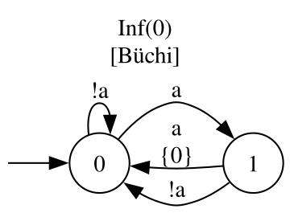
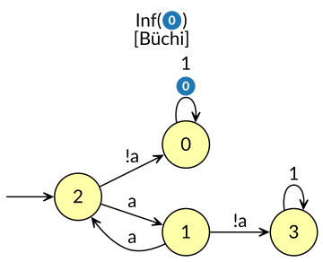
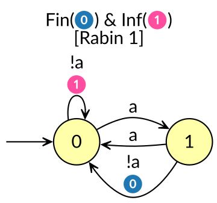

# The SOSG, Constructed — Figures & Tables

Companion artifact for [`sosg_constructed.md`](../sosg_constructed.md). Every
value below is read off a deterministic automaton by the construction of §§3–4
and verified against Spot; see [`reproduction.md`](reproduction.md) to
regenerate any item.

Throughout, the alphabet is `Σ = 2^{a}`, so the two letters are `a` and `!a`;
in the two `Even` examples `!a` plays the role of the block separator `b`.

---

## Figure 1 — the three deterministic automata `D`

The Emerson–Lei automata of the running examples, drawn as Spot renders them.

<table>
<tr>
<td align="center"></td>
<td align="center"></td>
<td align="center"></td>
</tr>
<tr>
<td align="center"><b>(a) <code>GF(aa)</code></b><br>2 states, <code>Inf(0)</code> (Büchi).<br>The <code>a</code>-letter transposes the<br>two states — a <code>Z₂</code> in the<br>transition monoid.</td>
<td align="center"><b>(b) <code>Even</code></b><br>4 states, <code>Inf(0)</code> (Büchi).<br>Parity pair <code>2/1</code>, an accepting<br>sink <code>0</code>, a rejecting sink <code>3</code>.</td>
<td align="center"><b>(c) <code>EvenBlocks</code></b><br>2 states, <code>Fin(0) ∧ Inf(1)</code>.<br>Prefix-independent; the parity<br>of a completed block lives on<br>the <code>!a</code>-transitions' marks.</td>
</tr>
</table>

<!-- from: samples/fixtures/hoa/sosg/{gf_aa_parity,even,evenblocks}.hoa via render_svg.py -->

---

## Table 1 — algebraic fingerprints

One row per language. `|EM¹|` is the acceptance-enriched monoid; `|S(L)₊¹|` the
constructed SOSG (identity adjoined). A group in the *transition* monoid may be
a presentation artifact; a group in `S(L)₊` is intrinsic and equivalent to
non-LTL-definability.

| example | PSL/SERE source | \|Q\| | \|EM¹\| | \|S(L)₊¹\| | group in TM? | group in S(L)₊? | LTL? | certificate / defining formula |
|---|---|:--:|:--:|:--:|:--:|:--:|:--:|---|
| `GF(aa)` | `G F(a & Xa)` | 2 | **10** | **6** | yes (`Z₂`) | **no** | **yes** | defining formula ≡ `GF(a ∧ Xa)` |
| `Even` | `{ {a[*2]}[*] ; !a }!` | 4 | 7 | 5 | yes | **yes (`Z₂`)** | no | `F₁` (linear): `aⁿ·b·aω ∈ L ⟺ n even` |
| `EvenBlocks` | `GF!a ∧ FG(!a → X{a[*2][*];!a}!)` | 2 | **16** | 7 | yes | yes (`Z₂`) | no | `F₂` (ω-power): `(aⁿ·b)ω`, membership by parity of `n` |

The `GF(aa)` row is the story in miniature: a group in `EM`, **no** group in
`S(L)₊`, hence LTL — the quotient destroys the presentation's `Z₂`. The
defining formula is produced as a 19-node DAG (its flat tree has 1 991 717
nodes) and verified Spot-equivalent to `GF(a ∧ Xa)`.

> **Full per-example summaries.** The complete, unedited tool output for each
> language — every `EM` element with its `(st, mk)` vector and fold to `S(L)₊`,
> the full multiplication and acceptance tables, and the residual automaton —
> is in [`sources/`](sources/): [**`GF(aa)`**](sources/gf_aa.md),
> [**`Even`**](sources/even.md), [**`EvenBlocks`**](sources/evenblocks.md).

<!-- from: tests/sosg/build_sosg.py on each fixture; DG metrics from dg_probe.py -->

---

## Table 2 — `EM(GF(aa))`: 10 elements folding onto 6 classes

Each enriched element `w` is a vector over the states `Q = {0, 1}`; at each
state it records `(destination, marks collected)`. Reading a second `a` closes
an `aa` and collects the `Inf`-mark `0` — the only difference between `a` and
`aa`, invisible to the transition monoid. The ten elements are the empty
word, the four `aa`-free “(first letter, last letter)” behaviours, and the
absorbing “contains `aa`” behaviour, each in one or two mark-states.

| `w` | at state `0` | at state `1` | → `S(L)₊` class |
|---|---|---|---|
| `ε` | `(0, ∅)` | `(1, ∅)` | `[ε]` |
| `!a` | `(0, ∅)` | `(0, ∅)` | `[¬a]` |
| `a` | `(1, ∅)` | `(0, {0})` | `[a]` |
| `!a·a` | `(1, ∅)` | `(1, ∅)` | `[¬a·a]` |
| `a·!a` | `(0, ∅)` | `(0, {0})` | `[a·¬a]` |
| `a·a` | `(0, {0})` | `(1, {0})` | `[a·a]` |
| `!a·a·a` | `(0, {0})` | `(0, {0})` | `[a·a]` |
| `a·!a·a` | `(1, ∅)` | `(1, {0})` | `[a]` |
| `a·a·a` | `(1, {0})` | `(0, {0})` | `[a·a]` |
| `!a·a·a·a` | `(1, {0})` | `(1, {0})` | `[a·a]` |

Four distinct elements collapse into `[a·a]` (“contains `aa`”, absorbing), and
`a·!a·a` rejoins `[a]`: **10 → 6**.

<!-- from: tests/sosg/build_sosg.py samples/fixtures/hoa/sosg/gf_aa_parity.hoa -->

---

## Table 3 — `S(GF(aa))₊`: the aperiodic quotient

Six classes, keyed by shortlex-least representative word. The letters map
`!a → [¬a]`, `a → [a]`.

Multiplication (row `i` · col `j`), classes numbered
`0=[ε] 1=[¬a] 2=[a] 3=[¬a·a] 4=[a·¬a] 5=[a·a]`:

```
 ·   [ε] [¬a] [a] [¬a·a] [a·¬a] [a·a]
[ε]   0   1    2    3      4      5
[¬a]  1   1    3    3      1      5
[a]   2   4    5    2      5      5
[¬a·a]3   1    5    3      5      5
[a·¬a]4   4    2    2      4      5
[a·a] 5   5    5    5      5      5
```

`[a·a]` is two-sided absorbing (“contains `aa`”), and every power cycle has
period `1` — the transition monoid's `Z₂` is gone. The single **accepting
linked pair** is `([a·a], [a·a])`: an ultimately-periodic word is in `GF(aa)`
iff its recurring loop contains an `aa`.

### Companion — `S(Even)₊`: the group that survives

For `Even` the letter `a`'s order-2 action is intrinsic. Classes
`0=[ε] 1=[¬a] 2=[a] 3=[a·¬a] 4=[a·a]`, letters `!a → [¬a]`, `a → [a]`:

```
 ·   [ε] [¬a] [a] [a·¬a] [a·a]
[ε]   0   1    2    3      4
[¬a]  1   1    1    1      1
[a]   2   3    4    1      2
[a·¬a]3   3    3    3      3
[a·a] 4   1    2    3      4
```

Here `[a]·[a] = [a·a]` and `[a·a]·[a] = [a]`: the pair `{[a], [a·a]}` is a
**period-2 cycle**, the `Z₂` that makes `Even` non-LTL. Accepting linked pairs:
`([¬a],[¬a])`, `([¬a],[a·¬a])`, `([¬a],[a·a])` — once the accepting sink is
reached (class `[¬a]`), every loop accepts.

<!-- from: tests/sosg/build_sosg.py on gf_aa_parity.hoa and even.hoa -->

---

## Figure 2 — the exportable invariant `𝓘(GF(aa))`

The serialized SOSG (format v1, [`sosg_format.md`](../sosg_format.md)): the
keyed classes, the letter map, the multiplication table of `S(L)₊¹`, and the
saturated set of accepting linked pairs. These core sections are a **complete
language invariant** — two languages are equal iff their cores are
byte-identical after canonical keying — and `𝓘(GF(aa))` computed from the
run-parity form (Figure 1a, `|EM¹| = 10`) is identical to the one computed from
a minimal reset form (`|EM¹| = 7`), though the automata are not isomorphic. The
optional `residuals` block carries the right-congruence automaton (here a single
state — `GF(aa)` is prefix-independent) and does not enter the equality test.

```
SOSG v1
ap: a
classes: 6
0  eps
1  !a
2  a
3  !a;a
4  a;!a
5  a;a
letters: !a->1  a->2
mult:
     0 1 2 3 4 5
  0  0 1 2 3 4 5
  1  1 1 3 3 1 5
  2  2 4 5 2 5 5
  3  3 1 5 3 5 5
  4  4 4 2 2 4 5
  5  5 5 5 5 5 5
accept:
  5 5
residuals: 1
0  eps
res-mult:
     !a a
  0  0 0
```

To test membership of `u·z^ω`: fold `u`, `z` to class ids through
`letters`+`mult`, iterate `z` to an idempotent `e`, set `s = u·e`, and accept
iff `(s, e)` is listed under `accept`. For `(a·!a)^ω`: `z = a·!a` folds to class
`4`, already idempotent (`4·4 = 4`), `s = 4`; `4 4` is not in `accept`, so it is
rejected — correctly, no `aa` recurs.

<!-- from: samples/fixtures/hoa/sosg/gf_aa.sosg (== gf_aa_reset.sosg, byte-identical) -->
