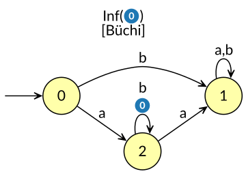
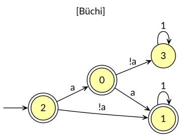

# SoS Learner — Status Report

Where the `sosl/` implementation stands against the plan in
`research_notes/sos_learner_spec.md` (the normative document), the paper
`research_notes/sos_learning.md` (whose running examples are computed by hand),
and the `.sos` normal form of `sosl/sosl/sos/io/sos_format.md`. This report answers
the questions the spec raises; it describes the implementation as it is.

## Milestones (spec §8)

- **M1 — Teacher + validator.** Done.
- **M2 — Learner without saturation** (table; fill / close / consist; chains;
  export). Done.
- **M2.5 — Convention alignment** (fresh-identity reference builder; the
  learner's `[ε]` singleton rule; the `.sos` fixtures). Done.
- **M3 — Saturation + exact equivalence.** Done. The two-sided sweep
  (`sosl/sosl/learn/saturate.py`) and the exact equivalence oracle
  (`sosl/sosl/teacher/exact.py`) are landed; every census language reaches its
  canonical invariant, the Even run reproduces the paper's §4.3 trace, and the
  two permanent-stall specimens behave as Proposition 4.4 predicts.
- **M4 — Campaign.** In progress. **M4.a (driver + E0) and M4.b (E1 scaling +
  E2 ablation) done** over the named cases — the `sosl.experiment` package
  (driver, manifest, per-run stats, E0/E1/E2/E4 reports) is landed, the E0 gate
  is green, and the E2 stall classes match theory (below). Remaining
  census-free: E5 (counterexample sensitivity). E3 (ROLL) and the census-backed
  E1 scatter / E2 specimen hunt fold in via `manifest.census_cases`.

## Ground truth: reference builder vs the paper

`sosl.sos.build.reference_of_hoa` reads the canonical syntactic ω-semigroup
`S(L)₊¹` from each source automaton in `research_notes/sos_figs/sources/`. Class
counts match the paper's fingerprint tables:

| example | source HOA | paper `\|S(L)₊¹\|` | reference |
|---|---|:--:|:--:|
| GF(aa) | `gf_aa_parity.hoa` | 6 | 6 |
| Even | `even.hoa` | 5 | 5 |
| EvenBlocks | `evenblocks.hoa` | 8 | 8 |

The ground-truth leg reproduces the paper's hand-computed canonical objects.

## M2 learner status (no saturation)

The learner reaches the canonical object on every language in the census: the
exported `.sos` is byte-equal to the reference, and the Cayley hypothesis is
acceptance-correct on the exhaustive lasso check (`|stem|, |loop| ≤ 3`).

| language | classes | vs reference | acceptor | member / equiv / cex |
|---|:--:|---|---|:--:|
| GF a | 3 | byte-equal | correct | 6 / 1 / 0 |
| F a | 3 | byte-equal | correct | 6 / 1 / 0 |
| a U b | 4 | byte-equal | correct | 41 / 1 / 0 |
| GF(aa) | 6 | byte-equal | correct | 63 / 4 / 3 |
| Even | 5 | byte-equal | correct | 40 / 3 / 2 |
| EvenBlocks | 8 | byte-equal | correct | 80 / 4 / 3 |
| F(a ∧ Xa) | 6 | byte-equal | correct | 62 / 4 / 3 |

Every fixpoint the learner settles on before its first equivalence query is
broken by a counterexample and refined to the canonical congruence: on this
census no stall survives to the exported object. Saturation is nonetheless
mandatory for the general case (below).

## Identity convention

The class set is the classes of non-empty words **plus a fresh identity class
`[ε]`, always** — even when some non-empty word acts neutrally. The class count
is `(number of non-empty-word classes) + 1`, and comes out the same from every
automaton presenting the same language (a canonicity requirement of Theorem 5.1:
byte-equality must equal language equality, independent of presentation).

`[ε]` is a permanent singleton: never entered into a class comparison, nothing
ever merged into it. The reason is the prediction machinery. Predictions and the
P-cache answer through the representative lasso `key(s)·key(e)^ω`. Every
non-identity class is keyed by a non-empty word, so every representative lasso is
well-formed; if a non-empty word were merged into `[ε]`, a loop could fold to
`e = [ε]` and its representative lasso would have an empty loop — no such lasso
exists, and the P-cache would have nothing well-defined to query. The singleton
rule makes that failure structurally impossible.

- *Reference builder:* quotient only the elements reachable as images of
  non-empty words; adjoin the identity as a fresh element no word class can
  collide with; key every non-identity class by its shortlex-least non-empty
  word. A word whose enriched element equals `ε` (e.g. `!a` in a one-state
  `GF a` automaton) is an ordinary class keyed `!a`.
- *Learner:* `[ε]` is seeded as its own class before the bit-row grouping, and
  the grouping skips it (`sosl/sosl/learn/partition.py`).

A non-empty class **may** act as an identity on all the *other* non-empty
classes and still be its own class. `[aa]` in Even does: it is neutral on every
class but is distinct from `[ε]` (keyed `a;a`). Both `M(c, [ε]) = c` and
`M([ε], c) = c` hold for every `c`, including such a `c`; there is no reason to
merge or special-case it.

## Saturation

`Invariant.member` reduces a lasso through the class multiplication table
`mult[c][d] = fold(c, rep[d])`, substituting a class representative in the middle
of a product. That substitution is sound only when the partition is a **two-sided
congruence** (`u ~ v` implies both `u·x ~ v·x` and `x·u ~ x·v`). A table closed
under fill / close / consist guarantees only the right half, so a pre-saturation
export can be acceptance-wrong even where the hypothesis is correct — the
hypothesis folds the literal letters of the queried lasso and never substitutes a
representative, which is why the two read-offs of one partition can disagree.

Saturation (`sosl/sosl/learn/saturate.py`) is the left-context sweep that turns the
right congruence into the two-sided syntactic one, after which the export is
well-defined. It runs after fill / close / consist reach a fixpoint and before
each equivalence query; an escalation restarts the loop, and an equivalence query
is posed only once a sweep comes back clean.

- For every non-representative table word `p`, its class rep `r0`, and every left
  class `d` (rep `r`), it compares `fold(d, p)` against `fold(d, r0)` — pure table
  folding, zero queries. On a mismatch it takes the first column `κ` separating
  the two fold-class reps and escalates.
- **Branch 1** — the bits of `r·p` and `r·r0` under `κ` differ: mint the column
  that reproduces "`r·w` under `κ`" as a bit on the bare candidate `w`.
- **Branch 2** — those bits agree: exactly one of `r·p` / `r·r0` disagrees with
  its own fold-class rep under `κ`; the **frozen-prefix chain** binary-searches the
  flip and mints one column, `κ`'s own prefix frozen in place and the unconsumed
  segment migrating into the middle component (spec §3.2 step 5, Lemma 4.5).

Each escalation splits at least one class, so the sweep terminates in at most the
final class count; a clean sweep is the certificate that the export is sound.

**One spec correction (branch-1 omega columns).** Reproducing "`r·w` under `κ`"
as a bit on the bare candidate `w` depends on where `w` sits. For a *linear*
`κ = (x, y, t)` the candidate is in the finite prefix, so `r` prepends there:
`(x·r, y, t)`. For an *omega* `κ = (x, y)` the candidate rides in the period, and
peeling one `r` off the repeating block gives `x·(r·w·y)^ω = x·r·(w·y·r)^ω` — so
`r` must seed **both** the prefix and the period suffix: `(x·r, y·r)`. The
bare-prefix form `(x·r, y)` keeps the period `w·y` and does not separate the
candidate on a prefix-independent language: on `GF(aa)` it maps both `a` and `aa`
to accepting and the sweep never converges. This is the omega analog of the Lemma
4.5 correction already made for the frozen-prefix chain (the segment migrates into
the middle, never the prefix); the same one-line fix applies to spec §3.2 step 4.

## Permanence and exact mode

Whether a language admits a **permanent** stall — a non-canonical fixpoint no
counterexample breaks — was the paper's §4.2 open question. It is now settled for
the two census specimens below: Proposition 4.4 proves both `a_implies_xa` and
`a_once` permanent (their stalls survive *any* equivalence oracle, exact
included). `F(a ∧ Xa)`, an earlier candidate, is retired — the census resolves it
**transient**: it reaches the canonical 6-class object already at M2 (`[ε] [!a]
[a] [!a;a] [a;!a] [a;a]`, byte-equal), a later counterexample breaking its
pre-equivalence stall.

Exact mode (`sosl/sosl/teacher/exact.py`) is the complete equivalence oracle. It
decides a hypothesis against `D` through the product of `D`'s reachable
stem-configs `(state, class)` with the *transformation closure* of the
hypothesis: each loop word acts on the classes as a function and on `D` as a
transition/mark profile, so one representative lasso per `(stem-config,
loop-element)` cell fixes both verdicts, and the shortlex-least cell on which they
disagree is the minimal counterexample. It returns that lasso or a certificate of
equality (`sosl/sosl/teacher/exact.py`).

Because Proposition 4.4 proves the two specimens permanent, their
`--no-saturation --eq-mode exact` runs are no longer decision procedures but
**fixtures for exact mode itself** (spec §9 P4): exact *must* certify their 4- and
3-class stalls, and a counterexample there would be an exact-mode bug. With
saturation on, exact drives both to the canonical 5 and 4. Both hold
(`sosl/tests/sosl/exact_fixtures.py`).

## Minimal stall specimens

An exhaustive learner census over the smallest 1-AP shapes (`sosl/tests/sosl/genaut_census.py`
over `genaut/corpus/`; nondeterministic inputs are determinized by the sos import
layer, so every automaton is covered) locates the smallest languages whose M2
fixpoint is non-canonical — a surviving stall under the default (bounded)
equivalence mode. Everything at one state is canonical; the stalls begin at two
states (`2state1ap0acc`). Two specimens, of different character, are reported
here. In both, the Cayley hypothesis is acceptance-correct (spec §9 P1 holds) and
the exported `.sos` is a class short of canonical (F2 fails).

### `a_once` — `L = { a·(¬a)^ω }` (LTL `a & X G !a`)

The single ω-word. Canonical form `D`:
[`sos_figs/sources/a_once.hoa`](sos_figs/sources/a_once.hoa); full algebra in
[`sos_figs/sources/a_once.md`](sos_figs/sources/a_once.md).



The reference invariant has **4 classes** (accepting pair `([a],[!a])`):

```
classes: 4        0 eps   1 !a   2 a   3 !a;a
mult   0: 0 1 2 3   1: 1 1 3 3   2: 2 2 3 3   3: 3 3 3 3     accept: 2 1
```

The learner stalls at 2 classes (`{ε}`, everything else), a single counterexample
refines it to **3**, and the bounded oracle then certifies. The exported `.sos`
merges the canonical `[!a;a]` into `[!a]`:

```
classes: 3        0 eps   1 !a   2 a
mult   0: 0 1 2   1: 1 1 1   2: 2 2 1                        accept: 2 1
```

The `a`-idempotent collapses onto `[!a]` (`a·a = [!a;a]` in the reference, `[!a]`
in the export), so the linked-pair read-off wrongly **accepts `a^ω`** (the
shortlex-least divergence: exported `True`, teacher `False`). The canonical
algebra keeps `[!a;a]` distinct; the context that separates `!a` from `!a;a`
needs a non-empty *left* prefix.

### `a_implies_xa` — `L = { w : w[0]=a ⇒ w[1]=a }` (LTL `a → X a`)

Canonical form `D`:
[`sos_figs/sources/a_implies_xa.hoa`](sos_figs/sources/a_implies_xa.hoa); full
algebra in [`sos_figs/sources/a_implies_xa.md`](sos_figs/sources/a_implies_xa.md).



The reference has **5 classes** (six accepting pairs). The learner stalls at
**4** and — the sharp point — with **zero counterexamples**: the first
closed/consistent fixpoint is already what the equivalence oracle certifies. The
export merges the canonical `[a;a]` into `[!a]` (both accepting idempotents in the
reference), so it wrongly **rejects `a^ω`** (exported `False`, teacher `True`).

### The shared moral

Both languages are LTL-definable (aperiodic) and minimal. In each, the M2
right-congruence merges the `a`-idempotent class into `[!a]`, and the class the
canonical algebra keeps is separated only by a left context — invisible to lasso
membership from the initial state. So the equivalence oracle has no counterexample
to give: the coarser hypothesis is acceptance-equivalent to `L`, and saturation's
left-context split is what recovers the class. Both stalls are **permanent** —
Proposition 4.4 proves no oracle breaks them, and exact mode confirms it by
certifying each stalled fixpoint (4 and 3 classes) with no counterexample; with
saturation on, each reaches its canonical algebra (5 and 4, byte-equal).
`a_implies_xa` is the sharpest exhibit: its 5-vs-4 gap is reached with **zero**
counterexamples, and it is smaller than `F(a ∧ Xa)`, which is transient.

## Saturated runs: conformance and ledgers

With saturation on, every census language reaches its canonical invariant
byte-equal to the reference builder — the two specimens included
(`sosl/tests/sosl/saturation_gate.py`): `GF(aa)` → 6, `Even` → 5, `EvenBlocks` → 8,
`a_implies_xa` → 5, `a_once` → 4.

**Even reproduces the paper's §4.3 trace exactly** (`sosl/tests/sosl/even_conformance.py`).
The day-one sweep on the initial 3-class table is clean; one equivalence
counterexample `(ε, a;a;!a)` splits `a;a`; the four-class sweep then fires first at
cell `(!a;a, [a])`, branch 2 (the two probe bits agree), and the frozen-prefix
chain flips at `j = 1 → 2`, minting the **linear** column `(ε, a;!a, a;a;!a)` — not
the omega column `(a, ε)` a different scan order would produce.

The saturated runs of the two Büchi census cases produce the split and query
ledgers below (`sosl/tests/sosl/m3_ledgers.py`; routine close/consist splits are folded
into the initial stabilized class count, and one mint can split more than one
class on re-stabilization).

**Even** — `(aa)*·!a·Σ^ω`, reference 5 (initial stabilized 3):

```
 #  trigger           chain   n      split          column
 1  cex (ε, a;a;!a)   stem    3->4   a -> a, a;a    ε·[]·!a , (a;a;!a)^ω
 2  saturation        frozen  4->5   a -> a, a;!a   ε·[]·a;!a , (a;a;!a)^ω

member: fill 32 / harvest 4 / saturation 7 / P-cache 8 / total 51
equiv 2 · cex 1 · sat 1 · columns lin/om 2/1
```

**EvenBlocks** — 2-state prefix-independent, `Fin(0) & Inf(1)`, reference 8
(initial stabilized 3):

```
 #  trigger           chain   n      split                              column
 1  cex (ε, !a;a;a)   loop    3->4   a -> a, !a;a                       a·([]·a)^ω
 2  saturation        frozen  4->6   a -> a, a;a ; !a;a -> !a;a, a;!a   a·([]·!a;a)^ω
 3  saturation        frozen  6->8   !a -> !a, a;!a;a ; a;a -> a;a,     ε·([]·!a)^ω
                                     !a;a;!a

member: fill 67 / harvest 4 / saturation 14 / P-cache 14 / total 99
equiv 2 · cex 1 · sat 2 · columns lin/om 0/4
```

Both complete with a **single** counterexample — the feedback's expectation, the
`a;!a` split having moved from an equivalence harvest to the sweep. `EvenBlocks`,
being prefix-independent, is carried entirely by omega columns (all frozen-chain
mints); the branch-1 omega correction above is the analogous fix that lets the
sweep converge on `GF(aa)`.

## Probes (under `sosl/tests/sosl/`)

- `paper_examples.py` — the three paper examples from their source HOA: reference
  size against the fingerprint tables, learned status, byte-equality, and a dump
  of the pre-equivalence stall partition for word-for-word comparison against the
  hand traces.
- `reference_vs_learner.py` — per-formula reference-vs-learned byte compare plus a
  budgeted acceptor check (exhaustive when the lasso space is small, else a
  deterministic sample).
- `diag_export_vs_hyp.py` — isolates export-vs-hypothesis divergence, separating a
  two-sided read-off defect from a learner-core defect.
- `genaut_census.py` — learns every automaton under a folder to its fixpoint and
  classifies it (canonical / surviving stall / P1 bug) against the spec's
  expected-failure table; a prototype of the campaign driver.
- `study_stall.py` — the full anatomy of one automaton's stall: canonical `D`,
  reference and learned `.sos`, stall and learned partitions, and the shortlex
  divergence lasso.
- `emit_canonical.py` — writes an input's canonical form `D` (the sos import
  layer's output) as HOA; the form reported for a specimen in `research_notes/`.
- `saturation_gate.py` — learns every census source with saturation on and
  asserts byte-equality to the reference (the M3 end-to-end gate).
- `even_conformance.py` — asserts the Even run reproduces the paper's §4.3 trace
  (clean day-one sweep, one cex, the exact sweep-minted linear column).
- `exact_fixtures.py` — exact mode: certification on the proven-permanent stalls
  under `--no-saturation` (spec P4), and canonical byte-equality with saturation.
- `m3_ledgers.py` — the split and per-phase query ledgers of a saturated run; a
  prototype of the campaign audit renderer.

---

## Theory-thread feedback — M3 accepted, notes before M4 (2026-07-07)

M3 is accepted as delivered, and everything above is now integrated: the
EvenBlocks ledger is the paper's Table 8, the per-phase query ledgers ground
Proposition 5.2 in `sos_learning.md` §5, and the branch-1 omega correction is
adopted as *normative* — spec §3.2 step 4 now states the `(x.r, y.r)` mint with
your `GF(aa)` non-convergence as the rationale, and the paper's Lemma 4.5
carries the same fix. The transcript did more than fill placeholders: it
overturned a paper prediction. The minimal teacher's first EvenBlocks
counterexample is `(ε, !a;a;a)`, shortlex-earlier than the hand-predicted
`(ε, a;a;!a)`, and the paper's §1/§3/§4.1 traces were rewritten to match
(loop chain, ω-column `(a, a)`, `!a;a` pulled out of `[a]`). Consequence for
you: the EvenBlocks run is now paper-anchored exactly as Even's is. A draft
probe for it sits uncommitted in the working tree,
`sosl/tests/sosl/evenblocks_conformance.py` (mirror of `even_conformance.py`,
built on `m3_ledgers.py`'s instrumentation): it asserts first cex
`(ε, !a;a;a)`, columns `(a, a)` / `(a, !a;a)` / `(ε, !a)` in that order,
splits 3→4→6→8, the 67/4/14/14 ledger, and byte-equality — and it ran green
once (2026-07-07). It is yours: review, adapt, and commit it as the M4.a
conformance lock (spec §8), or rewrite it if it does not fit your idioms.
One trace fact it established that this report's ledger did not state: the
EvenBlocks *day-one sweep is clean*, as on Even — the counterexample is
genuinely the run's first event. Any drift on this run is henceforth a paper
regression, not a free choice.

Two notes for the record. First, one slip in this report: the
even-conformance paragraph says a different scan order "would produce the
omega column `(a, ε)`" — under your own branch-1 omega correction it would be
`(a, a)`; the spec's gate text now says `(a, a)`, nothing to fix beyond
awareness. Second, the EvenBlocks signature matrix now in the paper (7 keys ×
4 ω-columns) was derived *by hand* from your ledger and cross-checked against
the split sequence; have the E4 renderer emit the final signature matrix so
that table becomes machine-generated like everything else — it is a natural
extension of `m3_ledgers.py`.

For M4, work from the revised spec (revision 2026-07-07b): §6 has the corpus
manifest and per-experiment design notes, §7 three new stats fields
(`n_classes_initial`, `stall_class`, `cex_policy`), §8 the ordered sub-gates
M4.a–M4.d, §9 the new rows P5/F6/F7. Two scheduling points worth
internalizing before you start. Build the driver by promoting
`genaut_census.py` and `m3_ledgers.py`, not from scratch — M4.a is mostly
plumbing you already have. And treat the ROLL leg as the schedule risk it is:
its equivalence queries carry automata, not Cayley forms, so the exact oracle
does not apply — answer them bounded, record the certification asymmetry as a
result (row F6), and if the integration fights back, deliver the wrapper plus
a blocking record and keep moving; M4.d does not wait for it. The place new
science can fall out is E2: with saturation off and `--eq-mode exact`, every
*surviving* stall is a proven-permanent specimen — the census found the two
smallest, and anything new at larger shapes is a first-class exhibit for the
paper. Report those individually, with both fixpoints and the separating left
context, before aggregating anything.

---

## M4.a — Driver + E0 (2026-07-08)

The `sosl.experiment` package (previously a README stub) is built by promoting
the two M3 prototypes into the campaign layer, as spec §8 M4.a directed:

    stats.py     RunStats (spec §7 verbatim, incl. n_classes_initial /
                 stall_class / cex_policy) -> stats.json + CSV
    run.py       Config + run_case: one instrumented run -> stats + split
                 ledger + signature matrix; per-case wall-clock budget;
                 crash-isolated (a fault becomes a recorded verdict)
    manifest.py  versioned corpus (m4a-2026-07-08): the triptych + the two
                 permanent specimens + a T1 alternate presentation; the census
                 tier (genaut/corpus/) is guarded/deferred (curated elsewhere)
    driver.py    manifest x config matrix -> one stats.json per run +
                 results.csv; one case never kills the campaign
    report.py    the E0 one-pager (with a PASS/FAIL gate) and the E4
                 ledger / signature-matrix renderers

`run_case` reuses the learner procedures unchanged behind a phase-tagged,
counting `member` wrapper, so its per-run metrics are the same numbers the M3
ledgers reported — the row-P5 stability lock (`tests/sosl/campaign_e0.py`)
asserts the Even (`32/4/7/8`) and EvenBlocks (`67/4/14/14`) ledgers byte-stable
against the M3 baselines above.

**E0 gate: PASS.** Ten runs over the named cases; zero MISMATCH, zero BUDGET.
The default config is SOUND on every case; the permanent specimens certify
`ACCEPTOR_ONLY` under `--no-saturation --eq-mode exact` (spec §9 P4/F5) and
reach canonical under saturation+exact.

| case | config | ref | init | learned | member (f/h/s/p) | eq | cex | sat | cert | stall | verdict |
|---|---|--:|--:|--:|--:|--:|--:|--:|---|---|---|
| gf_aa_parity | default | 6 | 3 | 6 | 74 (51/4/9/10) | 2 | 1 | 2 | bounded:8 | transient | SOUND |
| gf_aa_reset | default | 6 | 3 | 6 | 74 (51/4/9/10) | 2 | 1 | 2 | bounded:8 | transient | SOUND |
| even | default | 5 | 3 | 5 | 51 (32/4/7/8) | 2 | 1 | 1 | bounded:8 | transient | SOUND |
| evenblocks | default | 8 | 3 | 8 | 99 (67/4/14/14) | 2 | 1 | 2 | bounded:8 | transient | SOUND |
| a_implies_xa | default | 5 | 4 | 5 | 43 (32/0/2/9) | 1 | 0 | 1 | bounded:8 | transient | SOUND |
| a_once | default | 4 | 2 | 4 | 35 (26/3/2/4) | 2 | 1 | 1 | bounded:8 | transient | SOUND |
| a_implies_xa | no-sat-exact | 5 | 4 | 4 | 21 (17/0/0/4) | 1 | 0 | 0 | exact | permanent | ACCEPTOR_ONLY |
| a_implies_xa | exact | 5 | 4 | 5 | 43 (32/0/2/9) | 1 | 0 | 1 | exact | transient | SOUND |
| a_once | no-sat-exact | 4 | 2 | 3 | 18 (13/3/0/2) | 2 | 1 | 0 | exact | permanent | ACCEPTOR_ONLY |
| a_once | exact | 4 | 2 | 4 | 35 (26/3/2/4) | 2 | 1 | 1 | exact | transient | SOUND |

The two T1 presentations (`gf_aa_parity`, `gf_aa_reset`) produce identical
ledgers and signature matrices — a presentation-independence witness the driver
gets for free. The E4 renderer now machine-generates the signature matrix (class
keys x discovered columns), the companion to the paper's Tables 6/8 that was
previously hand-derived; artifacts land under `tests/sosl/logs/e0/`
(`results.csv`, `e0_report.md`, `e4_transcripts.md`).

The census tier is intentionally not wired: `genaut/corpus/` is being curated
separately, so E0 runs the named cases alone. E1's scaling scatter and E2's
broad permanent-stall hunt (M4.b) fold the census back in through
`manifest.census_cases` once it is ready.

---

## M4.b — E1 scaling + E2 ablation (2026-07-08)

Both experiments run over the named cases through the driver
(`tests/sosl/campaign_m4b.py`); the census tier stays deferred, so E1's scatter
plots and E2's broad specimen hunt fold in later via `manifest.census_cases`.

**E1 — scaling.** The default-config run metrics against the reference class
count `N`, with the designed bounds overlaid (`splits ≤ N`; table/fill membership
`~ O(N²·|Σ|)`). `splits ≤ N` holds on every case, and the fill count stays inside
the `N²·|Σ|` envelope; harvest and saturation add the counterexample-analysis
term on top.

| case | N | \|Σ\| | init | splits | fill | N²·\|Σ\| | member | eq |
|---|--:|--:|--:|--:|--:|--:|--:|--:|
| a_once | 4 | 2 | 2 | 2 | 26 | 32 | 35 | 2 |
| a_implies_xa | 5 | 2 | 4 | 1 | 32 | 50 | 43 | 1 |
| even | 5 | 2 | 3 | 2 | 32 | 50 | 51 | 2 |
| gf_aa_parity | 6 | 2 | 3 | 3 | 51 | 72 | 74 | 2 |
| gf_aa_reset | 6 | 2 | 3 | 3 | 51 | 72 | 74 | 2 |
| evenblocks | 8 | 2 | 3 | 5 | 67 | 128 | 99 | 2 |

The named cases give only `N ∈ {4,5,6,8}`; the scatter plots wait on the census
N-spread (the generator already emits the per-metric columns they consume).

**E2 — saturation ablation.** Every named case under both `default` (saturation
on) and the ablation leg `--no-saturation --eq-mode exact` (with exact
equivalence every *surviving* stall is provably permanent). The ablation-leg
stall class matches theory on all six cases:

| case | prefix-indep | ref | no-sat learned | stall class | expected |
|---|:--:|--:|--:|---|---|
| a_implies_xa | no | 5 | 4 | permanent | permanent |
| a_once | no | 4 | 3 | permanent | permanent |
| even | no | 5 | 5 | transient | transient |
| evenblocks | yes | 8 | 8 | transient | transient |
| gf_aa_parity | no | 6 | 6 | transient | transient |
| gf_aa_reset | no | 6 | 6 | transient | transient |

Stall-class frequency: permanent 2 · transient 4. No new permanent specimen
among the named cases — as expected; the census tier is where new ones surface.

The report renders each permanent specimen as a first-class exhibit
(`e2_report`): the coarse (certified non-canonical) `.sos`, the canonical `.sos`,
and the **separating left context** — the saturation escalation invisible to
lasso membership from the start. `a_once` merges `[!a;a]` into `[!a]`, split by
the left prefix `a` (`a·[]·!a`); `a_implies_xa` merges `[a;a]` into `[!a]`,
reaching its 5-vs-4 gap with zero counterexamples and one escalation
(`a·([]·a)^ω`). Artifacts under `tests/sosl/logs/m4b/`
(`results.csv`, `e1_report.md`, `e2_report.md`).
